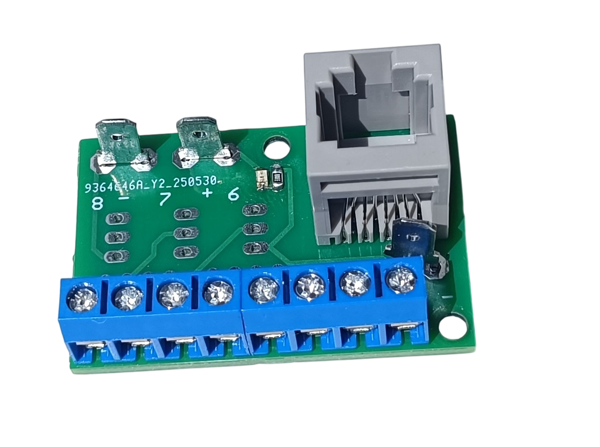

# Boeing 737 Overhead Panel – Manufacturing Files

This repository contains supplementary manufacturing files for the corresponding MakerWorld project.

## Contents

This repository includes:

- [PCB Manufacturing Files (Gerber)](#pcb-manufacturing-files-gerber)
- [UV Print Files](#uv-print-files)
- [3D Model Downloads - Makerworld](#3d-model-downloads-makerworld)

> **Note**
> This repository contains only supplementary manufacturing files. The 3D printable parts are available on MakerWorld.

---
# Support the Project

This project is completely free and will continue to be released free of charge.

Designing, testing, documenting, and maintaining the complete Boeing 737 Overhead Panel requires a significant amount of time. If you would like to support its continued development, you can make a voluntary contribution.

## Current Goal

The current funding goal is to purchase a **ProSim737 license**, which will help improve testing, validation, and future development of this project.

**Progress:** €4 / €1,500 (0%)

Thank you to everyone who supports this project!

# PCB Manufacturing Files (Gerber)

Three PCB versions are available depending on the intended use.

## 1. RJ45 Direct Connection

[📥 Download gerber files - PCB_RJ45_Direct.zip](https://raw.githubusercontent.com/om7ea/B737/main/PCB/PCB_RJ45_Direct.zip)

Designed for direct connection through an RJ45 connector.

Used for: Push buttons, Toggle switches, Rotary switches, Servos, Displays, ...

### Bill of Materials (BOM)

- 1x **RJ45 Connector** – 5224 8P8C in-line Vertical 180 Degree Full Plastic – https://www.aliexpress.com/item/4000641016208.html
- 3× **4.8 mm PCB Male Faston Terminal**
- **KF301 PCB screw terminals** - 2P/3P/4P as required
- **2.54 mm Male Pin Header** - as required 
- 1× **330 Ω Resistor (0805)** - optional
- 1× **Green LED (0805)** - optional

---

## 2. LED Driver Version

[📥 Download gerber files - PCB_RJ45_Driver.zip](https://raw.githubusercontent.com/om7ea/B737/main/PCB/PCB_RJ45_Driver.zip)

Includes an LED driver circuit.

Used for:
- LED Annunciators
- Other LEDs

---

## 3. Combined Version

[📥 Download gerber files - PCB_RJ45_Combined.zip](https://raw.githubusercontent.com/om7ea/B737/main/PCB/PCB_RJ45_Combined.zip)

Combines both functions into a single PCB.

Used when both inputs and LED outputs are required on the same board.

---

# UV Print Files

Will be added soon.

---

# 3D Model Downloads - Makerworld

The complete printable model is available on MakerWorld.

1. Main Frame - Will be added soon
2. Rotary Knobs - Will be added soon
3. Annunciators - Will be added soon
4. [Navigation panel](https://makerworld.com/en/models/2985636-boeing-737-overhead-navigation-panel)

---

# License

This repository contains supplementary resources for the corresponding MakerWorld project.

## Files corresponding to the MakerWorld model

Files that are part of the corresponding MakerWorld model are distributed under the MakerWorld Standard Digital File License associated with that model. No additional rights are granted by this repository.

Please refer to the corresponding MakerWorld project page for the complete license terms.

## Repository-exclusive files

Some files in this repository are provided exclusively on GitHub and are not part of the MakerWorld model. Unless otherwise stated, these files are licensed separately and may not be copied, modified, redistributed, or used for commercial purposes without the author's prior written permission.

Copyright © 2026 Marek Antoška (OM7EA). All rights reserved.
