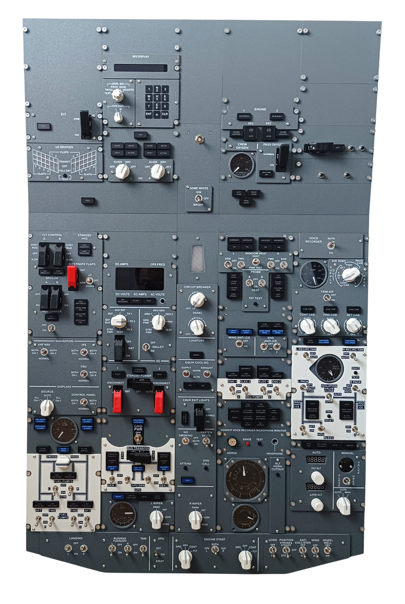
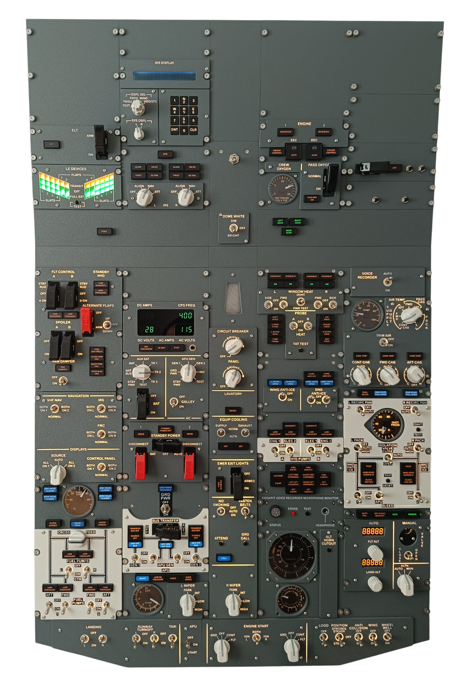
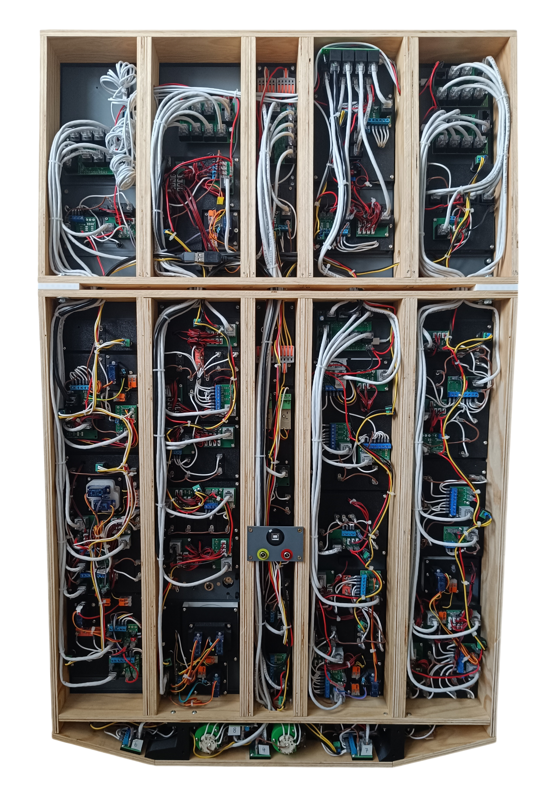

# Boeing 737 Overhead Panel – Manufacturing Files

This repository contains supplementary manufacturing files for the corresponding MakerWorld project. Additional files and resources will be added gradually as new models are published on MakerWorld.

> **Note**
> This repository contains only supplementary manufacturing files. The 3D printable parts are available on MakerWorld — see the [model list](docs/models/README.md) for a link to each one.

## Photos

---

## How It Works

All electronics are enclosed inside the panel and connected to an internal USB hub, so the finished panel needs just **one USB cable to the PC** — plus its own power supplies.

**On the PC:** Microsoft Flight Simulator 2020 + PMDG 737-800 + MobiFlight. MobiFlight maps each switch, button and LED to a PMDG variable through its graphical interface, so **no programming is required**.

**Inside the panel:** 7× **Mega 2560 PRO MINI** boards, each driving one group of panels, all connected to an internal USB hub. Panels attach to the boards through RJ45 connectors using standard Ethernet patch cables.

**Power:** the panel is powered externally, not through the USB cable. It uses **two separate power supplies** — a **12 V** supply for the backlighting and a **5 V** supply for the rest of the electronics.

📖 **[Full system overview →](docs/system-overview.md)**

---

## Documentation

| | Contents |
|---|---|
| ⚙️ **[System Overview](docs/system-overview.md)** | How the panel connects to the simulator — software, boards, wiring |
| 🔌 **[PCB Manufacturing Files](docs/pcb/README.md)** | Gerber downloads, BOM and assembly for each PCB design |
| 🖨️ **[UV Print Files](docs/uv-print.md)** | Printable panel graphics and printing instructions |
| 🛩️ **[Models](docs/models/README.md)** | Build notes for the frame, the shared models and each panel |
| 🎨 **[Filaments](docs/filaments.md)** | The filaments I used and their colours |
| 🖥️ **[MobiFlight Configuration](docs/mobiflight.md)** | The complete MobiFlight configuration — board definitions and the simulator mapping |

---

## Support the Project

This project is completely free and will continue to be released free of charge.

Designing, testing, documenting, and maintaining the complete Boeing 737 Overhead Panel requires a significant amount of time. If you would like to support its continued development, you can make a voluntary contribution.

### How Your Support Helps

I'm saving for a ProSim737 license, a professional simulator software package that would greatly enhance my home cockpit. Every contribution brings me one step closer to reaching that goal.

**Progress:** €4 / €1,500 (0%)
last updated: 20 August 2026

✈️ **Support via PayPal:**
https://paypal.me/om7ea

Thank you to everyone who supports this project!

---

## License

This repository contains supplementary resources for the corresponding MakerWorld project.

### Files corresponding to the MakerWorld model

Files that are part of the corresponding MakerWorld model are distributed under the MakerWorld Standard Digital File License associated with that model. No additional rights are granted by this repository.

Please refer to the corresponding MakerWorld project page for the complete license terms.

### Repository-exclusive files

Some files in this repository are provided exclusively on GitHub and are not part of the MakerWorld model. Unless otherwise stated, these files are licensed separately and may not be copied, modified, redistributed, or used for commercial purposes without the author's prior written permission.

Copyright © 2026 Marek Antoška (OM7EA). All rights reserved.
