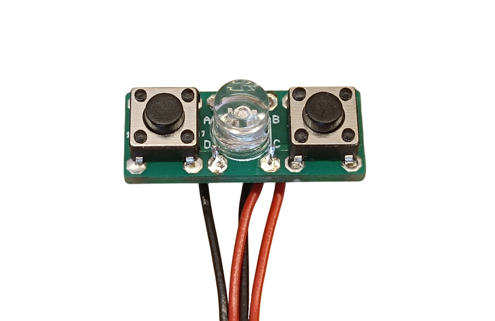
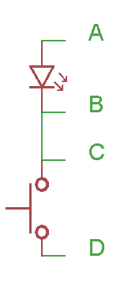
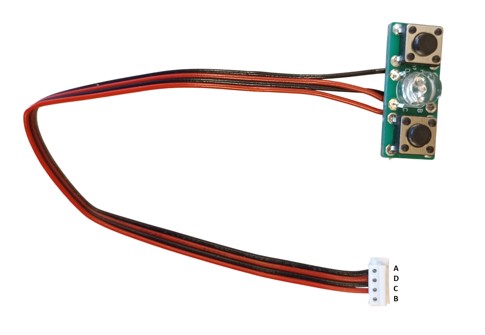
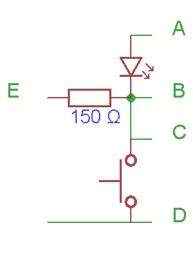
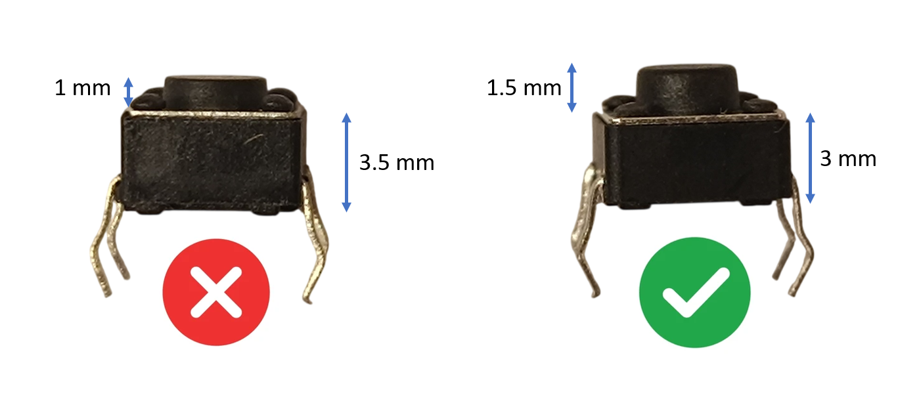
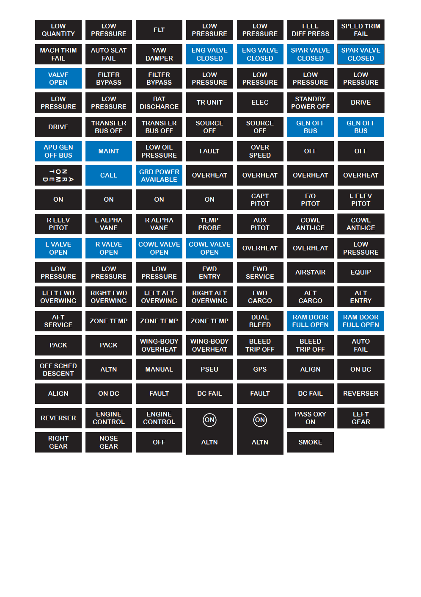
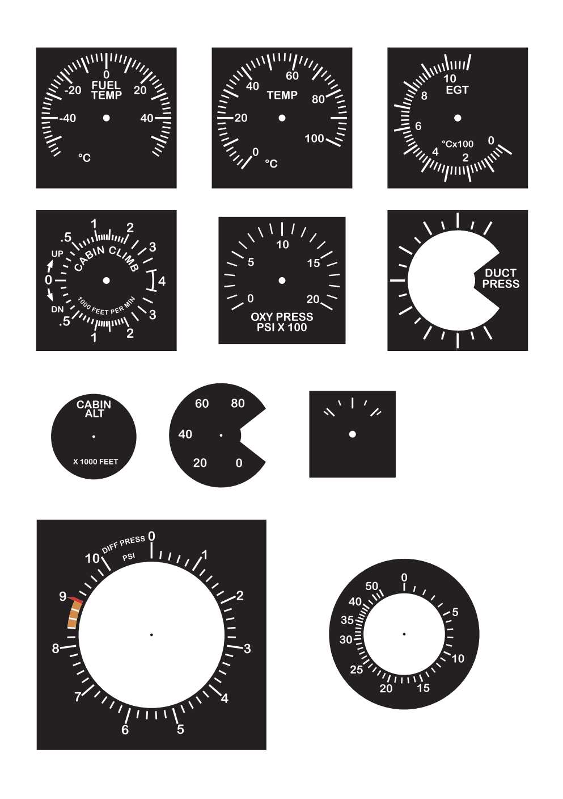

# Boeing 737 Overhead Panel – Manufacturing Files

This repository contains supplementary manufacturing files for the corresponding MakerWorld project. Additional files and resources will be added gradually as new models are published on MakerWorld.

## Contents

This repository includes:

- [PCB Manufacturing Files (Gerber)](#pcb-manufacturing-files-gerber)
- [UV Print Files](#uv-print-files)
- [3D Model Downloads - Makerworld](#3d-model-downloads---makerworld)

> **Note**
> This repository contains only supplementary manufacturing files. The 3D printable parts are available on MakerWorld.

---

## Photos

## Support the Project

This project is completely free and will continue to be released free of charge.

Designing, testing, documenting, and maintaining the complete Boeing 737 Overhead Panel requires a significant amount of time. If you would like to support its continued development, you can make a voluntary contribution.

### How Your Support Helps

I'm saving for a ProSim737 license, a professional simulator software package that would greatly enhance my home cockpit. Every contribution brings me one step closer to reaching that goal.

**Progress:** €4 / €1,500 (0%)
last updated: 18 July 2026

 

✈️ **Support via PayPal:**  
https://paypal.me/om7ea

Thank you to everyone who supports this project!

## PCB Manufacturing Files (Gerber)

Three PCB versions are available depending on the intended use.

### 1. Annunciator

[📥 Download gerber files - PCB_Annunciator.zip](https://raw.githubusercontent.com/om7ea/B737/main/PCB/PCB_Annunciator.zip)

A total of **125** PCBs will be required for the complete project. However, I recommend ordering a few extra PCBs in case some are damaged during assembly.

This project includes several types of annunciators:

- 94× black background with yellow LED
- 10× black background with green LED
- 2× black background with white LED
- 10× blue background with white LED
- 5× blue background with white LED with two brightness levels (DIM/BRIGHT)
- 2× large special annunciators in the Engine Panel, each with two PCBs (black background with a white LED in the upper section and a yellow LED in the lower section).

#### Bill of Materials (BOM)

- 125x **PCB** - download my Gerber files
- 250x **Switch** - 6x6x4.5 Tact Switch 4 Pin Vertical Micro Button Switch
- 96× **Yellow 5mm Flat Top LED**
- 10× **Green 5mm Flat Top LED**
- 19× **White 5mm Flat Top LED**
- 134 **Cable with connector** ZH 1.5 28AWG 15CM 4 pins (125 for annunciators + 9 for dual brightness function)

#### PCB Assembly & Wiring

##### Standard Annunciators

##### Annunciators with DIM/BRIGHT function

#### Important - Switch Type
I have encountered two different types of switches, both with a 4.5 mm height. The difference is the length of the actuator pin: one type has a 1.0 mm pin, while the other has a 1.5 mm pin.

The shorter 1.0 mm version caused significant problems during assembly. I had to modify and trim four plastic supports to make it work, so I do not recommend using this version.

The 1.5 mm version worked perfectly without any modifications.

Unfortunately, you cannot know in advance which version you will receive when ordering - it seems to depend on the manufacturer/supplier. If you receive the 1.0 mm version, I recommend ordering the switches again from a different supplier. They are relatively inexpensive, and this will save you a lot of trouble during assembly.

### 2. RJ45 Direct Connection

[📥 Download gerber files - PCB_RJ45_Direct.zip](https://raw.githubusercontent.com/om7ea/B737/main/PCB/PCB_RJ45_Direct.zip)

Designed for direct connection through an RJ45 connector.

Used for: Push buttons, Toggle switches, Rotary switches, Servos, Displays, ...

#### Bill of Materials (BOM)

- 1x **RJ45 Connector** – 5224 8P8C in-line Vertical 180 Degree Full Plastic – https://www.aliexpress.com/item/4000641016208.html
- 3× **4.8 mm PCB Male Faston Terminal**
- **KF301 PCB screw terminals** - 2P/3P/4P as required
- **2.54 mm Male Pin Header** - as required 
- 1× **330 Ω Resistor (0805)** - optional
- 1× **Green LED (0805)** - optional

---

### 3. RJ45 LED Driver

[📥 Download gerber files - PCB_RJ45_Driver.zip](https://raw.githubusercontent.com/om7ea/B737/main/PCB/PCB_RJ45_Driver.zip)

Includes an LED driver circuit.

Used for:
- LED Annunciators
- Other LEDs

---

### 4. RJ 45 Combined (4 pins with LED driver + 4 pins direct)

[📥 Download gerber files - PCB_RJ45_Combined.zip](https://raw.githubusercontent.com/om7ea/B737/main/PCB/PCB_RJ45_Combined.zip)

Combines both functions into a single PCB.

Used when both inputs and LED outputs are required on the same board.

---

## UV Print Files

Finding a suitable printing method took a considerable amount of trial and error. I initially tried standard laser printing, but the black areas were not opaque enough. When backlit, light leaked through the black print, resulting in poor contrast and an unrealistic appearance.

A local professional print shop suggested using UV printing instead. They also recommended printing the graphics twice on top of each other to achieve a much denser black. This solution produced excellent results and completely solved the backlight bleed issue.

The PDF files should be printed using double-pass UV printing on A4 transparent self-adhesive foil. This method provides excellent opacity and completely eliminates light bleed through the black areas when the panel is backlit. Printing both sheets cost approximately €15.

I recommend ordering at least two copies of each PDF file. During multiple prints, it is possible that one area of a sheet will be perfectly sharp while another area may appear slightly blurred. Having a second copy allows you to choose the best sections from each print if necessary.

<table>
<tr>
<td align="center">
<a href="https://raw.githubusercontent.com/om7ea/B737/main/docs/uv_print/uv_annunciators.pdf">
 
<b>Annunciators</b>
</a>
</td>

<td align="center">
<a href="https://raw.githubusercontent.com/om7ea/B737/main/docs/uv_print/uv_gauges.pdf">
 
<b>Gauges</b>
</a>
</td>
</tr>
</table>

---

## 3D Model Downloads - Makerworld

The complete printable model is available on MakerWorld.

1. Main Frame - Will be added soon
2. [Annunciators](https://makerworld.com/en/models/3121595-boeing-737-overhead-annunciators)
3. [Rotary Knobs](https://makerworld.com/en/models/3066127-boeing-737-overhead-rotary-knobs)
4. [Navigation panel](https://makerworld.com/en/models/2985636-boeing-737-overhead-navigation-panel)

## Filaments I Used
 Dark Gray - C-Tech Premium Line PLA RAL7011

 Transparent - Filament PM PLA Transparent

 White - Bambu PLA Basic Jade White (10100)

 Black - Bambu PLA Basic Black (10101)

 Bone White - Bambu PLA Matte Bone White (11103)

## License

This repository contains supplementary resources for the corresponding MakerWorld project.

### Files corresponding to the MakerWorld model

Files that are part of the corresponding MakerWorld model are distributed under the MakerWorld Standard Digital File License associated with that model. No additional rights are granted by this repository.

Please refer to the corresponding MakerWorld project page for the complete license terms.

### Repository-exclusive files

Some files in this repository are provided exclusively on GitHub and are not part of the MakerWorld model. Unless otherwise stated, these files are licensed separately and may not be copied, modified, redistributed, or used for commercial purposes without the author's prior written permission.

Copyright © 2026 Marek Antoška (OM7EA). All rights reserved.
