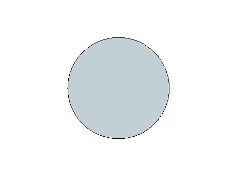
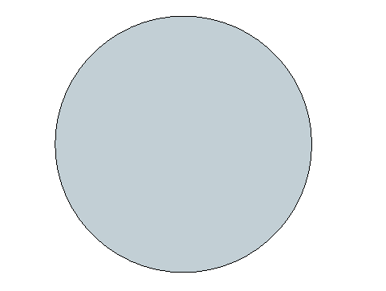
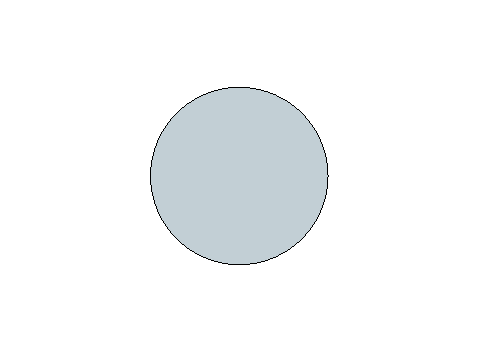
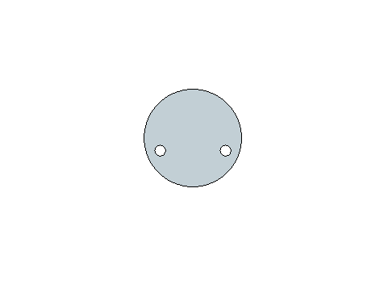

# CNC Cut Files

Acrylic windows for the gauges and for the AC and DC Meter Panel.

[← Back to main page](../README.md)

---

## Cuts

Five shapes, **nine pieces** in total. All five previews are drawn to the same scale, so the sizes can be compared against each other.

<table>
<thead>
<tr>
<th></th>
<th>File</th>
<th>Size</th>
<th>Qty</th>
<th>Used on</th>
</tr>
</thead>
<tbody>
<tr>
<td align="center"></td>
<td><a href="https://github.com/om7ea/B737/blob/main/docs/cnc_cut/cnc_gauge_48-8.dxf"><b>cnc_gauge_48-8.dxf</b></a></td>
<td>Ø 48.8 mm</td>
<td align="right">5×</td>
<td>Fuel Control, Generator Bus, Air Conditioning Control, Cabin Altitude and Bleed Air Control panels</td>
</tr>
</tbody>
<tbody>
<tr>
<td align="center"></td>
<td><a href="https://github.com/om7ea/B737/blob/main/docs/cnc_cut/cnc_gauge_78-9.dxf"><b>cnc_gauge_78-9.dxf</b></a></td>
<td>Ø 78.9 mm</td>
<td align="right">1×</td>
<td>Cabin Altitude Panel - the large two-needle gauge</td>
</tr>
</tbody>
<tbody>
<tr>
<td align="center"></td>
<td><a href="https://github.com/om7ea/B737/blob/main/docs/cnc_cut/cnc_gauge_43-8.dxf"><b>cnc_gauge_43-8.dxf</b></a></td>
<td>Ø 43.8 mm</td>
<td align="right">1×</td>
<td>Engine and Oxygen Panel</td>
</tr>
</tbody>
<tbody>
<tr>
<td align="center"></td>
<td><a href="https://github.com/om7ea/B737/blob/main/docs/cnc_cut/cnc_gauge_29-8.dxf"><b>cnc_gauge_29-8.dxf</b></a></td>
<td>Ø 29.8 mm, with two Ø 3.3 mm holes 20 mm apart</td>
<td align="right">1×</td>
<td>Cabin Pressure Control Panel</td>
</tr>
</tbody>
<tbody>
<tr>
<td align="center"></td>
<td><a href="https://github.com/om7ea/B737/blob/main/docs/cnc_cut/cnc_meter_window.dxf"><b>cnc_meter_window.dxf</b></a></td>
<td>96 × 46 mm, corners rounded to R 4.5 mm</td>
<td align="right">1×</td>
<td>AC and DC Meter Panel</td>
</tr>
</tbody>
</table>

The four round pieces are the windows of the gauges. Which instrument sits behind each one is on that panel's own page.

---

## Material

**Acrylic sheet between 2 and 3 mm** works for every piece. I used what I had on the shelf:

| Piece | Material I used |
|---|---|
| The four round gauge windows | **2 mm clear** |
| The meter panel window | **3 mm grey**, 65 % light transmission |

The grey sheet is what gives the meter panel window its dark, switched-off look while the instruments behind it still read clearly when lit.

---

## Cutting

I cut all nine pieces myself on my own CNC router.

The DXF files are drawn **1:1 in millimetres** and each outline is the finished edge of the piece, so the cutter has to run outside the line by its own radius.
