# 2. Annunciators

[📦 Download the printable model on MakerWorld](https://makerworld.com/en/models/3121595-boeing-737-overhead-annunciators)

[← Back to model list](README.md)

---

> **Note**
> The annunciators are shared across the whole overhead panel — they are not part of any individual panel model. A total of **125** are needed for the complete project.
>
> For the PCB, bill of materials, switch type and wiring, see [Annunciator PCB](../pcb/annunciator.md).

---

## Photos

<table>
<tr>
<td align="center" width="50%">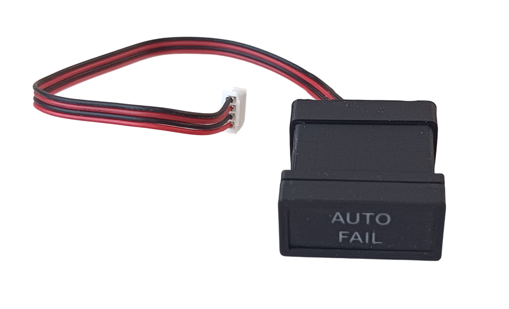 A single assembled annunciator</td>
<td align="center" width="50%">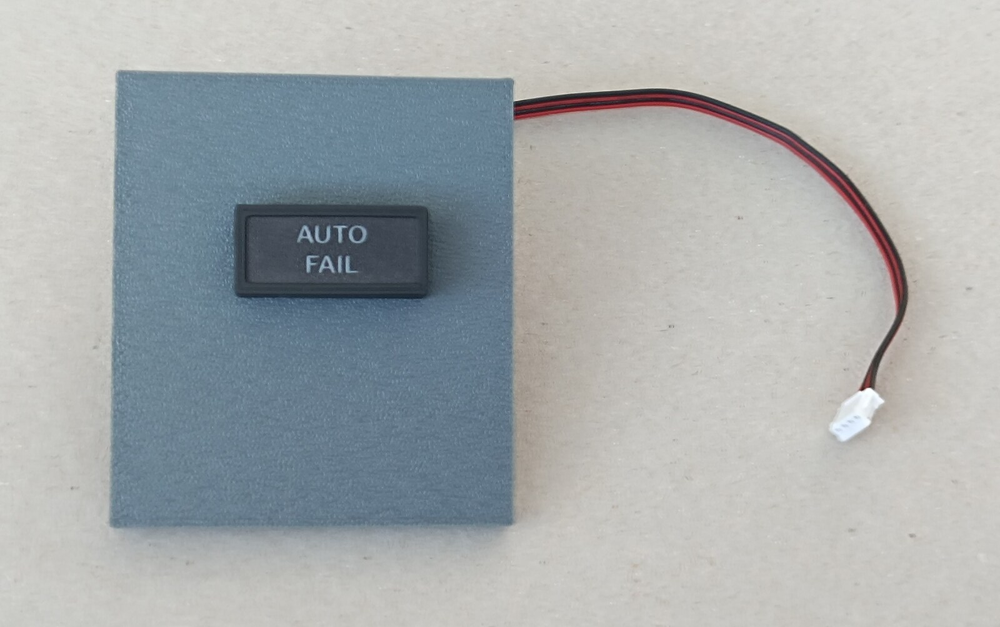 Finished annunciator fitted into a panel</td>
</tr>
<tr>
<td align="center" width="50%">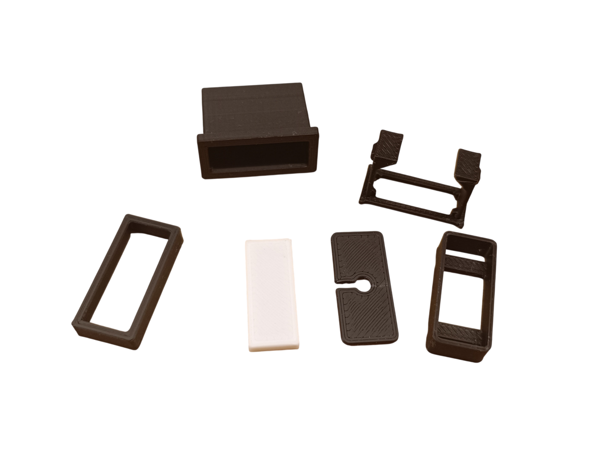 The six printed parts of one annunciator</td>
<td align="center" width="50%">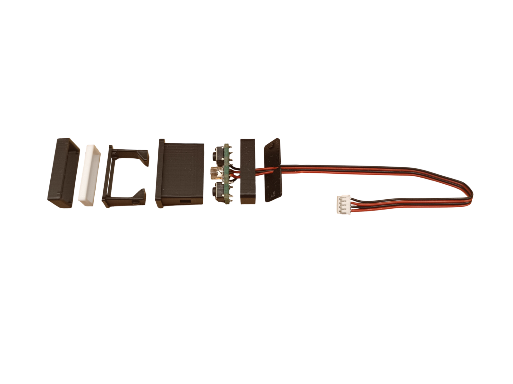 One annunciator, exploded</td>
</tr>
</table>

---

## How They Work

The annunciators have **built-in push buttons**, so they can reproduce the behaviour of the annunciators on the real aircraft. Pressing an annunciator lights it up, exactly as it does on the real overhead panel.

Each annunciator carries two tact switches and one LED on its own small PCB — see [Annunciator PCB](../pcb/annunciator.md).

---

## Annunciator Types

The project uses several types of annunciator:

| Qty | Background | LED |
|---:|---|---|
| 94× | black | yellow |
| 9× | black | green |
| 2× | black | white |
| 8× | blue | white |
| 9× | blue | white, two brightness levels (DIM/BRIGHT) |
| 2× | black | large special annunciators |

The two large special annunciators are **not** part of this model — their printable parts are included in the Engine and Oxygen panel model.

---

## Filament

| | Colour | Filament |
|---|---|---|
|  | Black | Bambu PLA Basic Black (10101) |
|  | White | Bambu PLA Basic Jade White (10100) |

---

## 3D Printed Parts

Six parts make up one annunciator. The quantities below are for the complete project.

| Qty | Part | Notes |
|---:|---|---|
| 121× | outer-part | print on a **Smooth** PEI plate |
| 121× | inner-part | see the printing warning below |
| 121× | table | white; print on a **Smooth** PEI plate |
| 121× | table-frame | print on a **Smooth** PEI plate |
| 121× | pcb-holder | |
| 121× | pcb-holder-cover | |

### ⚠️ Printing the inner-part

All parts of this model are printed with a **0.12 mm** layer height, except the **inner-part**, which uses **0.16 mm**.

The inner-part can be quite challenging to print. Its upper section may wobble during printing, which can cause it to detach from the build plate. If printing at 0.16 mm is unsuccessful, try **0.20 mm** instead. Calibrating the printer to reduce vibrations may also help.

---

## UV Print Files

| Qty | File |
|---:|---|
| 1× | A4 PDF — annunciator labels |

The PDF and the printing instructions are on the [UV Print Files](../uv-print.md) page.

---

## PCB

| Qty | PCB | Gerber files |
|---:|---|---|
| 121× | [Annunciator PCB](../pcb/annunciator.md) | [📥 PCB_Annunciator.zip](https://raw.githubusercontent.com/om7ea/B737/main/PCB/PCB_Annunciator.zip) |

---

## Assembly Diagram

One annunciator, exploded — from the table-frame on the left to the PCB and its cable on the right:

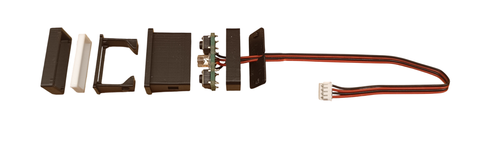

### 1. Table and UV foil

Attach the white **table** to the transparent self-adhesive UV-printed foil.

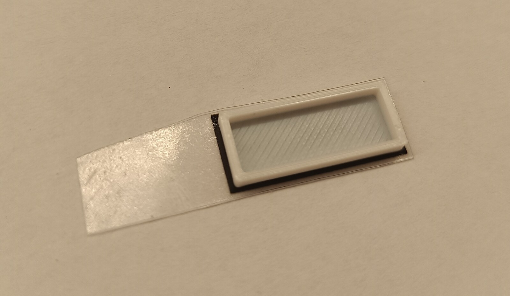

### 2. Trim the foil

Carefully trim away the excess foil using a knife.

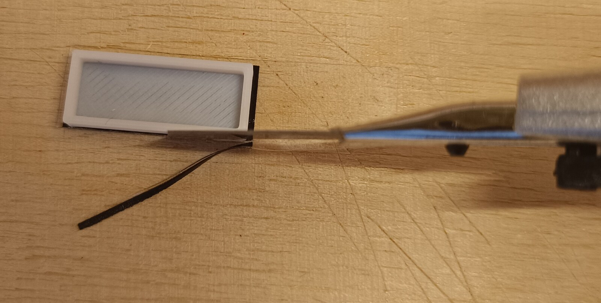

### 3. Glue the table into the table-frame

Apply a small drop of super glue to the highlighted areas.

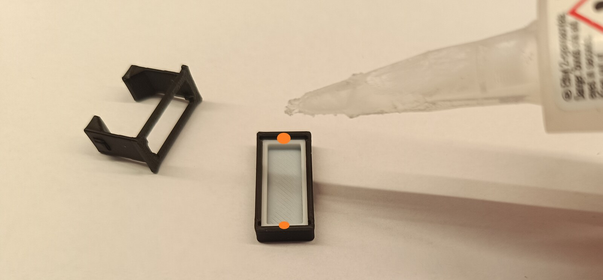

### 4. Insert the inner-part

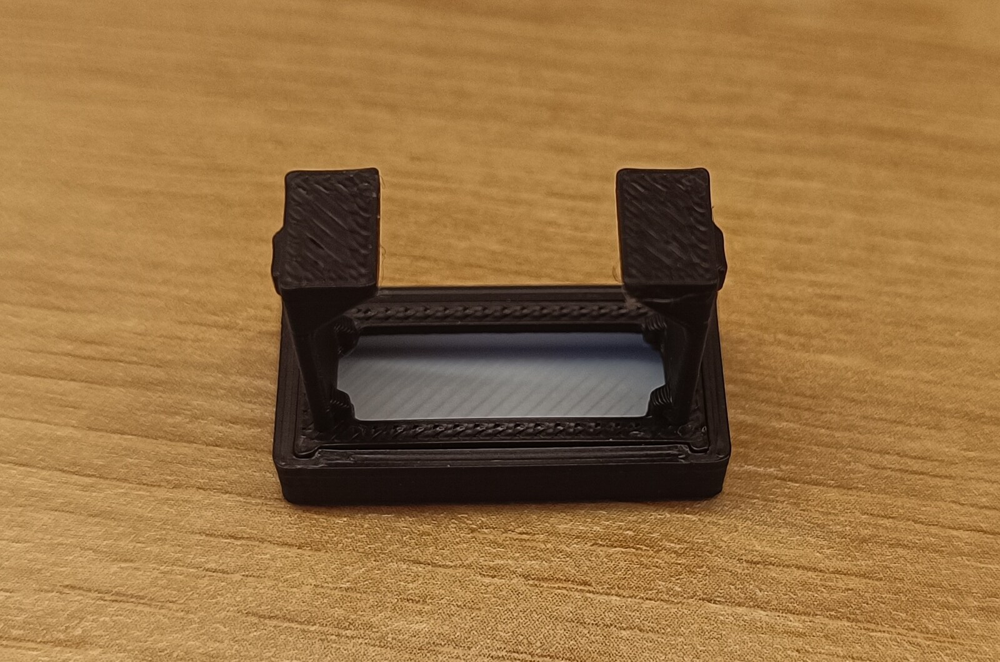

### 5. Fit the outer-part into the panel

Insert the **outer-part** into the panel and secure it with super glue or a hot glue gun. I recommend a 7 mm hot glue gun, as the assembly can then be taken apart again later if needed.

<table>
<tr>
<td align="center" width="50%">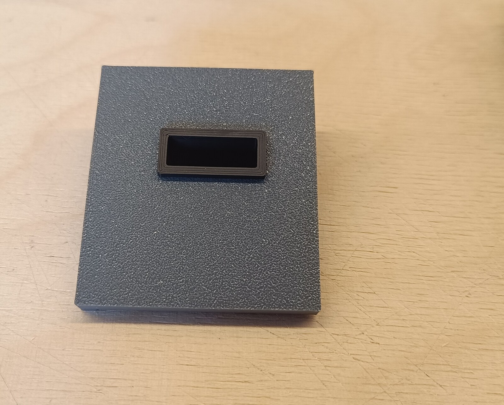 Front of the panel</td>
<td align="center" width="50%">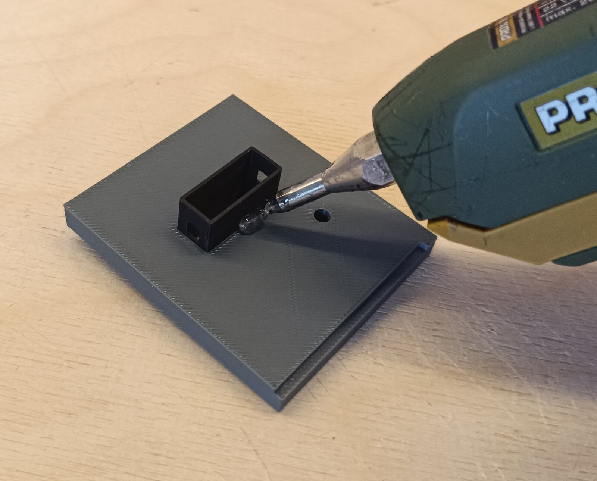 Glued from the back with a hot glue gun</td>
</tr>
</table>

### 6. Insert the assembled PCB into the pcb-holder

Instructions for assembling the PCB are on the [Annunciator PCB](../pcb/annunciator.md) page.

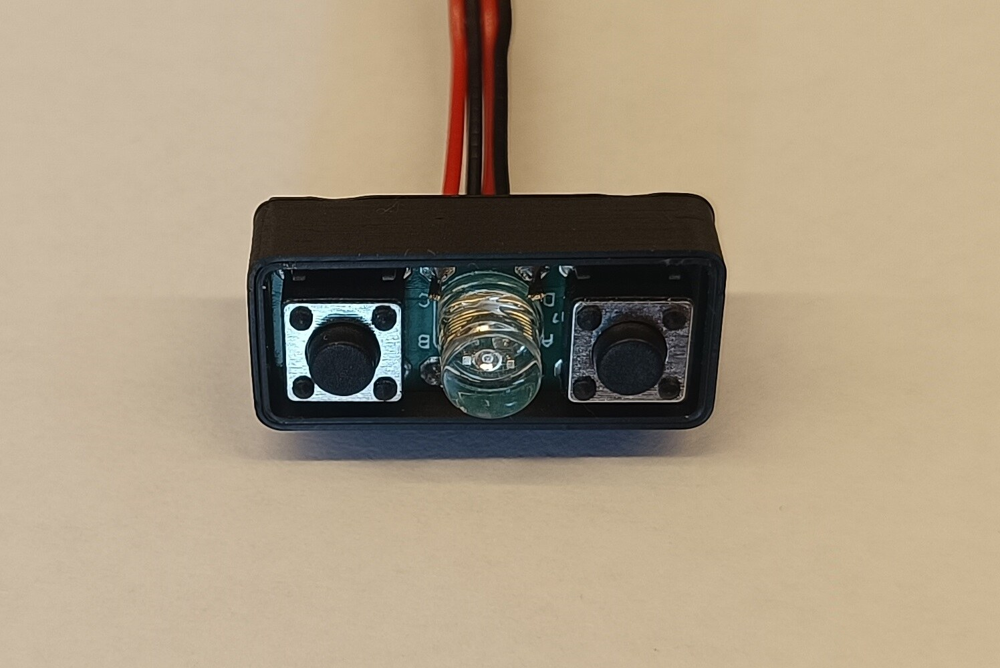

### 7. Glue the pcb-holder in place

Complete this step **only once you have the assembled RJ45 LED driver**, so that you can connect the annunciator PCB and test the mechanism while you work.

> **⚠️ Test before you glue**
> Assemble the parts completely **without glue** first and test the mechanism to make sure that both buttons work correctly and move freely. Only glue once you have confirmed that everything works.
>
> In some cases the mechanism may not work correctly — only one of the two buttons responds, neither button responds, or the buttons stay permanently pressed. If this happens, disassemble the parts **immediately** and find the cause before the glue sets. Otherwise the mechanism can end up permanently glued in the wrong position, and the outer-part and pcb-holder may have to be destroyed to take it apart.
>
> A slow-setting adhesive with a working time of about 1 minute is the safer choice. I used standard super glue myself without any problems.

Once the mechanism works correctly on the test RJ45 LED driver, apply a small drop of super glue to the marked areas, insert the pcb-holder with the PCB installed, and keep testing the mechanism while the glue sets to make sure it stays fully functional.

<table>
<tr>
<td align="center" width="50%">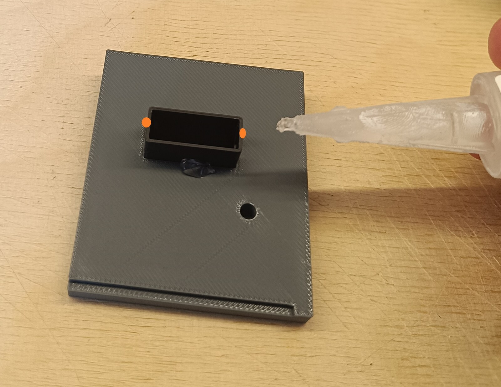 Glue points marked in orange</td>
<td align="center" width="50%">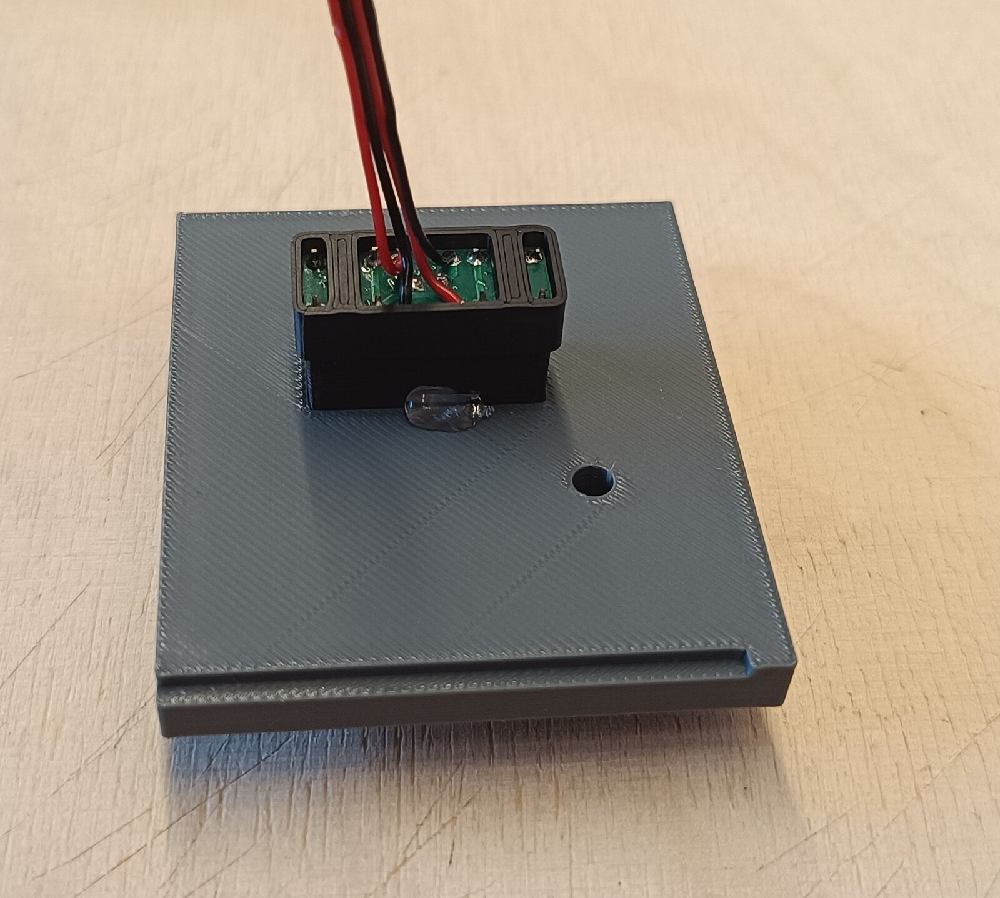 Pcb-holder with the PCB in place</td>
</tr>
</table>

### 8. Fit the pcb-holder cover

Apply a small amount of hot glue between the wires and attach the **pcb-holder-cover**. The hot glue also provides mechanical protection against the wires being pulled out.

<table>
<tr>
<td align="center" width="50%">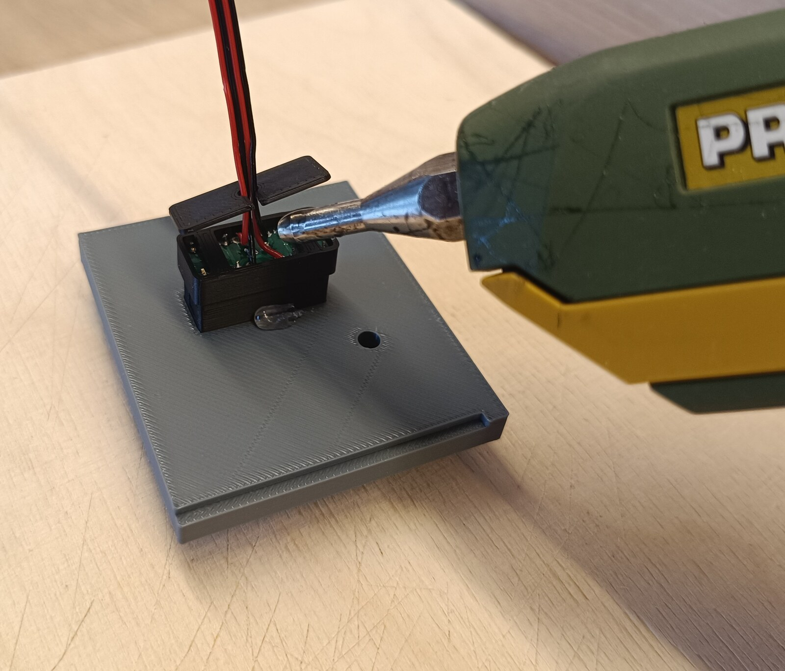 Hot glue applied between the wires</td>
<td align="center" width="50%">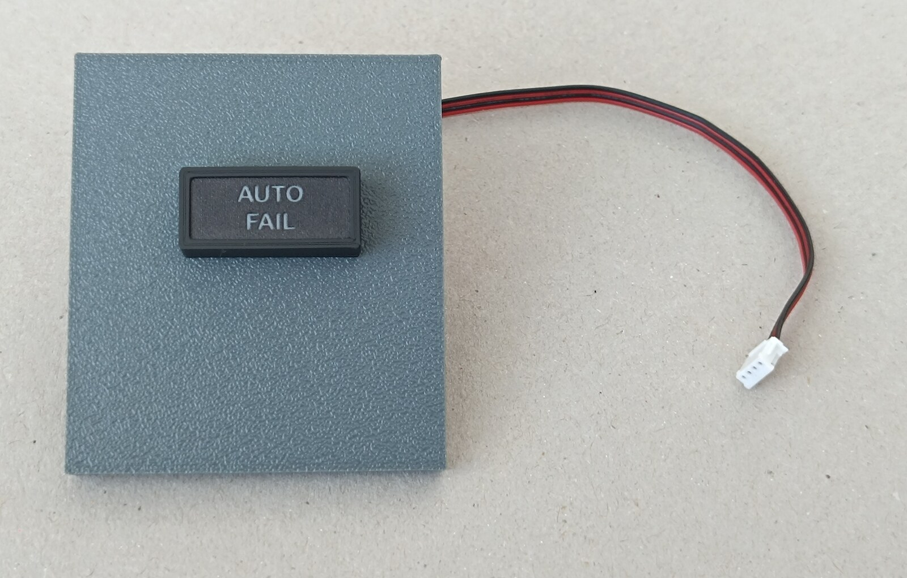 The finished annunciator</td>
</tr>
</table>
