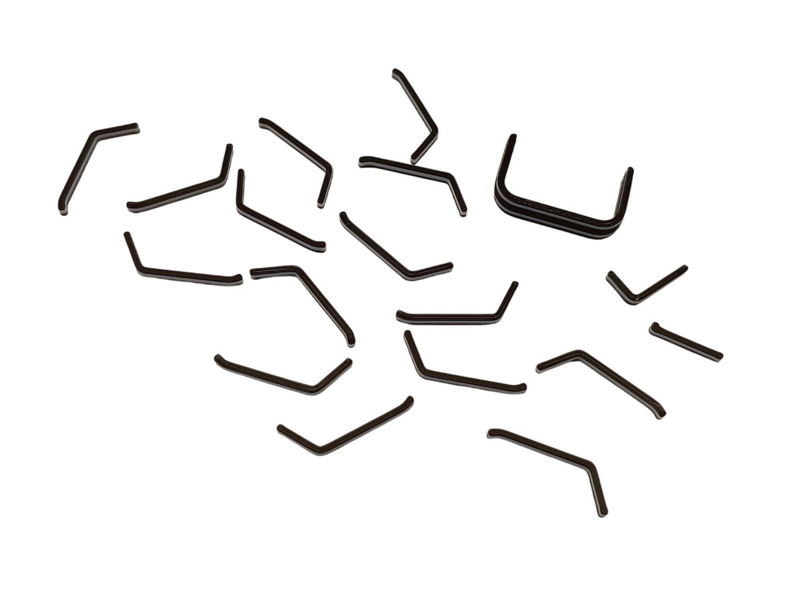

# 3. Rotary Knobs

[📦 Download the printable model on MakerWorld](https://makerworld.com/en/models/3066127-boeing-737-overhead-rotary-knobs)

[← Back to model list](README.md)

---

> **Note**
> The knobs are shared across the whole overhead panel — they are not part of any individual panel model. **21** knobs are needed for the complete project. Each panel page lists the knobs that panel uses.

---

## Photos

<table>
<tbody>
<tr>
<td align="center" width="50%"> The knob types, with the indicators already fitted</td>
<td align="center" width="50%"> Indicators before fitting</td>
</tr>
</tbody>
</table>

---

## Filament

| | Colour | Filament |
|---|---|---|
|  | Bone White | Bambu PLA Matte Bone White (11103) |
|  | Black | Bambu PLA Basic Black (10101) |
|  | White | Bambu PLA Basic Jade White (10100) |

---

## 3D Printed Parts

### Knobs

| Qty | Part | Shaft |
|---:|---|---|
| 14× | General knob | splined |
| 2× | General knob | D shaft |
| 1× | Fuel cross feed knob | |
| 1× | Flt alt knob | |
| 1× | Land alt knob | |
| 1× | IRS dspl sel knob | |
| 1× | IRS sys dspl knob | |

### Indicators

| Qty | Part |
|---:|---|
| 16× | General knob indicator |
| 1× | Fuel cross feed knob indicator |
| 1× | IRS dspl sel knob indicator |
| 1× | IRS sys dspl knob indicator |

The indicator is the black marker line that clips into the knob. The Flt alt and Land alt knobs have no indicator, which is why there are 19 indicators for 21 knobs.

---

## Screws

Every knob is held on its shaft by one grub screw.

| Qty | Screw | Used for |
|---:|---|---|
| 19× | Grub screw M3×8 | all knobs except the two below |
| 2× | Grub screw M3×5 | the IRS dspl sel and IRS sys dspl knobs on the IRS Display Unit |
