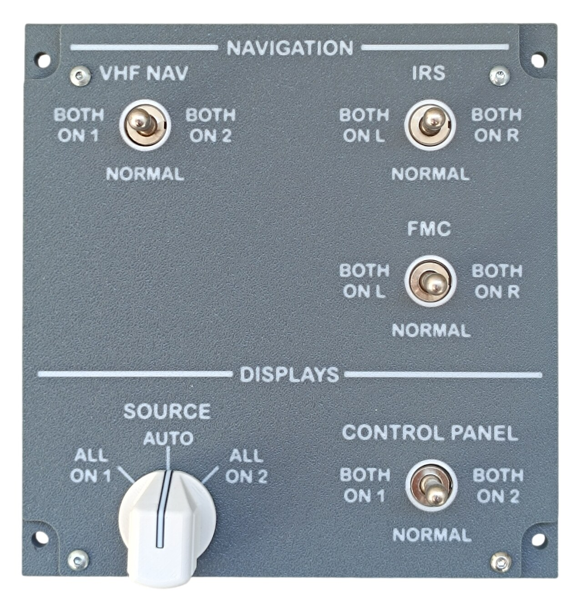
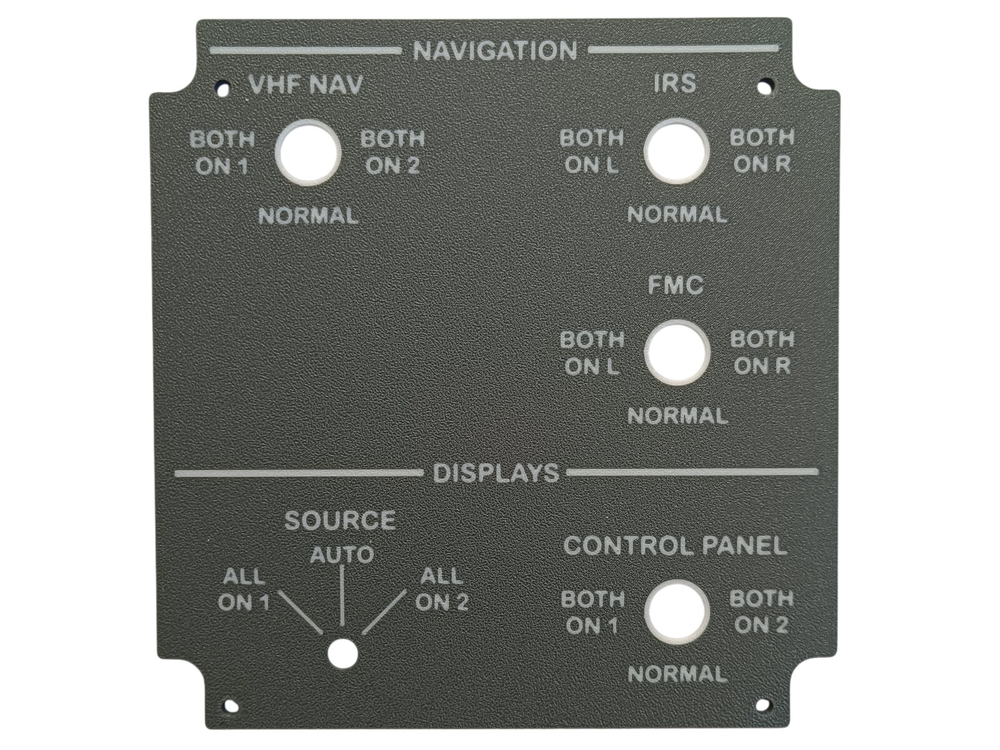
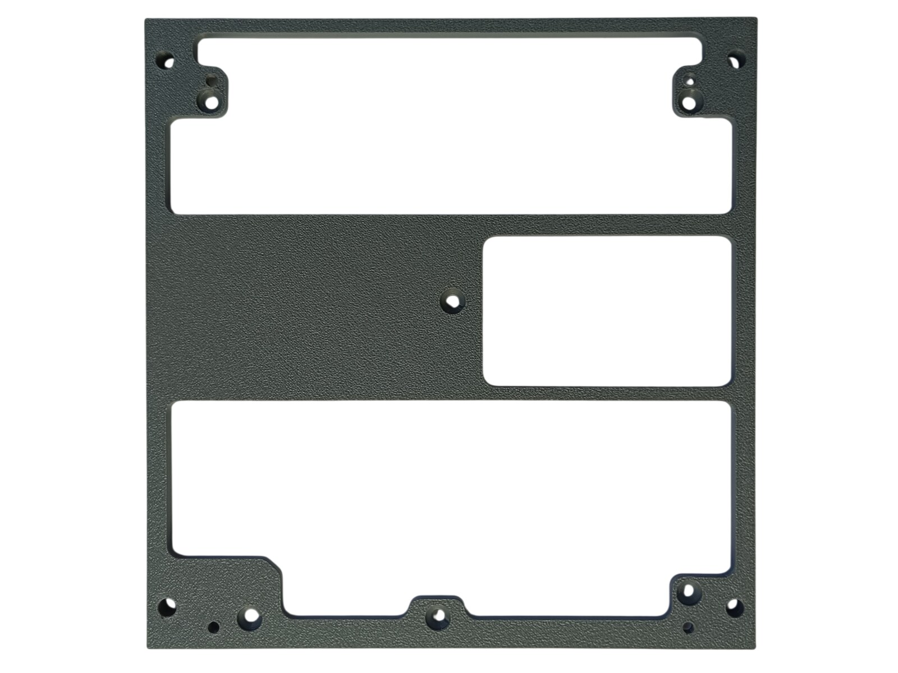
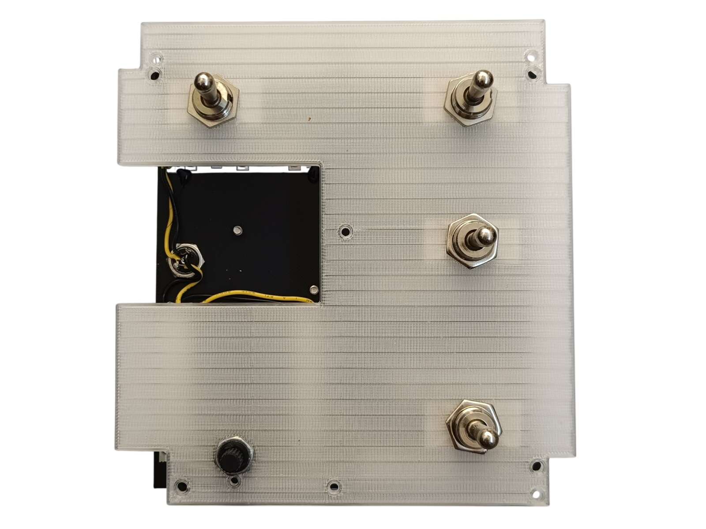
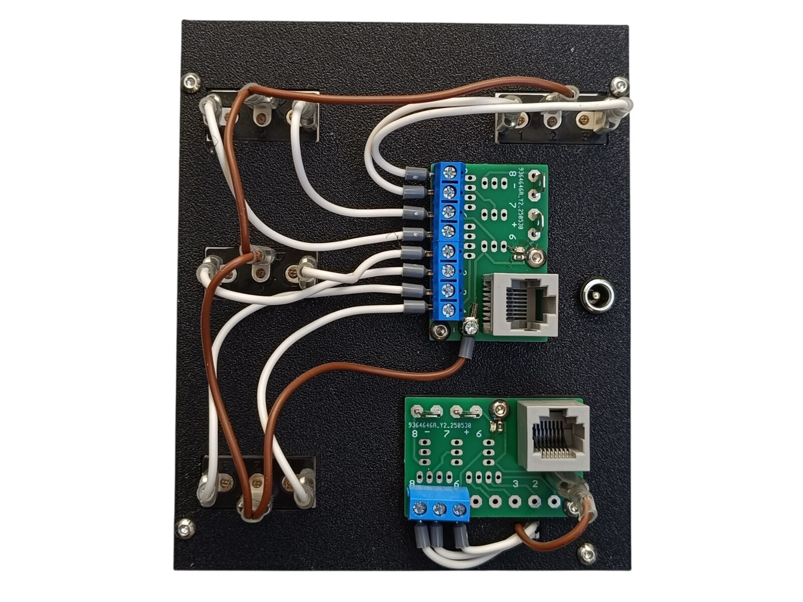
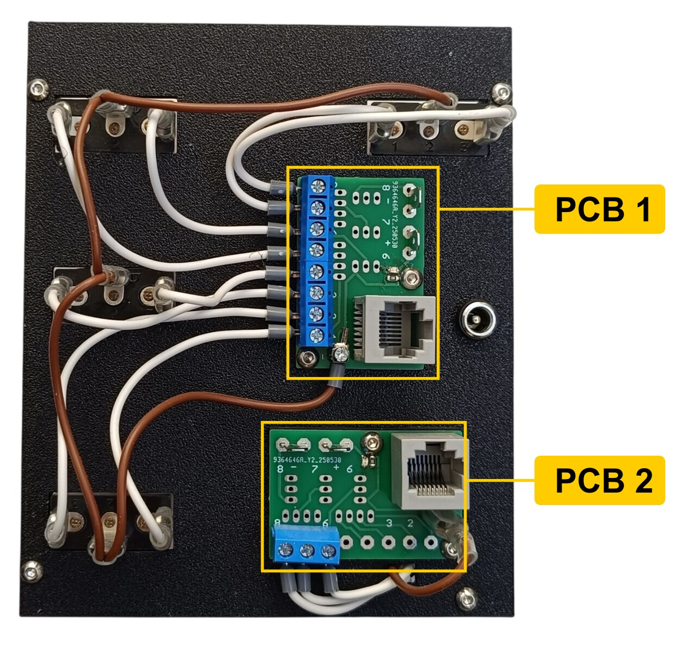
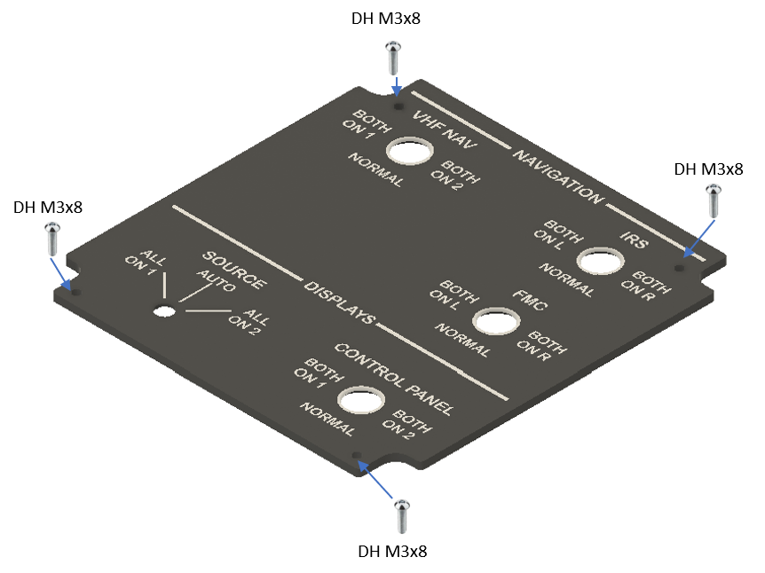
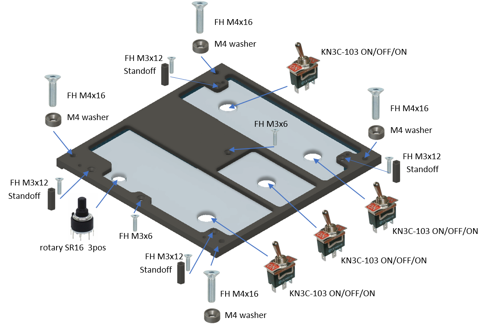
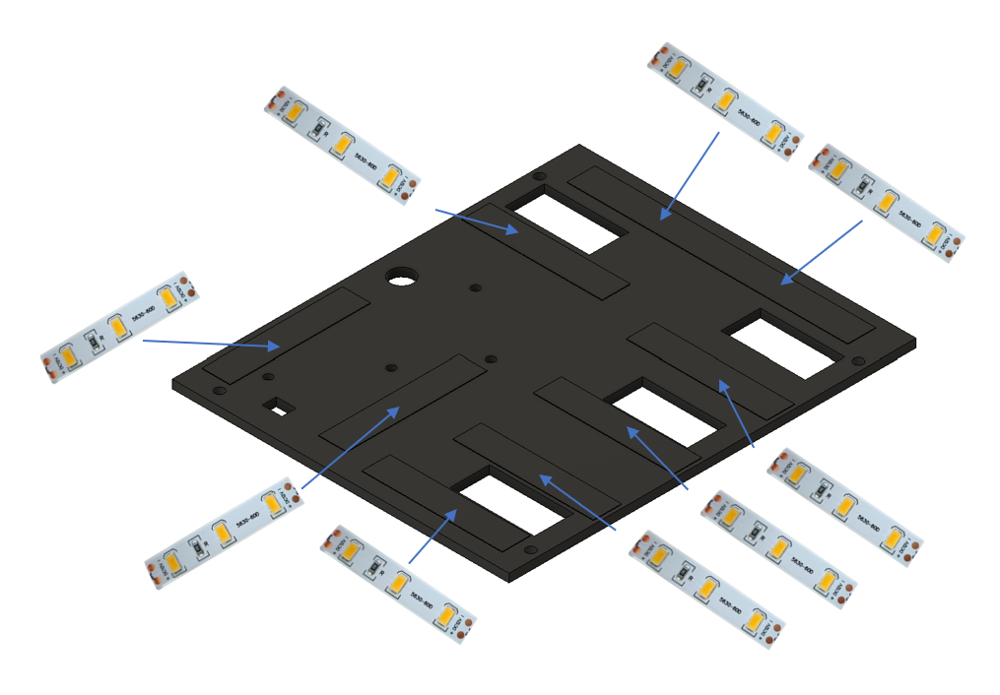
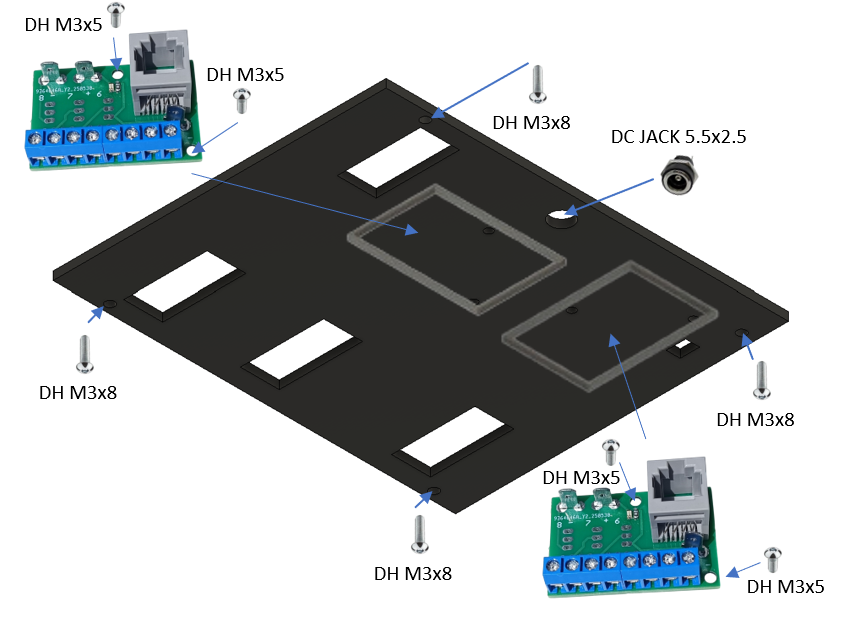

# 4. Navigation Panel

[📦 Download the printable model on MakerWorld](https://makerworld.com/en/models/2985636-boeing-737-overhead-navigation-panel)

[← Back to model list](README.md)

---

## Photos

<table>
<tbody>
<tr>
<td align="center" width="50%"> Finished panel</td>
<td align="center" width="50%"> Printed top panel</td>
</tr>
</tbody>
<tbody>
<tr>
<td align="center" width="50%"> Printed bottom panel</td>
<td align="center" width="50%"> Diffuser panel fitted, before the top panel goes on</td>
</tr>
</tbody>
<tbody>
<tr>
<td align="center" width="50%"> Rear side — PCBs, wiring and DC jack</td>
<td width="50%"></td>
</tr>
</tbody>
</table>

---

## Filament

| | Colour | Filament |
|---|---|---|
|  | Dark Gray | C-Tech Premium Line PLA RAL7011 |
|  | Transparent | Filament PM PLA Transparent |
|  | White | Bambu PLA Basic Jade White (10100) |
|  | Black | Bambu PLA Basic Black (10101) |

---

## 3D Printed Parts

| Qty | Part | Notes |
|---:|---|---|
| 1× | Top panel | print on a **Textured** PEI plate |
| 1× | Bottom panel | print on a **Textured** PEI plate |
| 1× | Diffuser panel | print on a **Smooth** PEI plate |
| 1× | Backlight panel | |
| 2× | PCB frame | |
| 4× | M4 washer | |
| 4× | Standoff 16 mm | |

---

## Switches and Buttons

| Qty | Type |
|---:|---|
| 4× | KN3(C)-103, ON/OFF/ON |
| 1× | Rotary switch SR16, 3 position |

The rotary switch is the SOURCE selector, the four toggle switches are VHF NAV, IRS, FMC and CONTROL PANEL.

---

## Rotary Knob

The knob for the SOURCE selector is a separate model shared with the other panels — it is **not included** in this download.

| | |
|---|---|
| 📦 Printable model | [Boeing 737 Overhead - Rotary Knobs](https://makerworld.com/en/models/3066127-boeing-737-overhead-rotary-knobs) |
| 🔧 Build notes | [Rotary Knobs](03-rotary-knobs.md) |

---

## Screws

| Qty | Screw | Joins |
|---:|---|---|
| 2× | Flat head M3×6 | bottom + diffuser |
| 4× | Flat head M3×12 | bottom + standoff |
| 4× | Flat head M4×16 | bottom + main frame |
| 4× | Dome head M3×5 | PCB + backlight |
| 4× | Dome head M3×8 | top + bottom |
| 4× | Dome head M3×8 | backlight + standoff |

---

## PCB

| Qty | PCB | Connections used | Gerber files |
|---:|---|---|---|
| 1× | [RJ45 Direct](../pcb/rj45-direct.md) | pins 1–8 | [📥 PCB_RJ45_Direct.zip](https://raw.githubusercontent.com/om7ea/B737/main/PCB/PCB_RJ45_Direct.zip) |
| 1× | [RJ45 Direct](../pcb/rj45-direct.md) | pins 6–8 | [📥 PCB_RJ45_Direct.zip](https://raw.githubusercontent.com/om7ea/B737/main/PCB/PCB_RJ45_Direct.zip) |

Mounting and connections are shown in [step 4](#4-backlight-panel--pcbs-and-dc-jack) of the assembly diagram. Which switch each connection carries is in [Wiring](#wiring).

---

## Wiring

There are no annunciators on this panel — everything on it is a switch input. The five switches need eleven connections, more than one Direct PCB has pins for, so they are split over two boards. Both reach the **same** MEGA 2560 — `Overhead_1b`. Each PCB is connected by one Ethernet patch cable to a socket on the [RJ45 Hub Shield](../pcb/rj45-hub-shield.md).

| PCB | Patch cable goes to | Connections used |
|---|---|---|
| **PCB 1** | socket **A2** on **Overhead_1b** | pins 1–8 |
| **PCB 2** | socket **A1** on **Overhead_1b** | pins 6–8 |

The socket labels **D0–D6**, **A1** and **A2** are silkscreened on the hub shield.

The rear of the panel. **PCB 1** is the upper board, the one with all eight screw terminals fitted; **PCB 2** is the lower board with only three.

### PCB 1 — socket A2 on Overhead_1b

The four toggle switches. Each of them is a three-position ON/OFF/ON switch, so each takes **two pins**, one per active position — in the centre NORMAL position neither pin is connected.

| Pin | Switch |
|---:|---|
| 1 | CONTROL PANEL — BOTH ON 2 |
| 2 | CONTROL PANEL — BOTH ON 1 |
| 3 | FMC — BOTH ON L |
| 4 | FMC — BOTH ON R |
| 5 | IRS — BOTH ON L |
| 6 | IRS — BOTH ON R |
| 7 | VHF NAV — BOTH ON 1 |
| 8 | VHF NAV — BOTH ON 2 |

The pairs follow the switches up the panel: CONTROL PANEL at the bottom, then FMC, then IRS and VHF NAV in the top row.

### PCB 2 — socket A1 on Overhead_1b

The SOURCE rotary switch, at the bottom left of the panel. All three of its positions are wired, each to its own pin — unlike the toggle switches, one of them is always connected.

| Pin | Switch |
|---:|---|
| 6 | SOURCE — ALL ON 2 |
| 7 | SOURCE — ALL ON 1 |
| 8 | SOURCE — AUTO |

Pins 1 to 5 are not used.

**The five switches share a single ground return.** Each switch takes one of its terminals to its own pin. The opposite terminals are commoned — daisy-chained from one switch to the next — and the chain ends at a **-** (ground) contact.

---

## Backlight

| Qty | Part |
|---:|---|
| 9× | LED strip |
| 1× | DC jack 5.5 × 2.5 mm |

Powered from the **12 V** supply — see [Power supply](../system-overview.md#power-supply).

---

## Assembly Diagram

Screw abbreviations used in the diagrams: **FH** = flat head, **DH** = dome head.

### 1. Top panel

### 2. Bottom panel — switches, diffuser and standoffs

### 3. Backlight panel — LED strips

### 4. Backlight panel — PCBs and DC jack

