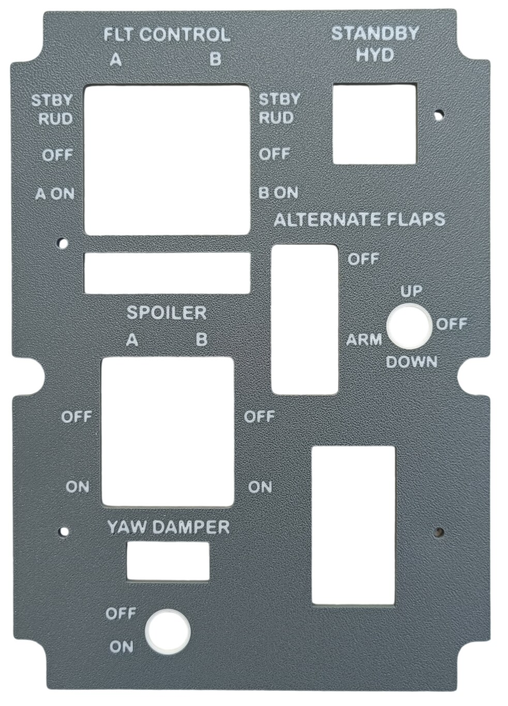
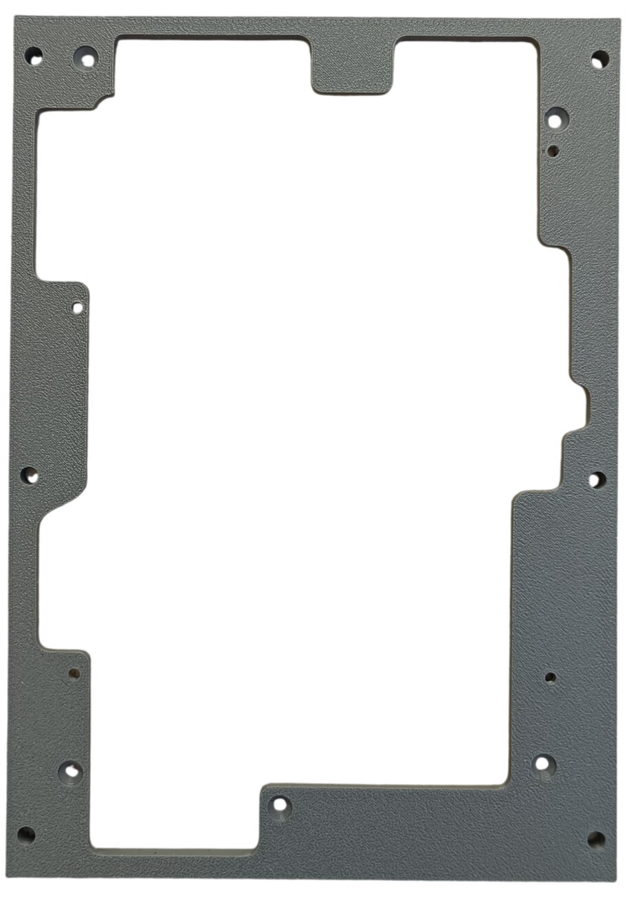
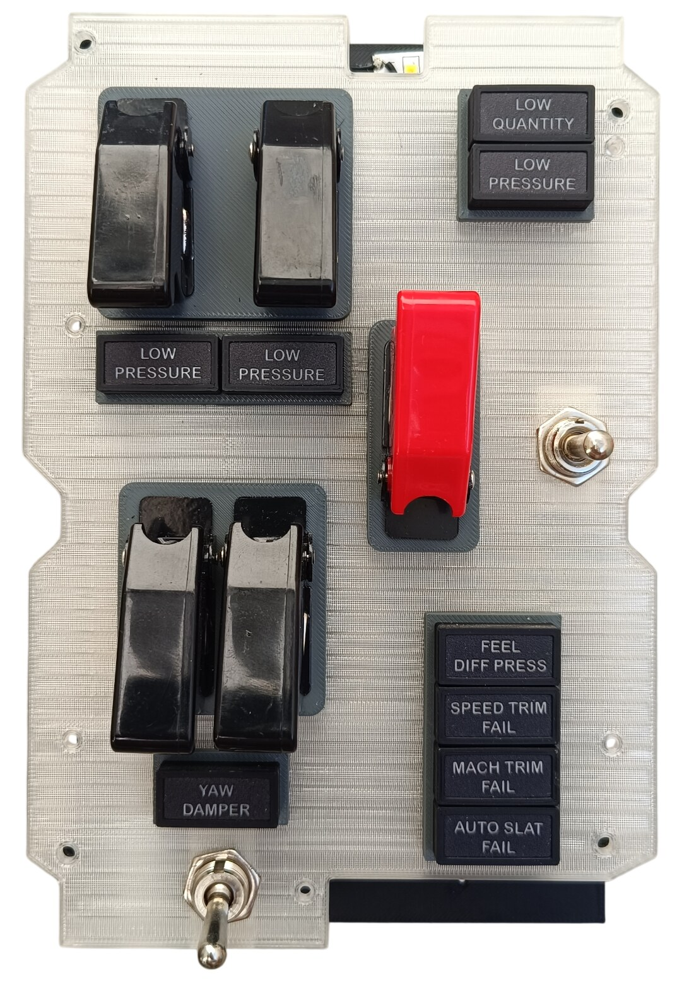
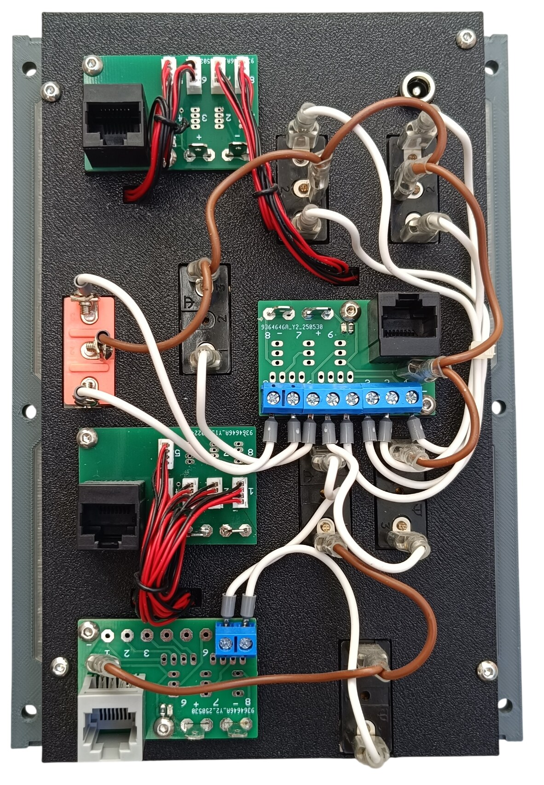
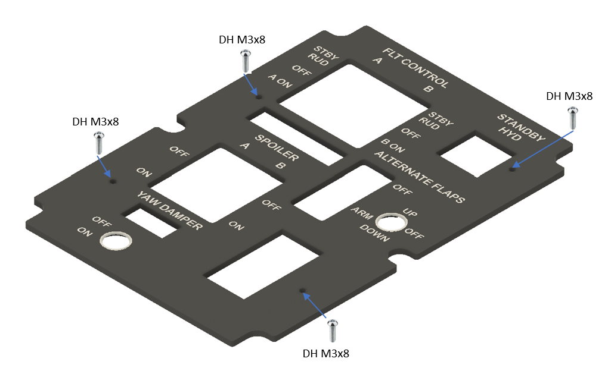
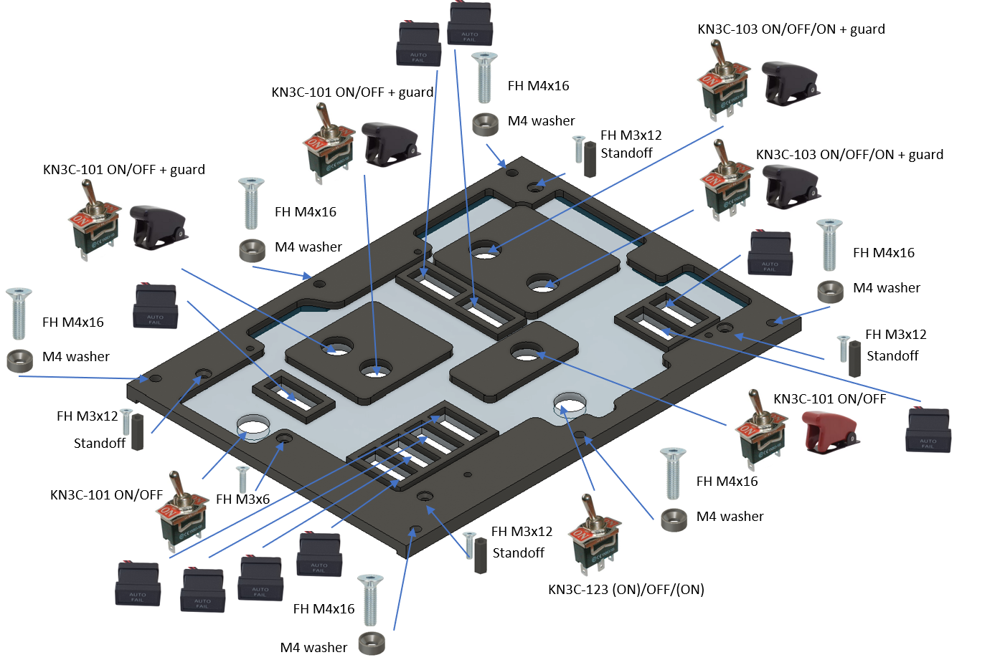
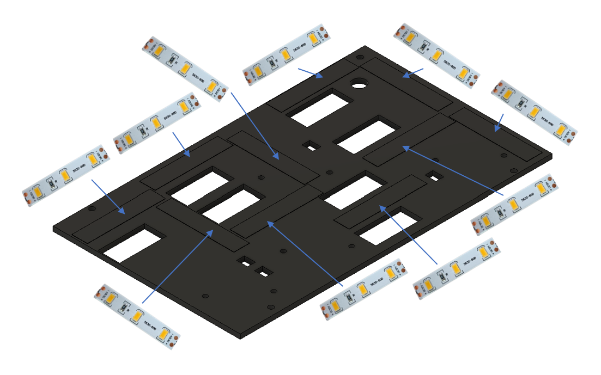
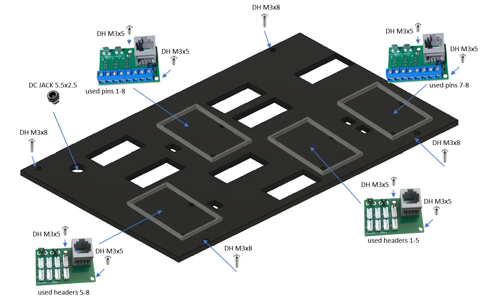

# 5. Flight Control Panel

[📦 Download the printable model on MakerWorld](https://makerworld.com/en/models/3153234-boeing-737-overhead-flight-control-panel)

[← Back to model list](README.md)

---

## Photos

<table>
<tbody>
<tr>
<td align="center" width="50%"> Finished panel</td>
<td align="center" width="50%"> Printed top panel</td>
</tr>
</tbody>
<tbody>
<tr>
<td align="center" width="50%"> Printed bottom panel</td>
<td align="center" width="50%"> Diffuser panel fitted, before the top panel goes on</td>
</tr>
</tbody>
<tbody>
<tr>
<td align="center" width="50%"> Rear side — the four PCBs, wiring and DC jack</td>
<td width="50%"></td>
</tr>
</tbody>
</table>

---

## Filament

| | Colour | Filament |
|---|---|---|
|  | Dark Gray | C-Tech Premium Line PLA RAL7011 |
|  | Transparent | Filament PM PLA Transparent |
|  | White | Bambu PLA Basic Jade White (10100) |
|  | Black | Bambu PLA Basic Black (10101) |

---

## 3D Printed Parts

| Qty | Part | Notes |
|---:|---|---|
| 1× | Top panel | print on a **Textured** PEI plate |
| 1× | Bottom panel | print on a **Textured** PEI plate |
| 1× | Diffuser panel | print on a **Smooth** PEI plate |
| 1× | Backlight panel | |
| 4× | PCB frame | |
| 6× | M4 washer | |
| 4× | Standoff 16 mm | |

---

## Switches and Buttons

| Qty | Type |
|---:|---|
| 2× | KN3(C)-103, ON/OFF/ON |
| 4× | KN3(C)-101 or KN3(C)-102, ON/OFF |
| 1× | KN3(C)-123, (ON)/OFF/(ON) |
| 4× | Toggle switch safety aircraft guard, black |
| 1× | Toggle switch safety aircraft guard, red |

The four black guards go on the FLT CONTROL and SPOILER switches, the red one on the ALTERNATE FLAPS ARM switch. The ALTERNATE FLAPS UP/DOWN and YAW DAMPER switches are left unguarded.

---

## Screws

| Qty | Screw | Joins |
|---:|---|---|
| 1× | Flat head M3×6 | bottom + diffuser |
| 4× | Flat head M3×12 | bottom + standoff |
| 6× | Flat head M4×16 | bottom + main frame |
| 8× | Dome head M3×5 | PCB + backlight |
| 4× | Dome head M3×8 | top + bottom |
| 4× | Dome head M3×8 | backlight + standoff |

---

## Annunciators

| Qty | Type |
|---:|---|
| 9× | Black background, yellow LED |

The annunciators are a separate model shared with the other panels — they are **not included** in this download.

| | |
|---|---|
| 📦 Printable model | [Boeing 737 Overhead - Annunciators](https://makerworld.com/en/models/3121595-boeing-737-overhead-annunciators) |
| 🔧 Build notes | [Annunciators](02-annunciators.md) |
| 🔌 PCB, BOM and wiring | [Annunciator PCB](../pcb/annunciator.md) |

---

## PCB

| Qty | PCB | Connections used | Gerber files |
|---:|---|---|---|
| 1× | [RJ45 Direct](../pcb/rj45-direct.md) | pins 1–8 | [📥 PCB_RJ45_Direct.zip](https://raw.githubusercontent.com/om7ea/B737/main/PCB/PCB_RJ45_Direct.zip) |
| 1× | [RJ45 Direct](../pcb/rj45-direct.md) | pins 7–8 | [📥 PCB_RJ45_Direct.zip](https://raw.githubusercontent.com/om7ea/B737/main/PCB/PCB_RJ45_Direct.zip) |
| 1× | [RJ45 LED Driver](../pcb/rj45-driver.md) | headers 1–5 | [📥 PCB_RJ45_Driver.zip](https://raw.githubusercontent.com/om7ea/B737/main/PCB/PCB_RJ45_Driver.zip) |
| 1× | [RJ45 LED Driver](../pcb/rj45-driver.md) | headers 5–8 | [📥 PCB_RJ45_Driver.zip](https://raw.githubusercontent.com/om7ea/B737/main/PCB/PCB_RJ45_Driver.zip) |

Mounting and connections are shown in [step 4](#4-backlight-panel--pcbs-and-dc-jack) of the assembly diagram.

---

## Backlight

| Qty | Part |
|---:|---|
| 10× | LED strip |
| 1× | DC jack 5.5 × 2.5 mm |

Powered from the **12 V** supply — see [Power supply](../system-overview.md#power-supply).

---

## Assembly Diagram

Screw abbreviations used in the diagrams: **FH** = flat head, **DH** = dome head.

### 1. Top panel

### 2. Bottom panel — diffuser, switches, annunciators and standoffs

### 3. Backlight panel — LED strips

### 4. Backlight panel — PCBs and DC jack

