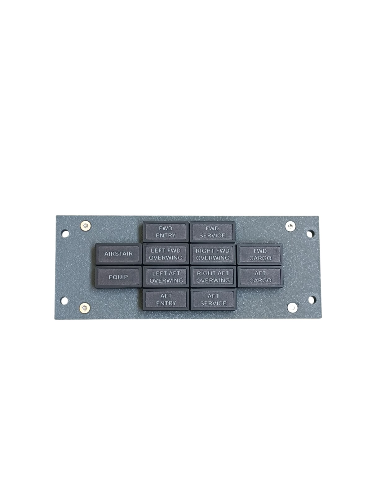
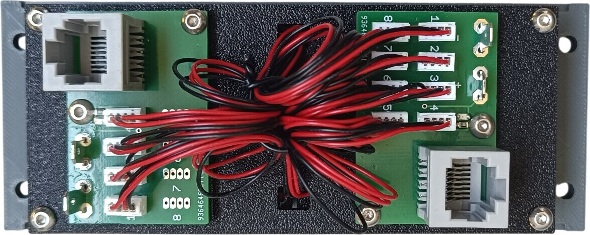
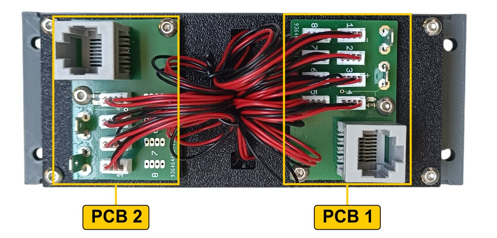
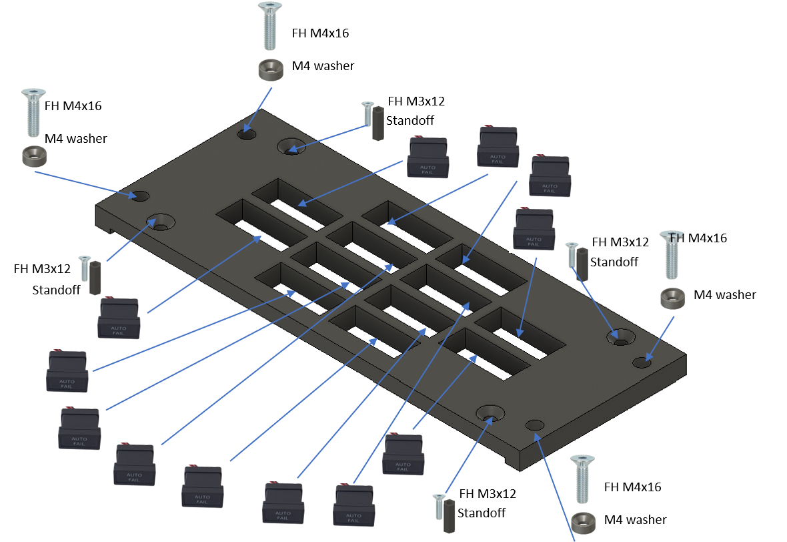
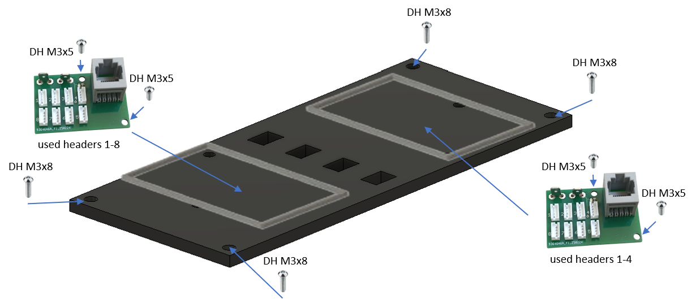

# 6. Door Warning Panel

[📦 Download the printable model on MakerWorld](https://makerworld.com/en/models/3163604-boeing-737-overhead-door-warning-panel)

[← Back to model list](README.md)

---

## Photos

<table>
<tbody>
<tr>
<td align="center" width="50%"> Finished panel</td>
<td align="center" width="50%"> Rear side — the two PCBs and wiring</td>
</tr>
</tbody>
</table>

---

## Filament

| | Colour | Filament |
|---|---|---|
|  | Dark Gray | C-Tech Premium Line PLA RAL7011 |
|  | Black | Bambu PLA Basic Black (10101) |

---

## 3D Printed Parts

| Qty | Part | Notes |
|---:|---|---|
| 1× | Bottom panel | print on a **Textured** PEI plate |
| 1× | Backlight panel | carries the PCBs — this panel is not backlit, see [Backlight](#backlight) |
| 2× | PCB frame | |
| 4× | M4 washer | |
| 4× | Standoff 16 mm | |

---

## Switches and Buttons

None — this panel carries annunciators only.

---

## Screws

| Qty | Screw | Joins |
|---:|---|---|
| 4× | Flat head M3×12 | bottom + standoff |
| 4× | Flat head M4×16 | bottom + main frame |
| 4× | Dome head M3×5 | PCB + backlight |
| 4× | Dome head M3×8 | backlight + standoff |

---

## Annunciators

| Qty | Type |
|---:|---|
| 12× | Black background, yellow LED |

The annunciators are a separate model shared with the other panels — they are **not included** in this download.

| | |
|---|---|
| 📦 Printable model | [Boeing 737 Overhead - Annunciators](https://makerworld.com/en/models/3121595-boeing-737-overhead-annunciators) |
| 🔧 Build notes | [Annunciators](02-annunciators.md) |
| 🔌 PCB, BOM and wiring | [Annunciator PCB](../pcb/annunciator.md) |

---

## PCB

| Qty | PCB | Connections used | Gerber files |
|---:|---|---|---|
| 1× | [RJ45 LED Driver](../pcb/rj45-driver.md) | headers 1–8 — **PCB 1** | [📥 PCB_RJ45_Driver.zip](https://raw.githubusercontent.com/om7ea/B737/main/PCB/PCB_RJ45_Driver.zip) |
| 1× | [RJ45 LED Driver](../pcb/rj45-driver.md) | headers 1–4 — **PCB 2** | [📥 PCB_RJ45_Driver.zip](https://raw.githubusercontent.com/om7ea/B737/main/PCB/PCB_RJ45_Driver.zip) |

Mounting is shown in [step 2](#2-backlight-panel--pcbs) of the assembly diagram. Which annunciator each header drives, and which board each PCB connects to, is in [Wiring](#wiring).

---

## Wiring

The twelve annunciators are driven by two [RJ45 LED Driver](../pcb/rj45-driver.md) PCBs. Each PCB is connected by one Ethernet patch cable to a socket on the [RJ45 Hub Shield](../pcb/rj45-hub-shield.md) of a MEGA 2560 PRO MINI.

**This panel is split across two boards.** Eight annunciators are driven by one and four by the other, and the split does not follow the rows of the panel — go by the tables below, not by the order the annunciators sit in.

| PCB | Patch cable goes to | Headers used |
|---|---|---:|
| **PCB 1** | socket **D2** on **Overhead_2b** | 1–8 |
| **PCB 2** | socket **D5** on **Overhead_4** | 1–4 |

The rear of the panel. **PCB 1** is the one with all eight headers populated; **PCB 2** has only headers 1–4.

The socket labels **D0–D6**, **A1** and **A2** are silkscreened on the hub shield.

### PCB 1 — socket D2 on Overhead_2b

| Header | Annunciator |
|---:|---|
| 1 | AFT ENTRY |
| 2 | AFT CARGO |
| 3 | RIGHT FWD OVERWING |
| 4 | LEFT FWD OVERWING |
| 5 | AIRSTAIR |
| 6 | FWD CARGO |
| 7 | EQUIP |
| 8 | AFT SERVICE |

### PCB 2 — socket D5 on Overhead_4

| Header | Annunciator |
|---:|---|
| 1 | FWD SERVICE |
| 2 | FWD ENTRY |
| 3 | RIGHT AFT OVERWING |
| 4 | LEFT AFT OVERWING |

Headers 5–8 are not populated on this PCB — the ZH connectors are only soldered in where a channel is used.

---

## Backlight

**This panel is not backlit.** It has no LED strips and no DC jack.

The printed part is still called *backlight panel* to keep the naming consistent with the other panels — here it only carries the two PCBs.

---

## Assembly Diagram

Screw abbreviations used in the diagrams: **FH** = flat head, **DH** = dome head.

### 1. Bottom panel — annunciators and standoffs

### 2. Backlight panel — PCBs

