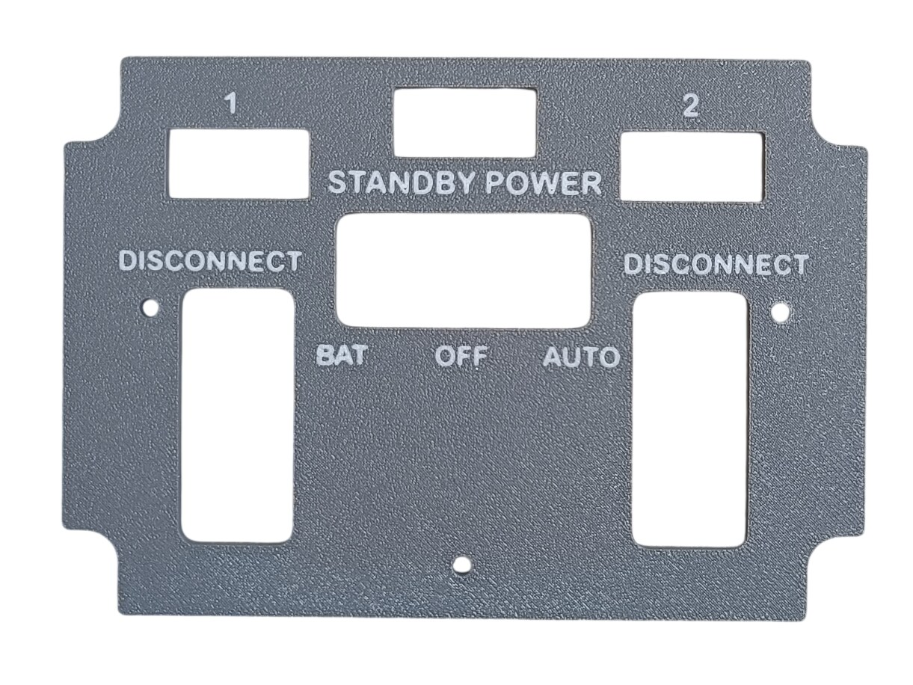
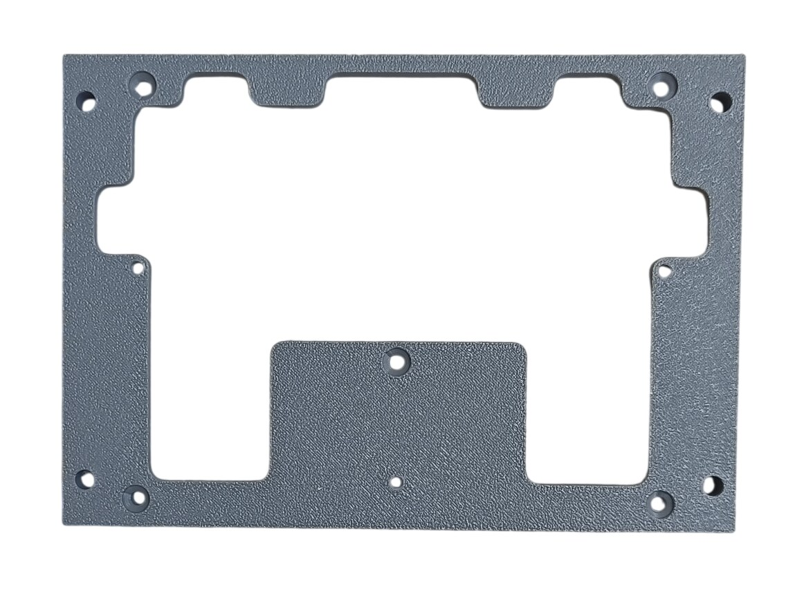
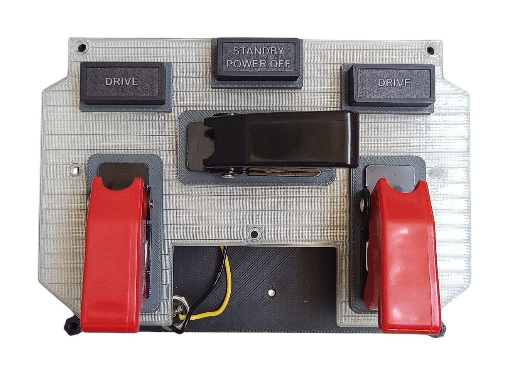
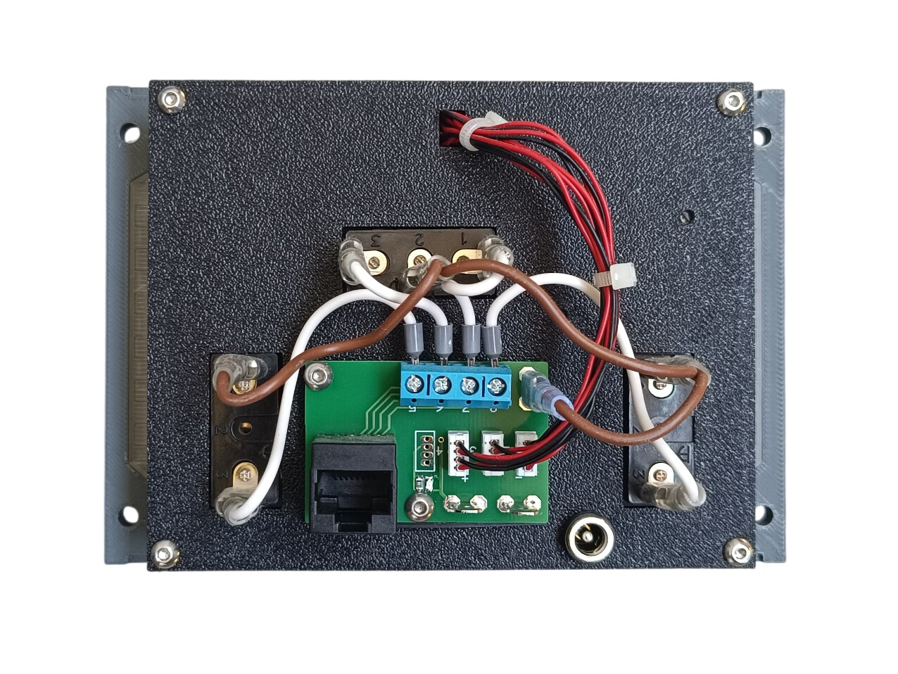
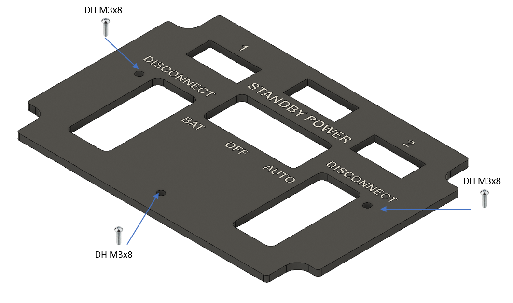
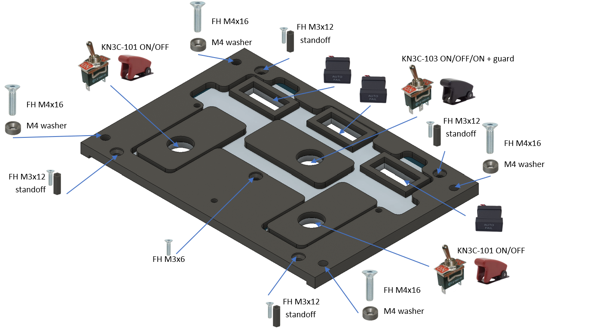
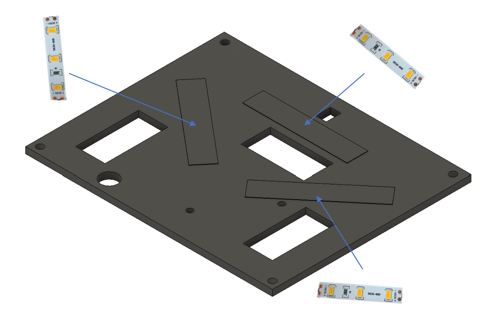
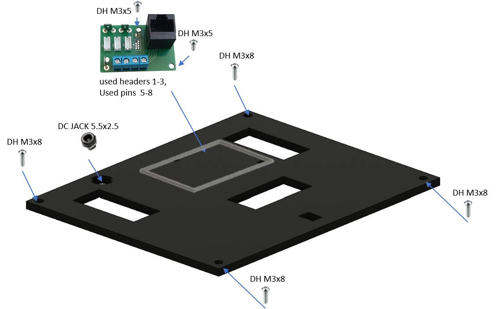

# 7. Generator Drive and Standby Power Panel

[📦 Download the printable model on MakerWorld](https://makerworld.com/en/models/3163662-boeing-737-overhead-generator-drive-panel)

[← Back to model list](README.md)

---

## Photos

<table>
<tbody>
<tr>
<td align="center" width="50%"> Finished panel</td>
<td align="center" width="50%"> Printed top panel</td>
</tr>
</tbody>
<tbody>
<tr>
<td align="center" width="50%"> Printed bottom panel</td>
<td align="center" width="50%"> Diffuser panel fitted, before the top panel goes on</td>
</tr>
</tbody>
<tbody>
<tr>
<td align="center" width="50%"> Rear side — PCB, wiring and DC jack</td>
<td width="50%"></td>
</tr>
</tbody>
</table>

---

## Filament

| | Colour | Filament |
|---|---|---|
|  | Dark Gray | C-Tech Premium Line PLA RAL7011 |
|  | Transparent | Filament PM PLA Transparent |
|  | White | Bambu PLA Basic Jade White (10100) |
|  | Black | Bambu PLA Basic Black (10101) |

---

## 3D Printed Parts

| Qty | Part | Notes |
|---:|---|---|
| 1× | Top panel | print on a **Textured** PEI plate |
| 1× | Bottom panel | print on a **Textured** PEI plate |
| 1× | Diffuser panel | print on a **Smooth** PEI plate |
| 1× | Backlight panel | |
| 1× | PCB frame | |
| 4× | M4 washer | |
| 4× | Standoff 16 mm | |

---

## Switches and Buttons

| Qty | Type |
|---:|---|
| 1× | KN3(C)-103, ON/OFF/ON |
| 2× | KN3(C)-101 or KN3(C)-102, ON/OFF |
| 1× | Toggle switch safety aircraft guard, black |
| 2× | Toggle switch safety aircraft guard, red |

The black guard goes on the STANDBY POWER switch, the two red ones on the DISCONNECT switches.

---

## Screws

| Qty | Screw | Joins |
|---:|---|---|
| 1× | Flat head M3×6 | bottom + diffuser |
| 4× | Flat head M3×12 | bottom + standoff |
| 4× | Flat head M4×16 | bottom + main frame |
| 2× | Dome head M3×5 | PCB + backlight |
| 3× | Dome head M3×8 | top + bottom |
| 4× | Dome head M3×8 | backlight + standoff |

---

## Annunciators

| Qty | Type |
|---:|---|
| 3× | Black background, yellow LED |

The annunciators are a separate model shared with the other panels — they are **not included** in this download.

| | |
|---|---|
| 📦 Printable model | [Boeing 737 Overhead - Annunciators](https://makerworld.com/en/models/3121595-boeing-737-overhead-annunciators) |
| 🔧 Build notes | [Annunciators](02-annunciators.md) |
| 🔌 PCB, BOM and wiring | [Annunciator PCB](../pcb/annunciator.md) |

---

## PCB

| Qty | PCB | Connections used | Gerber files |
|---:|---|---|---|
| 1× | [RJ45 Combined](../pcb/rj45-combined.md) | headers 1–3 and pins 5–8 | [📥 PCB_RJ45_Combined.zip](https://raw.githubusercontent.com/om7ea/B737/main/PCB/PCB_RJ45_Combined.zip) |

Mounting and connections are shown in [step 4](#4-backlight-panel--pcb-and-dc-jack) of the assembly diagram. Which annunciator and which switch each connection carries is in [Wiring](#wiring).

---

## Wiring

Everything on this panel — three annunciators and three switches — goes to a single PCB, connected by one Ethernet patch cable to a socket on the [RJ45 Hub Shield](../pcb/rj45-hub-shield.md).

| PCB | Patch cable goes to | Connections used |
|---|---|---|
| **PCB 1** | socket **A1** on **Overhead_2b** | headers 1–3, pins 5–8 |

The socket labels **D0–D6**, **A1** and **A2** are silkscreened on the hub shield.

The rear of the panel. There is only one board here, so it needs no marking: the annunciators go to the white ZH headers, the switches to the blue screw terminal.

### PCB 1 — socket A1 on Overhead_2b

This board carries both kinds of connection: the ZH headers 1–4 drive annunciators, the screw terminals 5–8 are direct.

| Header | Annunciator |
|---:|---|
| 1 | DRIVE — 1 |
| 2 | DRIVE — 2 |
| 3 | STANDBY POWER OFF |

Header 4 is not populated.

Both DRIVE annunciators carry the same printed text; the **1** and **2** above them on the panel say which generator each belongs to.

| Pin | Switch |
|---:|---|
| 5 | DISCONNECT — 2 |
| 6 | STANDBY POWER — BAT |
| 7 | STANDBY POWER — AUTO |
| 8 | DISCONNECT — 1 |

**The STANDBY POWER switch takes two pins.** It is the three-position ON/OFF/ON switch in the middle of the panel, and each of its two active positions needs its own connection: pin 6 for BAT, pin 7 for AUTO. In the centre OFF position neither pin is connected.

The three guards are mechanical covers only — they are not wired to anything.

**The switches share a single ground return.** Each switch takes one of its terminals to its own pin on the PCB. The opposite terminals are commoned — daisy-chained from one switch to the next — and the chain ends at a **-** (ground) contact.

---

## Backlight

| Qty | Part |
|---:|---|
| 3× | LED strip |
| 1× | DC jack 5.5 × 2.5 mm |

Powered from the **12 V** supply — see [Power supply](../system-overview.md#power-supply).

---

## Assembly Diagram

Screw abbreviations used in the diagrams: **FH** = flat head, **DH** = dome head.

### 1. Top panel

### 2. Bottom panel — diffuser, switches, annunciators and standoffs

### 3. Backlight panel — LED strips

### 4. Backlight panel — PCB and DC jack

