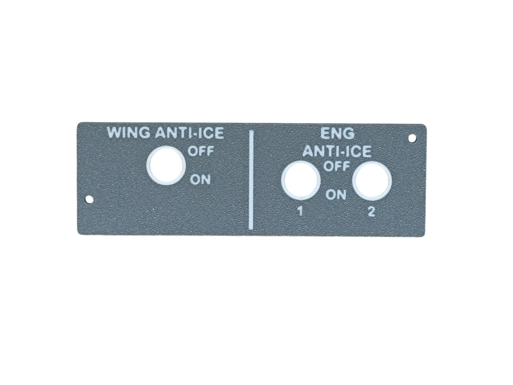
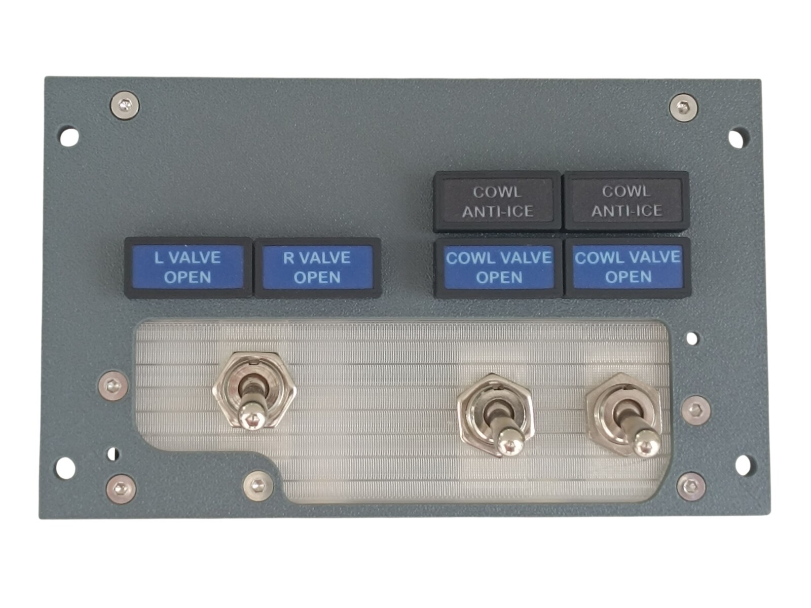
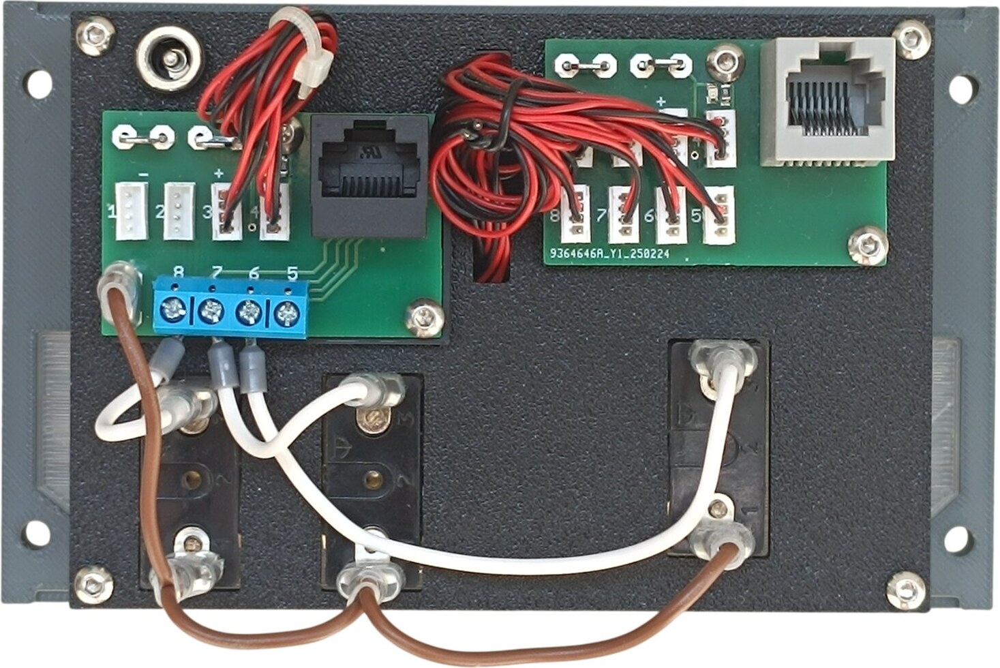
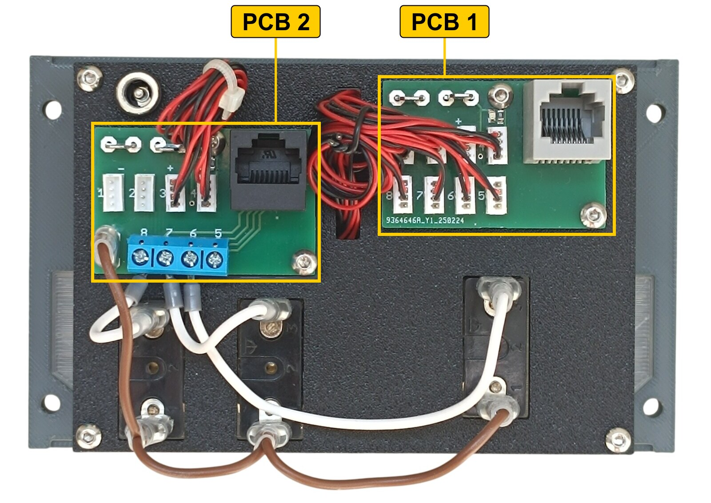
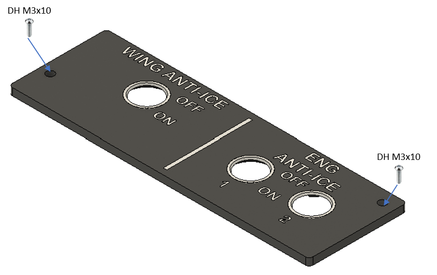
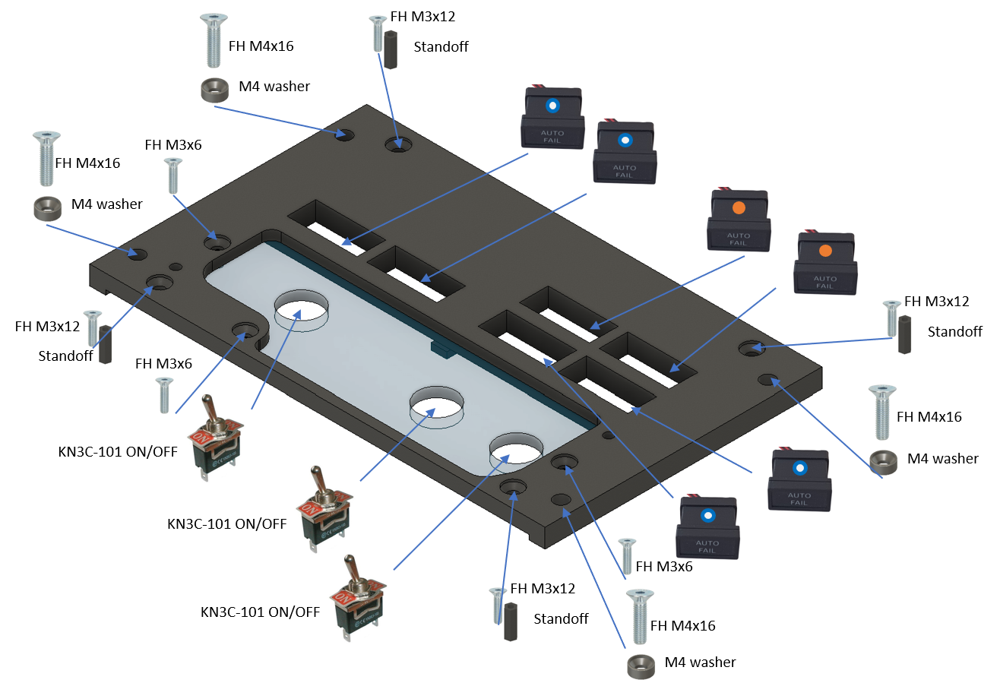
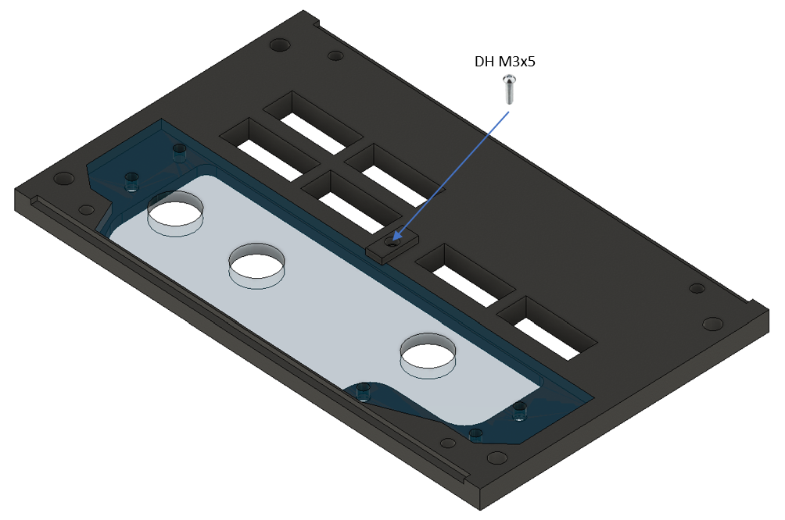
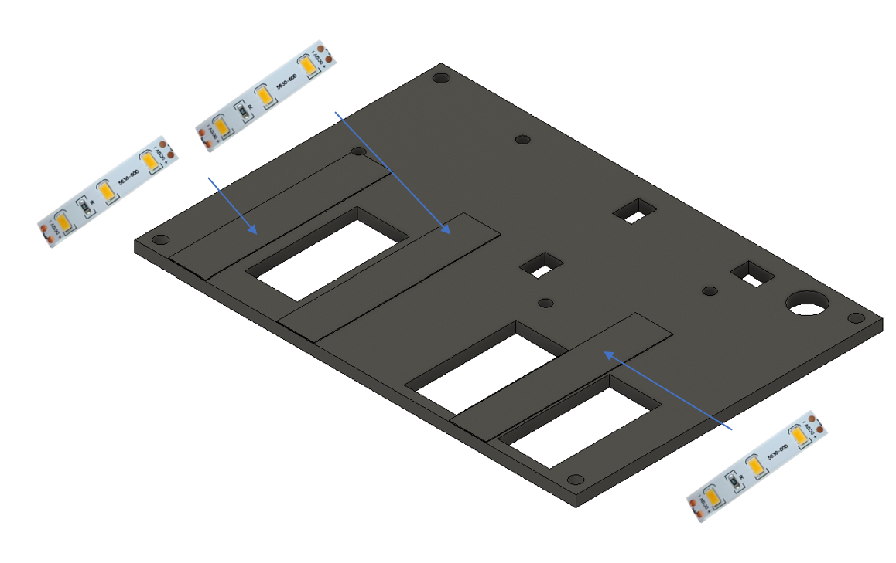
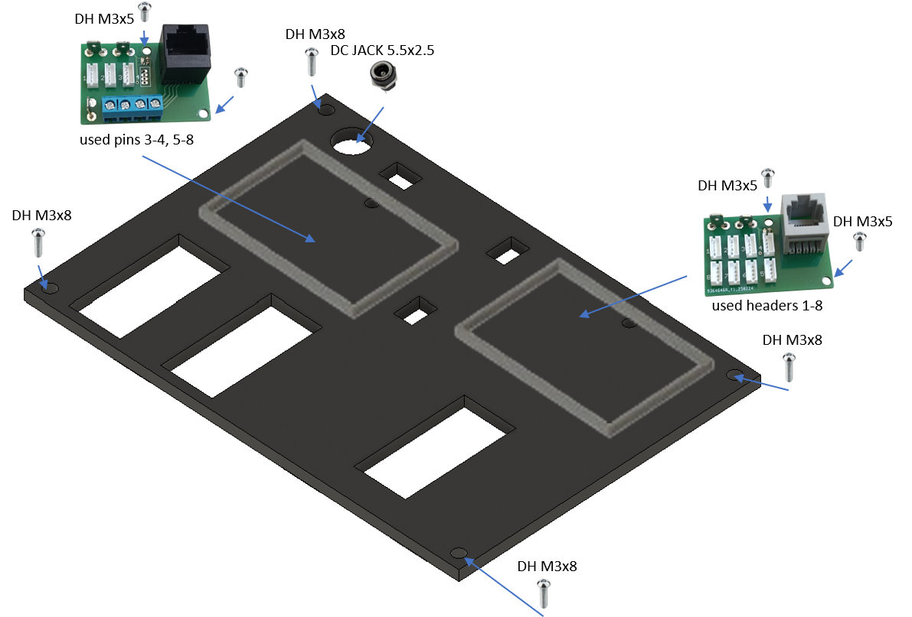

# 9. Anti-ice Panel

[📦 Download the printable model on MakerWorld](https://makerworld.com/en/models/3197814-boeing-737-overhead-anti-ice-panel)

[← Back to model list](README.md)

---

## Photos

<table>
<tbody>
<tr>
<td align="center" width="50%"> Finished panel</td>
<td align="center" width="50%"> Printed top panel</td>
</tr>
</tbody>
<tbody>
<tr>
<td align="center" width="50%"> Diffuser panel fitted, before the top panel goes on</td>
<td align="center" width="50%"> Rear side — PCBs, wiring and DC jack</td>
</tr>
</tbody>
</table>

---

## Filament

| | Colour | Filament |
|---|---|---|
|  | Dark Gray | C-Tech Premium Line PLA RAL7011 |
|  | Transparent | Filament PM PLA Transparent |
|  | White | Bambu PLA Basic Jade White (10100) |
|  | Black | Bambu PLA Basic Black (10101) |

---

## 3D Printed Parts

| Qty | Part | Notes |
|---:|---|---|
| 1× | Top panel | print on a **Textured** PEI plate |
| 1× | Bottom panel | print on a **Textured** PEI plate |
| 1× | Diffuser panel | print on a **Smooth** PEI plate |
| 1× | Backlight panel | |
| 2× | PCB frame | |
| 4× | M4 washer | |
| 4× | Standoff 16 mm | |

---

## Switches and Buttons

| Qty | Type |
|---:|---|
| 3× | KN3(C)-101 or KN3(C)-102, ON/OFF |

---

## Screws

| Qty | Screw | Joins |
|---:|---|---|
| 3× | Flat head M3×6 | bottom + diffuser |
| 4× | Flat head M3×12 | bottom + standoff |
| 4× | Flat head M4×16 | bottom + main frame |
| 5× | Dome head M3×5 | PCB + backlight, counterplate + bottom |
| 2× | Dome head M3×10 | top + bottom |
| 4× | Dome head M3×8 | backlight + standoff |

---

## Annunciators

| Qty | Type |
|---:|---|
| 2× | Black background, yellow LED |
| 4× | Blue background, white LED, dual brightness |

The annunciators are a separate model shared with the other panels — they are **not included** in this download.

| | |
|---|---|
| 📦 Printable model | [Boeing 737 Overhead - Annunciators](https://makerworld.com/en/models/3121595-boeing-737-overhead-annunciators) |
| 🔧 Build notes | [Annunciators](02-annunciators.md) |
| 🔌 PCB, BOM and wiring | [Annunciator PCB](../pcb/annunciator.md) |

---

## PCB

| Qty | PCB | Connections used | Gerber files |
|---:|---|---|---|
| 1× | [RJ45 LED Driver](../pcb/rj45-driver.md) | headers 1–8 | [📥 PCB_RJ45_Driver.zip](https://raw.githubusercontent.com/om7ea/B737/main/PCB/PCB_RJ45_Driver.zip) |
| 1× | [RJ45 Combined](../pcb/rj45-combined.md) | headers 3–4 and pins 5–8 | [📥 PCB_RJ45_Combined.zip](https://raw.githubusercontent.com/om7ea/B737/main/PCB/PCB_RJ45_Combined.zip) |

Mounting and connections are shown in [step 5](#5-backlight-panel--pcbs-and-dc-jack) of the assembly diagram. Which annunciator and which switch each connection carries is in [Wiring](#wiring).

---

## Wiring

The six annunciators and the three switches sit on two PCBs, and both reach the **same** MEGA 2560 — `Overhead_4`. Each PCB is connected by one Ethernet patch cable to a socket on the [RJ45 Hub Shield](../pcb/rj45-hub-shield.md).

| PCB | Patch cable goes to | Connections used |
|---|---|---|
| **PCB 1** — [RJ45 LED Driver](../pcb/rj45-driver.md) | socket **D1** on **Overhead_4** | headers 1–8 |
| **PCB 2** — [RJ45 Combined](../pcb/rj45-combined.md) | socket **D2** on **Overhead_4** | headers 3–4, pins 5–8 |

The socket labels **D0–D6**, **A1** and **A2** are silkscreened on the hub shield.

The rear of the panel. **PCB 2** is the Combined one — it is the board carrying both the white ZH headers and the blue screw terminal.

### PCB 1 — socket D1 on Overhead_4

All eight headers feed the four blue **dual brightness** annunciators. Each of those takes two connections, one for the bright level and one for the dim level, so four annunciators fill the whole board.

| Header | Annunciator |
|---:|---|
| 1 | COWL VALVE OPEN — right, bright |
| 2 | COWL VALVE OPEN — left, bright |
| 3 | R VALVE OPEN — bright |
| 4 | L VALVE OPEN — bright |
| 5 | L VALVE OPEN — dim |
| 6 | R VALVE OPEN — dim |
| 7 | COWL VALVE OPEN — left, dim |
| 8 | COWL VALVE OPEN — right, dim |

How the second connection is wired at the annunciator end is shown under [Annunciators with Dual Brightness Function](../pcb/annunciator.md#annunciators-with-dual-brightness-function).

### PCB 2 — socket D2 on Overhead_4

This is the Combined PCB, so it carries both kinds of connection: the ZH headers 1–4 drive annunciators, the screw terminals 5–8 are direct.

| Header | Annunciator |
|---:|---|
| 3 | COWL ANTI-ICE — left |
| 4 | COWL ANTI-ICE — right |

Headers 1 and 2 are not populated.

| Pin | Switch |
|---:|---|
| 5 | TAT TEST — **not on this panel**, see below |
| 6 | WING ANTI-ICE |
| 7 | ENG ANTI-ICE 1 |
| 8 | ENG ANTI-ICE 2 |

**Pin 5 serves a different panel.** It carries the TAT TEST push button of the [Window and Probe Heat Panel](08-window-and-probe-heat-panel.md), whose own RJ45 Direct PCB is full — all eight of its pins are taken by that panel's switches. The button is therefore wired across to this PCB.

**The switches share a single ground return.** Each switch takes one of its terminals to its own pin on the Combined PCB. The opposite terminals are commoned — daisy-chained from one switch to the next — and the chain ends at a **-** (ground) contact.

---

## Backlight

| Qty | Part |
|---:|---|
| 3× | LED strip |
| 1× | DC jack 5.5 × 2.5 mm |

Powered from the **12 V** supply — see [Power supply](../system-overview.md#power-supply).

---

## Assembly Diagram

Screw abbreviations used in the diagrams: **FH** = flat head, **DH** = dome head.

### 1. Top panel

### 2. Bottom panel — switches, annunciators and standoffs

### 3. Diffuser panel

### 4. Backlight panel — LED strips

### 5. Backlight panel — PCBs and DC jack

