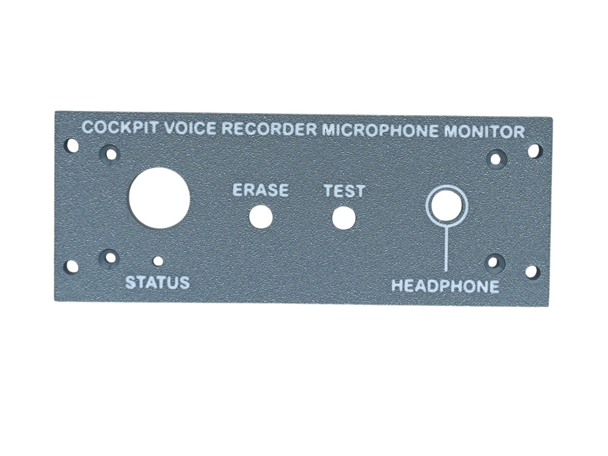
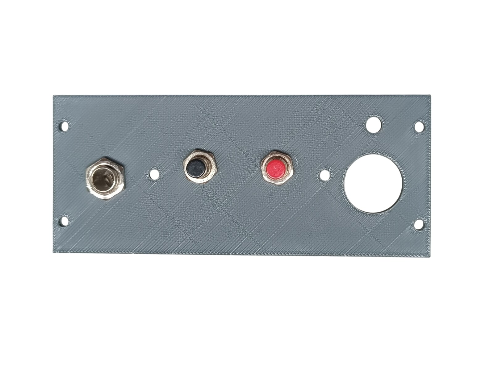
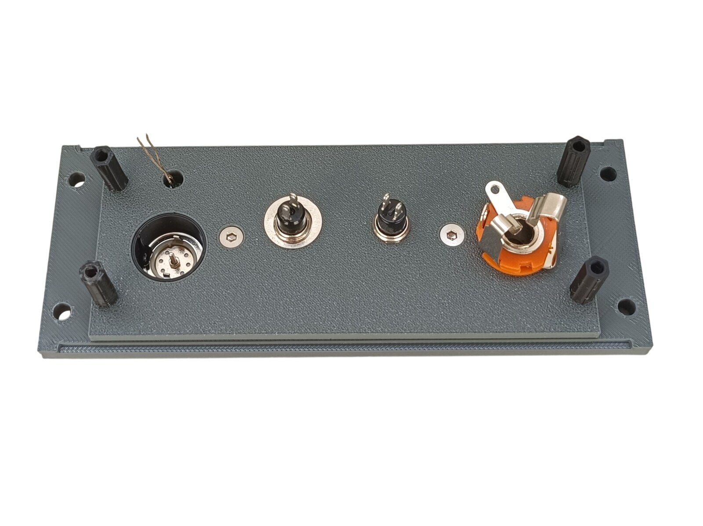
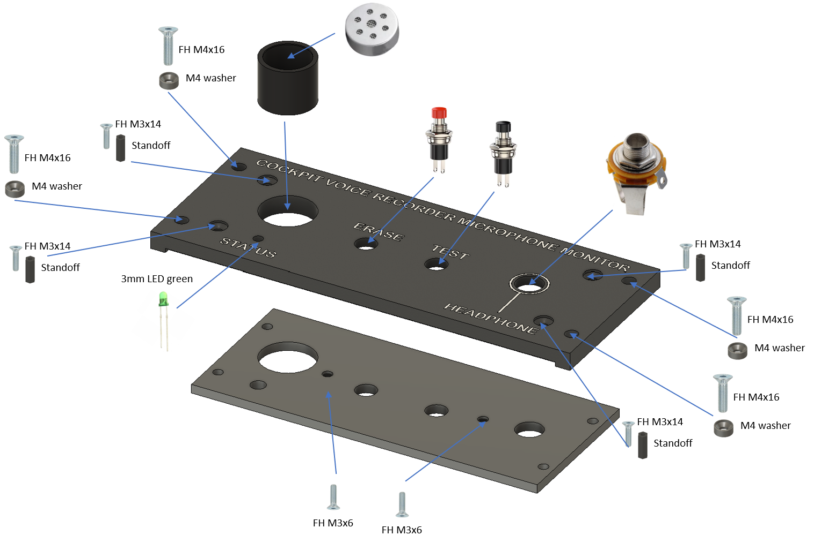

# 11. Voice Recorder Monitor

[📦 Download the printable model on MakerWorld](https://makerworld.com/en/models/3212900-boeing-737-overhead-voice-recorder-monitor)

[← Back to model list](README.md)

---

> **Note**
> This is the only panel whose controls and indicators are **not connected to the PC**, and the only **panel with text** that is **not backlit** — just as it is on the real aircraft.

---

## Photos

<table>
<tbody>
<tr>
<td align="center" width="50%"> Finished panel</td>
<td align="center" width="50%"> Printed top panel</td>
</tr>
</tbody>
<tbody>
<tr>
<td align="center" width="50%"> Headphone jack and buttons fitted to the top panel</td>
<td align="center" width="50%"> Rear side — microphone, LED and standoffs</td>
</tr>
</tbody>
</table>

---

## Filament

| | Colour | Filament |
|---|---|---|
|  | Dark Gray | C-Tech Premium Line PLA RAL7011 |
|  | White | Bambu PLA Basic Jade White (10100) |
|  | Black | Bambu PLA Basic Black (10101) |

---

## 3D Printed Parts

| Qty | Part | Notes |
|---:|---|---|
| 1× | Top panel | print on a **Textured** PEI plate |
| 1× | Bottom panel | print on a **Textured** PEI plate |
| 1× | Microphone cover | |
| 4× | M4 washer | |
| 4× | Standoff 16 mm | |

---

## Switches and Buttons

| Qty | Type |
|---:|---|
| 1× | PBS-110 push button, red |
| 1× | PBS-110 push button, black |

The red button is the ERASE button, the black one is TEST.

---

## Electronic Components

| Qty | Part |
|---:|---|
| 1× | Green LED 3 mm |
| 1× | Female panel jack 6.3 mm |
| 1× | Microphone 16 mm |

The green LED is the STATUS indicator and the jack is the HEADPHONE socket.

---

## Screws

| Qty | Screw | Joins |
|---:|---|---|
| 2× | Flat head M3×6 | bottom + top |
| 4× | Flat head M3×14 | top + standoff |
| 4× | Flat head M4×16 | bottom + main frame |

---

## Assembly Diagram

Screw abbreviations used in the diagram: **FH** = flat head.

