# 12. Voice Recorder Switch

[📦 Download the printable model on MakerWorld](https://makerworld.com/en/models/3214222-boeing-737-overhead-voice-recorder-switch)

[← Back to model list](README.md)

---

## Photos

<table>
<tbody>
<tr>
<td align="center" width="50%"> Finished panel</td>
<td align="center" width="50%">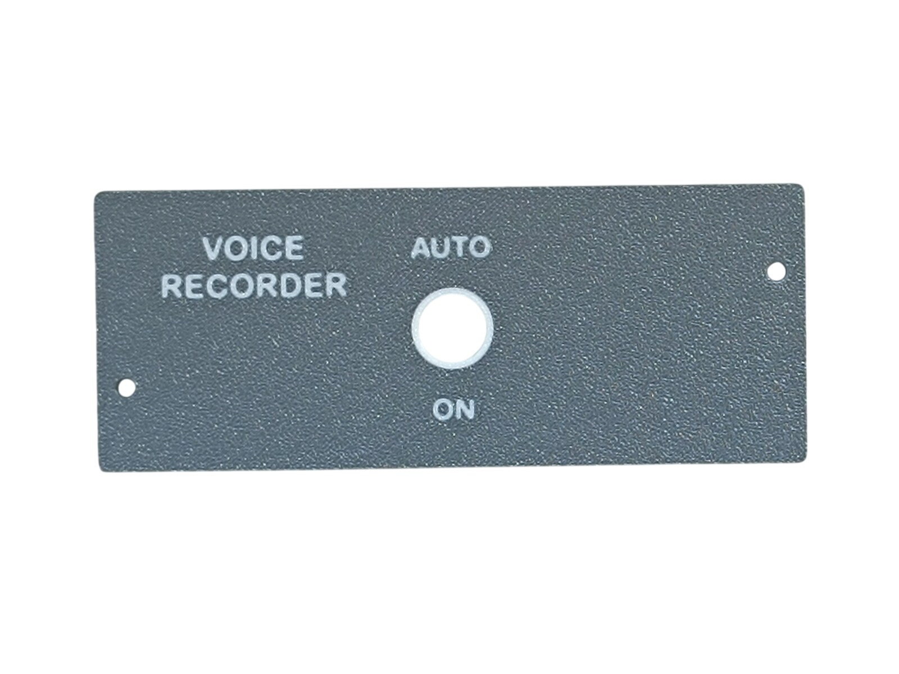 Printed top panel</td>
</tr>
</tbody>
<tbody>
<tr>
<td align="center" width="50%">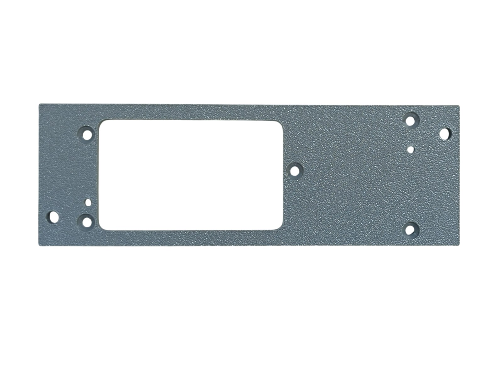 Printed bottom panel</td>
<td align="center" width="50%">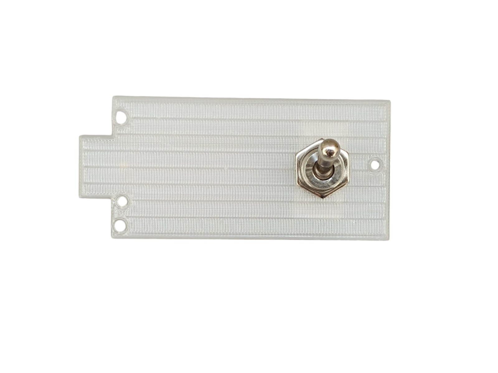 Diffuser panel with the switch fitted</td>
</tr>
</tbody>
<tbody>
<tr>
<td align="center" width="50%">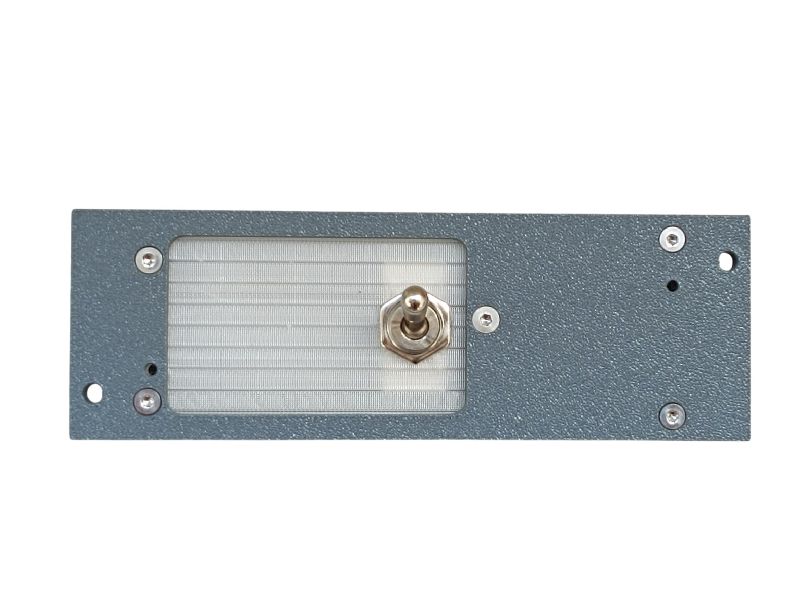 Diffuser panel fitted, before the top panel goes on</td>
<td align="center" width="50%">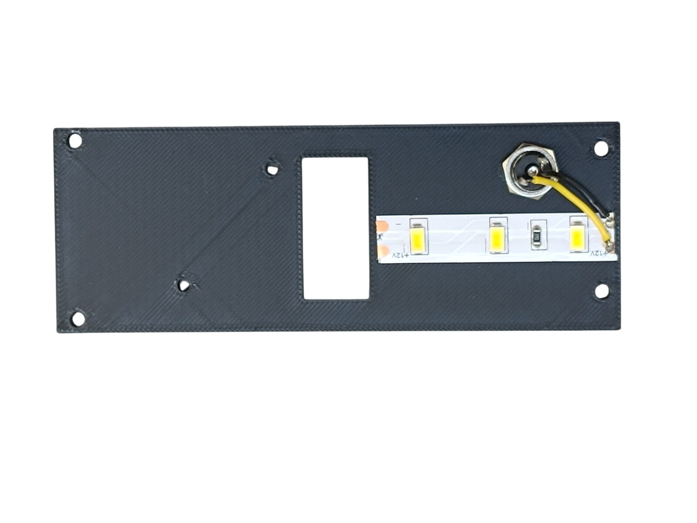 Backlight panel from the inside - LED strip and DC jack wiring</td>
</tr>
</tbody>
<tbody>
<tr>
<td align="center" width="50%">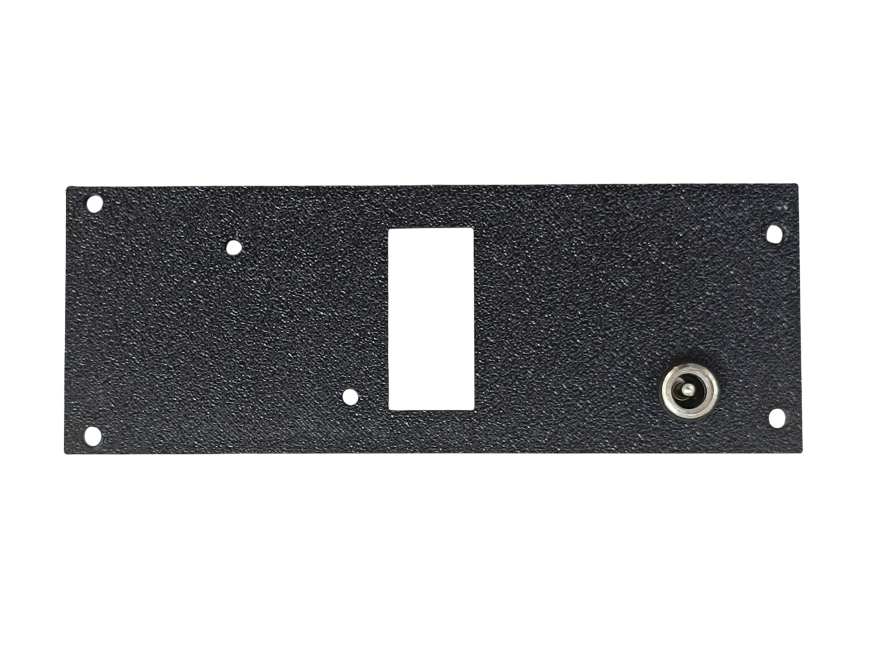 Backlight panel from the outside - DC jack</td>
<td align="center" width="50%">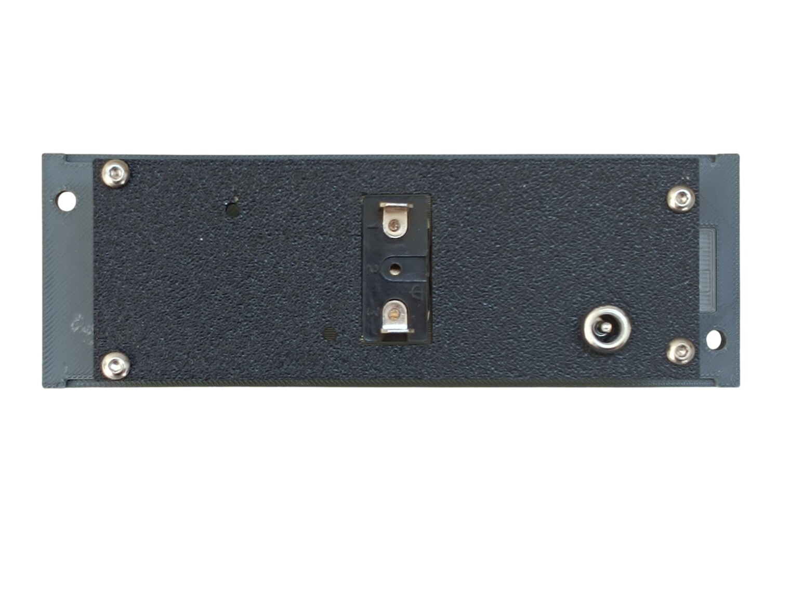 Rear side - backlight panel mounted, switch terminals and DC jack</td>
</tr>
</tbody>
</table>

---

## Filament

| | Colour | Filament |
|---|---|---|
|  | Dark Gray | C-Tech Premium Line PLA RAL7011 |
|  | Transparent | Filament PM PLA Transparent |
|  | White | Bambu PLA Basic Jade White (10100) |
|  | Black | Bambu PLA Basic Black (10101) |

---

## 3D Printed Parts

| Qty | Part | Notes |
|---:|---|---|
| 1× | Top panel | print on a **Textured** PEI plate |
| 1× | Bottom panel | print on a **Textured** PEI plate |
| 1× | Diffuser panel | print on a **Smooth** PEI plate |
| 1× | Backlight panel | |
| 2× | M4 washer | |
| 4× | Standoff 16 mm | |

---

## Switches and Buttons

| Qty | Type |
|---:|---|
| 1× | KN3(C)-101 or KN3(C)-102, ON/OFF |

---

## Screws

| Qty | Screw | Joins |
|---:|---|---|
| 1× | Flat head M3×6 | bottom + diffuser |
| 4× | Flat head M3×12 | bottom + standoff |
| 2× | Flat head M4×16 | bottom + main frame |
| 6× | Dome head M3×8 | top + bottom, backlight + standoff |

---

## Wiring

This panel has no PCB and no patch cable of its own. Its single switch is wired across to a PCB on the **Temperature Control Panel**, where it takes pin **5** - that PCB's cable goes to socket **A2** on **Overhead_5**.

**Both wires come from that panel**, the signal and the ground return, so nothing here connects to a MEGA 2560 directly.

---

## Backlight

| Qty | Part |
|---:|---|
| 1× | LED strip |
| 1× | DC jack 5.5 × 2.5 mm |

Powered from the **12 V** supply - see [Power supply](../system-overview.md#power-supply).

---

## Assembly Diagram

Screw abbreviations used in the diagrams: **FH** = flat head, **DH** = dome head.

### 1. Top panel

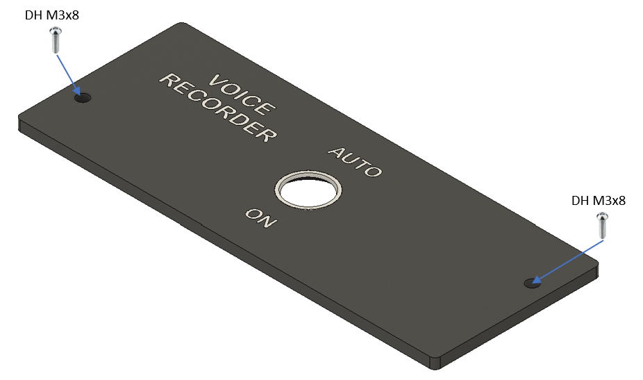

### 2. Bottom panel - diffuser, switch and standoffs

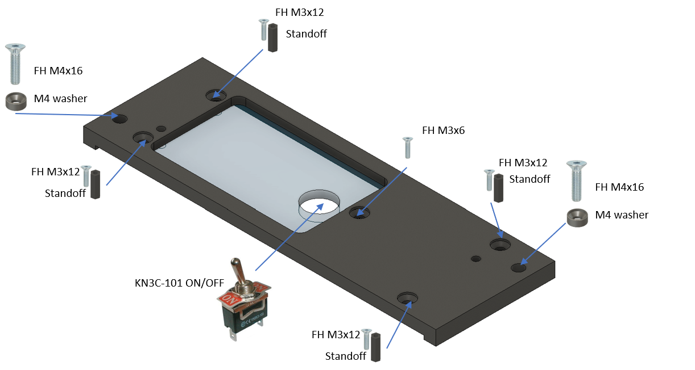

### 3. Backlight panel - LED strip

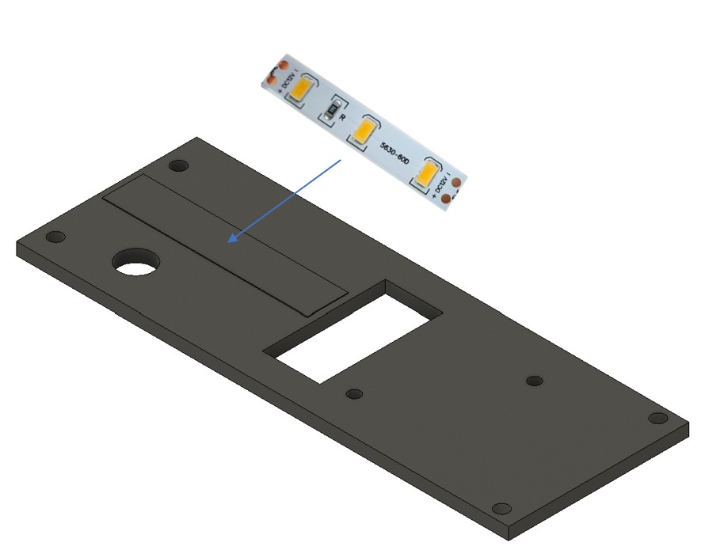

### 4. Backlight panel - DC jack

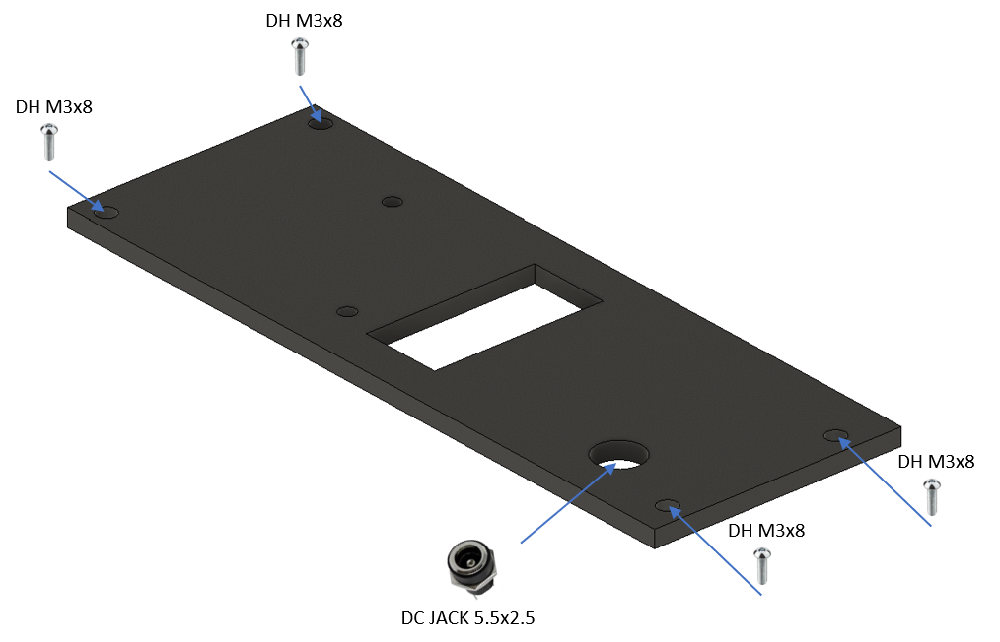
