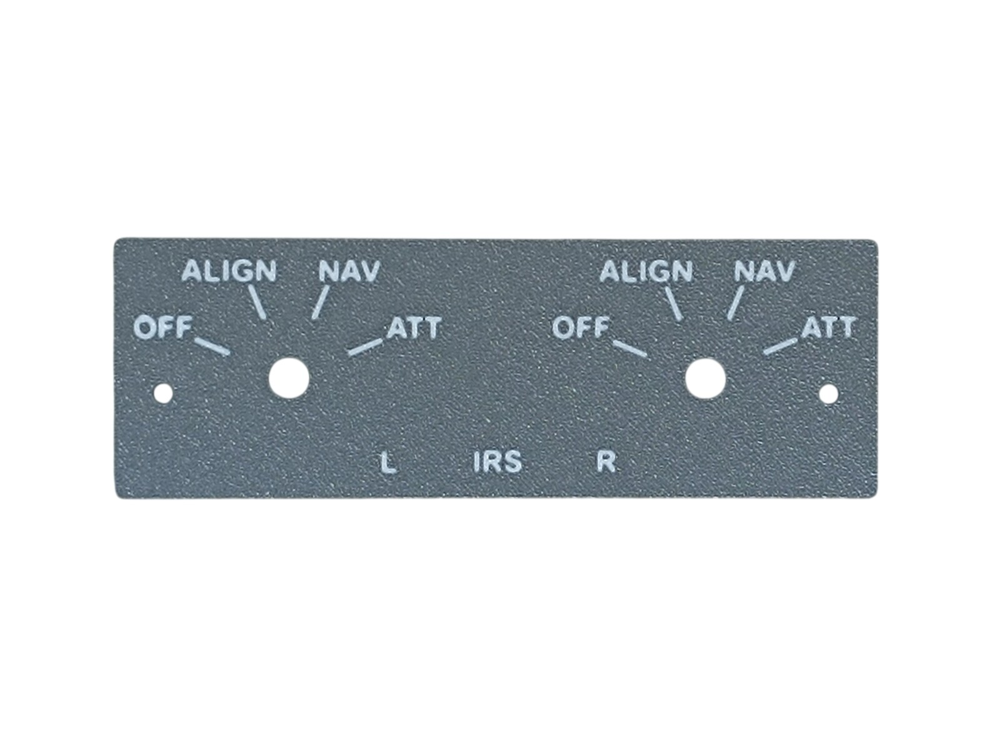
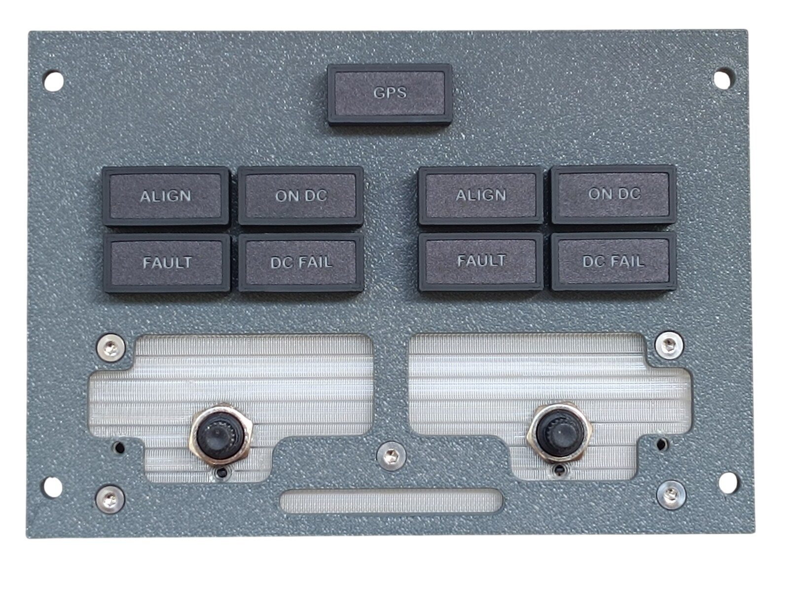
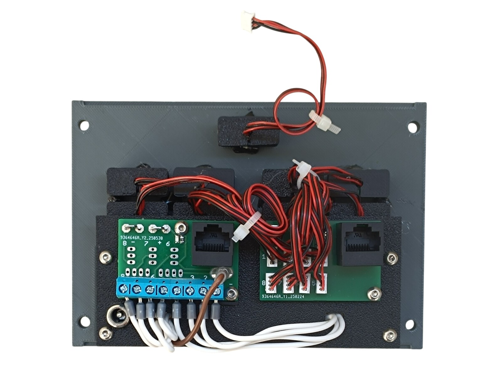
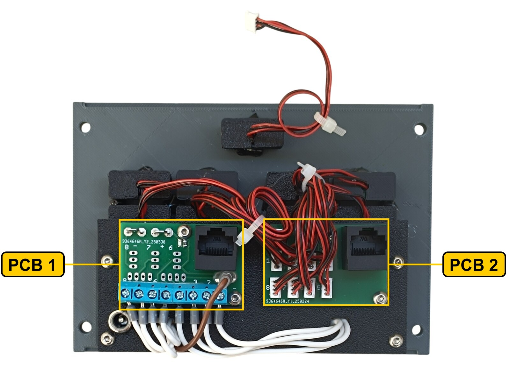
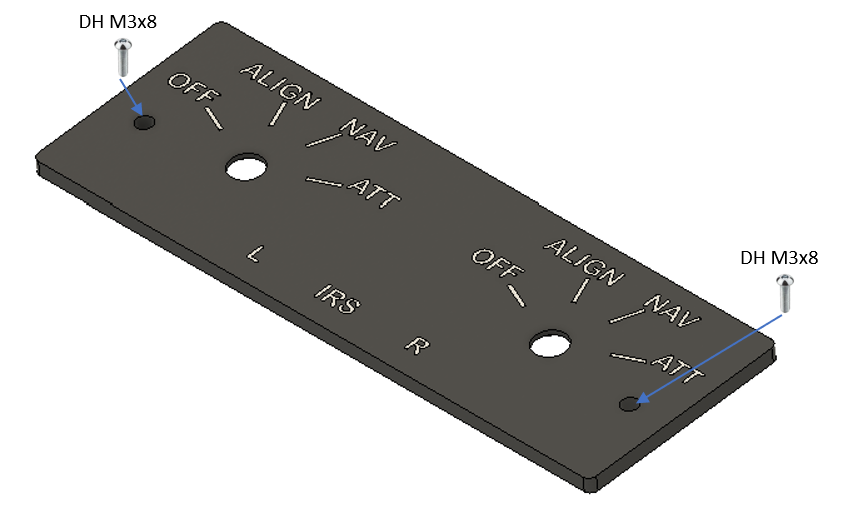
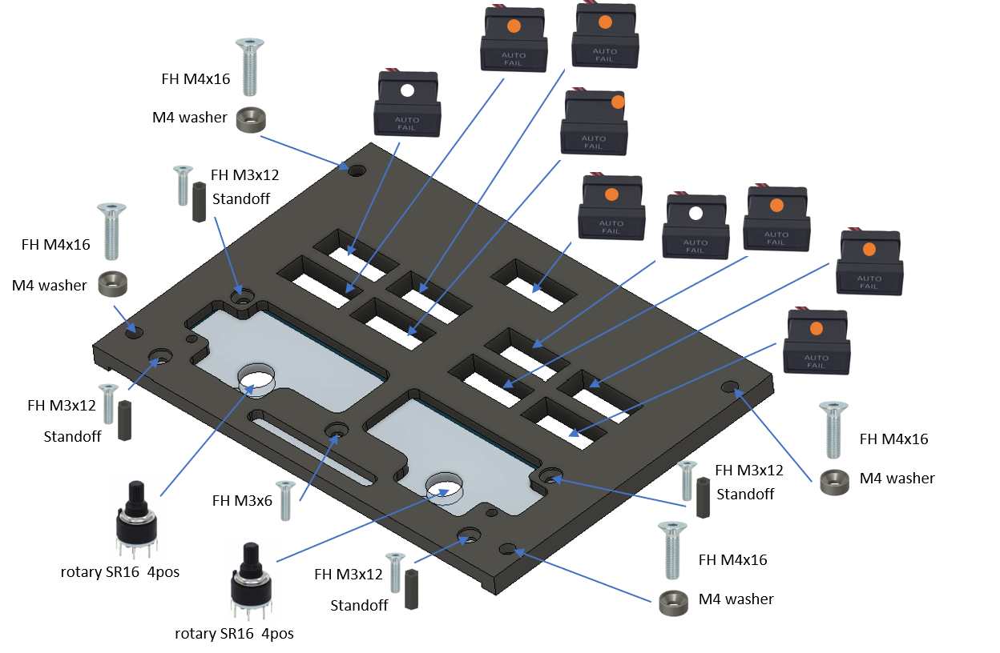
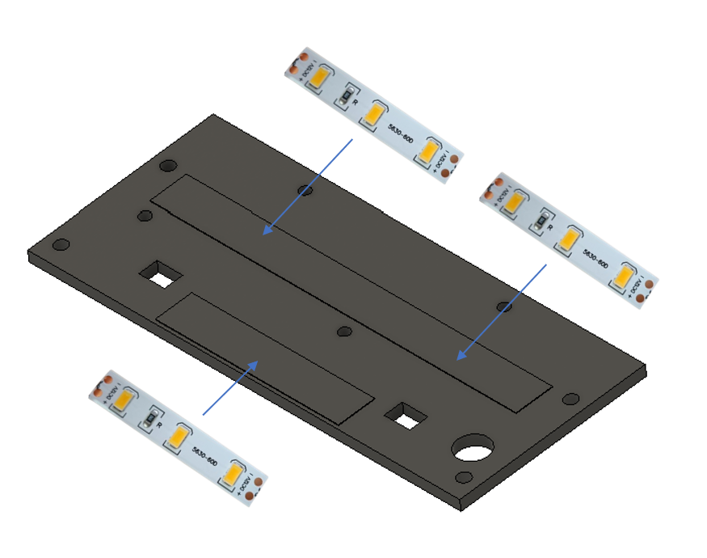
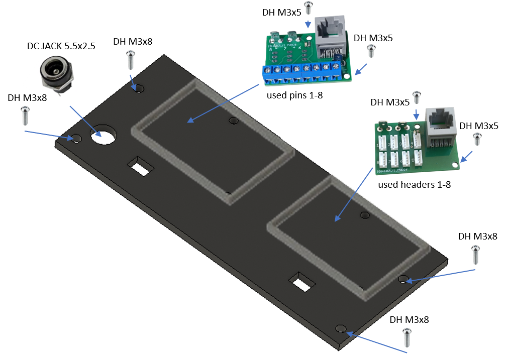

# 13. IRS Mode Select Unit

[📦 Download the printable model on MakerWorld](https://makerworld.com/en/models/3214377-boeing-737-overhead-irs-mode-select-unit)

[← Back to model list](README.md)

---

## Photos

<table>
<tbody>
<tr>
<td align="center" width="50%"> Finished panel</td>
<td align="center" width="50%"> Printed top panel</td>
</tr>
</tbody>
<tbody>
<tr>
<td align="center" width="50%"> Diffuser panel and rotary switches fitted, before the top panel goes on</td>
<td align="center" width="50%"> Rear side - PCBs, wiring and DC jack</td>
</tr>
</tbody>
</table>

---

## Filament

| | Colour | Filament |
|---|---|---|
|  | Dark Gray | C-Tech Premium Line PLA RAL7011 |
|  | Transparent | Filament PM PLA Transparent |
|  | White | Bambu PLA Basic Jade White (10100) |
|  | Black | Bambu PLA Basic Black (10101) |

---

## 3D Printed Parts

| Qty | Part | Notes |
|---:|---|---|
| 1× | Top panel | print on a **Textured** PEI plate |
| 1× | Bottom panel | print on a **Textured** PEI plate |
| 1× | Diffuser panel | print on a **Smooth** PEI plate |
| 1× | Backlight panel | |
| 2× | PCB frame | |
| 4× | M4 washer | |
| 4× | Standoff 16 mm | |

---

## Switches and Buttons

| Qty | Type |
|---:|---|
| 2× | Rotary switch SR16, 4 positions |

---

## Rotary Knobs

The knobs for the two IRS mode selectors are a separate model shared with the other panels - they are **not included** in this download.

| | |
|---|---|
| 📦 Printable model | [Boeing 737 Overhead - Rotary Knobs](https://makerworld.com/en/models/3066127-boeing-737-overhead-rotary-knobs) |
| 🔧 Build notes | [Rotary Knobs](03-rotary-knobs.md) |

---

## Screws

| Qty | Screw | Joins |
|---:|---|---|
| 1× | Flat head M3×6 | bottom + diffuser |
| 4× | Flat head M3×12 | bottom + standoff |
| 4× | Flat head M4×16 | bottom + main frame |
| 4× | Dome head M3×5 | PCB + backlight |
| 6× | Dome head M3×8 | top + bottom, backlight + standoff |

---

## Annunciators

| Qty | Type |
|---:|---|
| 7× | Black background, yellow LED |
| 2× | Black background, white LED |

The annunciators are a separate model shared with the other panels - they are **not included** in this download.

| | |
|---|---|
| 📦 Printable model | [Boeing 737 Overhead - Annunciators](https://makerworld.com/en/models/3121595-boeing-737-overhead-annunciators) |
| 🔧 Build notes | [Annunciators](02-annunciators.md) |
| 🔌 PCB, BOM and wiring | [Annunciator PCB](../pcb/annunciator.md) |

---

## PCB

| Qty | PCB | Connections used | Gerber files |
|---:|---|---|---|
| 1× | [RJ45 Direct](../pcb/rj45-direct.md) | pins 1–8 | [📥 PCB_RJ45_Direct.zip](https://raw.githubusercontent.com/om7ea/B737/main/PCB/PCB_RJ45_Direct.zip) |
| 1× | [RJ45 LED Driver](../pcb/rj45-driver.md) | headers 1–8 | [📥 PCB_RJ45_Driver.zip](https://raw.githubusercontent.com/om7ea/B737/main/PCB/PCB_RJ45_Driver.zip) |

Mounting and connections are shown in [step 4](#4-backlight-panel---pcbs-and-dc-jack) of the assembly diagram. Which annunciator and which switch each connection carries is in [Wiring](#wiring).

---

## Wiring

Both rotary switches and eight of the nine annunciators go to the two PCBs on this panel, and both boards reach the same MEGA 2560 - `Overhead_2a`. Each PCB is connected by one Ethernet patch cable to a socket on the [RJ45 Hub Shield](../pcb/rj45-hub-shield.md). The ninth annunciator, GPS, is wired to another panel - see below.

| PCB | Patch cable goes to | Connections used |
|---|---|---|
| **PCB 1** | socket **D2** on **Overhead_2a** | pins 1–8 |
| **PCB 2** | socket **D1** on **Overhead_2a** | headers 1–8 |

The socket labels **D0–D6**, **A1** and **A2** are silkscreened on the hub shield.

The rear of the panel. **PCB 1** is the board with the blue screw terminals, **PCB 2** the one with the eight ZH headers.

### PCB 1 - socket D2 on Overhead_2a

| Pin | Switch |
|---:|---|
| 1 | IRS L - NAV |
| 2 | IRS L - ATT |
| 3 | IRS L - OFF |
| 4 | IRS L - ALIGN |
| 5 | IRS R - ATT |
| 6 | IRS R - ALIGN |
| 7 | IRS R - OFF |
| 8 | IRS R - NAV |

### PCB 2 - socket D1 on Overhead_2a

Every annunciator text appears twice - **L** is the group of four above the left knob, **R** the group above the right one.

| Header | Annunciator |
|---:|---|
| 1 | ALIGN - R |
| 2 | ON DC - R |
| 3 | DC FAIL - R |
| 4 | FAULT - R |
| 5 | FAULT - L |
| 6 | DC FAIL - L |
| 7 | ON DC - L |
| 8 | ALIGN - L |

**The GPS annunciator is not on this panel's PCBs.** All eight headers of the LED driver are taken by the eight annunciators above, so GPS is wired across to **header 2** of the keyboard PCB on the [IRS Display Unit](14-irs-display-unit.md), whose patch cable goes to socket **A1** on **Overhead_2a**. It is the red and black pair leaving the panel at the top of the photo above, ending in a loose white connector.

**The switches share a single ground return.** Each switch position takes its own pin. The common terminals of the two switches are daisy-chained together and the chain ends at a **-** (ground) contact.

---

## Backlight

| Qty | Part |
|---:|---|
| 3× | LED strip |
| 1× | DC jack 5.5 × 2.5 mm |

Powered from the **12 V** supply - see [Power supply](../system-overview.md#power-supply).

---

## Assembly Diagram

Screw abbreviations used in the diagrams: **FH** = flat head, **DH** = dome head.

### 1. Top panel

### 2. Bottom panel - diffuser, rotary switches, annunciators and standoffs

### 3. Backlight panel - LED strips

### 4. Backlight panel - PCBs and DC jack

