# 14. IRS Display Unit

[📦 Download the printable model on MakerWorld](https://makerworld.com/en/models/3222680-boeing-737-overhead-irs-display-unit)

[← Back to model list](README.md)

---

## Photos

<table>
<tbody>
<tr>
<td align="center" width="50%">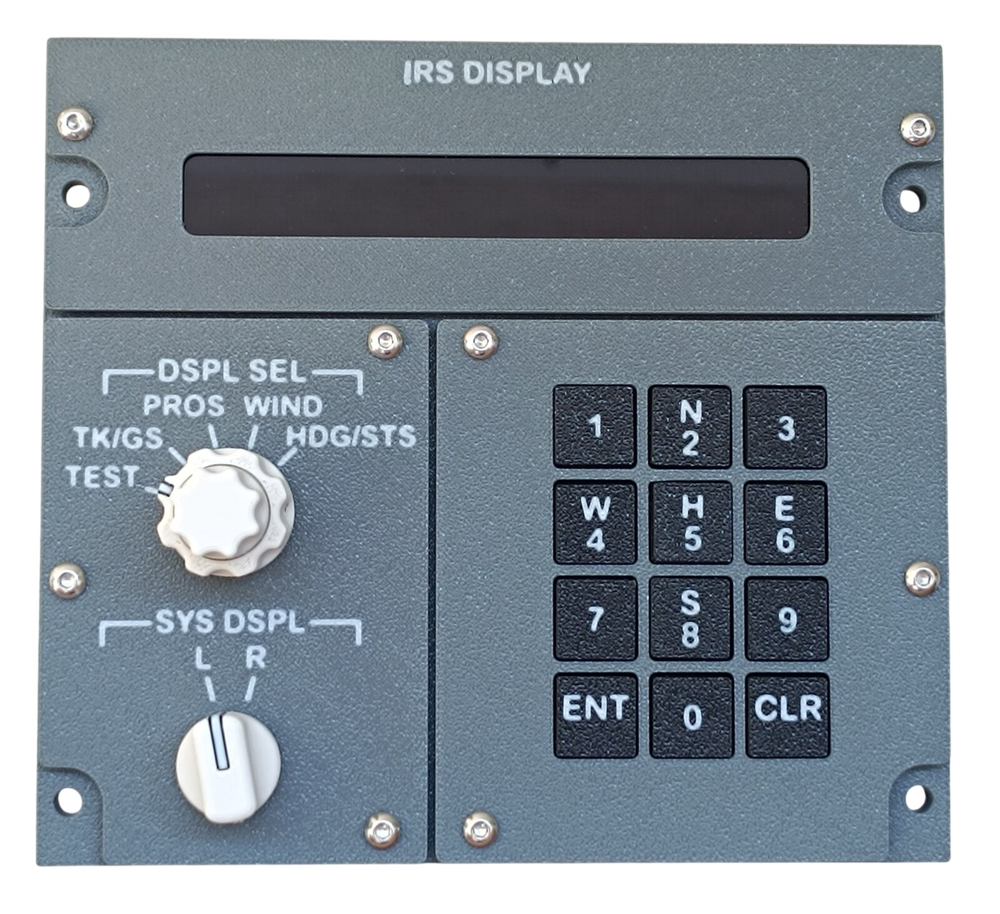 Finished panel</td>
<td align="center" width="50%">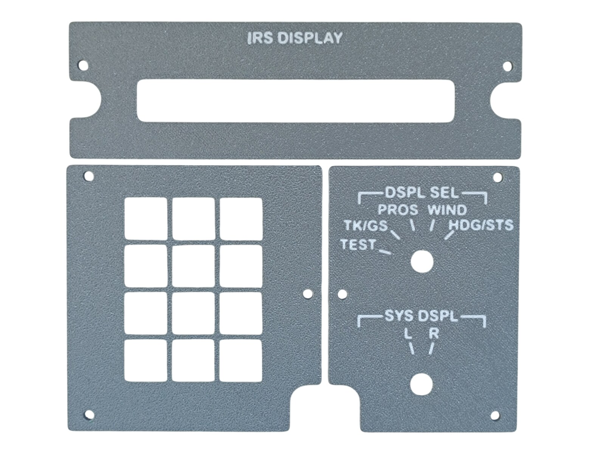 The three printed top panel parts</td>
</tr>
</tbody>
<tbody>
<tr>
<td align="center" width="50%">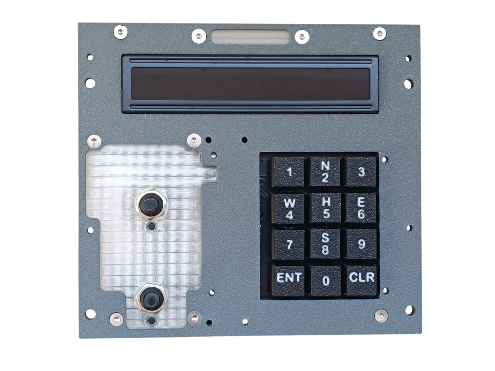 Diffuser, rotary switches, LCD and keyboard fitted, before the top panel goes on</td>
<td align="center" width="50%">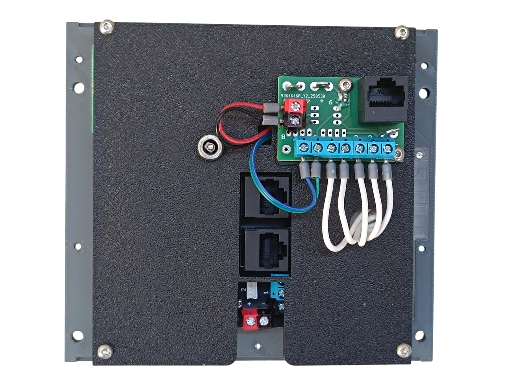 Rear side — PCBs, wiring and DC jack</td>
</tr>
</tbody>
</table>

---

## Filament

| | Colour | Filament |
|---|---|---|
|  | Dark Gray | C-Tech Premium Line PLA RAL7011 |
|  | Transparent | Filament PM PLA Transparent |
|  | White | Bambu PLA Basic Jade White (10100) |
|  | Black | Bambu PLA Basic Black (10101) |

---

## 3D Printed Parts

| Qty | Part | Notes |
|---:|---|---|
| 3× | Top panel | print on a **Textured** PEI plate |
| 1× | Bottom panel | print on a **Textured** PEI plate |
| 2× | Diffuser panel | print on a **Smooth** PEI plate |
| 1× | Backlight panel | |
| 1× | PCB frame | |
| 4× | M4 washer | |
| 4× | Standoff 16 mm | |
| 12× | Button top | |
| 12× | Button base | |

---

## Switches and Buttons

| Qty | Type |
|---:|---|
| 2× | Rotary switch RS26, 12 positions |

The RS26 has an adjustable number of positions — set the **DSPL SEL** switch to **5** and the **SYS DSPL** switch to **2**.

The twelve keypad buttons are not listed here. They are soldered to the [IRS Keyboard PCB](../pcb/irs-keyboard.md) and are part of its BOM.

---

## Rotary Knobs

The knobs for the two selectors are a separate model shared with the other panels — they are **not included** in this download.

| Qty | Knob |
|---:|---|
| 1× | IRS dspl sel knob |
| 1× | IRS sys dspl knob |

| | |
|---|---|
| 📦 Printable model | [Boeing 737 Overhead - Rotary Knobs](https://makerworld.com/en/models/3066127-boeing-737-overhead-rotary-knobs) |
| 🔧 Build notes | [Rotary Knobs](03-rotary-knobs.md) |

---

## Electronic Components

| Qty | Part | Reference |
|---:|---|---|
| 1× | **Large 1601 LCD** — 16×1 characters, white text on a black background | [Product I used](../../images/parts/AE_lcd_1601.png) |
| 1× | **I²C LCD interface module** | [Product I used](../../images/parts/AE_i2c_module.png) |

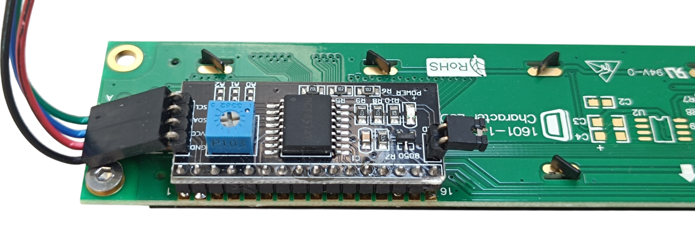

The interface module solders onto the LCD's 16-pin header. Its four wires are **GND**, **VCC**, **SDA** and **SCL** — where they go is in [Wiring](#wiring).

---

## Screws

| Qty | Screw | Joins |
|---:|---|---|
| 9× | Flat head M3×6 | bottom + diffuser, LCD + bottom |
| 4× | Flat head M3×8 | keyboard PCB + bottom |
| 4× | Flat head M3×12 | bottom + standoff |
| 4× | Flat head M4×16 | bottom + main frame |
| 2× | Dome head M3×5 | PCB + backlight |
| 12× | Dome head M3×8 | top + bottom, backlight + standoff |

The grub screws that hold the two knobs on their shafts are **M3×5** — see [Rotary Knobs](03-rotary-knobs.md#screws).

---

## PCB

| Qty | PCB | Connections used | Gerber files |
|---:|---|---|---|
| 1× | [RJ45 Direct](../pcb/rj45-direct.md) | pins 1–7 | [📥 PCB_RJ45_Direct.zip](https://raw.githubusercontent.com/om7ea/B737/main/PCB/PCB_RJ45_Direct.zip) |
| 1× | [IRS Keyboard](../pcb/irs-keyboard.md) | both RJ45 sockets | [📥 PCB_IRS_Keyboard.zip](https://raw.githubusercontent.com/om7ea/B737/main/PCB/PCB_IRS_Keyboard.zip) |

Mounting is shown in [step 2](#2-bottom-panel--diffuser-rotary-switches-lcd-and-keyboard) and [step 5](#5-backlight-panel--pcb-and-dc-jack) of the assembly diagram. What each connection carries is in [Wiring](#wiring).

---

## Wiring

Both PCBs reach the same MEGA 2560 — `Overhead_2a` — and the panel takes **three** Ethernet patch cables to the [RJ45 Hub Shield](../pcb/rj45-hub-shield.md), because the keyboard board has two RJ45 sockets of its own.

| Cable | Patch cable goes to | Connections used |
|---|---|---|
| **PCB 1** | socket **D0** on **Overhead_2a** | pins 1–7 |
| **RJ45 2** | socket **A2** on **Overhead_2a** | pins 1–8 |
| **RJ45 3** | socket **A1** on **Overhead_2a** | pins 1–3 and 5–8 |

The socket labels **D0–D6**, **A1** and **A2** are silkscreened on the hub shield.

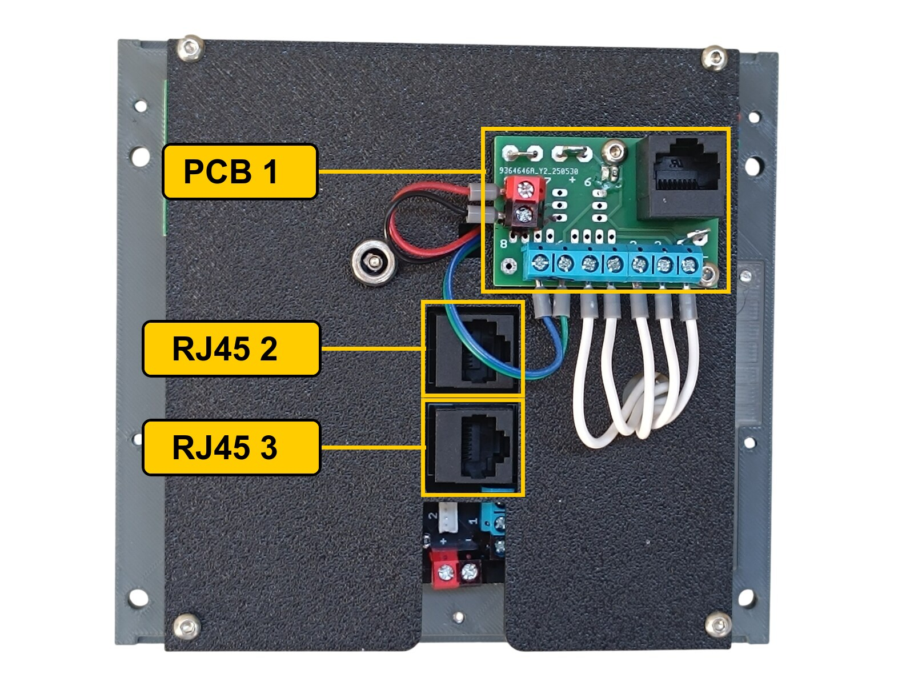

The rear of the panel. **PCB 1** is the green board with the blue screw terminals. **RJ45 2** and **RJ45 3** are the two sockets of the keyboard board underneath — of that board only the two sockets and the connector edge show through the cut-out.

The keys are wired by the keyboard PCB itself, so nothing on RJ45 2 and RJ45 3 can be connected the wrong way round. The only connections that have to be made correctly are the ones on **PCB 1** and the two **SYS DSPL** pins on RJ45 3.

### PCB 1 — socket D0 on Overhead_2a

| Pin | Connection |
|---:|---|
| 1 | DSPL SEL — TEST |
| 2 | DSPL SEL — TK/GS |
| 3 | DSPL SEL — PROS |
| 4 | DSPL SEL — WIND |
| 5 | DSPL SEL — HDG/STS |
| 6 | LCD — SCL |
| 7 | LCD — SDA |

**The LCD is powered from this board.** A KF301 2-pin screw terminal is fitted at the **pin 8** position and carries nothing but **5 V** and **ground** across to the interface module. Pin 8 itself is not used as an input.

### RJ45 2 — socket A2 on Overhead_2a

| Pin | Connection |
|---:|---|
| 1 | Key 8 |
| 2 | Key 7 |
| 3 | Key 6 |
| 4 | Key 5 |
| 5 | Key 4 |
| 6 | Key 3 |
| 7 | Key 2 |
| 8 | Key 1 |

### RJ45 3 — socket A1 on Overhead_2a

| Pin | Connection |
|---:|---|
| 1 | SYS DSPL — L |
| 2 | GPS annunciator |
| 3 | SYS DSPL — R |
| 5 | Key CLR |
| 6 | Key 0 |
| 7 | Key ENT |
| 8 | Key 9 |

Pin 4 is not used. Pin 2 is the ZH header, not a screw terminal.

**The GPS annunciator on pin 2 belongs to the [IRS Mode Select Unit](13-irs-mode-select-unit.md).** All eight headers of that panel's LED driver are taken by its own annunciators, so its GPS annunciator is wired across to this board.

> **Note**
> The GPS annunciator is the only one in the whole overhead that works with inverted logic. This is how the keyboard PCB is designed. While the simulator is running it behaves like any other annunciator and you will not notice anything. When the simulator is not running it is the only annunciator that lights up, while all the others stay dark.

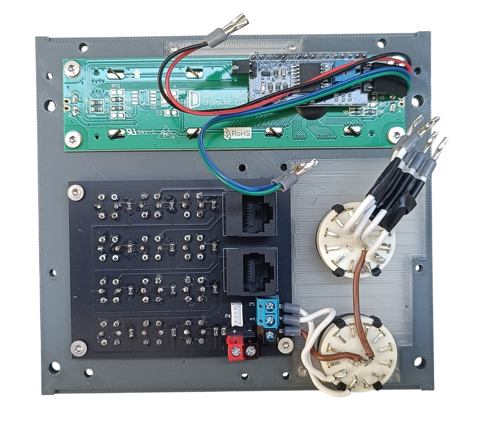

With the backlight panel removed. The wires from the lower rotary switch, **SYS DSPL**, go to the screw terminals on the keyboard board, not to PCB 1. The two RJ45 cables of that board can carry 16 signals, but the keypad needs only 12. The spare ones are used for the two switch positions and for the GPS annunciator.

**The two switches share a single ground return.** Each switch takes one of its terminals to its own pin. The opposite terminals are commoned — daisy-chained from one switch to the next — and the chain ends at a **-** (ground) contact.

---

## Backlight

| Qty | Part |
|---:|---|
| 3× | LED strip |
| 1× | DC jack 5.5 × 2.5 mm |

Powered from the **12 V** supply — see [Power supply](../system-overview.md#power-supply).

---

## Assembly Diagram

Screw abbreviations used in the diagrams: **FH** = flat head, **DH** = dome head.

### 1. Buttons

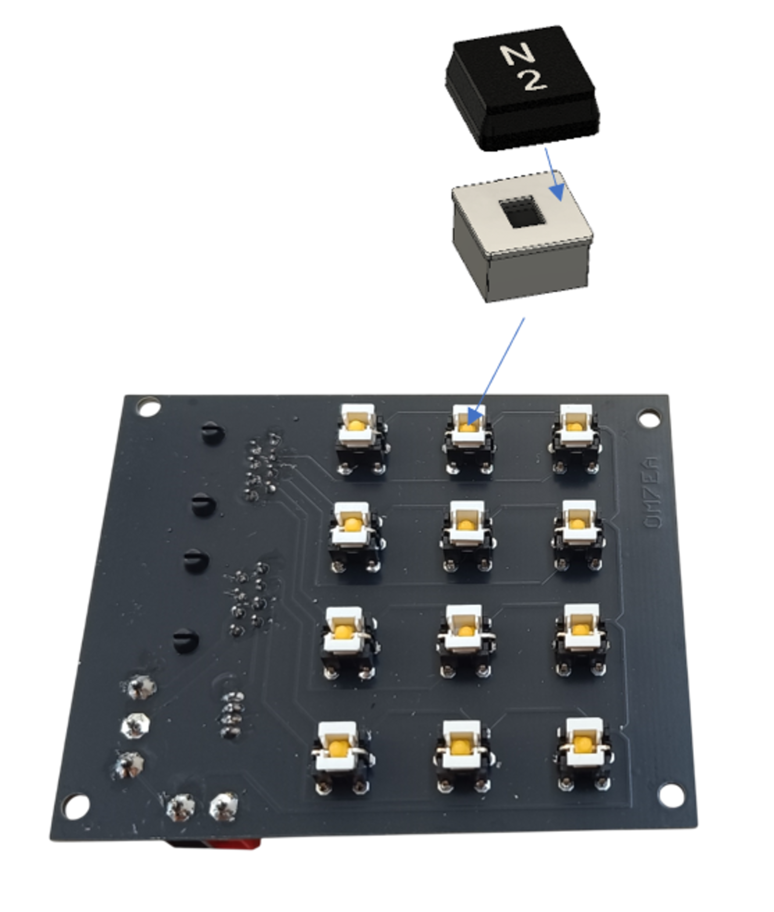

Push the printed top and base of each button together and fit them over the switches on the keyboard PCB.

### 2. Bottom panel — diffuser, rotary switches, LCD and keyboard

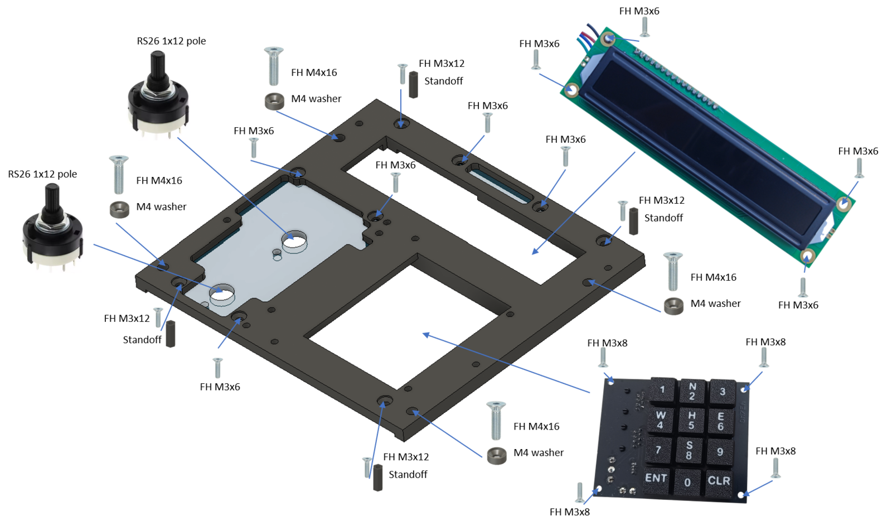

### 3. Top panel

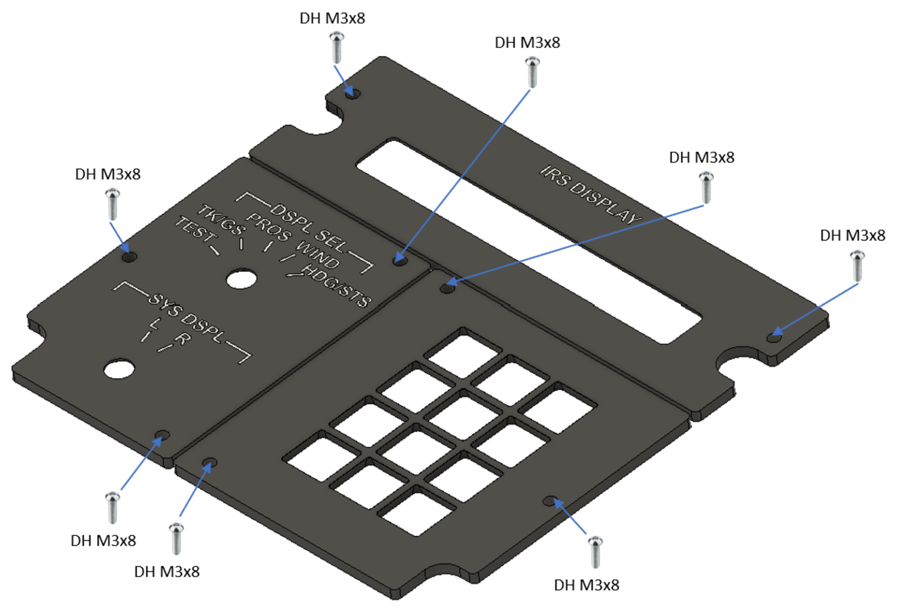

### 4. Backlight panel — LED strips

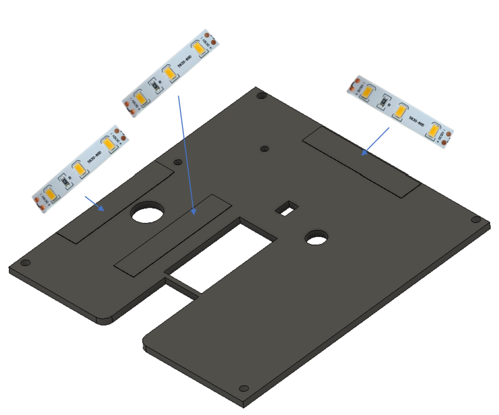

### 5. Backlight panel — PCB and DC jack

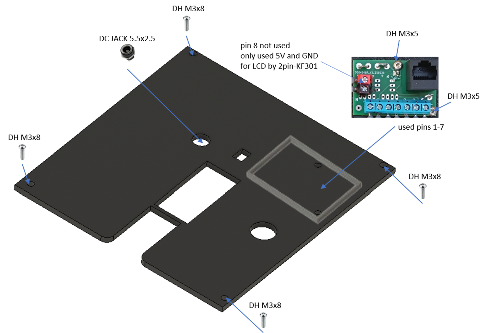
