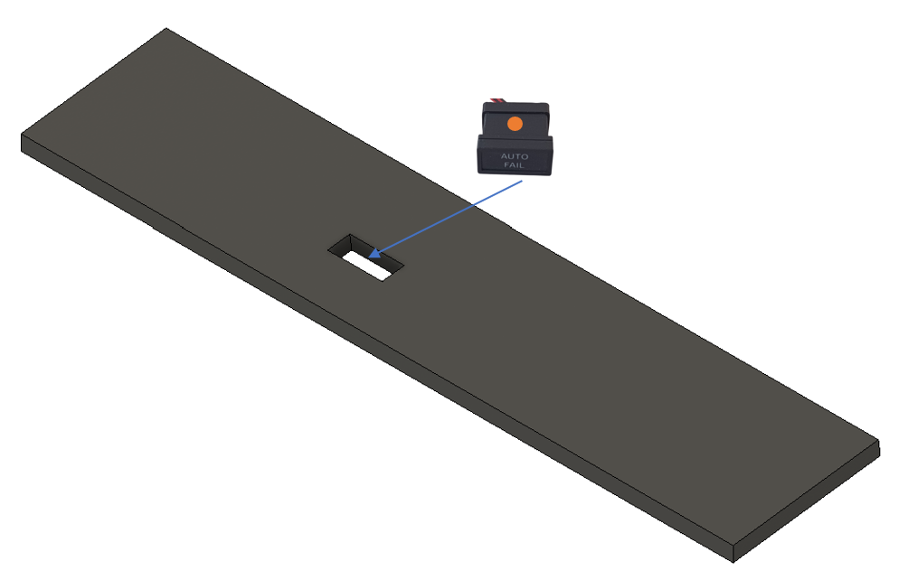
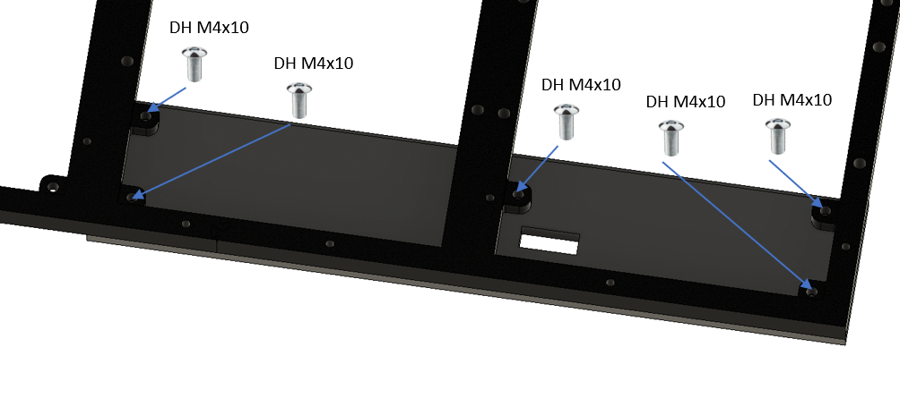

# 15. PSEU Panel

[📦 Download the printable model on MakerWorld](https://makerworld.com/en/models/3223471-boeing-737-overhead-pseu-panel)

[← Back to model list](README.md)

---

## Photos

<table>
<tbody>
<tr>
<td align="center"> Finished panel</td>
</tr>
</tbody>
</table>

---

## Filament

| | Colour | Filament |
|---|---|---|
|  | Dark Gray | C-Tech Premium Line PLA RAL7011 |

---

## 3D Printed Parts

| Qty | Part | Notes |
|---:|---|---|
| 1× | Bottom panel | print on a **Textured** PEI plate |

---

## Screws

| Qty | Screw | Joins |
|---:|---|---|
| 5× | Dome head M4×10 | bottom + main frame |

---

## Annunciators

| Qty | Type |
|---:|---|
| 1× | Black background, yellow LED |

The annunciators are a separate model shared with the other panels - they are **not included** in this download.

| | |
|---|---|
| 📦 Printable model | [Boeing 737 Overhead - Annunciators](https://makerworld.com/en/models/3121595-boeing-737-overhead-annunciators) |
| 🔧 Build notes | [Annunciators](02-annunciators.md) |
| 🔌 PCB, BOM and wiring | [Annunciator PCB](../pcb/annunciator.md) |

---

## Wiring

This panel has no PCB and no patch cable of its own. Its single annunciator is wired across to a PCB on the **[LE Devices and ELT Panel](17-le-devices-and-elt-panel.md)**, where it takes header **4** - that PCB's cable goes to socket **D0** on **Overhead_1a**.

The ZH cable to the annunciator comes from that panel, so nothing here connects to a MEGA 2560 directly.

---

## Assembly Diagram

Screw abbreviations used in the diagrams: **DH** = dome head.

### 1. Annunciator

### 2. Mounting to the main frame

