# 17. LE Devices and ELT Panel

[📦 Download the printable model on MakerWorld](https://makerworld.com/en/models/3233836-boeing-737-overhead-le-devices-and-elt-panel)

[← Back to model list](README.md)

---

## Photos

<table>
<tbody>
<tr>
<td align="center" width="50%">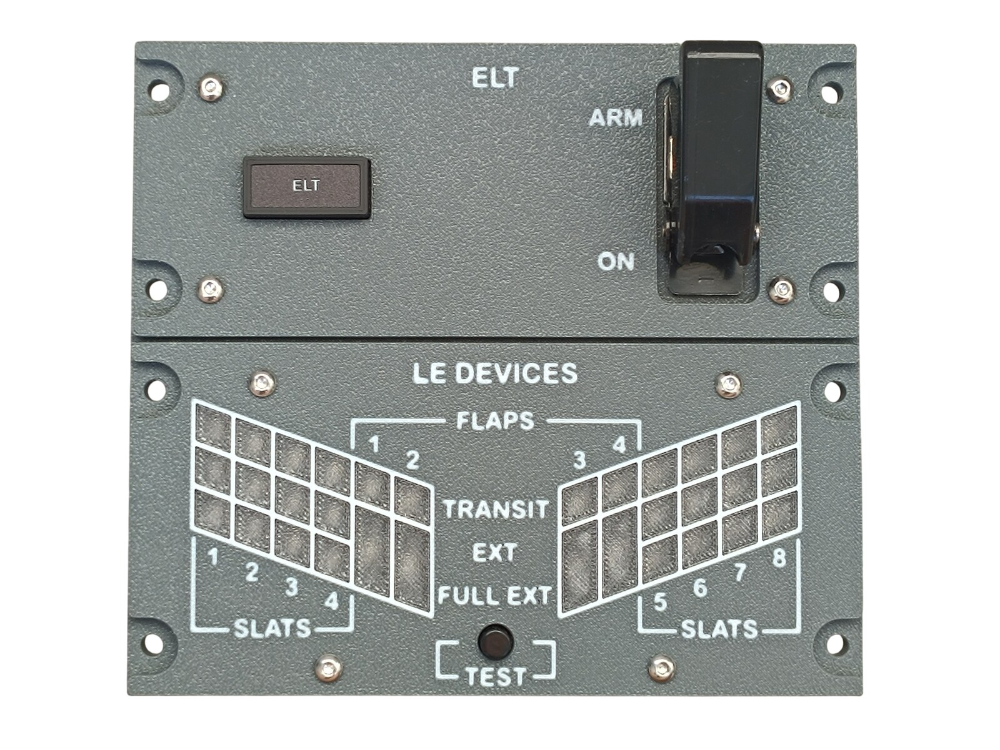 Finished panel</td>
<td align="center" width="50%">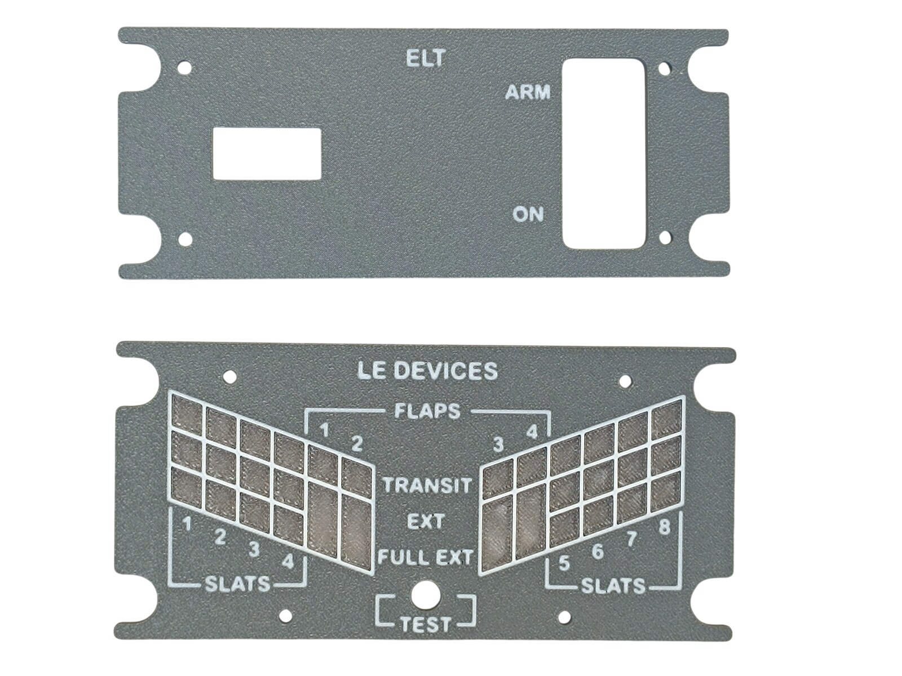 The two printed top panels</td>
</tr>
</tbody>
<tbody>
<tr>
<td align="center" width="50%">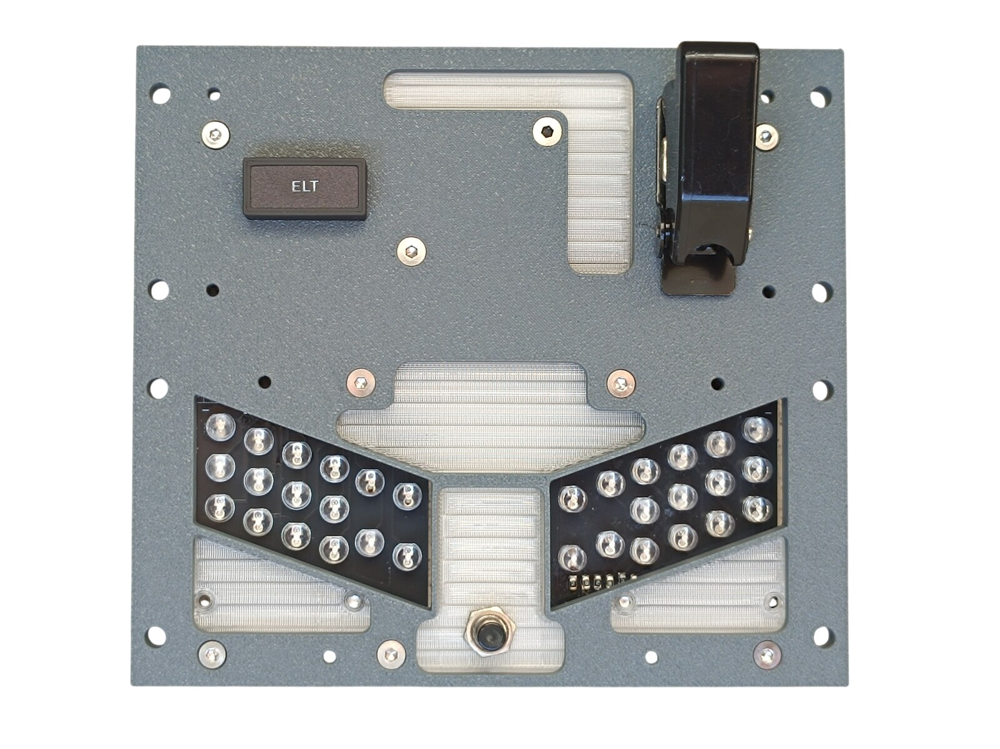 Diffusers fitted and the LEDs showing through, before the top panels go on</td>
<td align="center" width="50%">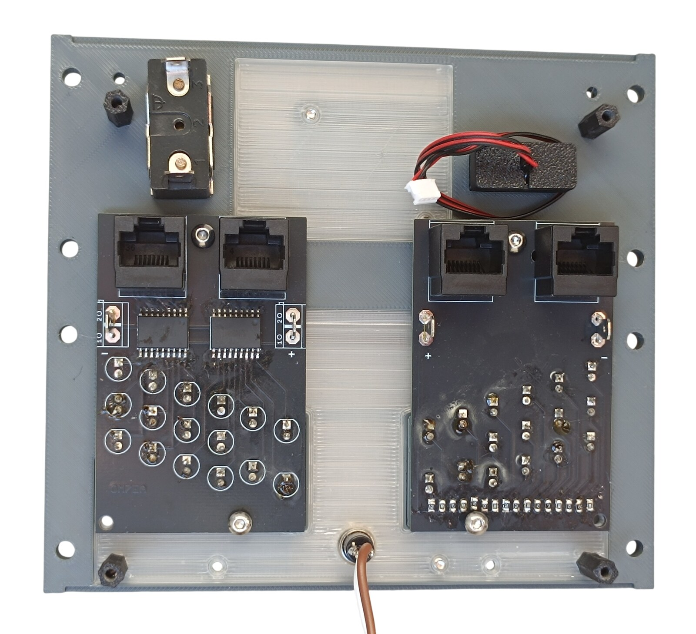 Rear of the bottom panel — the two LE Devices PCBs</td>
</tr>
</tbody>
<tbody>
<tr>
<td align="center" colspan="2">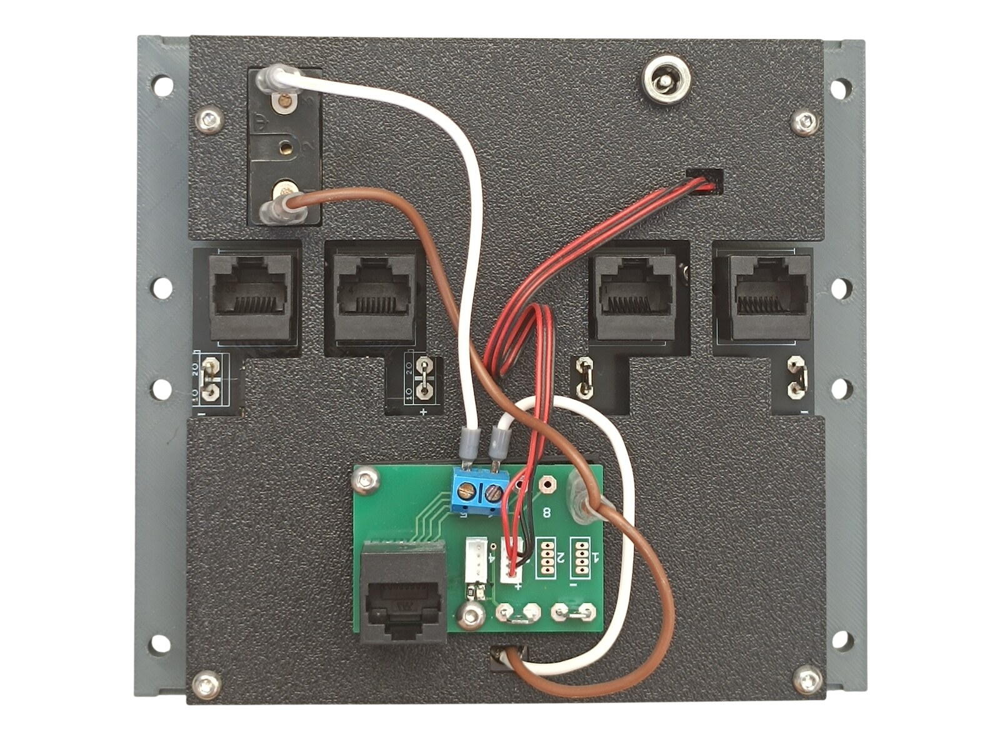 Rear side — the backlight panel with the four RJ45 sockets and the Combined PCB</td>
</tr>
</tbody>
</table>

---

## Filament

| | Colour | Filament |
|---|---|---|
|  | Dark Gray | C-Tech Premium Line PLA RAL7011 |
|  | Transparent | Filament PM PLA Transparent |
|  | White | Bambu PLA Basic Jade White (10100) |
|  | Black | Bambu PLA Basic Black (10101) |

---

## 3D Printed Parts

| Qty | Part | Notes |
|---:|---|---|
| 2× | Top panel | print on a **Textured** PEI plate |
| 1× | Bottom panel | print on a **Textured** PEI plate |
| 2× | Diffuser panel | print on a **Smooth** PEI plate |
| 1× | Backlight panel | |
| 1× | PCB frame | |
| 8× | M4 washer | |
| 4× | Standoff 16 mm | |

---

## Switches and Buttons

| Qty | Type |
|---:|---|
| 1× | KN3(C)-101 or KN3(C)-102, ON/OFF |
| 1× | PBS-110 push button, black |
| 1× | Toggle switch safety aircraft guard, black |

The guard goes on the ELT switch, the push button is the LE DEVICES TEST button.

---

## Screws

| Qty | Screw | Joins |
|---:|---|---|
| 5× | Flat head M3×6 | bottom + diffuser |
| 4× | Flat head M3×12 | bottom + standoff |
| 8× | Flat head M4×16 | bottom + main frame |
| 2× | Dome head M3×5 | PCB + backlight |
| 6× | Dome head M3×10 | bottom + LE Devices PCB |
| 12× | Dome head M3×8 | top + bottom, backlight + standoff |

---

## Annunciators

| Qty | Type |
|---:|---|
| 1× | Black background, yellow LED |

The annunciators are a separate model shared with the other panels — they are **not included** in this download.

| | |
|---|---|
| 📦 Printable model | [Boeing 737 Overhead - Annunciators](https://makerworld.com/en/models/3121595-boeing-737-overhead-annunciators) |
| 🔧 Build notes | [Annunciators](02-annunciators.md) |
| 🔌 PCB, BOM and wiring | [Annunciator PCB](../pcb/annunciator.md) |

---

## PCB

| Qty | PCB | Connections used | Gerber files |
|---:|---|---|---|
| 2× | [LE Devices](../pcb/le-devices.md) | 16 LEDs and 2 RJ45 sockets each | [📥 PCB_LE_Devices.zip](https://raw.githubusercontent.com/om7ea/B737/main/PCB/PCB_LE_Devices.zip) |
| 1× | [RJ45 Combined](../pcb/rj45-combined.md) | headers 3–4, pins 5–6 | [📥 PCB_RJ45_Combined.zip](https://raw.githubusercontent.com/om7ea/B737/main/PCB/PCB_RJ45_Combined.zip) |

The two LE Devices boards carry the 32 indicator lamps of the display. They are the same board — the design is symmetrical and the second one is populated mirrored, for the other half of the panel. Read [LE Devices](../pcb/le-devices.md) before you solder them.

Mounting is shown in [step 2](#2-bottom-panel--le-devices-pcbs) and [step 5](#5-backlight-panel--combined-pcb-and-dc-jack) of the assembly diagram. Which lamp and which switch each connection carries is in [Wiring](#wiring).

---

## Wiring

Everything on this panel reaches the same MEGA 2560 — `Overhead_1a`. The panel takes **five** Ethernet patch cables to the [RJ45 Hub Shield](../pcb/rj45-hub-shield.md), because each of the two LE Devices boards has two RJ45 sockets of its own.

| Cable | Patch cable goes to | Connections used |
|---|---|---|
| **RJ45 1** | socket **A2** on **Overhead_1a** | headers 1–8 |
| **RJ45 2** | socket **D1** on **Overhead_1a** | headers 1–8 |
| **RJ45 3** | socket **D2** on **Overhead_1a** | headers 1–8 |
| **RJ45 4** | socket **D3** on **Overhead_1a** | headers 1–8 |
| **PCB 3** | socket **D0** on **Overhead_1a** | headers 3–4, pins 5–6 |

The socket labels **D0–D6**, **A1** and **A2** are silkscreened on the hub shield.

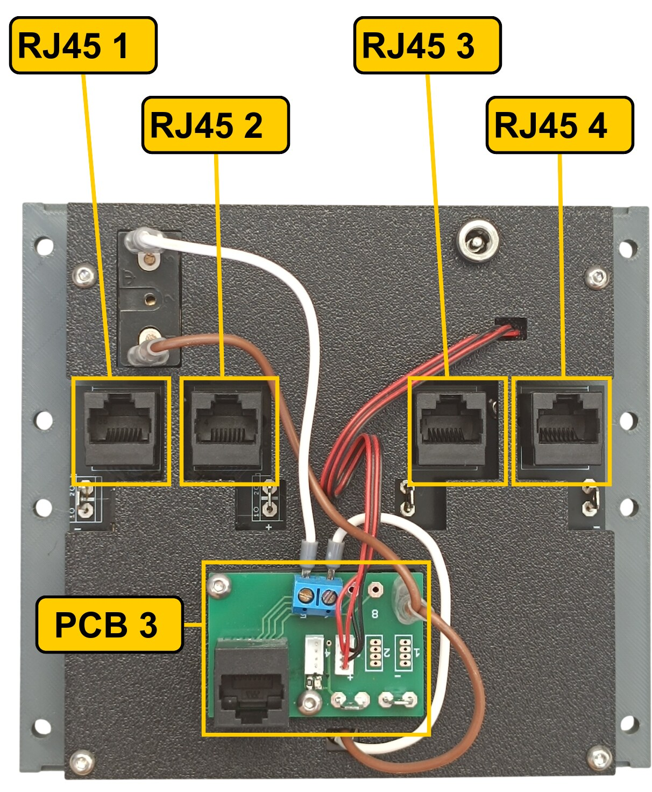

The rear of the panel. **PCB 3** is the green board with the blue screw terminal. **RJ45 1** to **RJ45 4** are the sockets of the two LE Devices boards underneath — of those boards only the sockets and the Faston terminals show through the backlight panel.

The lamps are soldered into the LE Devices boards, so nothing on RJ45 1 to RJ45 4 can be connected the wrong way round. The four tables below are there for fault-finding.

### RJ45 1 — socket A2 on Overhead_1a

| Header | Lamp |
|---:|---|
| 1 | SLATS 6 — EXT |
| 2 | SLATS 6 — TRANSIT |
| 3 | SLATS 7 — FULL EXT |
| 4 | SLATS 7 — EXT |
| 5 | SLATS 7 — TRANSIT |
| 6 | SLATS 8 — FULL EXT |
| 7 | SLATS 8 — EXT |
| 8 | SLATS 8 — TRANSIT |

### RJ45 2 — socket D1 on Overhead_1a

| Header | Lamp |
|---:|---|
| 1 | LE FLAPS 3 — TRANSIT |
| 2 | LE FLAPS 3 — EXT |
| 3 | LE FLAPS 4 — EXT |
| 4 | LE FLAPS 4 — TRANSIT |
| 5 | SLATS 5 — FULL EXT |
| 6 | SLATS 5 — EXT |
| 7 | SLATS 5 — TRANSIT |
| 8 | SLATS 6 — FULL EXT |

### RJ45 3 — socket D2 on Overhead_1a

| Header | Lamp |
|---:|---|
| 1 | SLATS 4 — TRANSIT |
| 2 | SLATS 4 — EXT |
| 3 | SLATS 4 — FULL EXT |
| 4 | LE FLAPS 1 — TRANSIT |
| 5 | LE FLAPS 1 — EXT |
| 6 | LE FLAPS 2 — EXT |
| 7 | LE FLAPS 2 — TRANSIT |
| 8 | SLATS 3 — FULL EXT |

### RJ45 4 — socket D3 on Overhead_1a

| Header | Lamp |
|---:|---|
| 1 | SLATS 3 — EXT |
| 2 | SLATS 1 — TRANSIT |
| 3 | SLATS 1 — EXT |
| 4 | SLATS 1 — FULL EXT |
| 5 | SLATS 2 — TRANSIT |
| 6 | SLATS 2 — EXT |
| 7 | SLATS 2 — FULL EXT |
| 8 | SLATS 3 — TRANSIT |

### PCB 3 — socket D0 on Overhead_1a

This is the Combined PCB, so it carries both kinds of connection: the ZH headers drive annunciators, the screw terminals are direct.

| Header | Annunciator |
|---:|---|
| 3 | ELT |
| 4 | PSEU — **not on this panel**, see below |

| Pin | Switch |
|---:|---|
| 5 | ELT — ARM/ON |
| 6 | LE DEVICES TEST |

Headers 1 and 2 and pins 7 and 8 are not used.

**Header 4 serves a different panel.** It carries the single annunciator of the [PSEU Panel](15-pseu-panel.md), which has no PCB of its own.

> **Note**
> The ELT annunciator on header 3 and the ELT switch on pin 5 are wired, but they have no configuration in the [MobiFlight project](../mobiflight.md) — the PMDG 737-800 exposes no variable for the ELT. The lamp stays dark and the switch does nothing.

**The switch and the push button share a single ground return.** Each takes one of its terminals to its own pin. The opposite terminals are commoned — daisy-chained from one to the other — and the chain ends at a **-** (ground) contact.

---

## Backlight

| Qty | Part |
|---:|---|
| 4× | LED strip |
| 1× | DC jack 5.5 × 2.5 mm |

Powered from the **12 V** supply — see [Power supply](../system-overview.md#power-supply).

---

## Assembly Diagram

Screw abbreviations used in the diagrams: **FH** = flat head, **DH** = dome head.

### 1. Bottom panel — diffusers, switch, button and standoffs

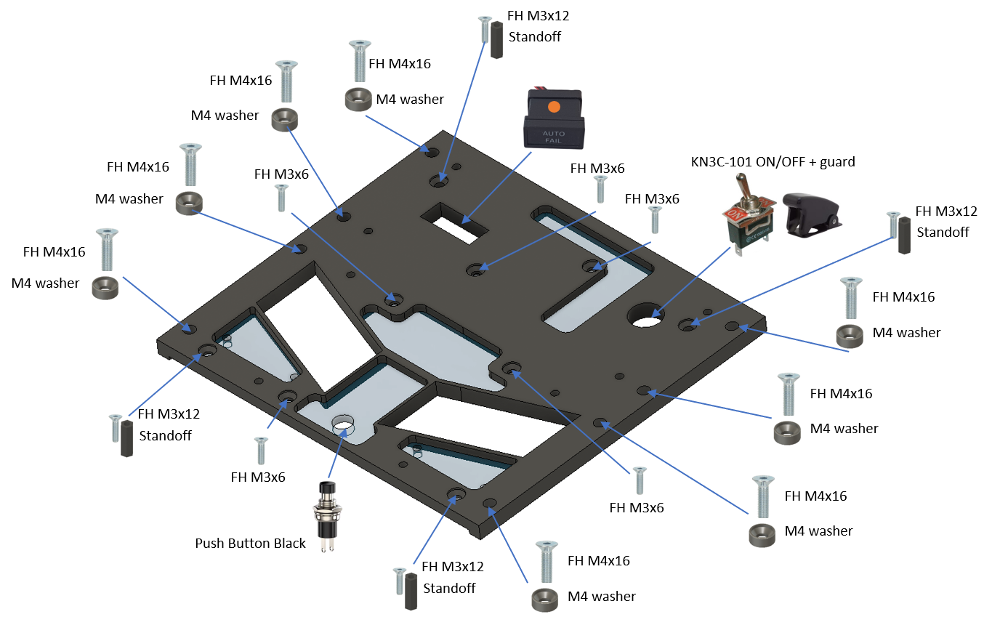

### 2. Bottom panel — LE Devices PCBs

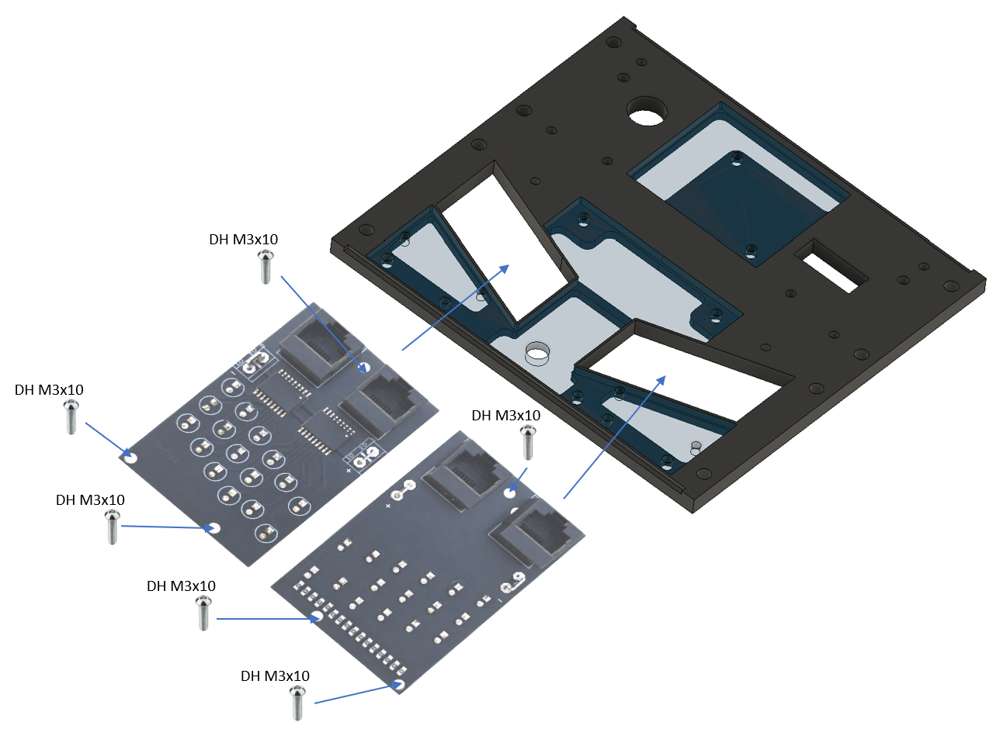

### 3. Top panels

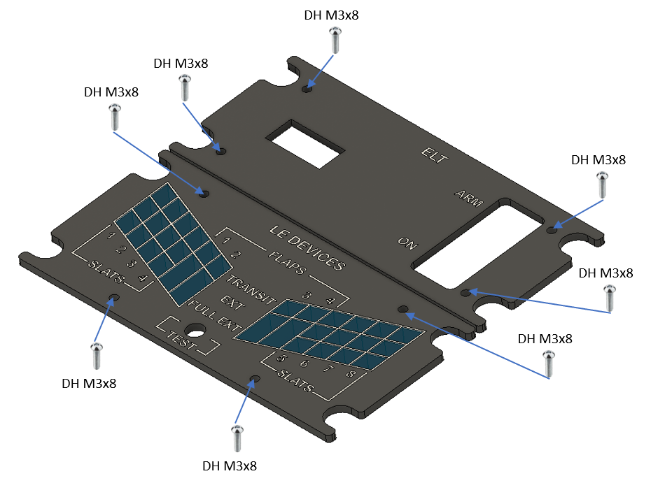

### 4. Backlight panel — LED strips

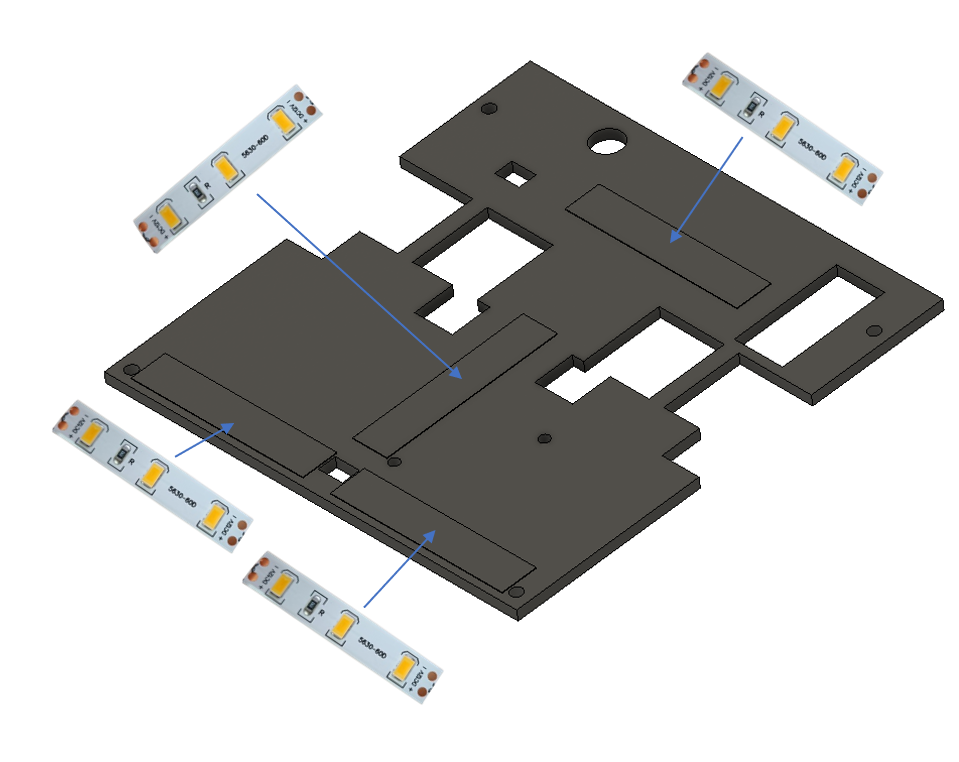

### 5. Backlight panel — Combined PCB and DC jack

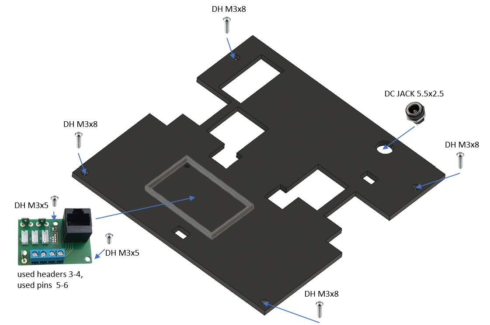
