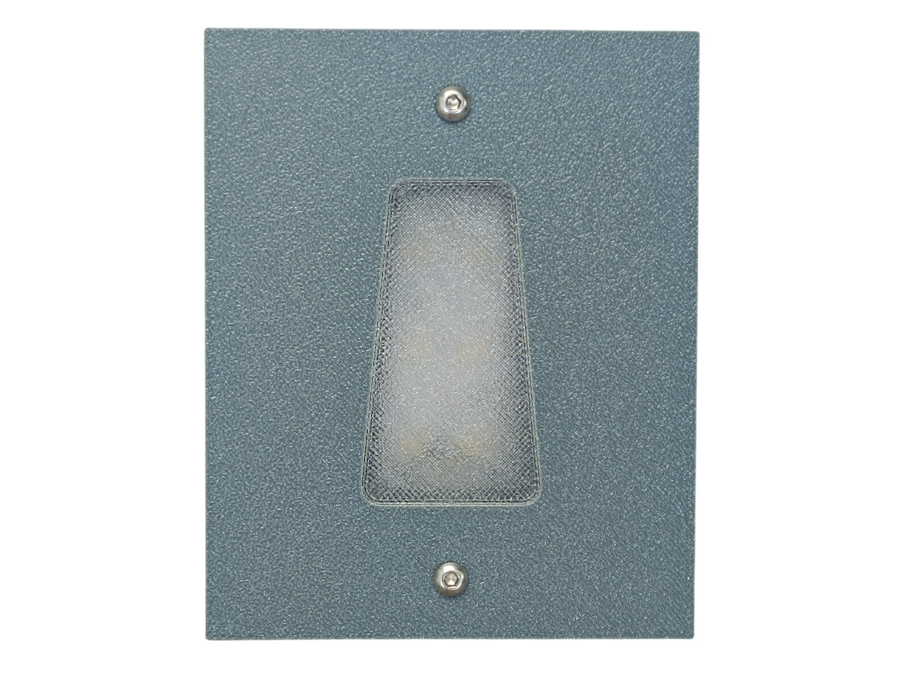
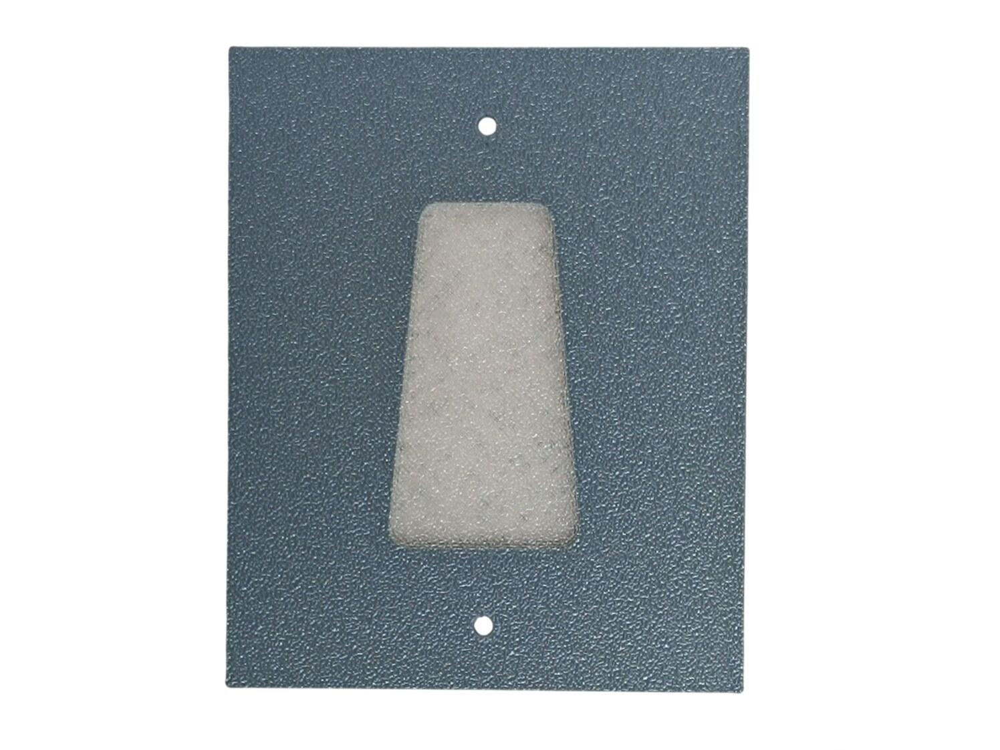
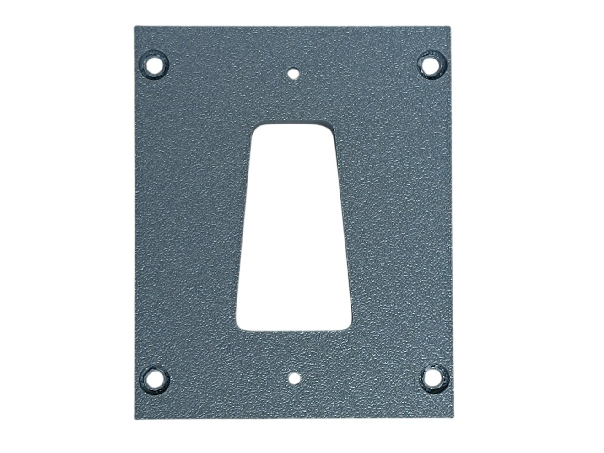
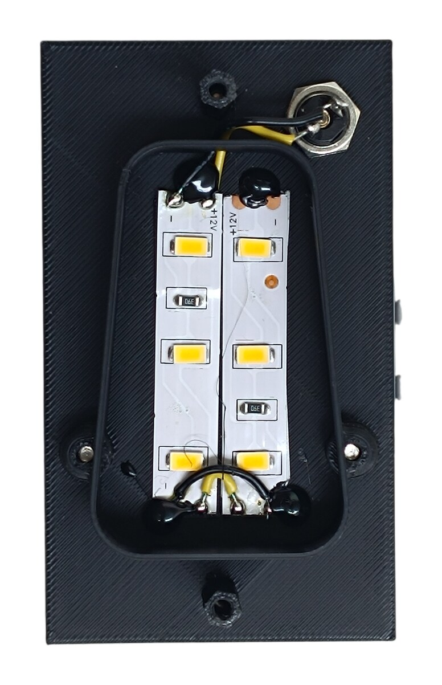
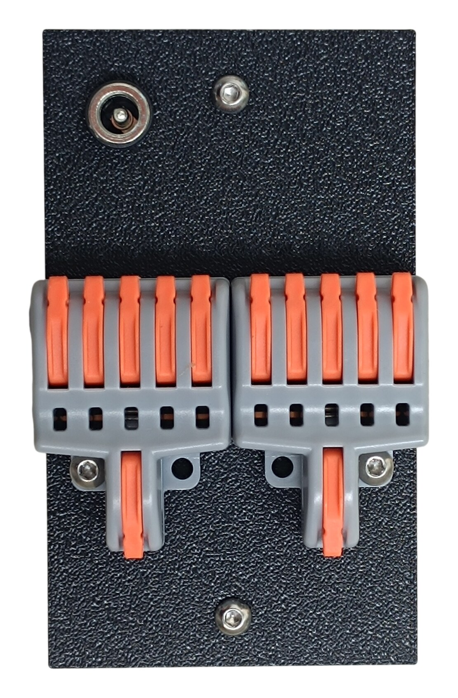
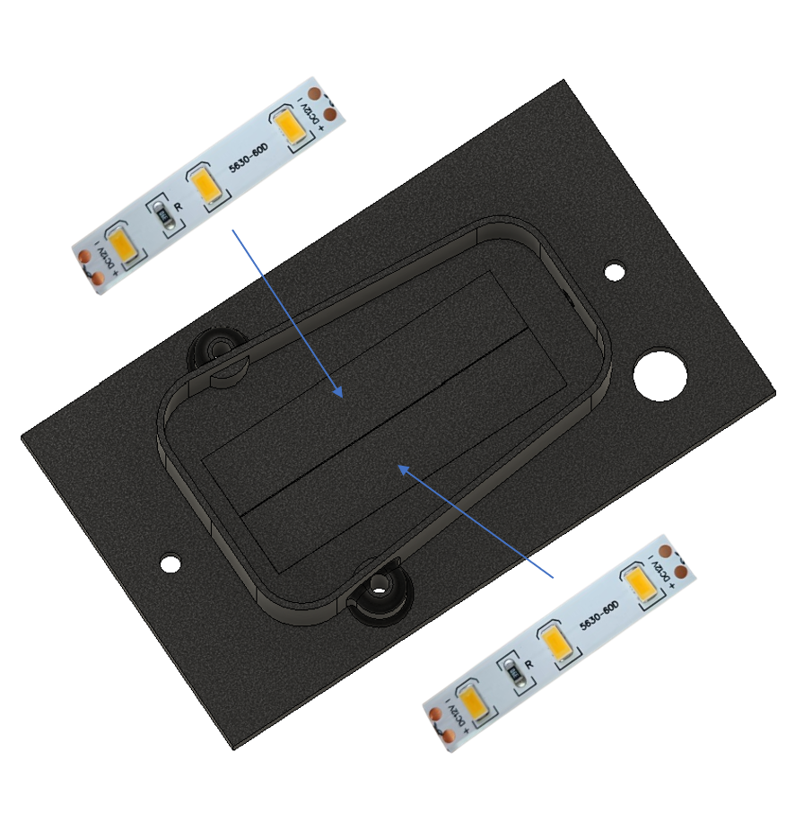
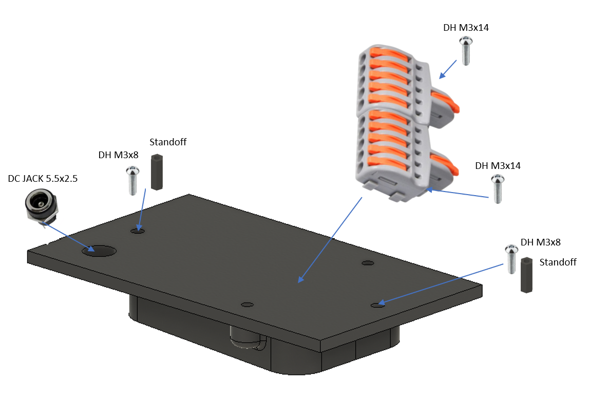
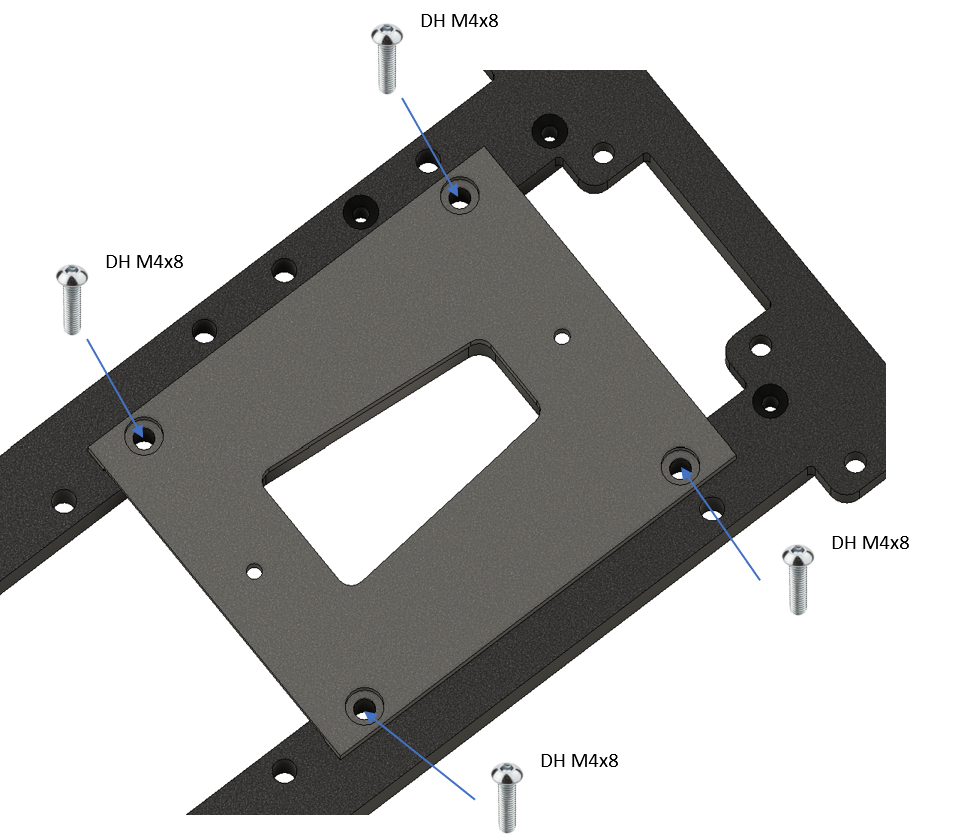
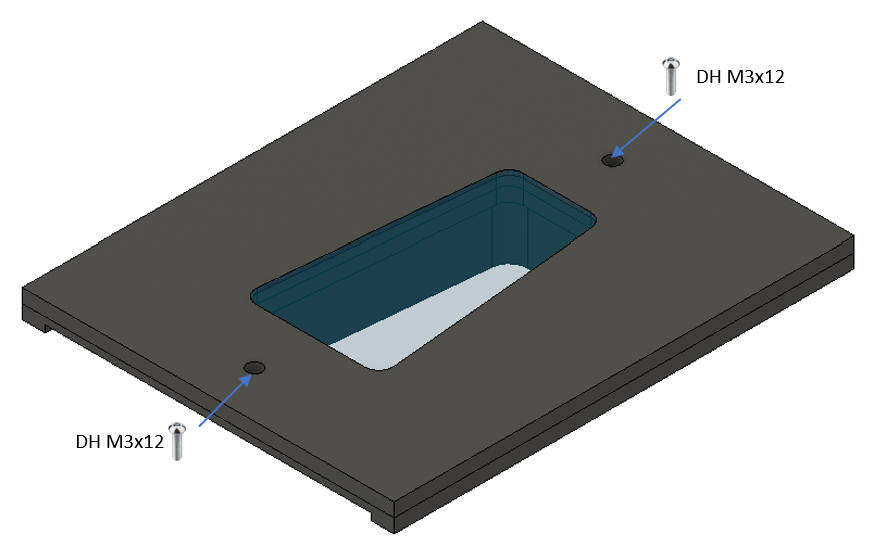

# 18. Flood Light

[📦 Download the printable model on MakerWorld](https://makerworld.com/en/models/3237863-boeing-737-overhead-flood-light)

[← Back to model list](README.md)

---

> **Note**
> The two LED strips behind the window are the overhead **flood light** itself, not panel backlighting. This panel has no PCB and no patch cable — but the pair of splice connectors screwed to its back is where the 12 V for the whole overhead is distributed.

---

## Photos

<table>
<tbody>
<tr>
<td align="center" width="50%"> Finished panel</td>
<td align="center" width="50%"> Top panel — the window is printed in Transparent</td>
</tr>
</tbody>
<tbody>
<tr>
<td align="center" width="50%"> Bottom panel — the four outer holes go to the main frame, the two inner ones to the standoffs</td>
<td align="center" width="50%"> Backlight panel — the two LED strips and the DC jack</td>
</tr>
</tbody>
<tbody>
<tr>
<td align="center" width="50%"> Rear side — the two splice connectors and the DC jack</td>
<td align="center" width="50%"></td>
</tr>
</tbody>
</table>

---

## Filament

| | Colour | Filament |
|---|---|---|
|  | Dark Gray | C-Tech Premium Line PLA RAL7011 |
|  | Transparent | Filament PM PLA Transparent |
|  | Black | Bambu PLA Basic Black (10101) |

---

## 3D Printed Parts

| Qty | Part | Notes |
|---:|---|---|
| 1× | Top panel | print on a **Textured** PEI plate; the window is Transparent, the rest Dark Gray |
| 1× | Bottom panel | print on a **Textured** PEI plate |
| 1× | Backlight panel | |
| 2× | Standoff 16 mm | |

---

## Electronic Components

| Qty | Part |
|---:|---|
| 2× | Splice connector F15, 1 in / 5 out |

These are lever-type splice connectors and they serve the **whole overhead**, not just this panel: one carries **+12 V**, the other **GND**, and the five outputs of each feed one column of panels. See [12 V](../system-overview.md#12-v) in the System Overview for the full distribution.

---

## Screws

| Qty | Screw | Joins |
|---:|---|---|
| 2× | Dome head M3×8 | backlight panel + standoff |
| 2× | Dome head M3×12 | top + standoff |
| 2× | Dome head M3×14 | backlight panel + splice connectors |
| 4× | Dome head M4×8 | bottom + main frame |

The four M4 screws are covered by the top panel, so the finished panel shows only the two M3×12 heads.

---

## Flood Light

| Qty | Part |
|---:|---|
| 2× | LED strip |
| 1× | DC jack 5.5 × 2.5 mm |

The strips sit in the recess of the backlight panel and shine out through the transparent window. They run on **12 V** from the flood light dimmer, on a DC plug of their own — the second dimmer channel described in [12 V](../system-overview.md#12-v). They are therefore independent of the overhead backlighting and have their own knob on the Center Middle Panel.

---

## Assembly Diagram

Screw abbreviations used in the diagrams: **DH** = dome head.

### 1. Backlight panel — LED strips

### 2. Backlight panel — DC jack, standoffs and splice connectors

### 3. Bottom panel — mounting to the main frame

### 4. Top panel

