# 19. Center Upper Panel

[📦 Download the printable model on MakerWorld](https://makerworld.com/en/models/3238245-boeing-737-overhead-center-upper-panel)

[← Back to model list](README.md)

---

> **Note**
> The two knobs on this panel are the brightness controls for the **whole overhead**. The dimmers behind them are bought boards that have to be taken out of their housings - see [Dimmers](#dimmers).

---

## Photos

<table>
<tbody>
<tr>
<td align="center" width="50%">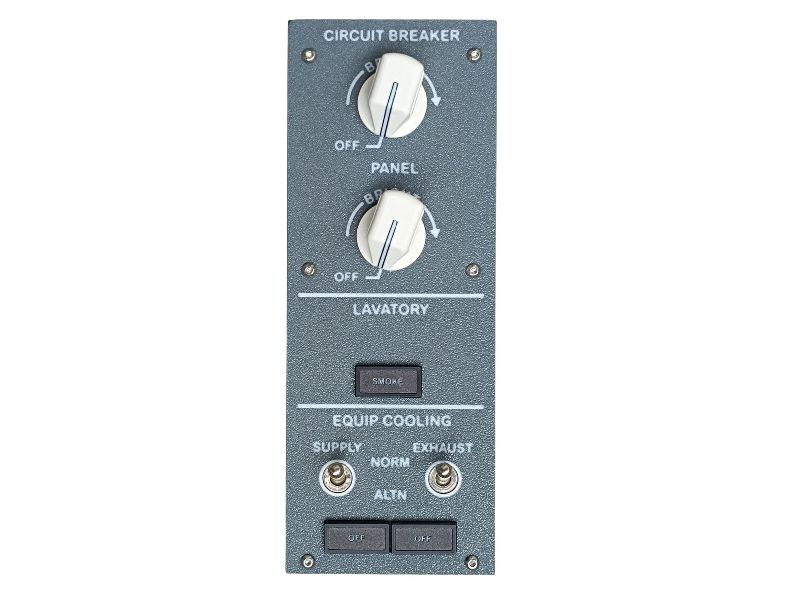 Finished panel</td>
<td align="center" width="50%">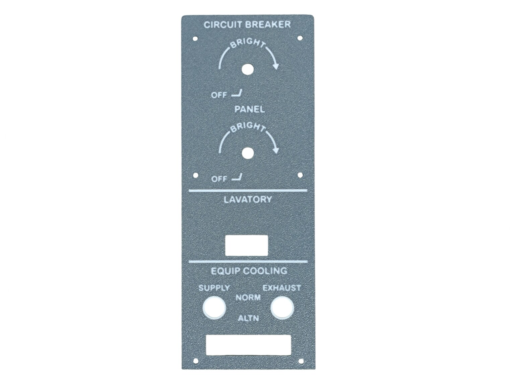 Top panel, printed and UV printed</td>
</tr>
</tbody>
<tbody>
<tr>
<td align="center" width="50%">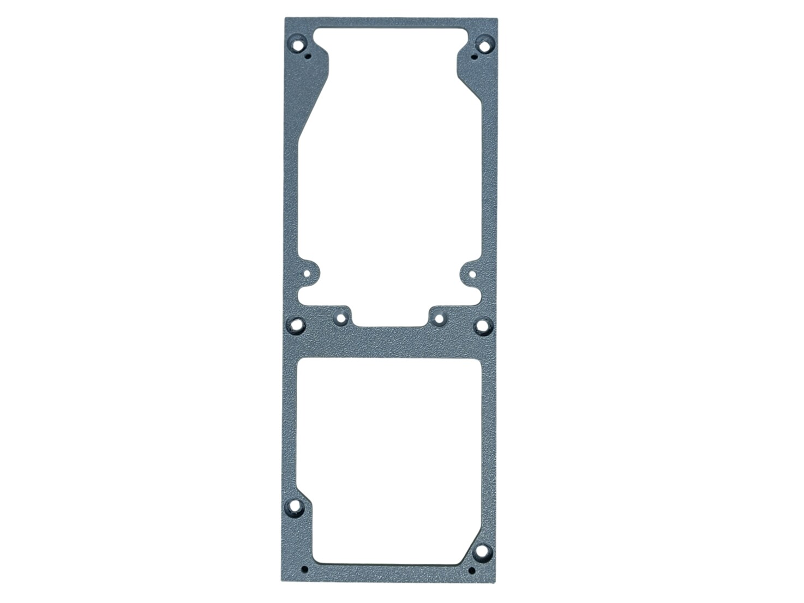 Bottom panel</td>
<td align="center" width="50%">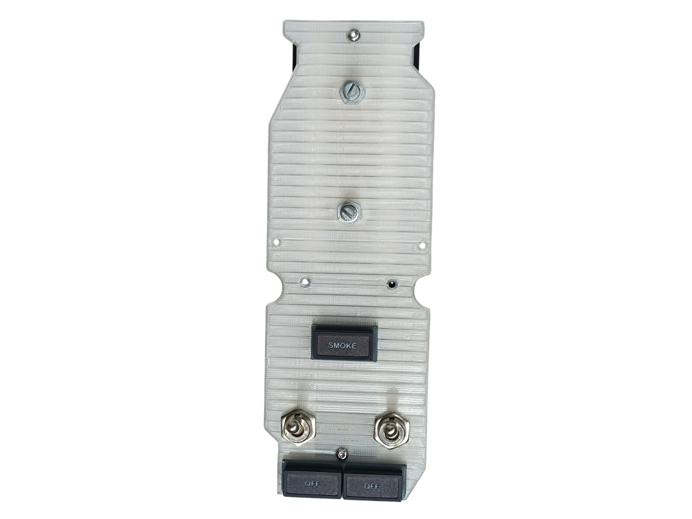 Diffuser panel with the annunciators, the switches and the two potentiometers</td>
</tr>
</tbody>
<tbody>
<tr>
<td align="center" width="50%">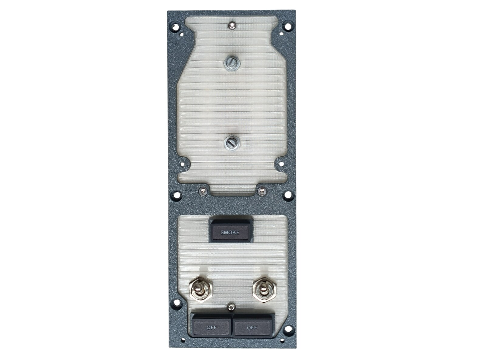 The diffuser fitted into the bottom panel, before the top panel goes on</td>
<td align="center" width="50%">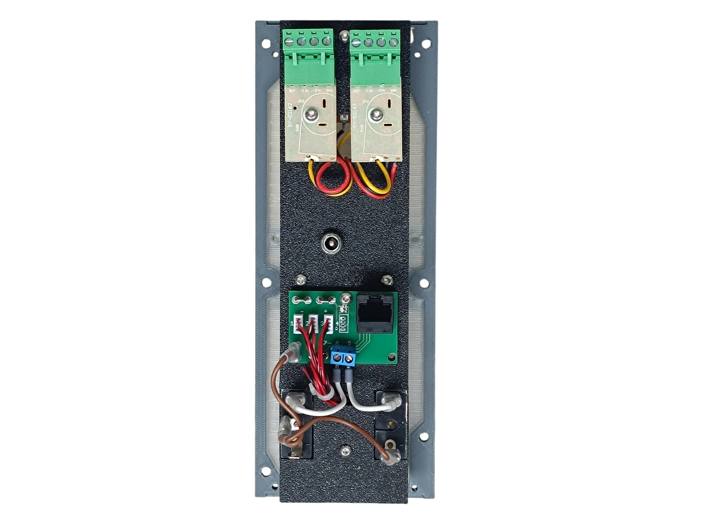 Rear side - the two dimmer boards, the DC jack and the Combined PCB</td>
</tr>
</tbody>
<tbody>
<tr>
<td align="center" width="50%">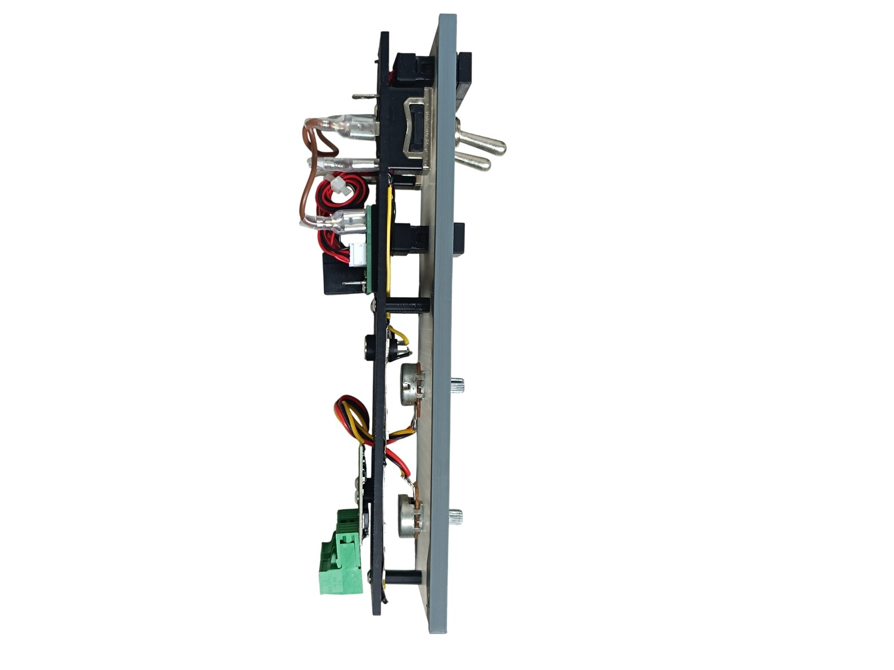 From the side - how deep the panel builds up</td>
<td align="center" width="50%"></td>
</tr>
</tbody>
</table>

---

## Filament

| | Colour | Filament |
|---|---|---|
|  | Dark Gray | C-Tech Premium Line PLA RAL7011 |
|  | Transparent | Filament PM PLA Transparent |
|  | White | Bambu PLA Basic Jade White (10100) |
|  | Black | Bambu PLA Basic Black (10101) |

---

## 3D Printed Parts

| Qty | Part | Notes |
|---:|---|---|
| 1× | Top panel | print on a **Textured** PEI plate |
| 1× | Bottom panel | print on a **Textured** PEI plate |
| 1× | Diffuser panel | print on a **Smooth** PEI plate |
| 1× | Backlight panel | |
| 1× | PCB frame | |
| 4× | Standoff 16 mm | |

---

## Switches and Buttons

| Qty | Type |
|---:|---|
| 2× | KN3(C)-101 or KN3(C)-102, ON/OFF |

The two toggle switches are EQUIP COOLING SUPPLY and EQUIP COOLING EXHAUST.

---

## Rotary Knobs

The knobs for the two dimmers are a separate model shared with the other panels - they are **not included** in this download. Both are the **General knob**; the dimmer potentiometers have splined shafts.

| | |
|---|---|
| 📦 Printable model | [Boeing 737 Overhead - Rotary Knobs](https://makerworld.com/en/models/3066127-boeing-737-overhead-rotary-knobs) |
| 🔧 Build notes | [Rotary Knobs](03-rotary-knobs.md) |

---

## Dimmers

The brightness controls of the whole overhead sit on this panel: the knobs on its face, the dimmer boards on its back.

| Qty | Part | Reference |
|---:|---|---|
| 2× | **PWM LED dimmer** - 12–24 V, rotary knob | [Product I used](../../images/parts/AE_dimmer.png) |

Each dimmer is sold as a finished unit in a plastic housing. Take the board and its potentiometer out of the housing and use them as they are - **nothing has to be desoldered**, the potentiometer stays on the lead it comes with.

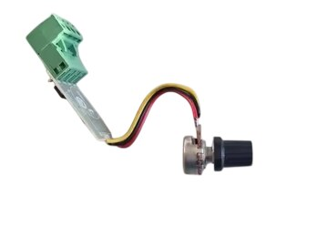

The potentiometer is mounted on the diffuser panel, the board on the backlight panel.

| Knob | Controls |
|---|---|
| **PANEL** | the backlighting of the whole overhead |
| **CIRCUIT BREAKER** | the overhead flood light |

On the real aircraft the CIRCUIT BREAKER knob sets the brightness of the circuit breaker panel and the flood light is controlled from outside the overhead. That panel does not exist here, so the knob drives the [Flood Light](18-flood-light.md) instead. How the two outputs are distributed is in [12 V](../system-overview.md#12-v) in the System Overview.

---

## Screws

| Qty | Screw | Joins |
|---:|---|---|
| 2× | Flat head M3×12 | bottom + standoff |
| 2× | Dome head M3×5 | PCB + backlight |
| 14× | Dome head M3×8 | top + bottom, diffuser + standoff, backlight + standoff, backlight + dimmer PCB |
| 6× | Dome head M4×8 | bottom + main frame |

---

## Annunciators

| Qty | Type |
|---:|---|
| 3× | Black background, yellow LED |

The annunciators are a separate model shared with the other panels - they are **not included** in this download.

| | |
|---|---|
| 📦 Printable model | [Boeing 737 Overhead - Annunciators](https://makerworld.com/en/models/3121595-boeing-737-overhead-annunciators) |
| 🔧 Build notes | [Annunciators](02-annunciators.md) |
| 🔌 PCB, BOM and wiring | [Annunciator PCB](../pcb/annunciator.md) |

---

## PCB

| Qty | PCB | Connections used | Gerber files |
|---:|---|---|---|
| 1× | [RJ45 Combined](../pcb/rj45-combined.md) | headers 1–3, pins 5–6 | [📥 PCB_RJ45_Combined.zip](https://raw.githubusercontent.com/om7ea/B737/main/PCB/PCB_RJ45_Combined.zip) |
| 2× | Dimmer board | - | bought board, see [Dimmers](#dimmers) |

Mounting is shown in [step 3](#3-backlight-panel---pcb-dc-jack-and-dimmers) of the assembly diagram. Which lamp and which switch each connection carries is in [Wiring](#wiring).

---

## Wiring

The three annunciators and the two toggle switches are all on one [RJ45 Combined](../pcb/rj45-combined.md) PCB, connected by a single Ethernet patch cable to the [RJ45 Hub Shield](../pcb/rj45-hub-shield.md) of a MEGA 2560 PRO MINI.

| PCB | Patch cable goes to | Connections used |
|---|---|---|
| **PCB 1** | socket **A1** on **Overhead_3** | headers 1–3, pins 5–6 |

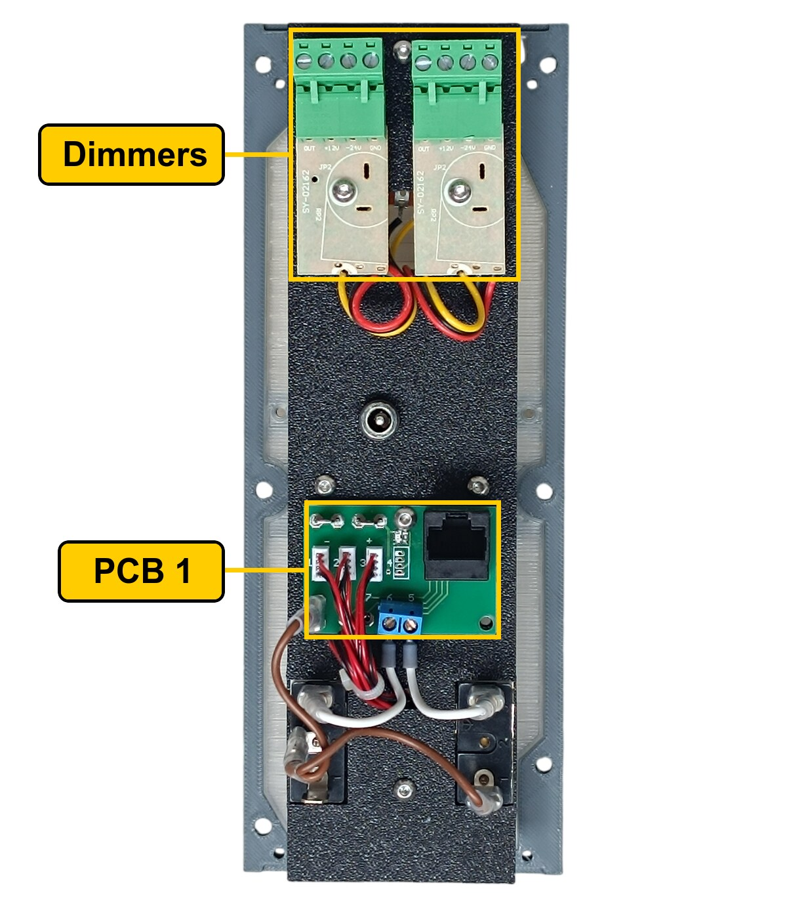

The rear of the panel. **PCB 1** is the green board with the RJ45 socket and the blue screw terminal. The two boards above it are the [dimmers](#dimmers) - they have no connection to the simulator.

The socket labels **D0–D6**, **A1** and **A2** are silkscreened on the hub shield.

### PCB 1 - socket A1 on Overhead_3

This is the Combined PCB, so it carries both kinds of connection: the ZH headers drive annunciators, the screw terminals are direct.

| Header | Annunciator |
|---:|---|
| 1 | OFF - supply cooling |
| 2 | SMOKE |
| 3 | OFF - exhaust cooling |

| Pin | Switch |
|---:|---|
| 5 | EQUIP COOLING SUPPLY |
| 6 | EQUIP COOLING EXHAUST |

Header 4 and pins 7 and 8 are not used.

**The two switches share a single ground return.** Each takes one of its terminals to its own pin. The opposite terminals are commoned - daisy-chained from one to the other - and the chain ends at a **-** (ground) contact.

---

## Backlight

| Qty | Part |
|---:|---|
| 5× | LED strip |
| 1× | DC jack 5.5 × 2.5 mm |

Powered from the **12 V** supply - see [Power supply](../system-overview.md#power-supply). Like every other backlit panel, its brightness is set by the PANEL knob on this panel's own face.

---

## Assembly Diagram

Screw abbreviations used in the diagrams: **FH** = flat head, **DH** = dome head.

### 1. Bottom panel - diffuser, annunciators, switches and potentiometers

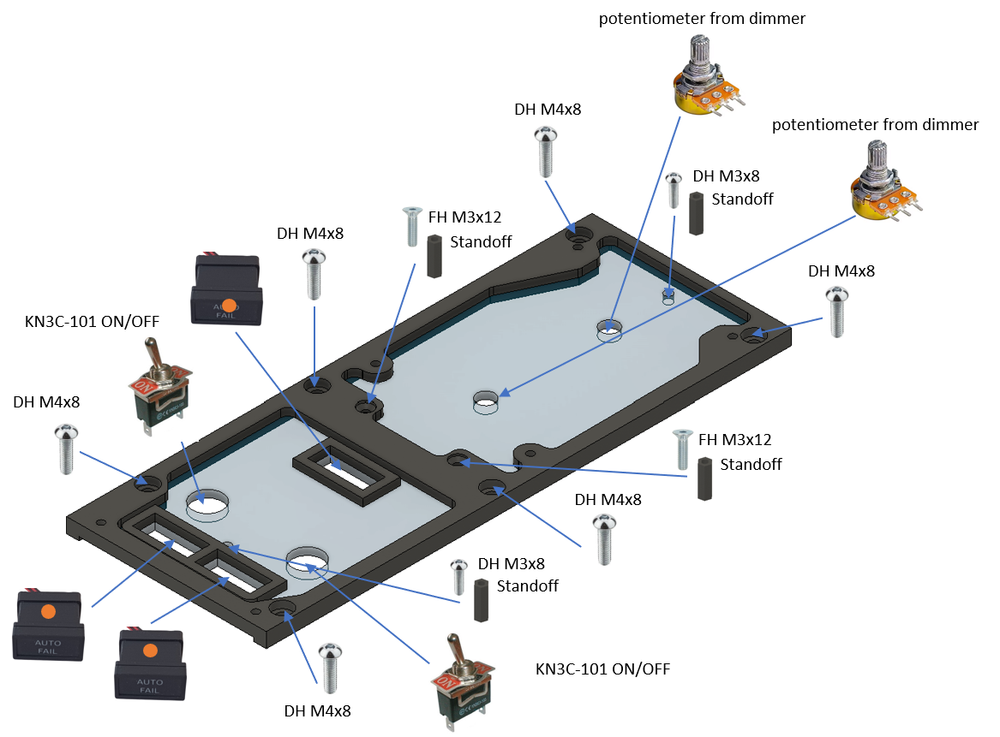

The six M4×8 screws in this drawing are the ones that later hold the finished panel on the main frame.

### 2. Backlight panel - LED strips

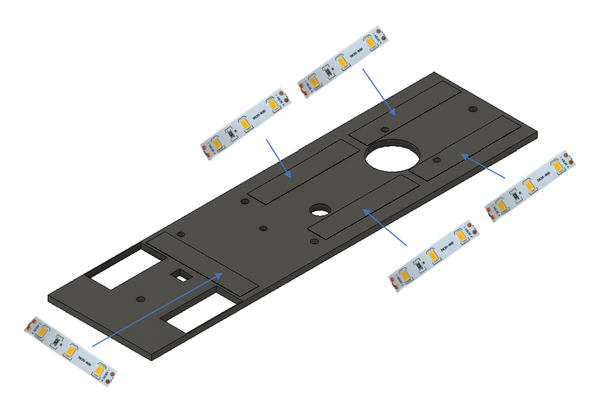

### 3. Backlight panel - PCB, DC jack and dimmers

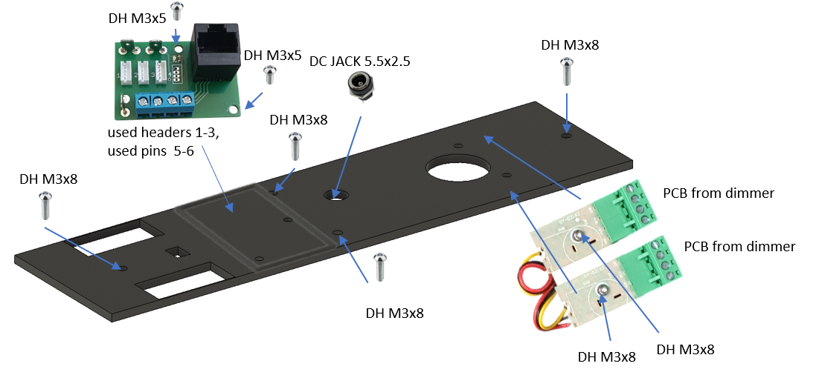

### 4. Top panel

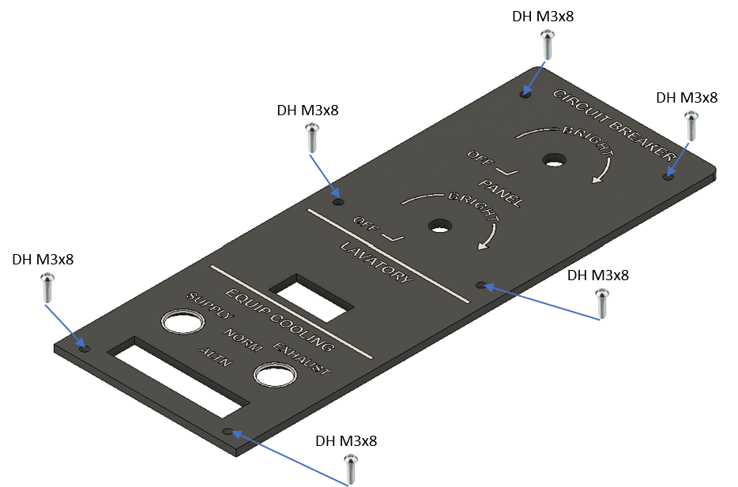
