# 20. Center Lower Panel

[📦 Download the printable model on MakerWorld](https://makerworld.com/en/models/3238455-boeing-737-overhead-center-lower-panel)

[← Back to model list](README.md)

---

## Photos

<table>
<tbody>
<tr>
<td align="center" width="50%">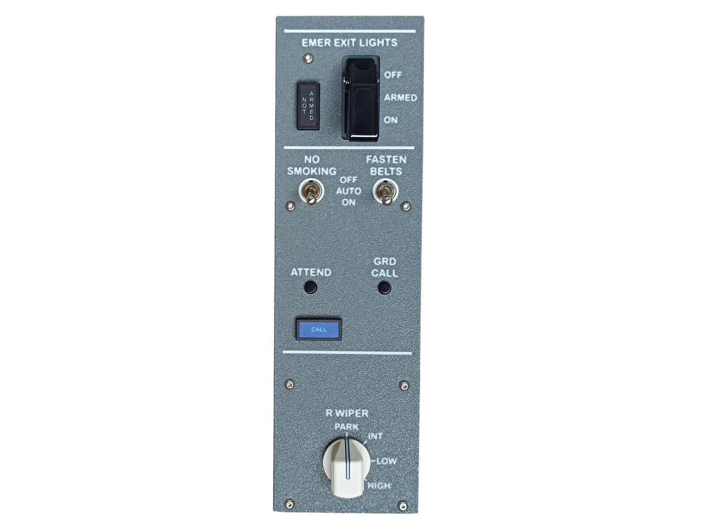 Finished panel</td>
<td align="center" width="50%">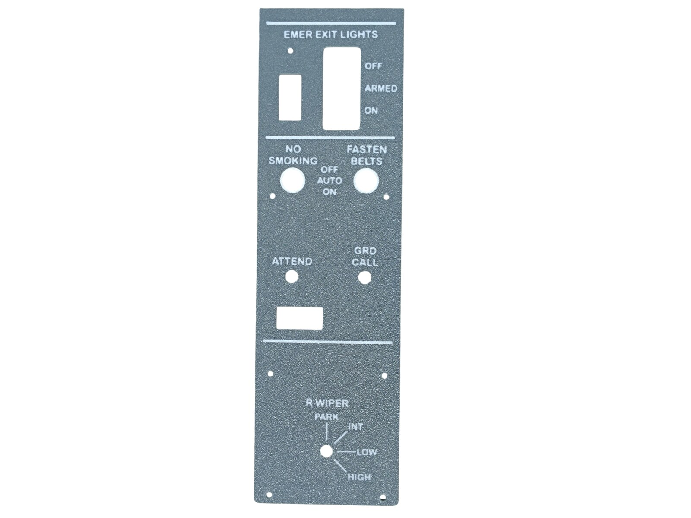 Top panel, printed and UV printed</td>
</tr>
</tbody>
<tbody>
<tr>
<td align="center" width="50%">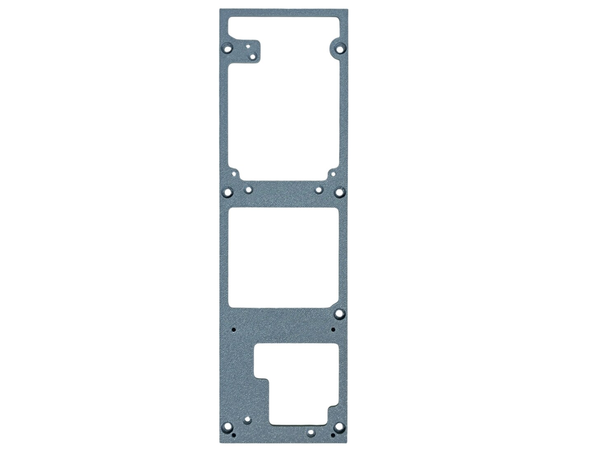 Bottom panel</td>
<td align="center" width="50%">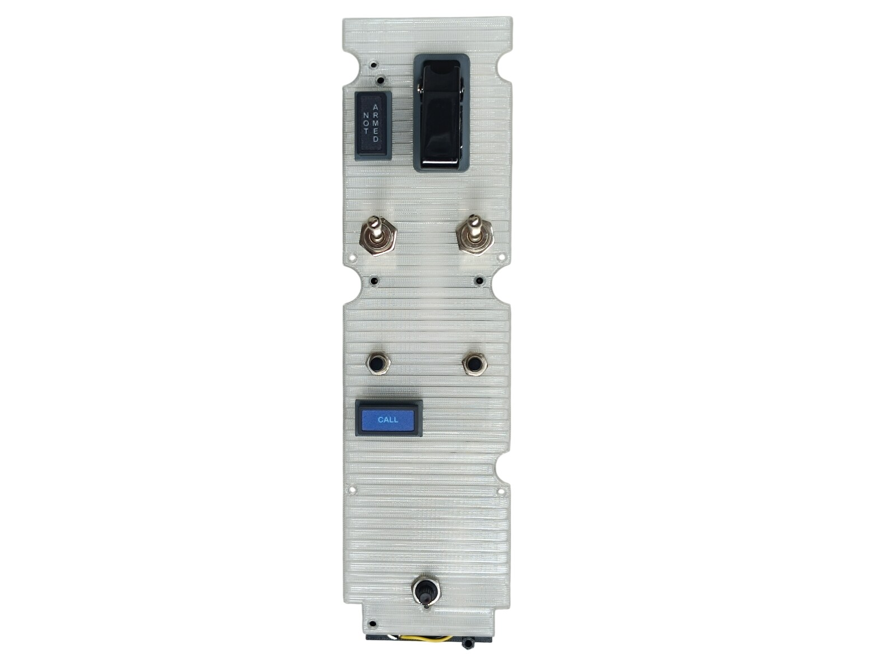 Diffuser panel with the annunciators, the switches and the rotary switch</td>
</tr>
</tbody>
<tbody>
<tr>
<td align="center" width="50%">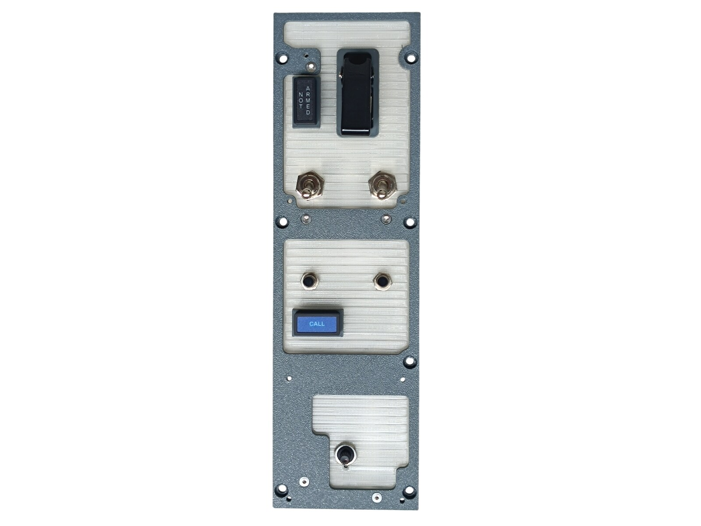 The diffuser fitted into the bottom panel, before the top panel goes on</td>
<td align="center" width="50%">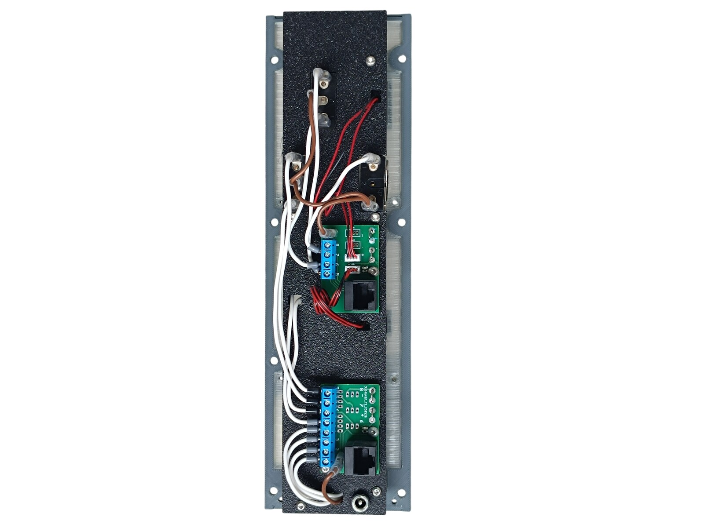 Rear side — the two PCBs and the DC jack</td>
</tr>
</tbody>
</table>

---

## Filament

| | Colour | Filament |
|---|---|---|
|  | Dark Gray | C-Tech Premium Line PLA RAL7011 |
|  | Transparent | Filament PM PLA Transparent |
|  | White | Bambu PLA Basic Jade White (10100) |
|  | Black | Bambu PLA Basic Black (10101) |

---

## 3D Printed Parts

| Qty | Part | Notes |
|---:|---|---|
| 1× | Top panel | print on a **Textured** PEI plate |
| 1× | Bottom panel | print on a **Textured** PEI plate |
| 1× | Diffuser panel | print on a **Smooth** PEI plate |
| 1× | Backlight panel | |
| 2× | PCB frame | |
| 5× | Standoff 16 mm | |

---

## Switches and Buttons

| Qty | Type |
|---:|---|
| 2× | KN3(C)-103, ON/OFF/ON |
| 1× | KN3(C)-101 or KN3(C)-102, ON/OFF |
| 2× | PBS-110 push button, black |
| 1× | Rotary switch SR16, 4 positions |
| 1× | Toggle switch safety aircraft guard, black |

The three-position switches are EMER EXIT LIGHTS and FASTEN BELTS, the two-position one is NO SMOKING. The guard goes on the EMER EXIT LIGHTS switch, the push buttons are ATTEND and GRD CALL, and the rotary switch is R WIPER.

---

## Rotary Knobs

The knob for the R WIPER selector is a separate model shared with the other panels — it is **not included** in this download.

| | |
|---|---|
| 📦 Printable model | [Boeing 737 Overhead - Rotary Knobs](https://makerworld.com/en/models/3066127-boeing-737-overhead-rotary-knobs) |
| 🔧 Build notes | [Rotary Knobs](03-rotary-knobs.md) |

---

## Screws

| Qty | Screw | Joins |
|---:|---|---|
| 5× | Flat head M3×12 | bottom + standoff |
| 4× | Dome head M3×5 | PCB + backlight |
| 12× | Dome head M3×8 | top + bottom, backlight + standoff |
| 7× | Dome head M4×8 | bottom + main frame |

---

## Annunciators

| Qty | Type |
|---:|---|
| 1× | Black background, yellow LED |
| 1× | Blue background, white LED |

The yellow one is NOT ARMED, the blue one is CALL.

The annunciators are a separate model shared with the other panels — they are **not included** in this download.

| | |
|---|---|
| 📦 Printable model | [Boeing 737 Overhead - Annunciators](https://makerworld.com/en/models/3121595-boeing-737-overhead-annunciators) |
| 🔧 Build notes | [Annunciators](02-annunciators.md) |
| 🔌 PCB, BOM and wiring | [Annunciator PCB](../pcb/annunciator.md) |

---

## PCB

| Qty | PCB | Connections used | Gerber files |
|---:|---|---|---|
| 1× | [RJ45 Direct](../pcb/rj45-direct.md) | pins 1–8 | [📥 PCB_RJ45_Direct.zip](https://raw.githubusercontent.com/om7ea/B737/main/PCB/PCB_RJ45_Direct.zip) |
| 1× | [RJ45 Combined](../pcb/rj45-combined.md) | headers 3–4, pins 5–7 | [📥 PCB_RJ45_Combined.zip](https://raw.githubusercontent.com/om7ea/B737/main/PCB/PCB_RJ45_Combined.zip) |

Mounting is shown in [step 3](#3-backlight-panel--pcbs-and-dc-jack) of the assembly diagram. Which switch and which annunciator each connection carries is in [Wiring](#wiring).

---

## Wiring

The panel takes **two** Ethernet patch cables to the [RJ45 Hub Shield](../pcb/rj45-hub-shield.md). Both go to the same MEGA 2560 — `Overhead_3`.

| PCB | Patch cable goes to | Connections used |
|---|---|---|
| **PCB 1** | socket **D2** on **Overhead_3** | pins 1–8 |
| **PCB 2** | socket **A2** on **Overhead_3** | headers 3–4, pins 5–7 |

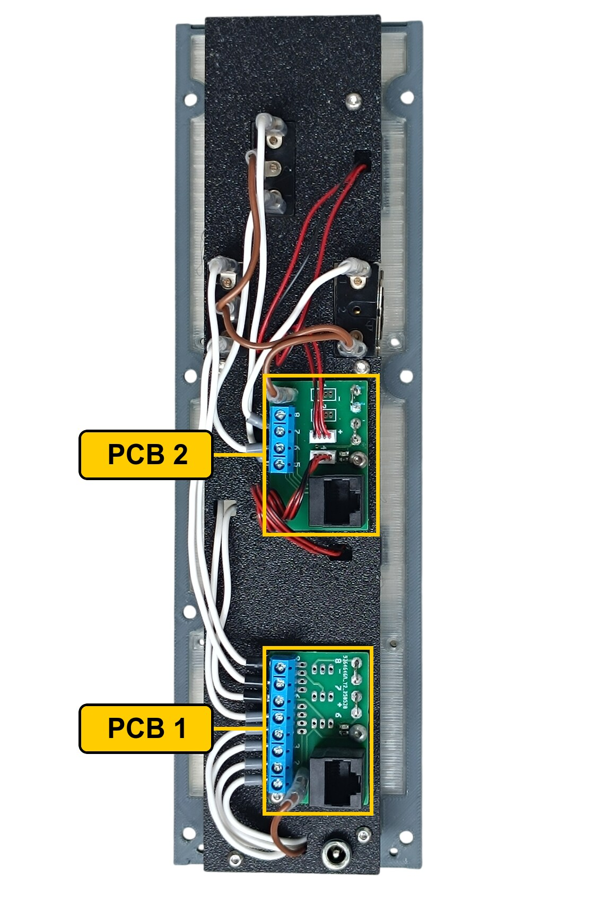

The rear of the panel. **PCB 1** is the lower board, the one with the eight-way blue screw terminal. **PCB 2** is above it, with the four-way terminal and the two red-and-black cables running off to the annunciators.

The socket labels **D0–D6**, **A1** and **A2** are silkscreened on the hub shield.

### PCB 1 — socket D2 on Overhead_3

| Pin | Switch |
|---:|---|
| 1 | R WIPER — HIGH |
| 2 | R WIPER — LOW |
| 3 | R WIPER — INT |
| 4 | R WIPER — PARK |
| 5 | ATTEND |
| 6 | GRD CALL |
| 7 | FASTEN BELTS — OFF |
| 8 | FASTEN BELTS — ON |

### PCB 2 — socket A2 on Overhead_3

This is the Combined PCB, so it carries both kinds of connection: the ZH headers drive annunciators, the screw terminals are direct.

| Header | Annunciator |
|---:|---|
| 3 | NOT ARMED |
| 4 | CALL |

| Pin | Switch |
|---:|---|
| 5 | EMER EXIT LIGHTS — ON |
| 6 | EMER EXIT LIGHTS — OFF |
| 7 | NO SMOKING |

Headers 1 and 2 are not populated, and neither is pin 8.

**All the switches and buttons share a single ground return.** Each takes one of its terminals to its own pin. The opposite terminals are commoned — daisy-chained from one to the next — and the chain ends at a **-** (ground) contact.

---

## Backlight

| Qty | Part |
|---:|---|
| 7× | LED strip |
| 1× | DC jack 5.5 × 2.5 mm |

Powered from the **12 V** supply — see [Power supply](../system-overview.md#power-supply).

---

## Assembly Diagram

Screw abbreviations used in the diagrams: **FH** = flat head, **DH** = dome head.

### 1. Bottom panel — diffuser, annunciators and switches

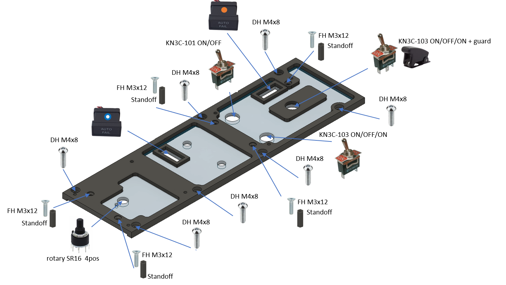

The seven M4×8 screws in this drawing are the ones that later hold the finished panel on the main frame.

### 2. Backlight panel — LED strips

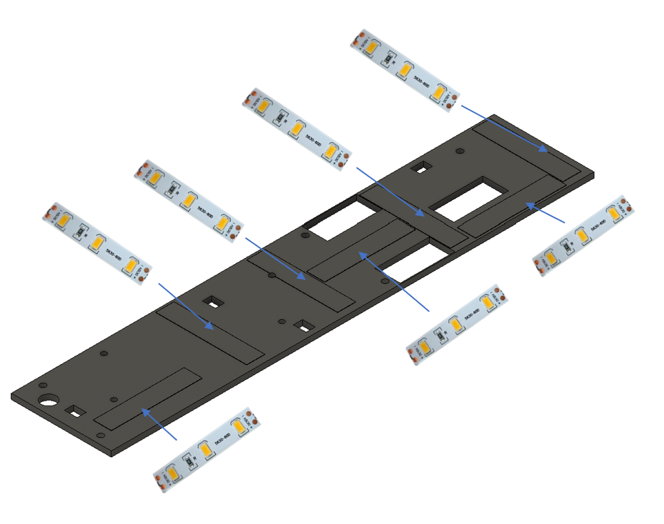

### 3. Backlight panel — PCBs and DC jack

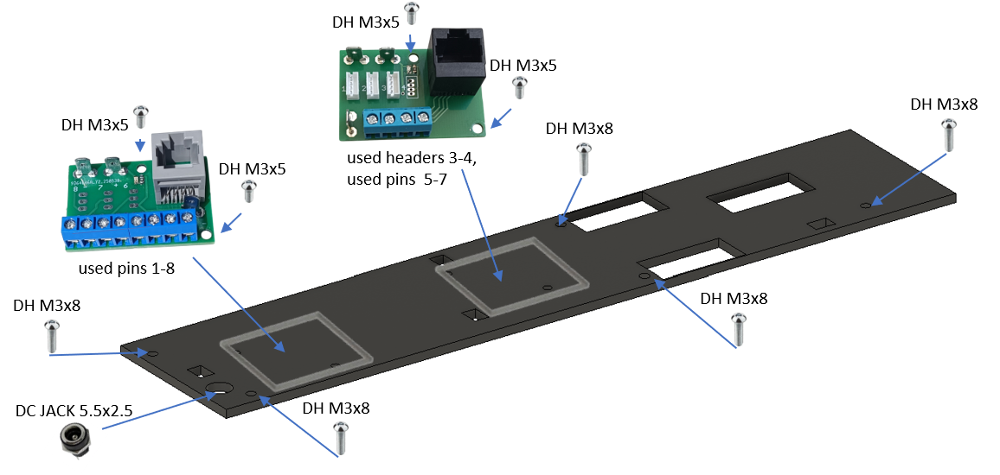

### 4. Top panel

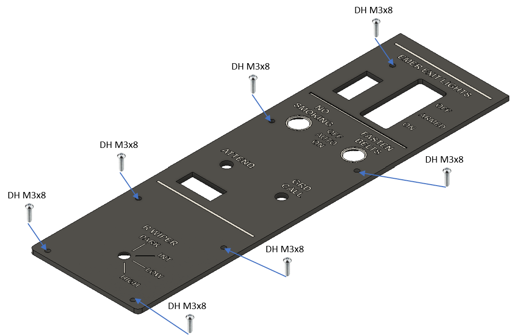
