# 21. Temperature and Climb Gauges

[📦 Download the printable model on MakerWorld](https://makerworld.com/en/models/3251829-boeing-737-overhead-temperature-and-climb-gauges)

[← Back to model list](README.md)

---

> **Note**
> These gauges are shared across the overhead panel - they are not part of any individual panel model. **4** of them are needed for the complete project, one on each of these panels: **Fuel Control Panel**, **Generator Bus Panel**, **Air Conditioning Control Panel** and **Cabin Altitude Panel**.
>
> All four are built from the same parts. What makes each one a different instrument is the UV-printed scale stuck to its face and the shape of its needle.

---

## Photos

<table>
<tbody>
<tr>
<td align="center" width="50%"> A finished gauge - this one carries the FUEL TEMP scale</td>
<td align="center" width="50%">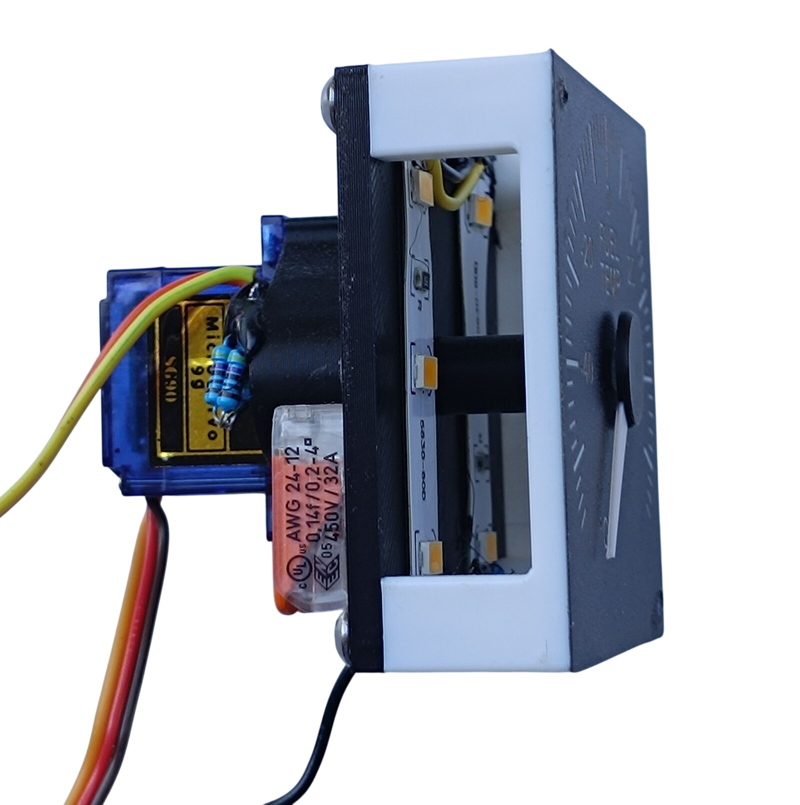 From the side - the two LED strips on the backlight part</td>
</tr>
</tbody>
</table>

---

## How It Works

The needle is driven by an **SG90 servo** through a pair of printed gears. The **14-tooth** gear sits on the servo, the **7-tooth** gear on the needle shaft, so the needle turns **twice as far as the servo** - the 180° of an SG90 become a full turn of the dial.

The needle shaft itself is a **2 mm acrylic rod** running in two **MR52ZZ** ball bearings, one in the top plate and one in the backlight plate. The rod is not only a shaft: a white LED underneath shines up through it, so the rod also carries light into the needle. The 7-tooth gear sits in that light path, which is why it is printed in **transparent** PLA.

The dial itself is lit separately, by two LED strips on the backlight part - see [Backlight](#backlight).

---

## Filament

| | Colour | Filament |
|---|---|---|
|  | Black | Bambu PLA Basic Black (10101) |
|  | White | Bambu PLA Basic Jade White (10100) |
|  | Transparent | Filament PM PLA Transparent |

---

## 3D Printed Parts

The finished gauge is a 52 × 52 mm box, about 32 mm deep without the servo.

| Per gauge | Total for 4 | Part | Colour | Notes |
|---:|---:|---|---|---|
| 1× | 4× | top | White | the front plate - the UV-printed scale goes on it and it diffuses the backlight |
| 1× | 4× | backlight | Black | print with **supports** |
| 1× | 4× | cover | Black | the servo bracket; print with **supports** |
| 1× | 4× | gear 14t | Black | on the servo |
| 1× | 4× | gear 7t | Transparent | on the needle shaft, in the light path of the needle LED |

### Needles

Each needle is two parts: a white blade and a black centre cap that covers its hub. The four designs differ slightly from one another, and each one is named in the project file after the instrument it belongs to.

| Qty | Part | Colour | Used on |
|---:|---|---|---|
| 1× | hand-fuel_white + hand-fuel_black | White + Black | Fuel Control Panel |
| 1× | hand-egt-white + hand-egt-black | White + Black | Generator Bus Panel |
| 1× | hand-temp_white + hand-temp_black | White + Black | Air Conditioning Control Panel |
| 1× | hand-climb-white + hand-climb-black | White + Black | Cabin Altitude Panel |

Mixing the needles up does no harm - they all fit and they all work.

---

## Electronic and Mechanical Components

| Per gauge | Total for 4 | Part | Reference |
|---:|---:|---|---|
| 1× | 4× | **Servo SG90** - 180°, plastic gears | [Product I used](../../images/parts/AE_servo_SG90.png) |
| 2× | 8× | **Ball bearing MR52ZZ** - 2 × 5 × 2.5 mm | [Product I used](../../images/parts/AE_bearing_MR52ZZ.png) |
| 1× | 4× | **Acrylic rod** - 2 mm, transparent; the needle shaft is cut from it | [Product I used](../../images/parts/AE_acrylic_rod.png) |
| 1× | 4× | **White 5 mm flat top LED** - the same one the annunciators use | [Product I used](../../images/parts/AE_led_white.png) |
| 1× | 4× | **150 Ω resistor** - in series with the white LED | |
| 2× | 8× | **LED strip** - the scale backlight | [Product I used](../../images/parts/AE_led_strip.png) |
| 1× | 4× | **820 Ω resistor** - in series with the two LED strips | |
| 2× | 8× | **Splice connector** - lever type, for the 12 V of the scale backlight | |

The three self-tapping screws that come with the servo are used as well: two hold the servo to the cover, the third fastens the 14-tooth gear to the servo shaft.

---

## Screws

| Per gauge | Total for 4 | Screw | Joins |
|---:|---:|---|---|
| 4× | 16× | Dome head M3×8 | backlight plate + top plate |
| 2× | 8× | Dome head M3×5 | cover + backlight plate |

---

## UV Print Files

| Qty | File |
|---:|---|
| 1× | A4 PDF - gauge scales |

One sheet carries the scales for all the gauges of the overhead. The PDF and the printing instructions are on the [UV Print Files](../uv-print.md) page.

---

## Backlight

### Scale

The scale is lit by two LED strips on the backlight part, one on each side, shining through the white top plate from behind. They run on **12 V** taken from the backlighting of the panel the gauge is fitted in, so the gauge dims together with that panel - see [Power supply](../system-overview.md#power-supply).

The two strips are not wired straight across that 12 V: an **820 Ω resistor** goes in series with the pair. The white top plate passes far more light than the printed face of a panel does, so on the bare supply the scale burns out much brighter than the lettering around it. The resistor holds it back to the brightness of the rest of the overhead.

The two strips sit in parallel and the resistor goes in the lead feeding them, close to the strips.

### Needle

The needle has a light of its own: a white 5 mm LED under the needle shaft, shining up through the transparent 7-tooth gear and the acrylic rod into the needle. It runs on **5 V** with a **150 Ω** resistor in series.

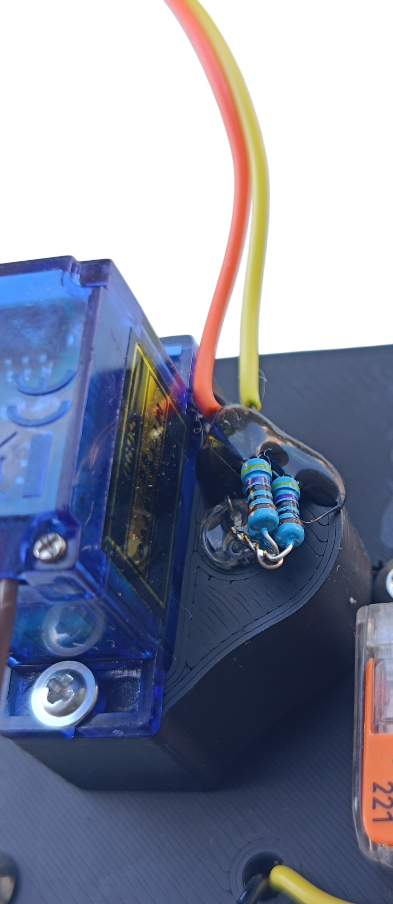

The photo shows more than one resistor because I had no 150 Ω to hand and made the value up from three in parallel. One resistor of the right value does the same job.

> **Note**
> The needle lighting works, but the effect is weak. White PLA does not carry light well over the length of a needle, so the needle glows rather than lights up. It is worth building - but do not expect the needle to stand out the way the scale does.

---

## Wiring

A gauge has three connections. Which PCB and which socket they land on depends on the panel the gauge is fitted in, and is on that panel's own page.

| Connection | Supply | Comes from |
|---|---|---|
| Servo | 5 V | +5 V, the control signal and GND, all three from an [RJ45 Direct](../pcb/rj45-direct.md) PCB |
| Needle LED | 5 V | +5 V and GND from two pins of a double-ended pin header on an [RJ45 Direct](../pcb/rj45-direct.md) PCB |
| Scale backlight | 12 V | the backlighting of the panel the gauge is fitted in, through an **820 Ω** resistor - see [Backlight](#backlight) |

> **⚠️ The servo plug has to be rewired**
> The SG90 does not leave the factory in the order the RJ45 Direct PCB expects, so the servo will **not** work if you plug it in as it comes. **Swap the red and the yellow wire:**
>
> | | Wire order in the plug |
> |---|---|
> | As delivered | brown - red - yellow |
> | **Needed** | **brown - yellow - red** |
>
> Lift the small tabs on the plastic housing, pull those two crimped contacts out and swap them over. Brown stays where it is. (On some SG90s the yellow wire is orange instead - it is the signal wire either way.)

The 12 V for the scale backlight is brought over from the panel's own backlighting with two **lever-type splice connectors**, one for +12 V and one for GND. Where they sit is up to you - both on the gauge works fine, and so does one on the gauge and one on the panel. On my own build it varies from panel to panel: the leads coming out of some backlight panels were short, so one connector had to stay on the panel and only the other went on the gauge. There is nothing to screw them to, so **glue them down with super glue.**

---

## Assembly

Screw abbreviations used below: **DH** = dome head.

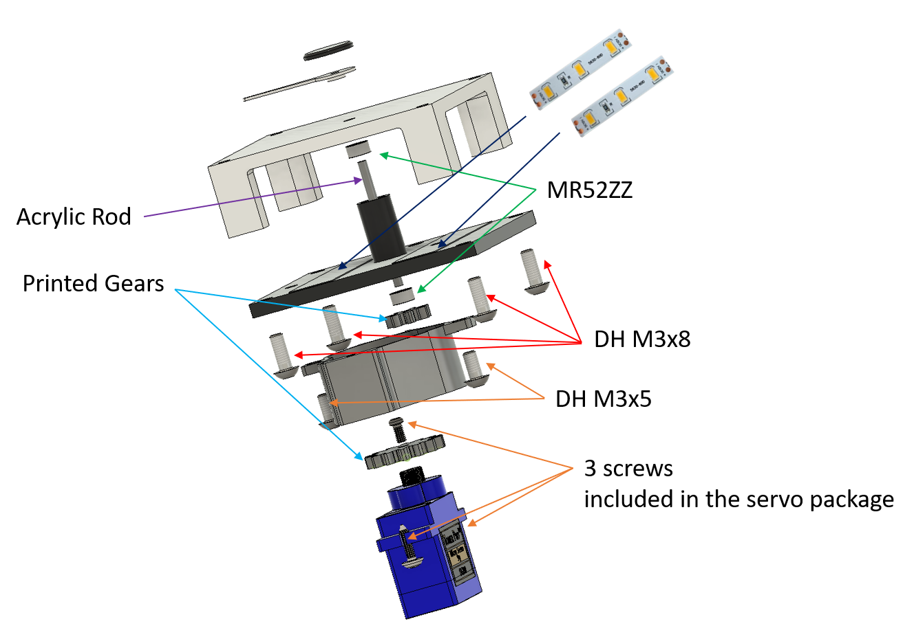

<table>
<tbody>
<tr>
<td width="55%"><b>1.</b> Screw the <b>servo</b> to the <b>cover</b> with two of the screws that come in the servo bag.</td>
<td align="center">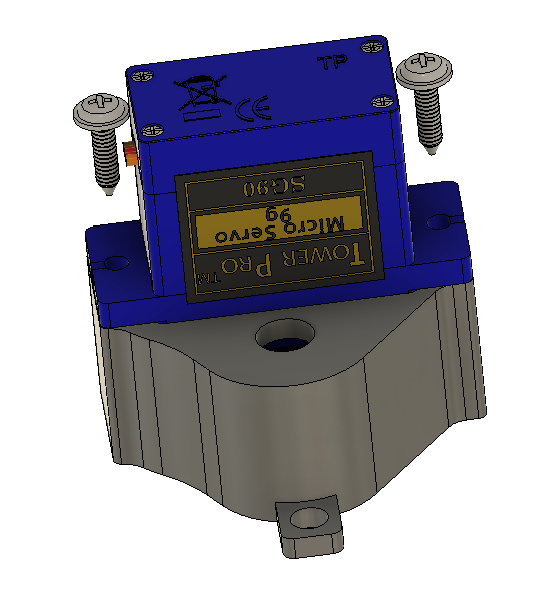</td>
</tr>
</tbody>
<tbody>
<tr>
<td width="55%"><b>2.</b> Fasten the <b>14-tooth gear</b> to the servo shaft, again with a screw from the servo bag.</td>
<td align="center">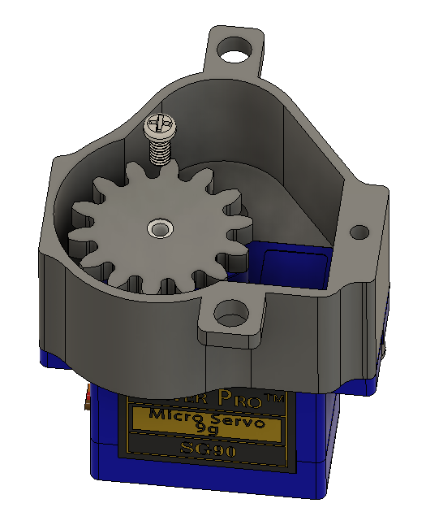</td>
</tr>
</tbody>
<tbody>
<tr>
<td width="55%"><b>3.</b> Stick the printed foil onto the <b>top</b> part.</td>
<td align="center">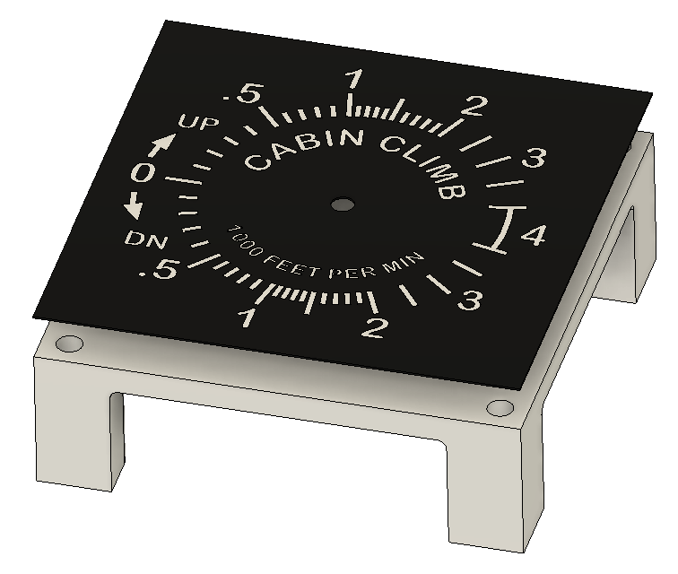</td>
</tr>
</tbody>
<tbody>
<tr>
<td width="55%"><b>4.</b> Press an <b>MR52ZZ</b> bearing into the top part.</td>
<td align="center">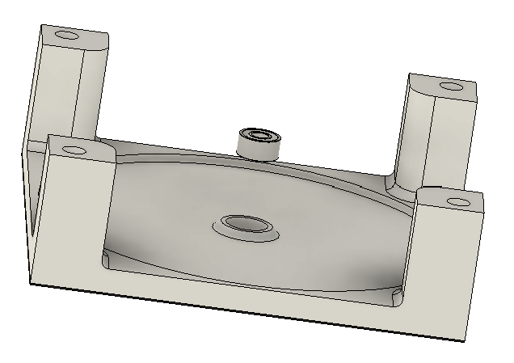</td>
</tr>
</tbody>
<tbody>
<tr>
<td width="55%"><b>5.</b> Fit the two <b>LED strips</b> onto the <b>backlight</b> part and bring their leads out. The two are wired in parallel and the <b>820 Ω resistor</b> goes in the lead feeding them - see <a href="#backlight">Backlight</a>. They have to go on before the part is screwed on in the next step.</td>
<td align="center">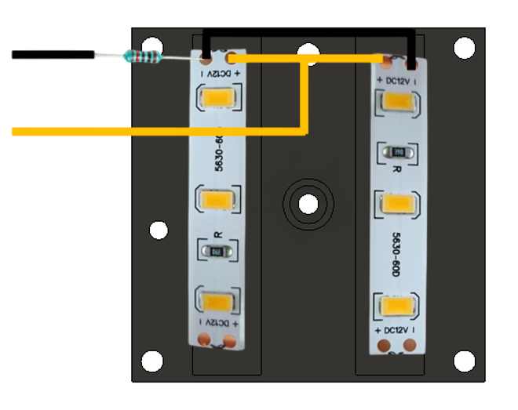</td>
</tr>
</tbody>
<tbody>
<tr>
<td width="55%"><b>6.</b> Screw the <b>backlight</b> part on with 4× DH M3×8.</td>
<td align="center">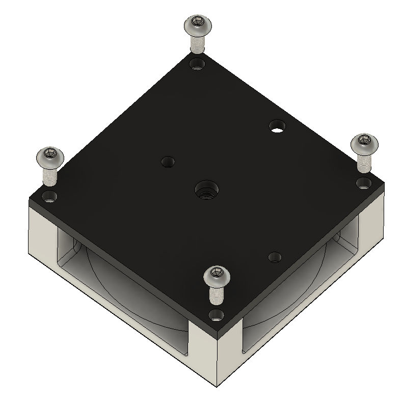</td>
</tr>
</tbody>
<tbody>
<tr>
<td width="55%"><b>7.</b> Press the second <b>MR52ZZ</b> bearing into the backlight part.</td>
<td align="center">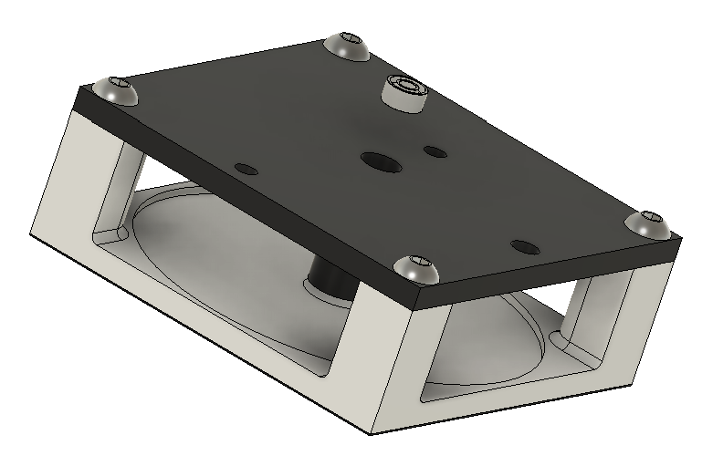</td>
</tr>
</tbody>
<tbody>
<tr>
<td width="55%"><b>8.</b> Push the <b>acrylic rod</b> through both bearings. I used a 26 mm length.</td>
<td align="center">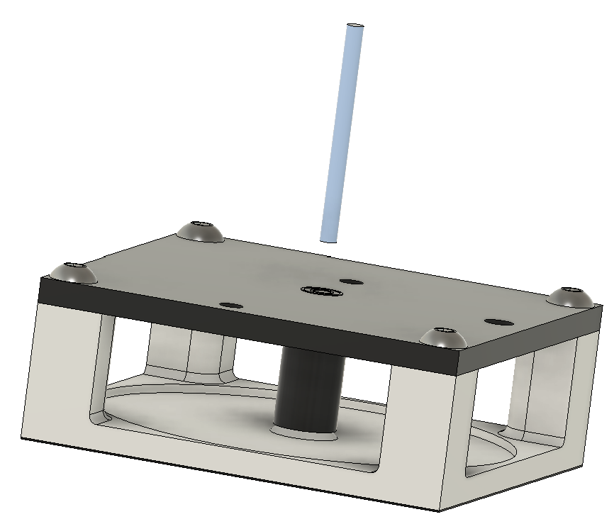</td>
</tr>
</tbody>
<tbody>
<tr>
<td width="55%"><b>9.</b> From the front, glue the white <b>needle</b> onto the rod with super glue.</td>
<td align="center">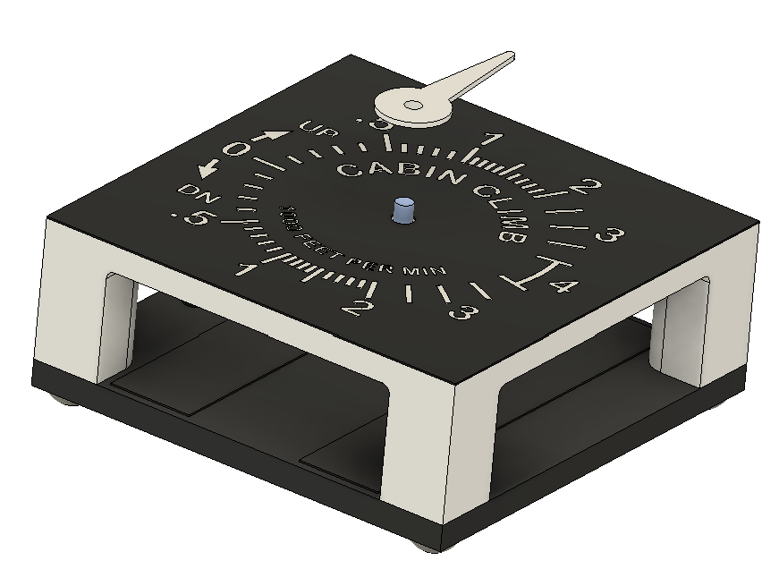</td>
</tr>
</tbody>
<tbody>
<tr>
<td width="55%"><b>10.</b> Glue the black <b>centre cap</b> onto the needle.</td>
<td align="center">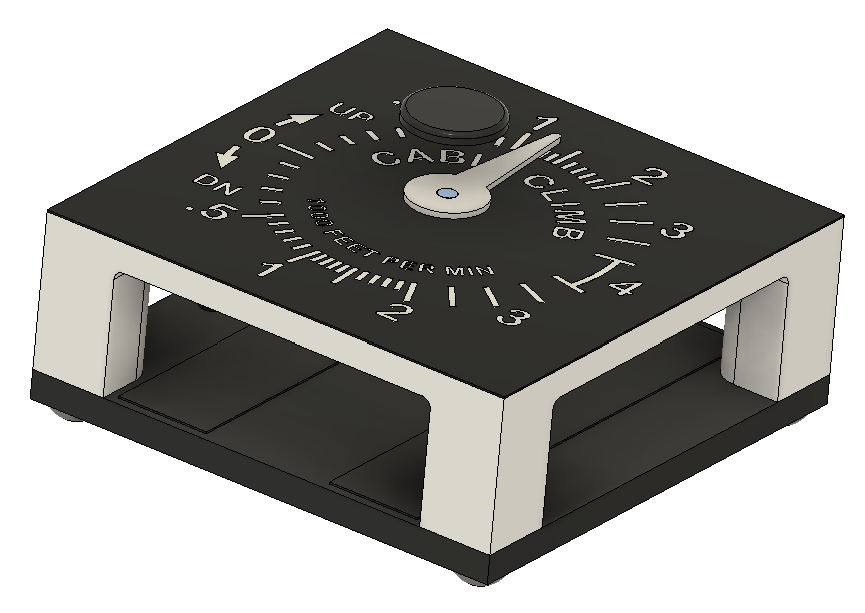</td>
</tr>
</tbody>
<tbody>
<tr>
<td width="55%"><b>11.</b> From the back, glue the <b>7-tooth gear</b> onto the acrylic rod.</td>
<td align="center">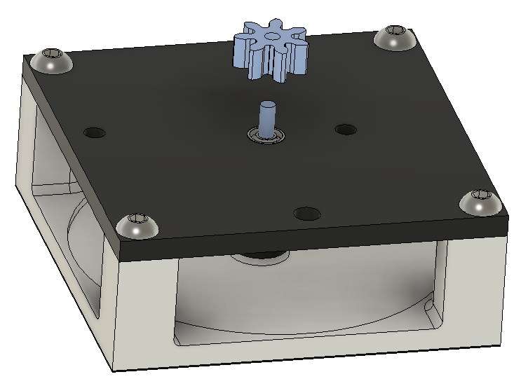</td>
</tr>
</tbody>
<tbody>
<tr>
<td width="55%"><b>12.</b> Put the <b>cover</b> with its servo in place, so that the two gears mesh.</td>
<td align="center">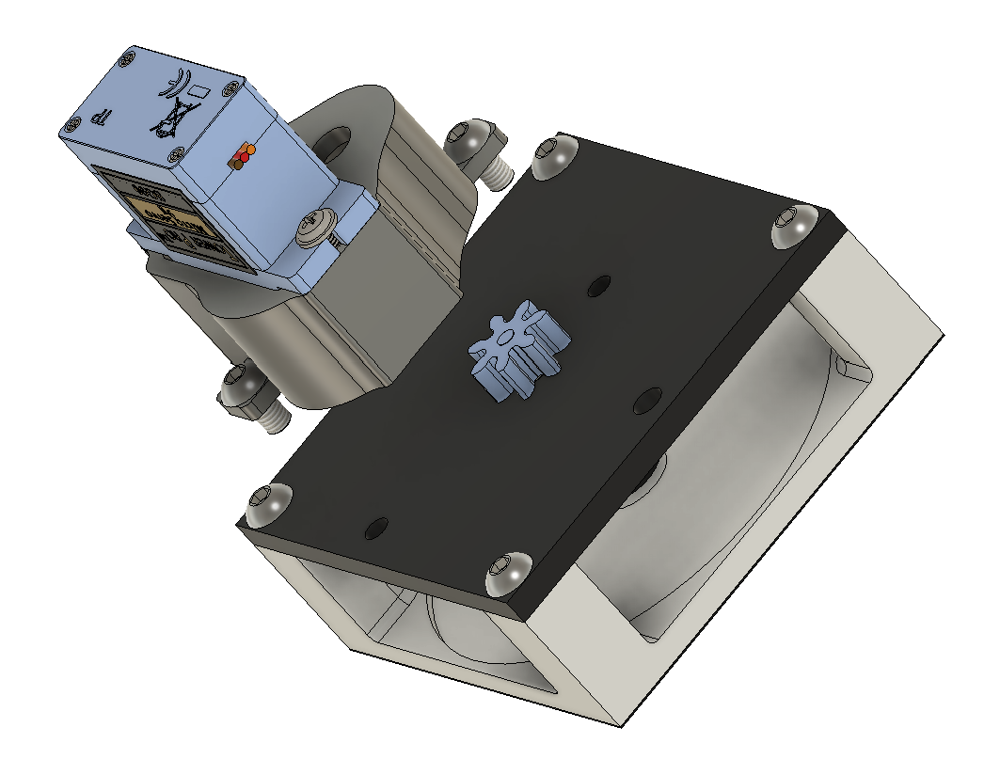</td>
</tr>
</tbody>
<tbody>
<tr>
<td width="55%"><b>13.</b> Screw the cover down with 2× DH M3×5.</td>
<td align="center"></td>
</tr>
</tbody>
<tbody>
<tr>
<td width="55%"><b>14.</b> Push the white <b>LED</b> - the one with the 150 Ω resistor - into the hole in the cover, beside the servo.</td>
<td align="center">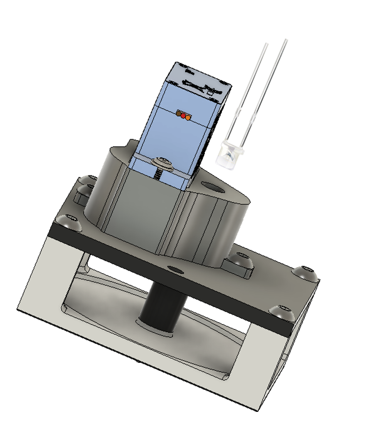</td>
</tr>
</tbody>
</table>
