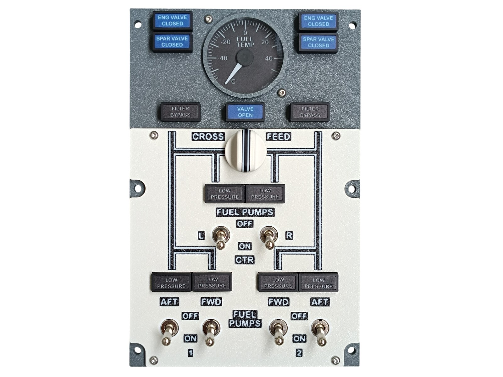
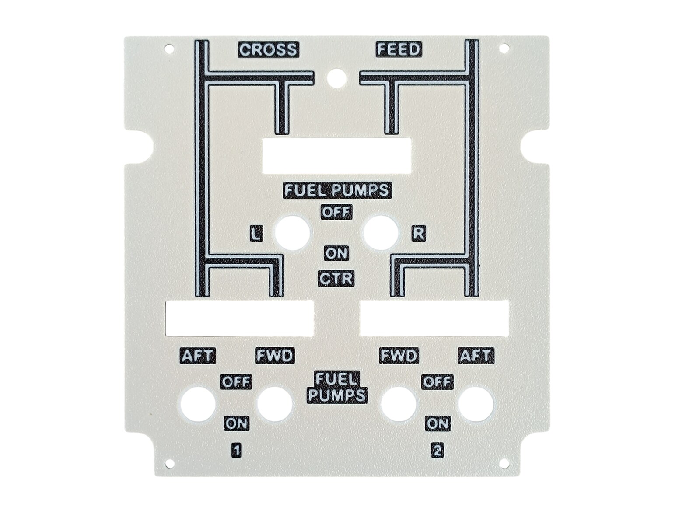
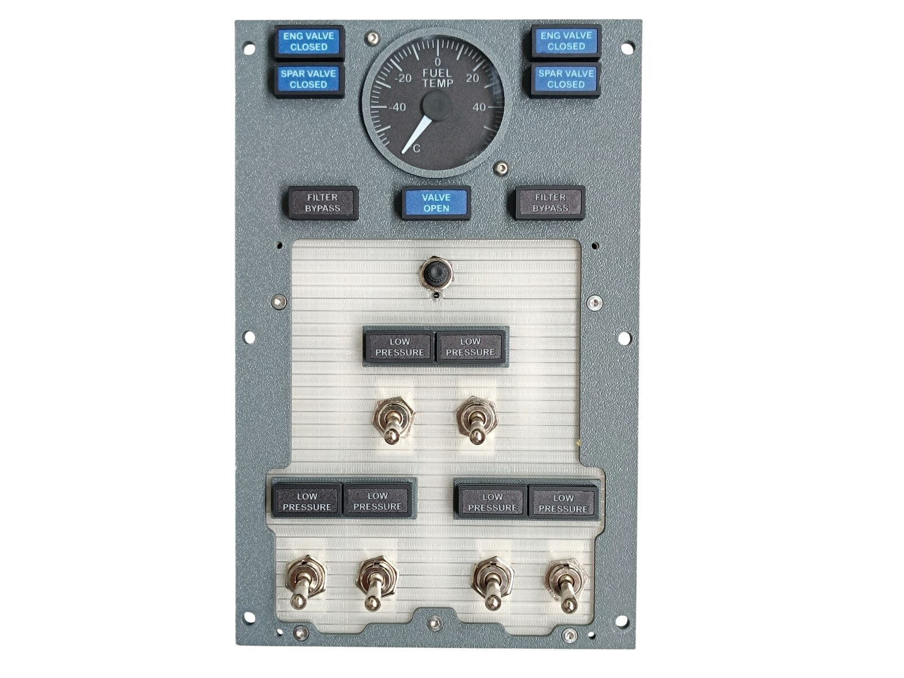
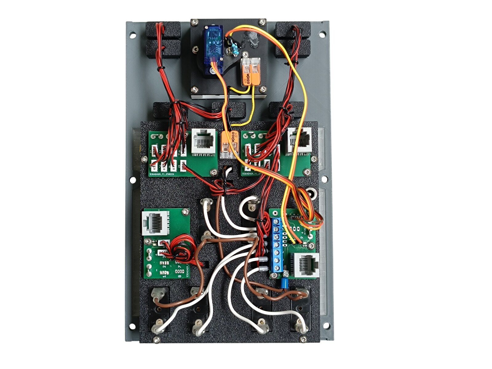
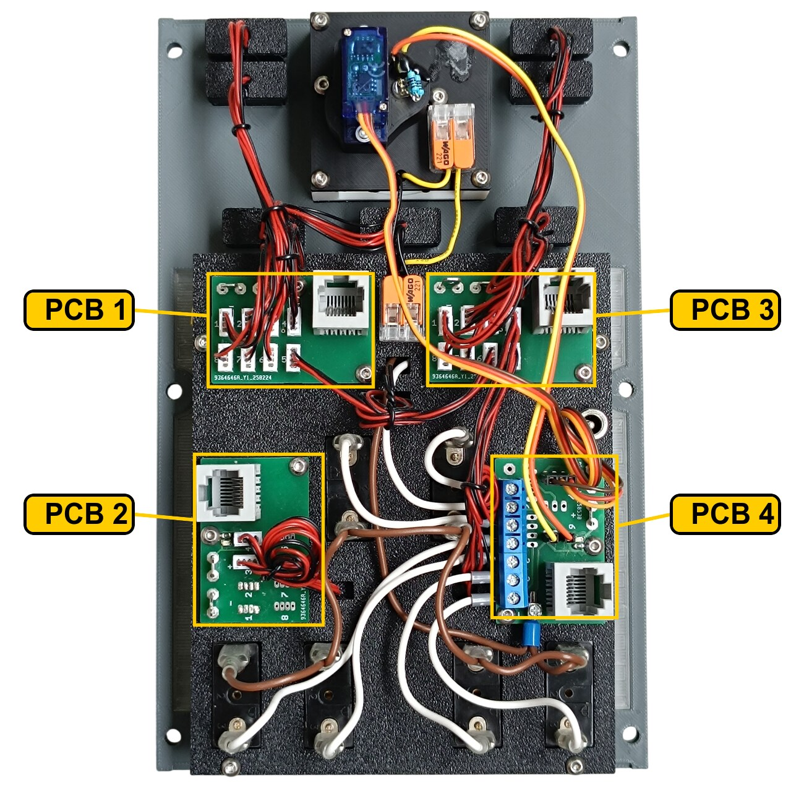
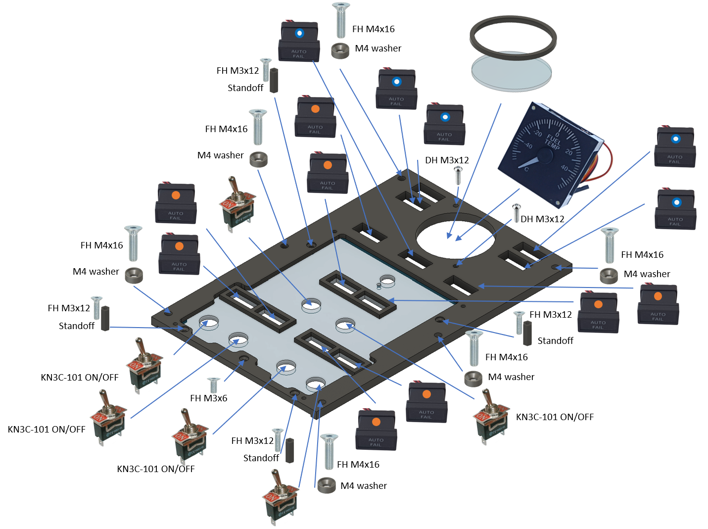
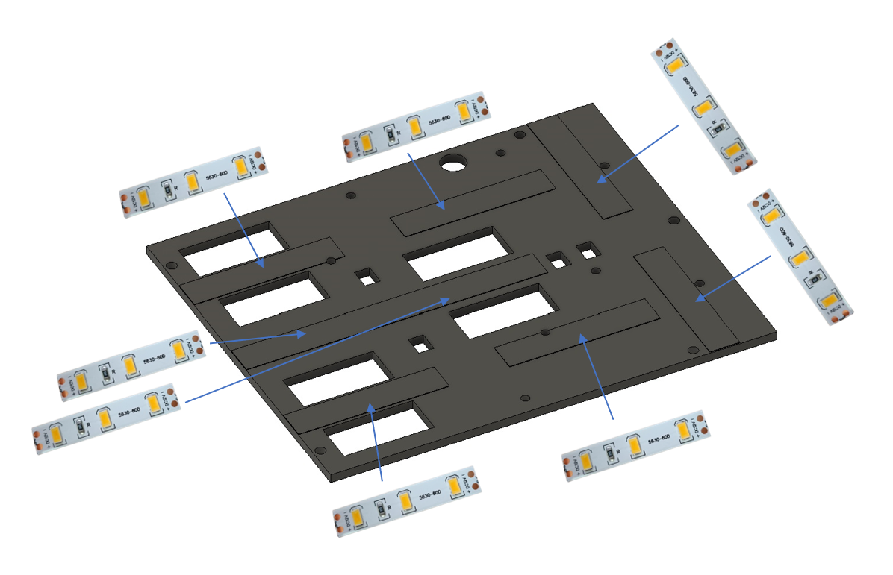
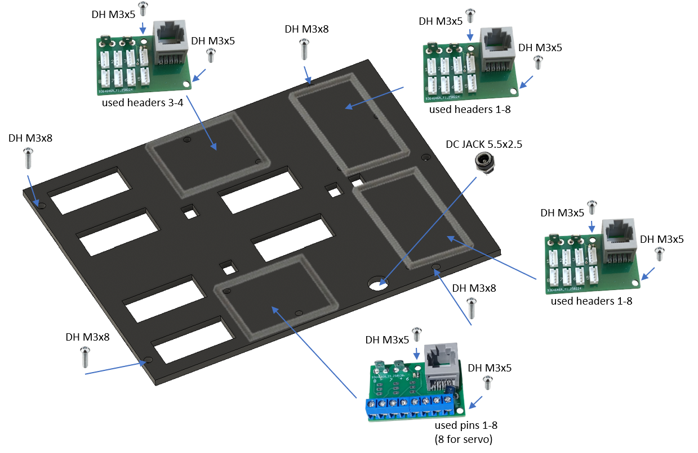
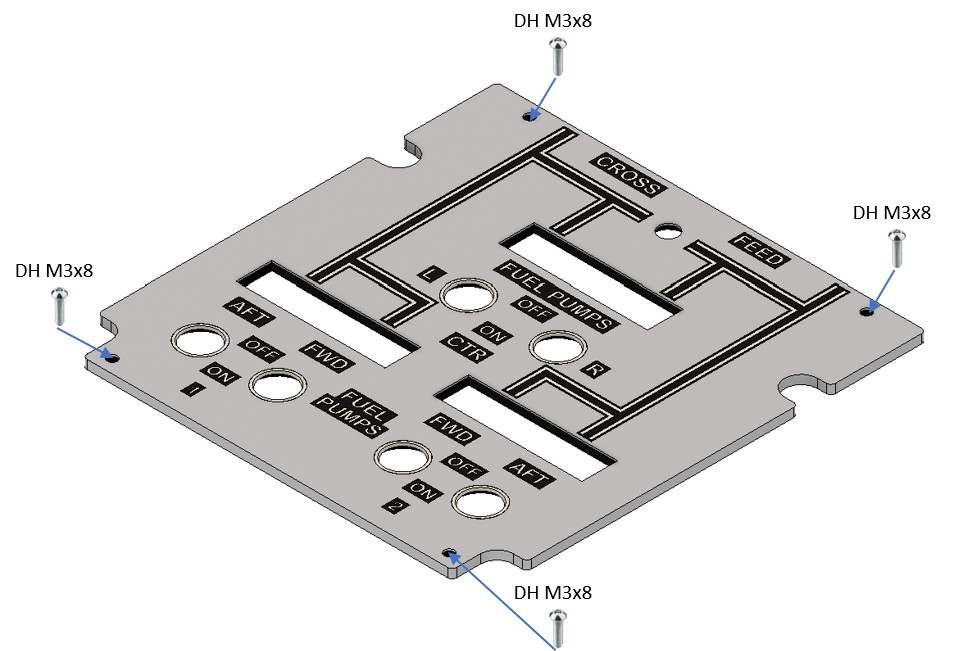

# 22. Fuel Control Panel

[📦 Download the printable model on MakerWorld](https://makerworld.com/en/models/3260961-boeing-737-overhead-fuel-control-panel)

[← Back to model list](README.md)

---

## Photos

<table>
<tbody>
<tr>
<td align="center" width="50%"> Finished panel</td>
<td align="center" width="50%"> Top panel, printed and UV printed</td>
</tr>
</tbody>
<tbody>
<tr>
<td align="center" width="50%"> The annunciators, the gauge and the diffuser with the switches, before the top panel goes on</td>
<td align="center" width="50%"> Rear side - the four PCBs, the gauge and the DC jack</td>
</tr>
</tbody>
</table>

---

## Filament

| | Colour | Filament |
|---|---|---|
|  | Dark Gray | C-Tech Premium Line PLA RAL7011 |
|  | Bone White | Bambu PLA Matte Bone White (11103) |
|  | Transparent | Filament PM PLA Transparent |
|  | White | Bambu PLA Basic Jade White (10100) |
|  | Black | Bambu PLA Basic Black (10101) |

---

## 3D Printed Parts

| Qty | Part | Notes |
|---:|---|---|
| 1× | Top panel | print on a **Textured** PEI plate |
| 1× | Bottom panel | print on a **Textured** PEI plate |
| 1× | Diffuser panel | print on a **Smooth** PEI plate |
| 1× | Backlight panel | |
| 1× | Bezel | the ring around the gauge window |
| 4× | PCB frame | |
| 6× | M4 washer | |
| 4× | Standoff 16 mm | |

---

## Switches and Buttons

| Qty | Type |
|---:|---|
| 6× | KN3(C)-101 or KN3(C)-102, ON/OFF |
| 1× | Rotary switch SR16, 8 positions |

The six toggle switches are the FUEL PUMPS switches, the rotary switch is CROSS FEED.

---

## Rotary Knobs

The knob for the CROSS FEED selector is a separate model shared with the other panels - it is **not included** in this download.

| Qty | Part |
|---:|---|
| 1× | Fuel cross feed knob |
| 1× | Fuel cross feed knob indicator |

| | |
|---|---|
| 📦 Printable model | [Boeing 737 Overhead - Rotary Knobs](https://makerworld.com/en/models/3066127-boeing-737-overhead-rotary-knobs) |
| 🔧 Build notes | [Rotary Knobs](03-rotary-knobs.md) |

---

## Gauge

The FUEL TEMP instrument is a separate model shared with three other panels - it is **not included** in this download. The bezel and the acrylic window in front of it are part of this panel.

| | |
|---|---|
| 📦 Printable model | [Boeing 737 Overhead - Temperature and Climb Gauges](https://makerworld.com/en/models/3251829-boeing-737-overhead-temperature-and-climb-gauges) |
| 🔧 Build notes | [Temperature and Climb Gauges](21-temperature-and-climb-gauges.md) |

The needle to fit is **hand-fuel_white + hand-fuel_black**, and the scale is the FUEL TEMP dial on the [UV print sheet](../uv-print.md). Its three connections are in [Wiring](#wiring).

---

## Screws

| Qty | Screw | Joins |
|---:|---|---|
| 1× | Flat head M3×6 | bottom + diffuser |
| 4× | Flat head M3×12 | bottom + standoff |
| 6× | Flat head M4×16 | bottom + main frame |
| 8× | Dome head M3×5 | PCB + backlight |
| 8× | Dome head M3×8 | top + bottom, backlight + standoff |
| 2× | Dome head M3×12 | bottom + gauge |

The six M4×16 screws each take one of the printed M4 washers.

---

## Annunciators

| Qty | Type |
|---:|---|
| 8× | Black background, yellow LED |
| 5× | Blue background, white LED, two brightness levels (DIM/BRIGHT) |

The yellow ones are the six LOW PRESSURE and the two FILTER BYPASS annunciators. The blue ones are ENG VALVE CLOSED and SPAR VALVE CLOSED, twice each, and VALVE OPEN.

The annunciators are a separate model shared with the other panels - they are **not included** in this download.

| | |
|---|---|
| 📦 Printable model | [Boeing 737 Overhead - Annunciators](https://makerworld.com/en/models/3121595-boeing-737-overhead-annunciators) |
| 🔧 Build notes | [Annunciators](02-annunciators.md) |
| 🔌 PCB, BOM and wiring | [Annunciator PCB](../pcb/annunciator.md) |

---

## CNC Cut Files

| Qty | File | Size |
|---:|---|---|
| 1× | cnc_gauge_48-8.dxf | Ø 48.8 mm |

This is the round window that goes in front of the FUEL TEMP gauge, behind the bezel. The drawing, the material and the cutting notes are on the [CNC Cut Files](../cnc-cut.md) page.

---

## PCB

| Qty | PCB | Connections used | Gerber files |
|---:|---|---|---|
| 3× | [RJ45 LED Driver](../pcb/rj45-driver.md) | headers 1–8 on two of them, 3–4 on the third | [📥 PCB_RJ45_Driver.zip](https://raw.githubusercontent.com/om7ea/B737/main/PCB/PCB_RJ45_Driver.zip) |
| 1× | [RJ45 Direct](../pcb/rj45-direct.md) | pins 1–8 | [📥 PCB_RJ45_Direct.zip](https://raw.githubusercontent.com/om7ea/B737/main/PCB/PCB_RJ45_Direct.zip) |

Mounting is shown in [step 3](#3-backlight-panel---pcbs-and-dc-jack) of the assembly diagram. Which switch and which annunciator each connection carries is in [Wiring](#wiring).

---

## Wiring

Everything on this panel reaches the same MEGA 2560 - `Overhead_1b`. The panel takes **four** Ethernet patch cables to the [RJ45 Hub Shield](../pcb/rj45-hub-shield.md).

| PCB | Patch cable goes to | Connections used |
|---|---|---|
| **PCB 1** | socket **D0** on **Overhead_1b** | headers 1–8 |
| **PCB 2** | socket **D1** on **Overhead_1b** | headers 3–4 |
| **PCB 3** | socket **D2** on **Overhead_1b** | headers 1–8 |
| **PCB 4** | socket **D3** on **Overhead_1b** | pins 1–8 |

The socket labels **D0–D6**, **A1** and **A2** are silkscreened on the hub shield.

The rear of the panel. **PCB 1** and **PCB 3** are the pair in the middle, one for each half of the panel, and **PCB 2** below them is mounted on its side with only two of its headers populated. **PCB 4** is the board with the blue eight-way screw terminal; the black pin header beside it is where the servo plugs in.

### PCB 1 - socket D0 on Overhead_1b

| Header | Annunciator |
|---:|---|
| 1 | ENG VALVE CLOSED - right, bright |
| 2 | SPAR VALVE CLOSED - right, dim |
| 3 | VALVE OPEN - bright |
| 4 | FILTER BYPASS - right |
| 5 | LOW PRESSURE - CTR R |
| 6 | VALVE OPEN - dim |
| 7 | SPAR VALVE CLOSED - right, bright |
| 8 | ENG VALVE CLOSED - right, dim |

### PCB 2 - socket D1 on Overhead_1b

| Header | Annunciator |
|---:|---|
| 3 | LOW PRESSURE - 2 AFT |
| 4 | LOW PRESSURE - 2 FWD |

Headers 1, 2 and 5 to 8 are not populated.

### PCB 3 - socket D2 on Overhead_1b

| Header | Annunciator |
|---:|---|
| 1 | ENG VALVE CLOSED - left, bright |
| 2 | SPAR VALVE CLOSED - left, bright |
| 3 | FILTER BYPASS - left |
| 4 | LOW PRESSURE - 1 FWD |
| 5 | LOW PRESSURE - 1 AFT |
| 6 | LOW PRESSURE - CTR L |
| 7 | SPAR VALVE CLOSED - left, dim |
| 8 | ENG VALVE CLOSED - left, dim |

All six LOW PRESSURE annunciators carry the same printed text. Each one sits directly above the pump switch it belongs to, and the qualifier in the tables is the marking beside that switch: **CTR L** and **CTR R** for the centre tank pumps, **1 FWD**, **1 AFT**, **2 FWD** and **2 AFT** for the four below.

> **Note**
> The four VALVE CLOSED annunciators are driven on their **dim** input only. They are the dual brightness type, so each has a second connector that feeds the LED without the 150 Ω resistor - see [Annunciator PCB](../pcb/annunciator.md). Their bright inputs are wired as well, on headers 1 and 7 of PCB 1 and 1 and 2 of PCB 3, but those four headers have no configuration in the [MobiFlight project](../mobiflight.md), so the four lamps only ever light dim. VALVE OPEN is the one annunciator on this panel that is driven at both levels.

### PCB 4 - socket D3 on Overhead_1b

| Pin | Switch |
|---:|---|
| 1 | FUEL PUMPS - 1 AFT |
| 2 | FUEL PUMPS - 1 FWD |
| 3 | FUEL PUMPS - 2 FWD |
| 4 | FUEL PUMPS - 2 AFT |
| 5 | FUEL PUMPS - CTR R |
| 6 | CROSS FEED |
| 7 | FUEL PUMPS - CTR L |
| 8 | FUEL TEMP gauge - servo signal |

Pins 1 to 4 follow the four lower switches left to right as they appear on the front of the panel.

The CROSS FEED selector is wired as a two-position switch: one contact of the SR16 goes to pin 6, and the other seven positions stay unused.

The gauge takes two more connections from this board that are not on the screw terminal: the servo's **+5 V** and **GND**, and the **+5 V** and **GND** of the needle LED, all from the pin headers. Its scale backlight runs on 12 V from this panel's own backlighting, through the lever-type splice connector above the gauge. The servo plug has to be rewired before it will work - see [Temperature and Climb Gauges](21-temperature-and-climb-gauges.md#wiring).

**All the switches share a single ground return.** Each switch takes one of its terminals to its own pin on the Direct PCB. The opposite terminals are commoned - daisy-chained from one switch to the next - and the chain ends at a **-** (ground) contact.

---

## Backlight

| Qty | Part |
|---:|---|
| 8× | LED strip |
| 1× | DC jack 5.5 × 2.5 mm |

Powered from the **12 V** supply - see [Power supply](../system-overview.md#power-supply).

---

## Assembly Diagram

Screw abbreviations used in the diagrams: **FH** = flat head, **DH** = dome head.

### 1. Bottom panel - diffuser, annunciators, gauge and switches

The six M4×16 screws in this drawing are the ones that later hold the finished panel on the main frame.

### 2. Backlight panel - LED strips

### 3. Backlight panel - PCBs and DC jack

### 4. Top panel

