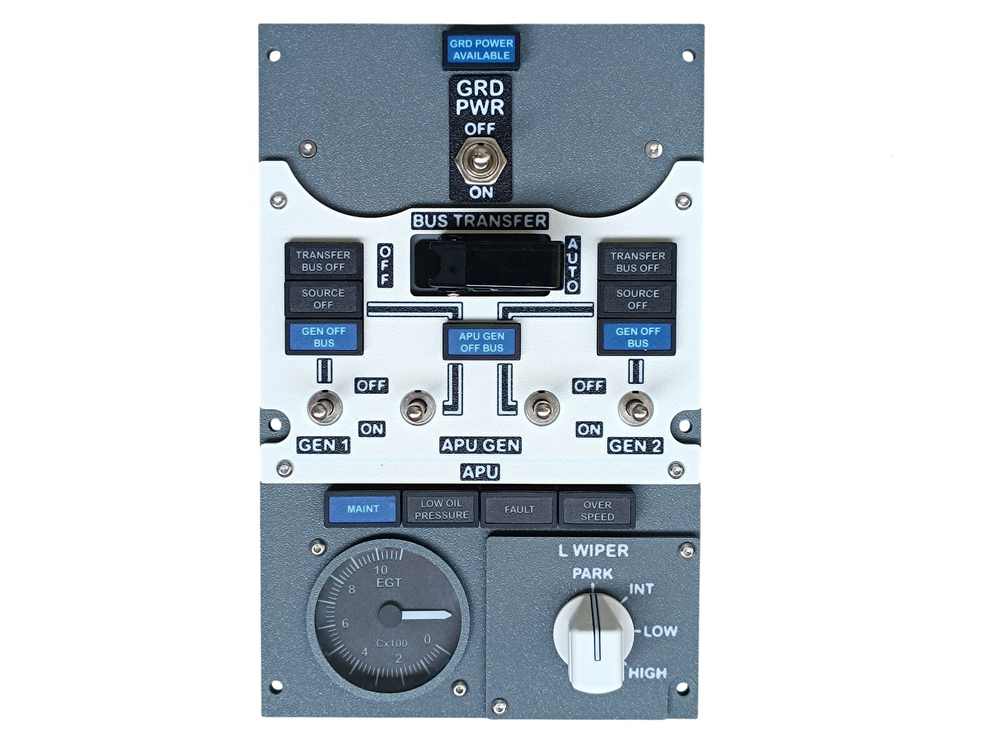
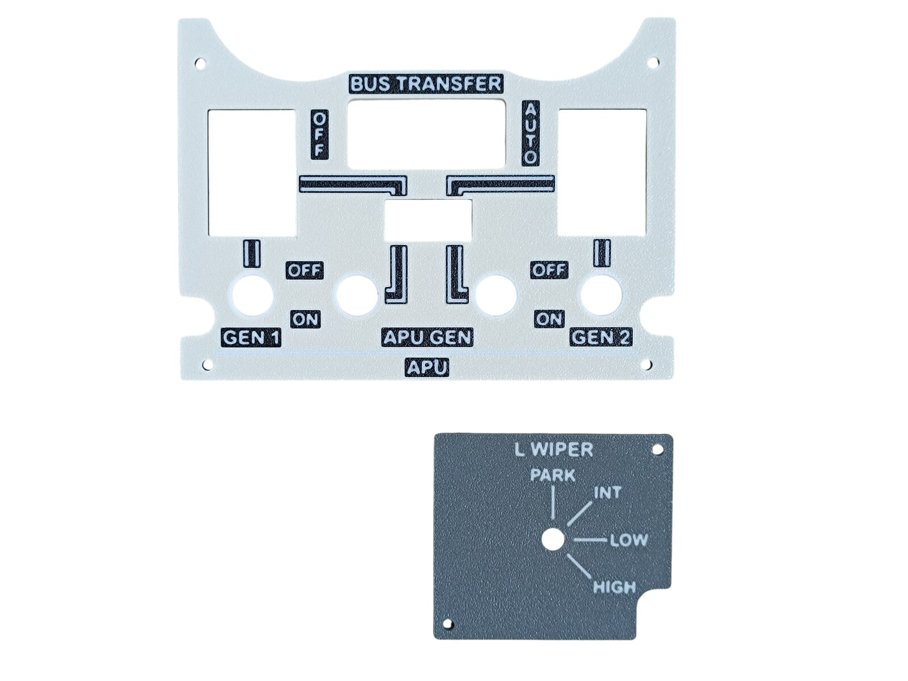
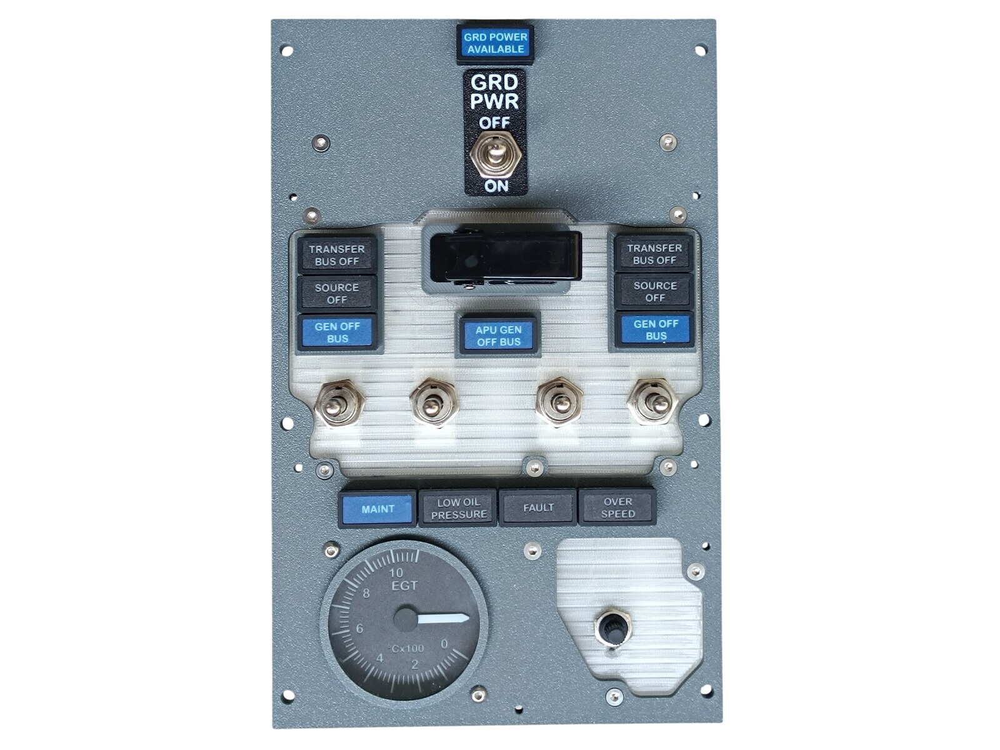
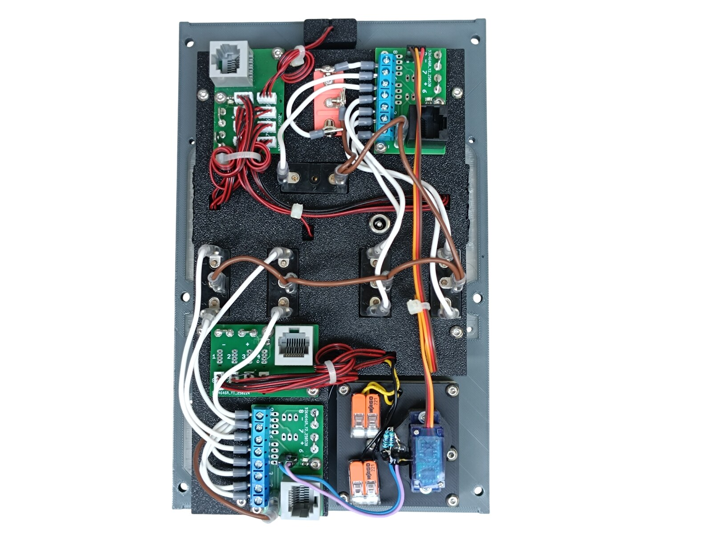
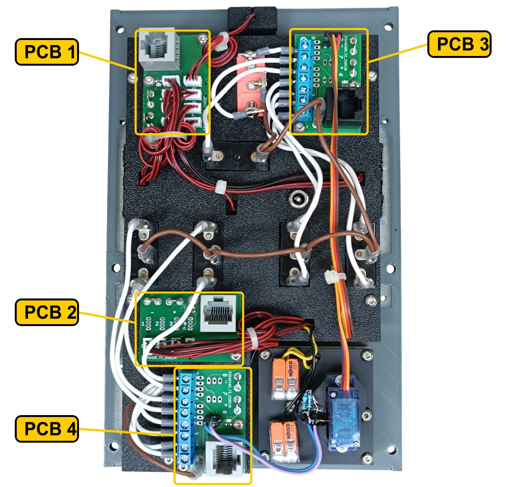
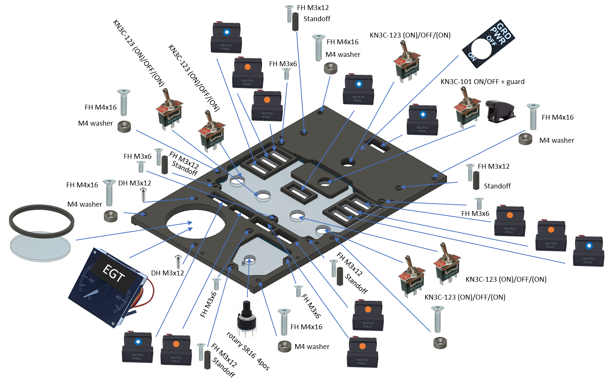
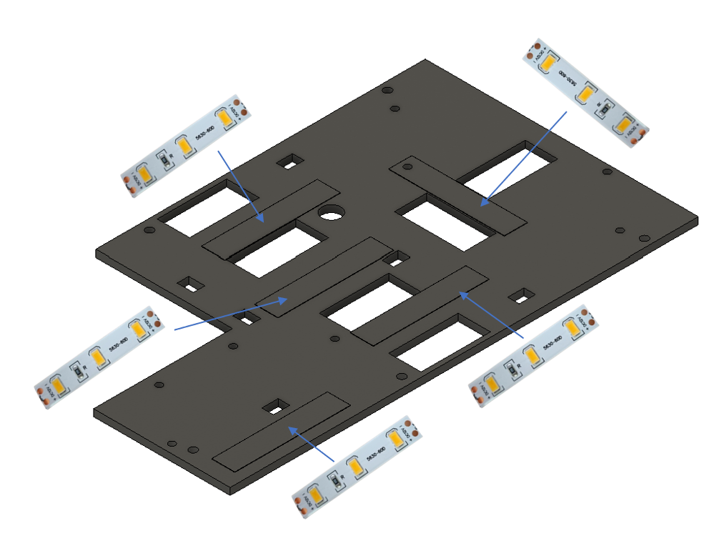
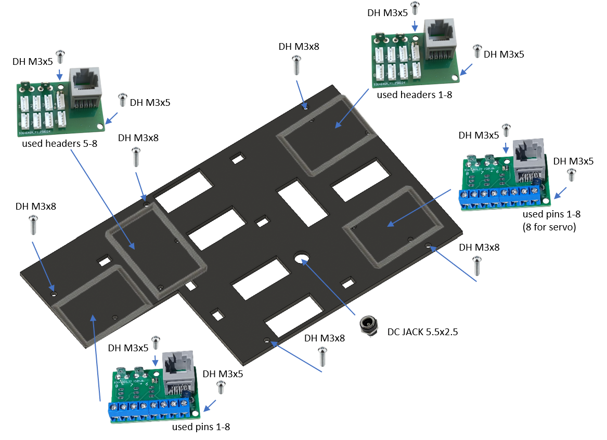
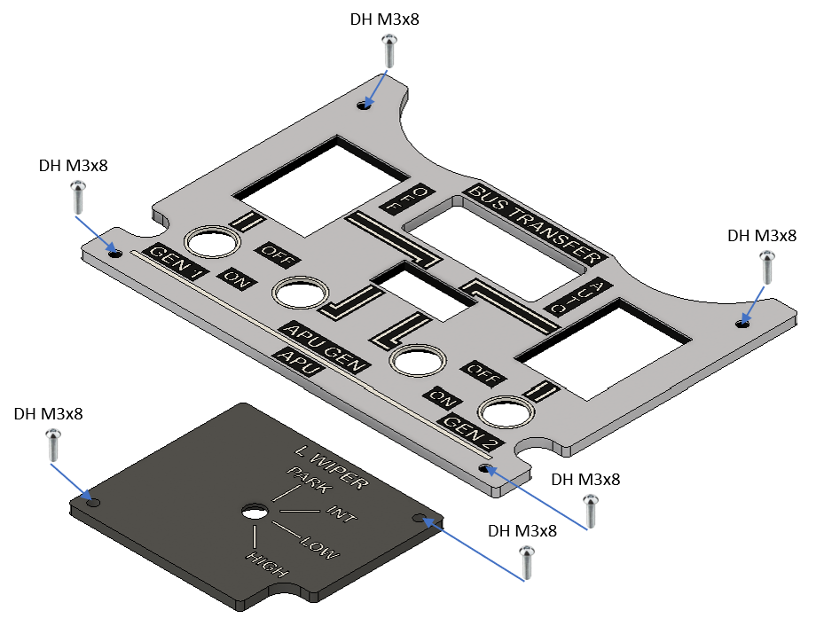

# 23. Generator Bus Panel

[📦 Download the printable model on MakerWorld](https://makerworld.com/en/models/3275951-boeing-737-overhead-generator-bus-panel)

[← Back to model list](README.md)

---

## Photos

<table>
<tbody>
<tr>
<td align="center" width="50%"> Finished panel</td>
<td align="center" width="50%"> The two top panels - Bone White with the lettering in Black and Jade White, and the Dark Gray L WIPER plate</td>
</tr>
</tbody>
<tbody>
<tr>
<td align="center" width="50%"> The annunciators, the gauge, the switches and the two diffusers, before the top panels go on</td>
<td align="center" width="50%"> Rear side - the four PCBs, the gauge servo and the DC jack</td>
</tr>
</tbody>
</table>

---

## Filament

| | Colour | Filament |
|---|---|---|
|  | Dark Gray | C-Tech Premium Line PLA RAL7011 |
|  | Bone White | Bambu PLA Matte Bone White (11103) |
|  | Transparent | Filament PM PLA Transparent |
|  | White | Bambu PLA Basic Jade White (10100) |
|  | Black | Bambu PLA Basic Black (10101) |

---

## 3D Printed Parts

| Qty | Part | Notes |
|---:|---|---|
| 1× | Top panel 1 | the Bone White plate carrying the switches; print on a **Textured** PEI plate |
| 1× | Top panel 2 | the Dark Gray L WIPER plate; print on a **Textured** PEI plate |
| 1× | Bottom panel | print on a **Textured** PEI plate |
| 1× | GRD PWR plate | the small plate around the ground power switch; print on a **Textured** PEI plate |
| 1× | Diffuser panel 1 | print on a **Smooth** PEI plate |
| 1× | Diffuser panel 2 | print on a **Smooth** PEI plate |
| 1× | Backlight panel | |
| 1× | Bezel | the ring around the gauge window |
| 4× | PCB frame | |
| 6× | M4 washer | |
| 5× | Standoff 16 mm | |

---

## Switches and Buttons

| Qty | Type |
|---:|---|
| 5× | KN3(C)-123, (ON)/OFF/(ON) |
| 1× | KN3(C)-101 or KN3(C)-102, ON/OFF |
| 1× | Rotary switch SR16, 4 positions |
| 1× | Toggle switch's safety aircraft guard, black |

The five three-position switches are GRD PWR, GEN 1, GEN 2 and the two APU GEN switches - all of them spring back to the centre from both ends. The two-position switch is BUS TRANSFER, and the guard goes on it. The rotary switch is L WIPER.

---

## Rotary Knobs

The knob for the L WIPER selector is a separate model shared with the other panels - it is **not included** in this download.

| Qty | Part |
|---:|---|
| 1× | General knob, splined shaft |
| 1× | General knob indicator |

| | |
|---|---|
| 📦 Printable model | [Boeing 737 Overhead - Rotary Knobs](https://makerworld.com/en/models/3066127-boeing-737-overhead-rotary-knobs) |
| 🔧 Build notes | [Rotary Knobs](03-rotary-knobs.md) |

---

## Gauge

The EGT instrument is a separate model shared with three other panels - it is **not included** in this download. The bezel that rings it is part of this panel; the acrylic window between the two is not printed at all, it is cut - see [CNC Cut Files](#cnc-cut-files).

| | |
|---|---|
| 📦 Printable model | [Boeing 737 Overhead - Temperature and Climb Gauges](https://makerworld.com/en/models/3251829-boeing-737-overhead-temperature-and-climb-gauges) |
| 🔧 Build notes | [Temperature and Climb Gauges](21-temperature-and-climb-gauges.md) |

The needle to fit is **hand-egt-white + hand-egt-black**, and the scale is the EGT dial on the [UV print sheet](../uv-print.md). Its connections are in [Wiring](#wiring).

---

## Screws

| Qty | Screw | Joins |
|---:|---|---|
| 5× | Flat head M3×6 | bottom + diffusers |
| 5× | Flat head M3×12 | bottom + standoff |
| 6× | Flat head M4×16 | bottom + main frame |
| 8× | Dome head M3×5 | PCB + backlight |
| 11× | Dome head M3×8 | top + bottom, backlight + standoff |
| 2× | Dome head M3×12 | bottom + gauge |

The six M4×16 screws each take one of the printed M4 washers.

---

## Annunciators

| Qty | Type |
|---:|---|
| 7× | Black background, yellow LED |
| 5× | Blue background, white LED |

The yellow ones are TRANSFER BUS OFF and SOURCE OFF, twice each, and LOW OIL PRESSURE, FAULT and OVER SPEED. The blue ones are GRD POWER AVAILABLE, APU GEN OFF BUS, MAINT and GEN OFF BUS twice.

The annunciators are a separate model shared with the other panels - they are **not included** in this download.

| | |
|---|---|
| 📦 Printable model | [Boeing 737 Overhead - Annunciators](https://makerworld.com/en/models/3121595-boeing-737-overhead-annunciators) |
| 🔧 Build notes | [Annunciators](02-annunciators.md) |
| 🔌 PCB, BOM and wiring | [Annunciator PCB](../pcb/annunciator.md) |

---

## CNC Cut Files

| Qty | File | Size |
|---:|---|---|
| 1× | cnc_gauge_48-8.dxf | Ø 48.8 mm |

This is the round window that goes in front of the EGT gauge, behind the bezel. The drawing, the material and the cutting notes are on the [CNC Cut Files](../cnc-cut.md) page.

The window is glued to the bezel.

> **Note**
> Do not use cyanoacrylate (superglue) for that joint. As it cures it leaves a white film on the surface around the joint, not only where the glue was applied, and on a clear window it is impossible to miss. A two-part epoxy is a good choice instead.

---

## PCB

| Qty | PCB | Connections used | Gerber files |
|---:|---|---|---|
| 2× | [RJ45 LED Driver](../pcb/rj45-driver.md) | headers 1–8 on one, 5–8 on the other | [📥 PCB_RJ45_Driver.zip](https://raw.githubusercontent.com/om7ea/B737/main/PCB/PCB_RJ45_Driver.zip) |
| 2× | [RJ45 Direct](../pcb/rj45-direct.md) | pins 1–8 | [📥 PCB_RJ45_Direct.zip](https://raw.githubusercontent.com/om7ea/B737/main/PCB/PCB_RJ45_Direct.zip) |

Mounting is shown in [step 3](#3-backlight-panel---pcbs-and-dc-jack) of the assembly diagram. Which switch and which annunciator each connection carries is in [Wiring](#wiring).

---

## Wiring

Everything on this panel reaches the same MEGA 2560 - `Overhead_2b`. The panel takes **four** Ethernet patch cables to the [RJ45 Hub Shield](../pcb/rj45-hub-shield.md).

| PCB | Patch cable goes to | Connections used |
|---|---|---|
| **PCB 1** | socket **D1** on **Overhead_2b** | headers 1–8 |
| **PCB 2** | socket **D6** on **Overhead_2b** | headers 5–8 |
| **PCB 3** | socket **D0** on **Overhead_2b** | pins 1–8 |
| **PCB 4** | socket **D5** on **Overhead_2b** | pins 1–8 |

The socket labels **D0–D6**, **A1** and **A2** are silkscreened on the hub shield.

The rear of the panel. **PCB 1** and **PCB 2** are the two boards with the small white connectors and the red-and-black cables running off to the annunciators; **PCB 1** has all eight of them populated, **PCB 2** only the lower row. **PCB 3** and **PCB 4** are the two boards with the blue eight-way screw terminal - the three-wire cable of the gauge servo runs the length of the panel to **PCB 3**.

### PCB 1 - socket D1 on Overhead_2b

| Header | Annunciator |
|---:|---|
| 1 | SOURCE OFF - left |
| 2 | TRANSFER BUS OFF - left |
| 3 | SOURCE OFF - right |
| 4 | TRANSFER BUS OFF - right |
| 5 | GRD POWER AVAILABLE |
| 6 | GEN OFF BUS - right |
| 7 | APU GEN OFF BUS |
| 8 | GEN OFF BUS - left |

TRANSFER BUS OFF, SOURCE OFF and GEN OFF BUS are each printed twice, once on either side of the panel. **Left** is the pair above the GEN 1 switch, **right** the pair above GEN 2.

### PCB 2 - socket D6 on Overhead_2b

| Header | Annunciator |
|---:|---|
| 5 | MAINT |
| 6 | LOW OIL PRESSURE |
| 7 | OVER SPEED |
| 8 | FAULT |

Headers 1 to 4 are not populated.

### PCB 3 - socket D0 on Overhead_2b

| Pin | Switch |
|---:|---|
| 1 | GEN 1 - ON |
| 2 | GEN 1 - OFF |
| 3 | APU GEN - left, ON |
| 4 | APU GEN - left, OFF |
| 5 | BUS TRANSFER |
| 6 | GRD PWR - OFF |
| 7 | GRD PWR - ON |
| 8 | EGT gauge - servo signal |

### PCB 4 - socket D5 on Overhead_2b

| Pin | Switch |
|---:|---|
| 1 | L WIPER - HIGH |
| 2 | L WIPER - INT |
| 3 | L WIPER - LOW |
| 4 | L WIPER - PARK |
| 5 | APU GEN - right, ON |
| 6 | APU GEN - right, OFF |
| 7 | GEN 2 - ON |
| 8 | GEN 2 - OFF |

The two APU GEN switches share one printed label. **Left** is the one beside GEN 1, **right** the one beside GEN 2.

The gauge takes four more connections that do not go through a screw terminal, all of them from the pin headers: the servo's **+5 V** and **GND** from PCB 3, and the **+5 V** and **GND** of the needle LED from PCB 4. Its scale backlight runs on 12 V from this panel's own backlighting, through the two lever-type splice connectors beside the servo. The servo plug has to be rewired before it will work - see [Temperature and Climb Gauges](21-temperature-and-climb-gauges.md#wiring).

**All the switches share a single ground return.** Each switch takes one of its terminals to its own pin on the Direct PCB. The opposite terminals are commoned - daisy-chained from one switch to the next - and the chain ends at a **-** (ground) contact.

---

## Backlight

| Qty | Part | Reference |
|---:|---|---|
| 5× | LED strip | [Product I used](../../images/parts/AE_led_strip.png) |
| 1× | DC jack 5.5 × 2.5 mm | [Product I used](../../images/parts/AE_dc_jack.png) |

Powered from the **12 V** supply - see [Power supply](../system-overview.md#power-supply).

---

## Assembly Diagram

Screw abbreviations used in the diagrams: **FH** = flat head, **DH** = dome head.

### 1. Bottom panel - diffusers, annunciators, gauge and switches

The six M4×16 screws in this drawing are the ones that later hold the finished panel on the main frame.

### 2. Backlight panel - LED strips

### 3. Backlight panel - PCBs and DC jack

### 4. Top panels

