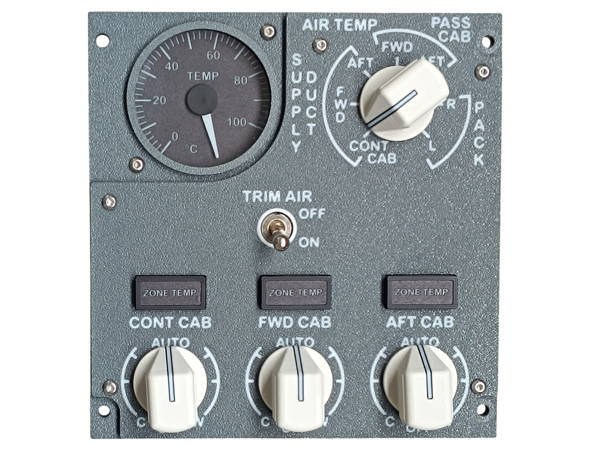
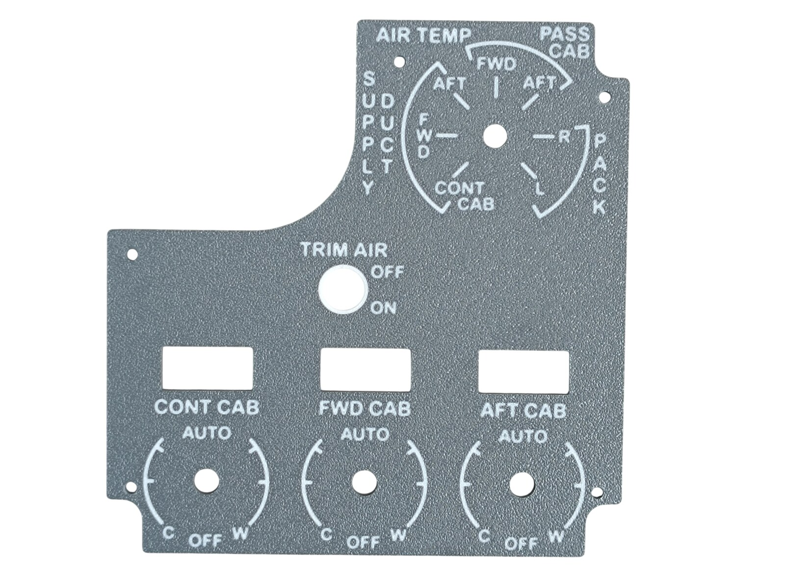
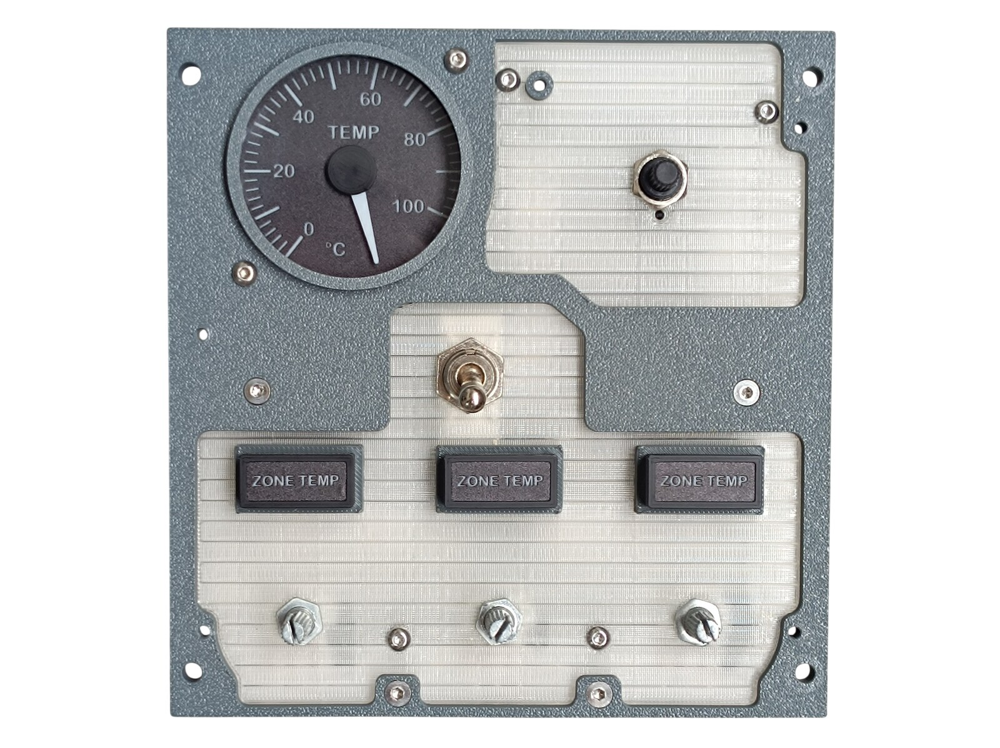
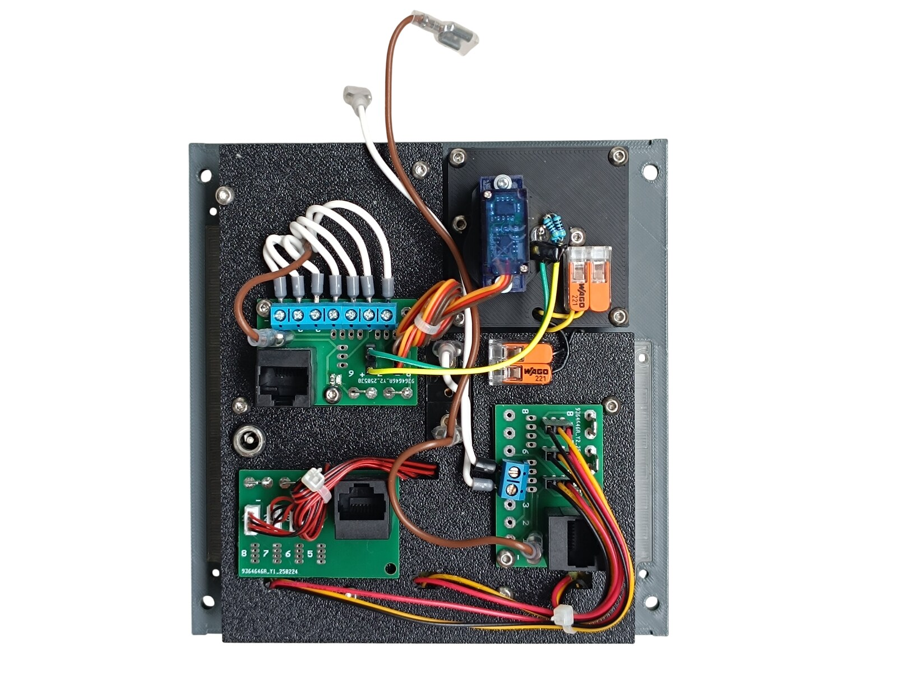
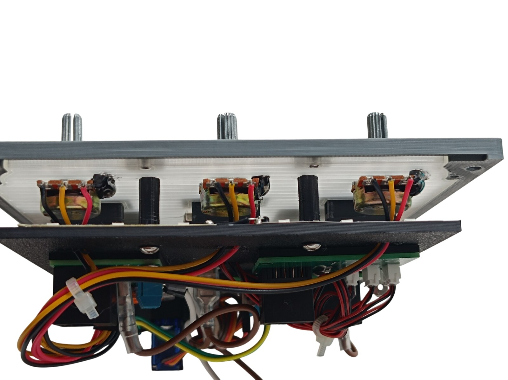
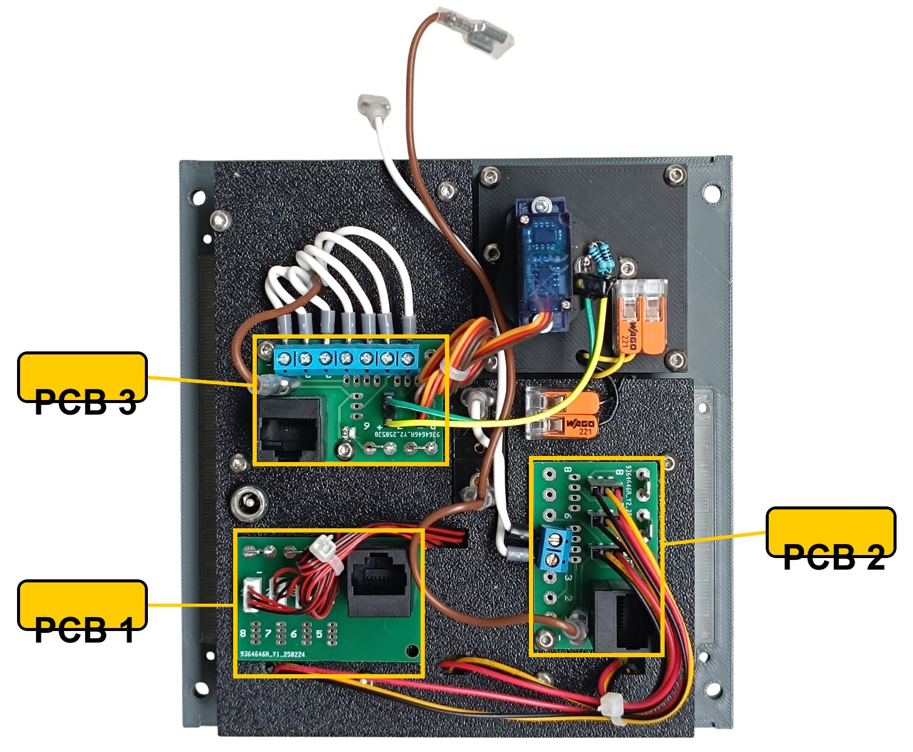
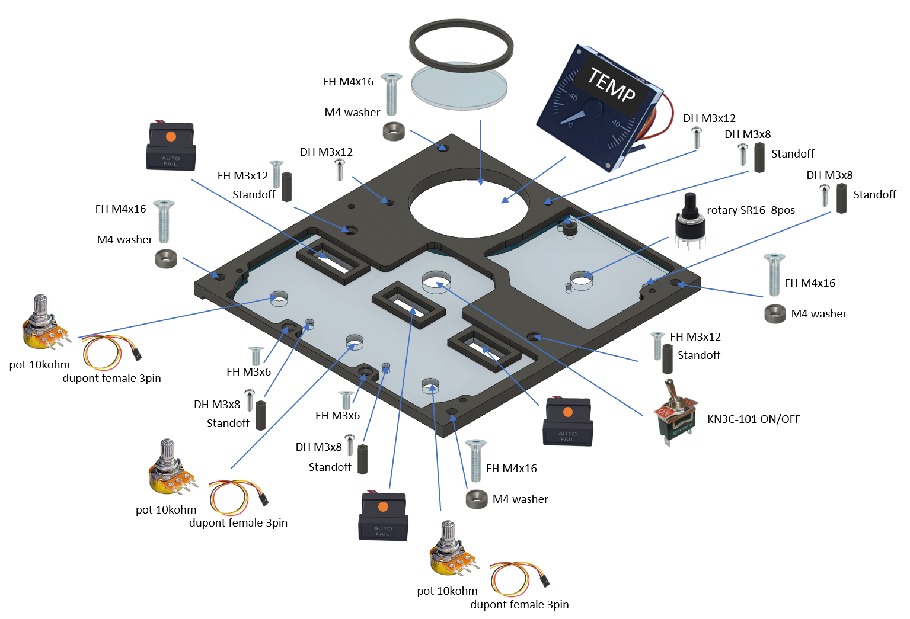
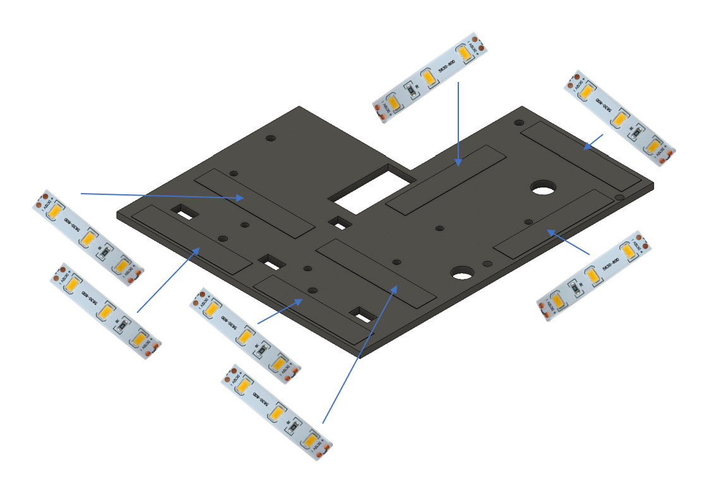
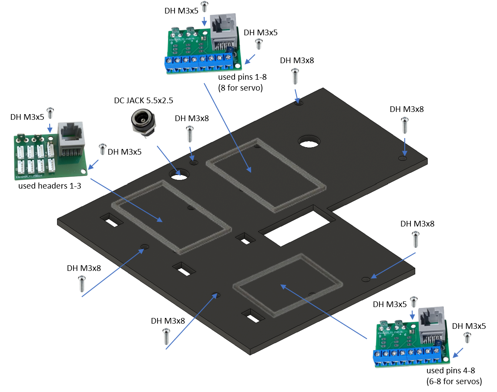
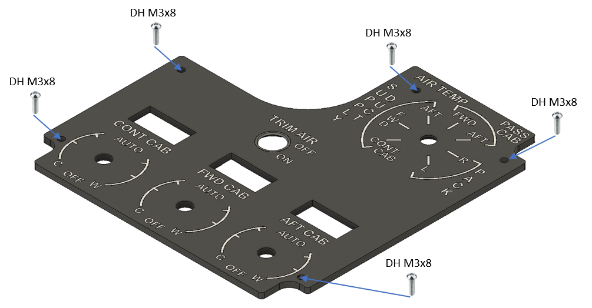

# 24. Air Conditioning Control Panel

[📦 Download the printable model on MakerWorld](https://makerworld.com/en/models/3286939-boeing-737-overhead-air-conditioning-panel)

[← Back to model list](README.md)

---

## Photos

<table>
<tbody>
<tr>
<td align="center" width="50%"> Finished panel</td>
<td align="center" width="50%"> The top panel - Dark Gray with the lettering in Jade White</td>
</tr>
</tbody>
<tbody>
<tr>
<td align="center" width="50%"> The gauge, the AIR TEMP selector, the TRIM AIR switch, the annunciators and the potentiometers, with the diffuser fitted, before the top panel goes on</td>
<td align="center" width="50%"> Rear side - the three PCBs, the gauge servo and the DC jack</td>
</tr>
</tbody>
<tbody>
<tr>
<td align="center" width="50%"> Side view with the backlight panel lifted off - the three temperature potentiometers and their splined shafts</td>
<td align="center" width="50%"></td>
</tr>
</tbody>
</table>

---

## Filament

| | Colour | Filament |
|---|---|---|
|  | Dark Gray | C-Tech Premium Line PLA RAL7011 |
|  | Transparent | Filament PM PLA Transparent |
|  | White | Bambu PLA Basic Jade White (10100) |
|  | Black | Bambu PLA Basic Black (10101) |

---

## 3D Printed Parts

| Qty | Part | Notes |
|---:|---|---|
| 1× | Top panel | the Dark Gray plate with the Jade White lettering; print on a **Textured** PEI plate |
| 1× | Bottom panel | print on a **Textured** PEI plate |
| 1× | Diffuser panel | print on a **Smooth** PEI plate |
| 1× | Backlight panel | |
| 1× | Bezel | the ring around the gauge window |
| 3× | PCB frame | |
| 4× | M4 washer | |
| 6× | Standoff 16 mm | |

---

## Switches and Buttons

| Qty | Type | Reference |
|---:|---|---|
| 1× | KN3(C)-101 or KN3(C)-102, ON/OFF | |
| 1× | Rotary switch SR16, 8 positions | |
| 3× | **Potentiometer 10 kΩ** - WH148, 3-pin, 20 mm shank | [Product I used](../../images/parts/AE_potentiometer.png) |
| 3× | **Dupont lead** - 3-pin female, 2.54 mm | [Product I used](../../images/parts/AE_dupont.png) |

The toggle switch is TRIM AIR. The rotary switch is the AIR TEMP source selector, and seven of its eight positions are used. The three potentiometers are the CONT CAB, FWD CAB and AFT CAB temperature knobs, and each one is wired with one of the Dupont leads.

---

## Rotary Knobs

The knobs for the AIR TEMP selector and the three temperature potentiometers are a separate model shared with the other panels - they are **not included** in this download.

| Qty | Part |
|---:|---|
| 4× | General knob, splined shaft |
| 4× | General knob indicator |

| | |
|---|---|
| 📦 Printable model | [Boeing 737 Overhead - Rotary Knobs](https://makerworld.com/en/models/3066127-boeing-737-overhead-rotary-knobs) |
| 🔧 Build notes | [Rotary Knobs](03-rotary-knobs.md) |

---

## Gauge

The TEMP instrument is a separate model shared with three other panels - it is **not included** in this download. The bezel that rings it is part of this panel; the acrylic window between the two is not printed at all, it is cut - see [CNC Cut Files](#cnc-cut-files).

| | |
|---|---|
| 📦 Printable model | [Boeing 737 Overhead - Temperature and Climb Gauges](https://makerworld.com/en/models/3251829-boeing-737-overhead-temperature-and-climb-gauges) |
| 🔧 Build notes | [Temperature and Climb Gauges](21-temperature-and-climb-gauges.md) |

The needle to fit is **hand-temp_white + hand-temp_black**, and the scale is the TEMP dial on the [UV print sheet](../uv-print.md). Its connections are in [Wiring](#wiring).

---

## Screws

| Qty | Screw | Joins |
|---:|---|---|
| 2× | Flat head M3×6 | bottom + diffuser |
| 2× | Flat head M3×12 | bottom + standoff |
| 4× | Flat head M4×16 | bottom + main frame |
| 6× | Dome head M3×5 | PCB + backlight |
| 15× | Dome head M3×8 | top + bottom, top + diffuser, diffuser + standoff, backlight + standoff |
| 2× | Dome head M3×12 | bottom + gauge |

The four M4×16 screws each take one of the printed M4 washers.

---

## Annunciators

| Qty | Type |
|---:|---|
| 3× | Black background, yellow LED |

All three are ZONE TEMP.

The annunciators are a separate model shared with the other panels - they are **not included** in this download.

| | |
|---|---|
| 📦 Printable model | [Boeing 737 Overhead - Annunciators](https://makerworld.com/en/models/3121595-boeing-737-overhead-annunciators) |
| 🔧 Build notes | [Annunciators](02-annunciators.md) |
| 🔌 PCB, BOM and wiring | [Annunciator PCB](../pcb/annunciator.md) |

---

## CNC Cut Files

| Qty | File | Size |
|---:|---|---|
| 1× | cnc_gauge_48-8.dxf | Ø 48.8 mm |

This is the round window that goes in front of the TEMP gauge, behind the bezel. The drawing, the material and the cutting notes are on the [CNC Cut Files](../cnc-cut.md) page.

---

## PCB

| Qty | PCB | Connections used | Gerber files |
|---:|---|---|---|
| 1× | [RJ45 LED Driver](../pcb/rj45-driver.md) | headers 1–3 | [📥 PCB_RJ45_Driver.zip](https://raw.githubusercontent.com/om7ea/B737/main/PCB/PCB_RJ45_Driver.zip) |
| 2× | [RJ45 Direct](../pcb/rj45-direct.md) | pins 1–8 on one, 4–8 on the other | [📥 PCB_RJ45_Direct.zip](https://raw.githubusercontent.com/om7ea/B737/main/PCB/PCB_RJ45_Direct.zip) |

Mounting is shown in [step 3](#3-backlight-panel---pcbs-and-dc-jack) of the assembly diagram. Which switch and which annunciator each connection carries is in [Wiring](#wiring).

---

## Wiring

The three PCBs do not all hang off the same MEGA 2560 - two go to `Overhead_5`, one to `Overhead_2a`. Each PCB is connected by one Ethernet patch cable to a socket on the [RJ45 Hub Shield](../pcb/rj45-hub-shield.md).

| PCB | Patch cable goes to | Connections used |
|---|---|---|
| **PCB 1** | socket **A1** on **Overhead_5** | headers 1–3 |
| **PCB 2** | socket **A2** on **Overhead_5** | pins 4–8 |
| **PCB 3** | socket **D5** on **Overhead_2a** | pins 1–8 |

The socket labels **D0–D6**, **A1** and **A2** are silkscreened on the hub shield.

The rear of the panel. **PCB 1** is the board with the small white connectors and the red-and-black cables running off to the annunciators. **PCB 2** and **PCB 3** both take screw terminals: seven of them on **PCB 3**, holding the white wires of the AIR TEMP selector, and a single two-way one on **PCB 2**, whose three-pin headers carry the temperature potentiometers. The eighth position on **PCB 3** has no screw terminal fitted - it is the gauge servo connection, which goes on the pin headers instead. The white and brown wire leaving the top of the panel are the pair that feeds the [Voice Recorder Switch](12-voice-recorder-switch.md).

### PCB 1 - socket A1 on Overhead_5

| Header | Annunciator |
|---:|---|
| 1 | ZONE TEMP - FWD CAB |
| 2 | ZONE TEMP - AFT CAB |
| 3 | ZONE TEMP - CONT CAB |

Headers 4 to 8 are not populated. All three annunciators are printed ZONE TEMP; the cabin zone belonging to each one is printed on the panel below it.

### PCB 2 - socket A2 on Overhead_5

| Pin | Switch |
|---:|---|
| 4 | TRIM AIR |
| 5 | Voice Recorder Switch |
| 6 | CONT CAB temperature |
| 7 | FWD CAB temperature |
| 8 | AFT CAB temperature |

Pins 1 to 3 are not used.

Pin 5 does not belong to this panel. It carries the toggle switch of the [Voice Recorder Switch](12-voice-recorder-switch.md), which has no PCB of its own - both the signal and the ground return for it come from this board.

### PCB 3 - socket D5 on Overhead_2a

| Pin | Switch |
|---:|---|
| 1 | AIR TEMP - PASS CAB AFT |
| 2 | AIR TEMP - PACK R |
| 3 | AIR TEMP - PACK L |
| 4 | AIR TEMP - PASS CAB FWD |
| 5 | AIR TEMP - SUPPLY DUCT AFT |
| 6 | AIR TEMP - SUPPLY DUCT CONT CAB |
| 7 | AIR TEMP - SUPPLY DUCT FWD |
| 8 | TEMP gauge - servo signal |

None of the gauge connections go through a screw terminal. The servo signal on pin 8, the servo's **+5 V** and **GND** and the **+5 V** and **GND** of the needle LED all sit on the pin headers of PCB 3. Its scale backlight runs on 12 V from this panel's own backlighting, through the lever-type splice connectors beside the servo. The servo plug has to be rewired before it will work - see [Temperature and Climb Gauges](21-temperature-and-climb-gauges.md#wiring).

Each potentiometer takes its **+5 V** and **GND** from the pin headers of PCB 2 as well, so its 3-pin Dupont lead plugs straight onto the board.

**All the switches share a single ground return.** Each switch takes one of its terminals to its own pin on the Direct PCB. The opposite terminals are commoned - daisy-chained from one switch to the next - and the chain ends at a **-** (ground) contact.

---

## Backlight

| Qty | Part | Reference |
|---:|---|---|
| 7× | LED strip | [Product I used](../../images/parts/AE_led_strip.png) |
| 1× | DC jack 5.5 × 2.5 mm | [Product I used](../../images/parts/AE_dc_jack.png) |

Powered from the **12 V** supply - see [Power supply](../system-overview.md#power-supply).

---

## Assembly Diagram

Screw abbreviations used in the diagrams: **FH** = flat head, **DH** = dome head.

### 1. Bottom panel - diffuser, gauge, annunciators, switches and potentiometers

### 2. Backlight panel - LED strips

### 3. Backlight panel - PCBs and DC jack

### 4. Top panel

