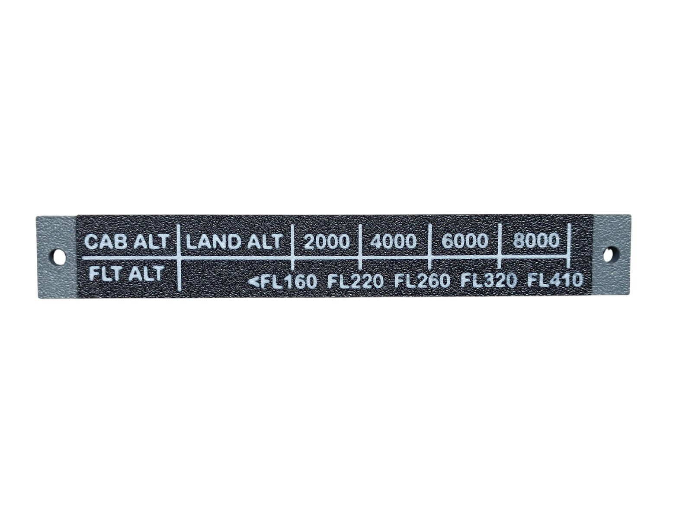
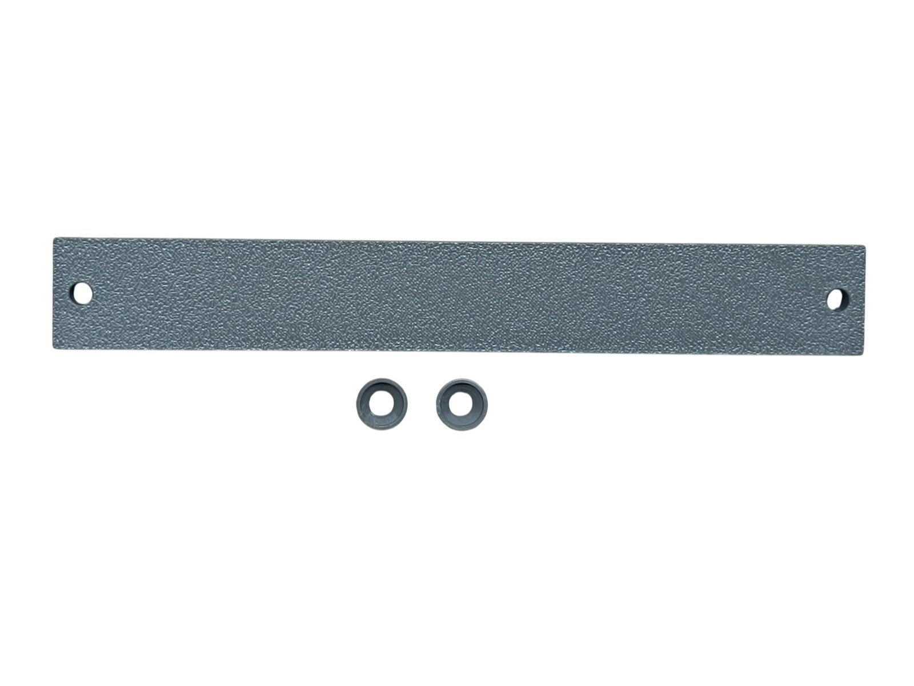
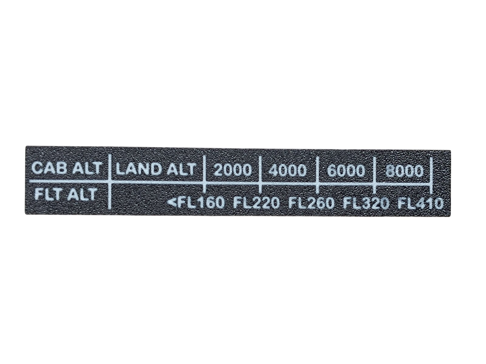
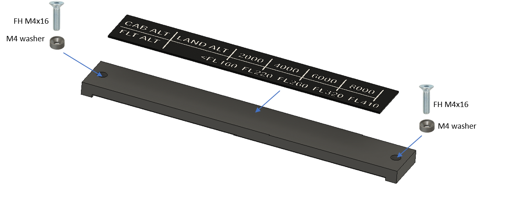

# 25. Pressurization Altitude Info

[← Back to model list](README.md)

---

## Photos

<table>
<tbody>
<tr>
<td align="center" width="50%"> Finished plate</td>
<td align="center" width="50%"> The bottom panel and the two printed M4 washers</td>
</tr>
</tbody>
<tbody>
<tr>
<td align="center" width="50%"> The info plate - Black with the lettering in Jade White</td>
<td align="center" width="50%"></td>
</tr>
</tbody>
</table>

---

## Filament

| | Colour | Filament |
|---|---|---|
|  | Dark Gray | C-Tech Premium Line PLA RAL7011 |
|  | White | Bambu PLA Basic Jade White (10100) |
|  | Black | Bambu PLA Basic Black (10101) |

---

## 3D Printed Parts

| Qty | Part | Notes |
|---:|---|---|
| 1× | Bottom panel | print on a **Textured** PEI plate |
| 1× | Info plate | the Black plate with the Jade White lettering; print on a **Textured** PEI plate |
| 2× | M4 washer | |

---

## Glue

The info plate is glued into the recess in the bottom panel - nothing screws the two together.

> **Note**
> Do not use cyanoacrylate (superglue) here. As it cures it leaves a white film on the surface around the joint, not only where the glue was applied, and that shows on a black plate. A two-part epoxy is a good choice instead.

---

## Screws

| Qty | Screw | Joins |
|---:|---|---|
| 2× | Flat head M4×16 | bottom + main frame |

The two M4×16 screws each take one of the printed M4 washers.

---

## Assembly Diagram

Screw abbreviations used in the diagram: **FH** = flat head.

### 1. Info plate and mounting to the main frame

