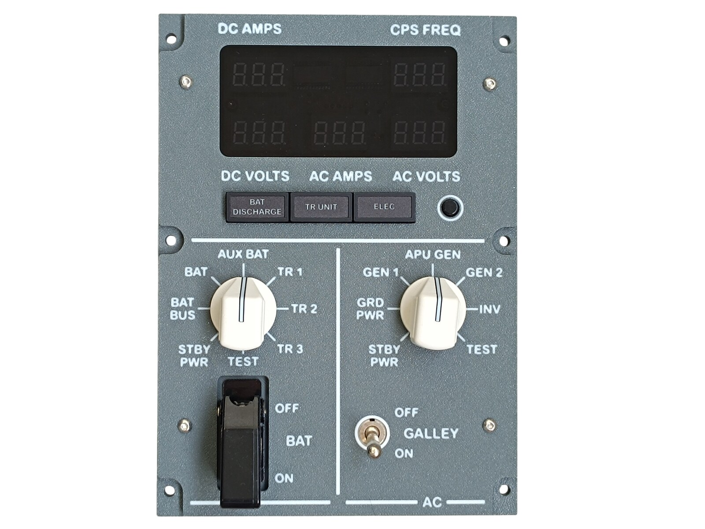
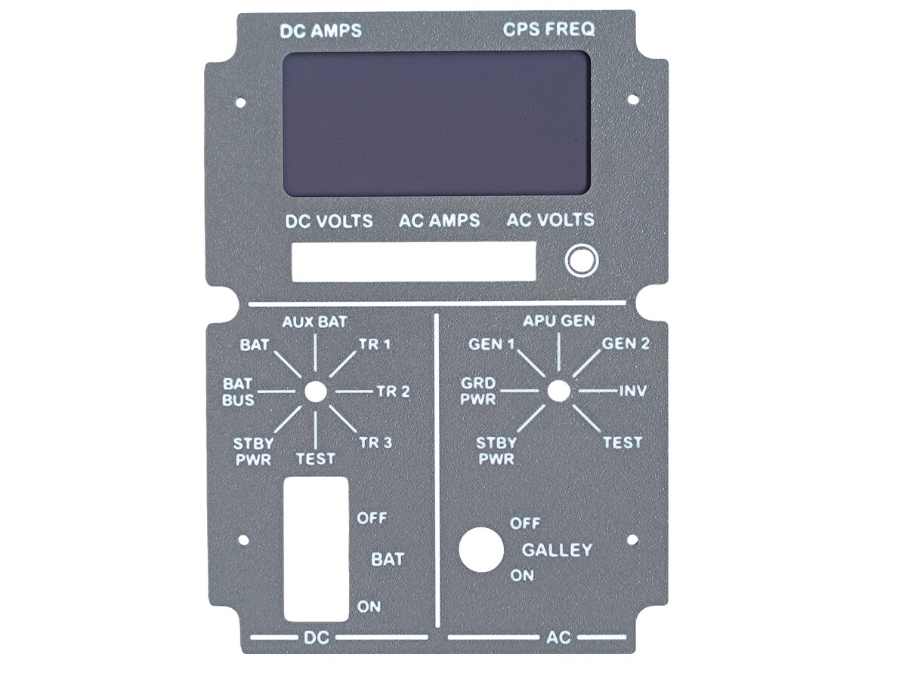
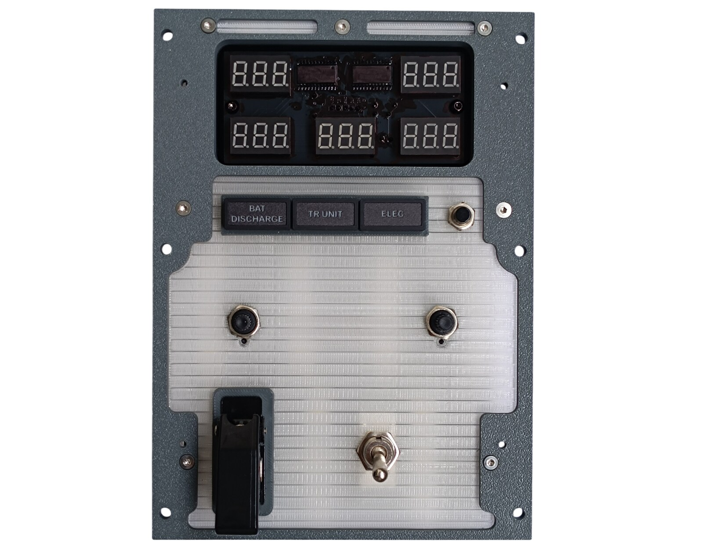
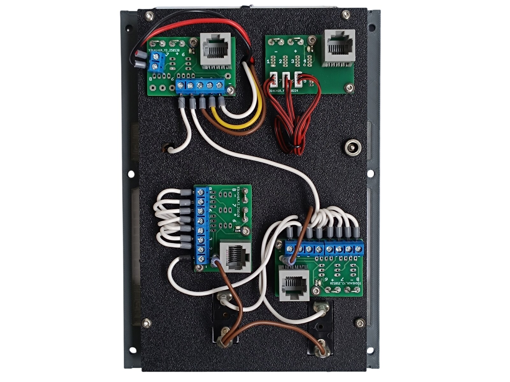
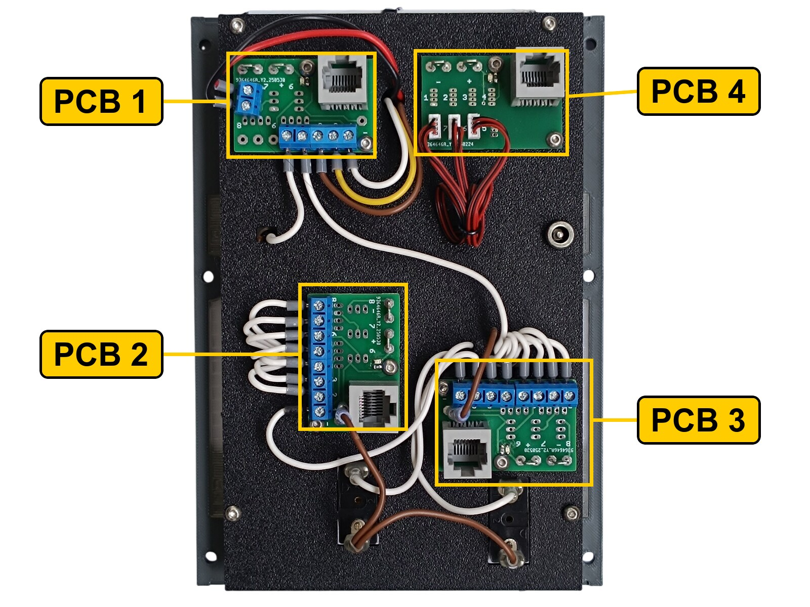
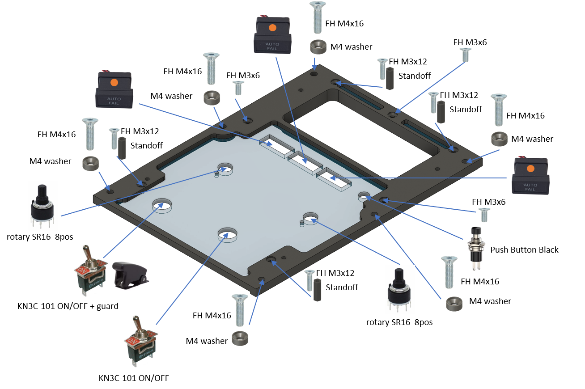
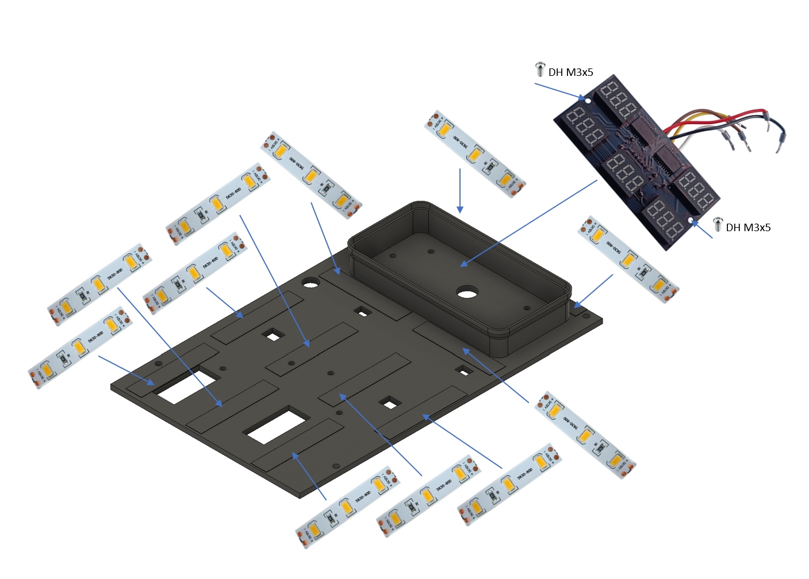
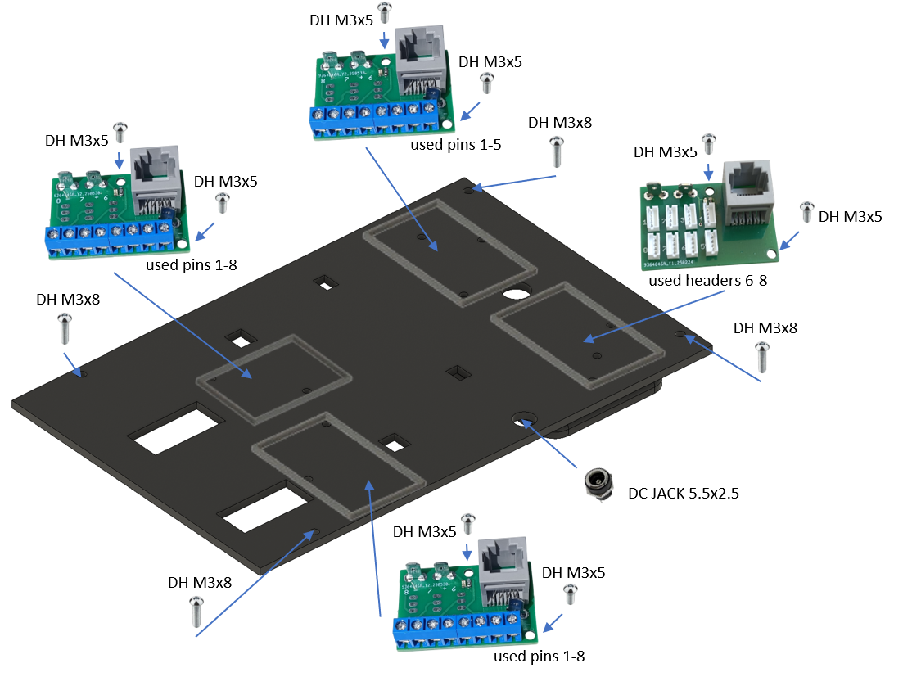
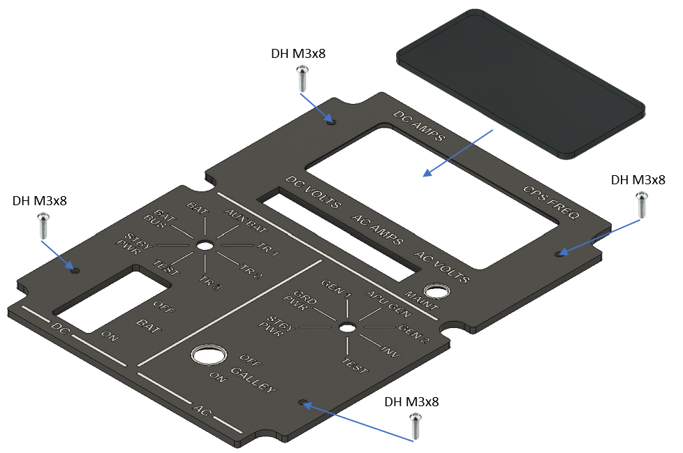

# 26. AC and DC Meter Panel

[📦 Download the printable model on MakerWorld](https://makerworld.com/en/models/3288999-boeing-737-overhead-ac-and-dc-meter-panel)

[← Back to model list](README.md)

---

## Photos

<table>
<tbody>
<tr>
<td align="center" width="50%"> Finished panel</td>
<td align="center" width="50%"> The top panel - Dark Gray with the lettering in Jade White, with the grey acrylic window behind the display cut-out</td>
</tr>
</tbody>
<tbody>
<tr>
<td align="center" width="50%"> The AC and DC Meter PCB, the annunciators, the MAINT button, both selectors and both toggle switches, with the diffusers fitted, before the top panel goes on</td>
<td align="center" width="50%"> Rear side - the four RJ45 PCBs on the backlight panel and the DC jack</td>
</tr>
</tbody>
</table>

---

## Filament

| | Colour | Filament |
|---|---|---|
|  | Dark Gray | C-Tech Premium Line PLA RAL7011 |
|  | Transparent | Filament PM PLA Transparent |
|  | White | Bambu PLA Basic Jade White (10100) |
|  | Black | Bambu PLA Basic Black (10101) |

---

## 3D Printed Parts

| Qty | Part | Notes |
|---:|---|---|
| 1× | Top panel | the Dark Gray plate with the Jade White lettering; print on a **Textured** PEI plate |
| 1× | Bottom panel | print on a **Textured** PEI plate |
| 1× | Diffuser 1 panel | print on a **Smooth** PEI plate |
| 1× | Diffuser 2 panel | print on a **Smooth** PEI plate |
| 1× | Backlight panel | |
| 4× | PCB frame | |
| 6× | M4 washer | |
| 4× | Standoff 16 mm | |

---

## Switches and Buttons

| Qty | Type |
|---:|---|
| 2× | KN3(C)-101 or KN3(C)-102, ON/OFF |
| 2× | Rotary switch SR16, 8 positions |
| 1× | PBS-110 push button, black |
| 1× | Toggle switch safety aircraft guard, black |

The two toggle switches are BAT and GALLEY, and the guard goes on the BAT switch. The push button is the MAINT button beside the ELEC annunciator. The rotary switches are the two meter selectors: the DC selector uses all eight of its positions, the AC selector seven of eight.

> **Note**
> With the knob already fitted, I turned each selector hard against its end stop until the stop broke off inside the switch. What is left is a switch that turns continuously in both directions instead of running out of travel. I used the same trick on the [Fuel Control Panel](22-fuel-control-panel.md).

---

## Rotary Knobs

The knobs for the two meter selectors are a separate model shared with the other panels - they are **not included** in this download.

| Qty | Part |
|---:|---|
| 2× | General knob, splined shaft |
| 2× | General knob indicator |

| | |
|---|---|
| 📦 Printable model | [Boeing 737 Overhead - Rotary Knobs](https://makerworld.com/en/models/3066127-boeing-737-overhead-rotary-knobs) |
| 🔧 Build notes | [Rotary Knobs](03-rotary-knobs.md) |

---

## Screws

| Qty | Screw | Joins |
|---:|---|---|
| 3× | Flat head M3×6 | bottom + diffuser |
| 4× | Flat head M3×12 | bottom + standoff |
| 6× | Flat head M4×16 | bottom + main frame |
| 10× | Dome head M3×5 | PCB + backlight, AC and DC Meter PCB + backlight |
| 8× | Dome head M3×8 | top + bottom, backlight + standoff |

The six M4×16 screws each take one of the printed M4 washers.

---

## Annunciators

| Qty | Type |
|---:|---|
| 3× | Black background, yellow LED |

They are BAT DISCHARGE, TR UNIT and ELEC.

The annunciators are a separate model shared with the other panels - they are **not included** in this download.

| | |
|---|---|
| 📦 Printable model | [Boeing 737 Overhead - Annunciators](https://makerworld.com/en/models/3121595-boeing-737-overhead-annunciators) |
| 🔧 Build notes | [Annunciators](02-annunciators.md) |
| 🔌 PCB, BOM and wiring | [Annunciator PCB](../pcb/annunciator.md) |

---

## CNC Cut Files

| Qty | File | Size |
|---:|---|---|
| 1× | cnc_meter_window.dxf | 96 × 46 mm, corners rounded to R 4.5 mm |

This is the window that goes in front of the five displays. It is the one piece cut from **grey** acrylic instead of clear - the tint is what keeps the panel looking dark until the displays light up. The drawing, the material and the cutting notes are on the [CNC Cut Files](../cnc-cut.md) page.

The window is glued to the top panel.

> **Note**
> Do not use cyanoacrylate (superglue) for that joint. As it cures it leaves a white film on the surface around the joint, not only where the glue was applied, and on a clear window it is impossible to miss. A two-part epoxy is a good choice instead.

---

## PCB

| Qty | PCB | Connections used | Gerber files |
|---:|---|---|---|
| 3× | [RJ45 Direct](../pcb/rj45-direct.md) | pins 1-5 on one, 1-8 on the other two | [📥 PCB_RJ45_Direct.zip](https://raw.githubusercontent.com/om7ea/B737/main/PCB/PCB_RJ45_Direct.zip) |
| 1× | [RJ45 LED Driver](../pcb/rj45-driver.md) | headers 6-8 | [📥 PCB_RJ45_Driver.zip](https://raw.githubusercontent.com/om7ea/B737/main/PCB/PCB_RJ45_Driver.zip) |
| 1× | [AC and DC Meter](../pcb/ac-dc-meter.md) | all five displays | [📥 PCB_AC_DC_Meter.zip](https://raw.githubusercontent.com/om7ea/B737/main/PCB/PCB_AC_DC_Meter.zip) |

The AC and DC Meter PCB is fitted in [step 2](#2-backlight-panel---led-strips-and-the-display-board) of the assembly diagram, the other four in [step 3](#3-backlight-panel---pcbs-and-dc-jack). Which switch, annunciator and display each connection carries is in [Wiring](#wiring).

---

## Wiring

The four RJ45 boards do not all hang off the same MEGA 2560 - two go to `Overhead_2a`, two to `Overhead_2b`. Each is connected by one Ethernet patch cable to a socket on the [RJ45 Hub Shield](../pcb/rj45-hub-shield.md). The AC and DC Meter PCB has no patch cable of its own; it hangs off PCB 1.

| PCB | Patch cable goes to | Connections used |
|---|---|---|
| **PCB 1** | socket **D4** on **Overhead_2a** | pins 1-5 |
| **PCB 2** | socket **D4** on **Overhead_2b** | pins 1-8 |
| **PCB 3** | socket **A2** on **Overhead_2b** | pins 1-8 |
| **PCB 4** | socket **D6** on **Overhead_2a** | headers 6-8 |
| **PCB 5** | none | fed from PCB 1 |

The socket labels **D0-D6**, **A1** and **A2** are silkscreened on the hub shield.

The rear of the panel. **PCB 1** is the board with a small two-way screw terminal beside the five-way one; the red, black, brown, yellow and white wires leaving it run over the edge of the panel to the display board on the other side. **PCB 4** is the board with the small white connectors and the red-and-black cables running off to the annunciators. **PCB 2** and **PCB 3** each carry a full row of eight screw terminals. **PCB 5**, the display board, sits on the front of the panel and is not visible here - it is in photo 3 above.

### PCB 1 - socket D4 on Overhead_2a

| Pin | Connection |
|---:|---|
| 1-3 | AC and DC Meter PCB - the DIN, CLK and LOAD lines |
| 4 | DC meter selector - TR 1 |
| 5 | MAINT button |

Pins 6 to 8 are not used.

### PCB 2 - socket D4 on Overhead_2b

| Pin | Switch |
|---:|---|
| 1 | DC meter selector - STBY PWR |
| 2 | AC meter selector - INV |
| 3 | AC meter selector - GEN 2 |
| 4 | AC meter selector - GEN 1 |
| 5 | AC meter selector - APU GEN |
| 6 | AC meter selector - GRD PWR |
| 7 | AC meter selector - STBY PWR |
| 8 | AC meter selector - TEST |

### PCB 3 - socket A2 on Overhead_2b

| Pin | Switch |
|---:|---|
| 1 | GALLEY |
| 2 | BAT |
| 3 | DC meter selector - TR 2 |
| 4 | DC meter selector - AUX BAT |
| 5 | DC meter selector - TR 3 |
| 6 | DC meter selector - BAT |
| 7 | DC meter selector - BAT BUS |
| 8 | DC meter selector - TEST |

The eight positions of the DC meter selector are spread over three boards: six of them here, TR 1 on PCB 1 and STBY PWR on PCB 2.

### PCB 4 - socket D6 on Overhead_2a

| Header | Annunciator |
|---:|---|
| 6 | BAT DISCHARGE |
| 7 | ELEC |
| 8 | TR UNIT |

Headers 1 to 5 are not populated.

### PCB 5 - AC and DC Meter

The display board takes its serial link from pins 1 to 3 of PCB 1, and its **5 V** and **GND** from the two-way screw terminal on the same board. Which wire colour goes to which pad is on the [AC and DC Meter PCB](../pcb/ac-dc-meter.md) page.

**All the switches share a single ground return.** Each switch takes one of its terminals to its own pin on the Direct PCB. The opposite terminals are commoned - daisy-chained from one switch to the next - and the chain ends at a **-** (ground) contact.

---

## Backlight

| Qty | Part | Reference |
|---:|---|---|
| 11× | LED strip | [Product I used](../../images/parts/AE_led_strip.png) |
| 1× | DC jack 5.5 × 2.5 mm | [Product I used](../../images/parts/AE_dc_jack.png) |

Powered from the **12 V** supply - see [Power supply](../system-overview.md#power-supply).

---

## Assembly Diagram

Screw abbreviations used in the diagrams: **FH** = flat head, **DH** = dome head.

### 1. Bottom panel - diffusers, annunciators and switches

### 2. Backlight panel - LED strips and the display board

### 3. Backlight panel - PCBs and DC jack

### 4. Top panel and window

