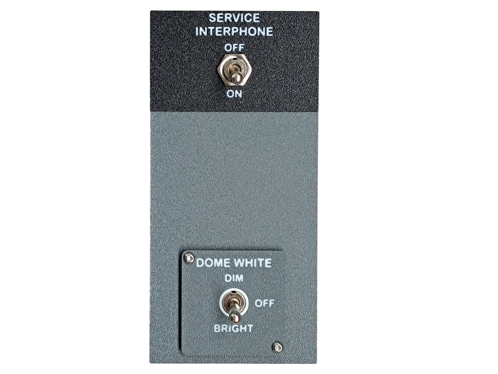
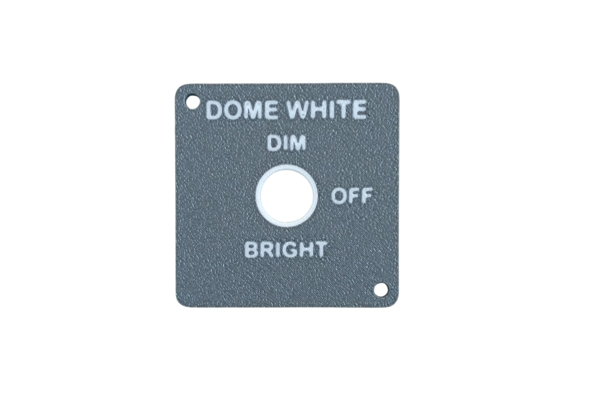
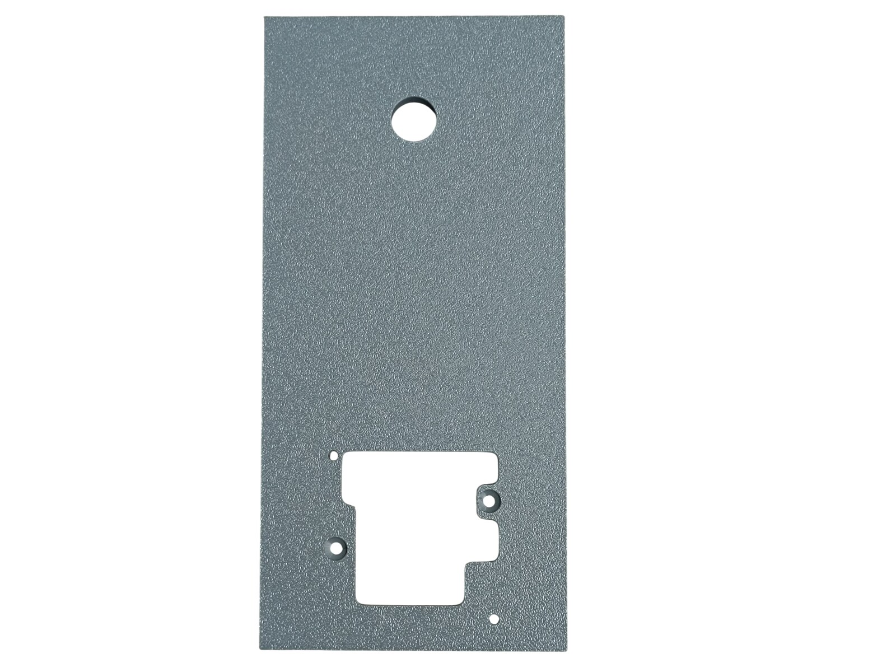
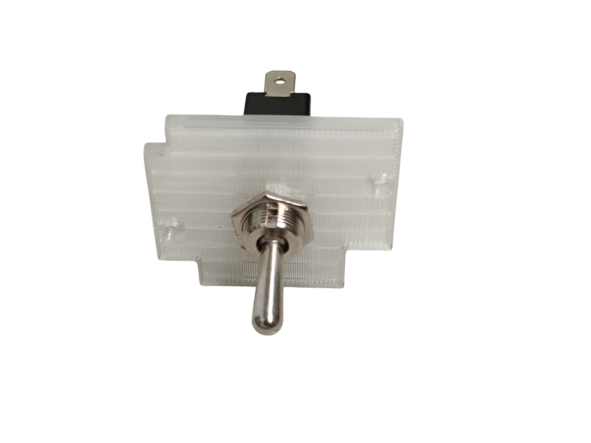
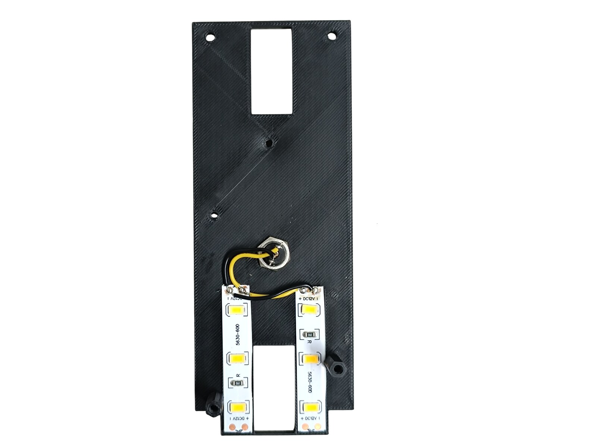
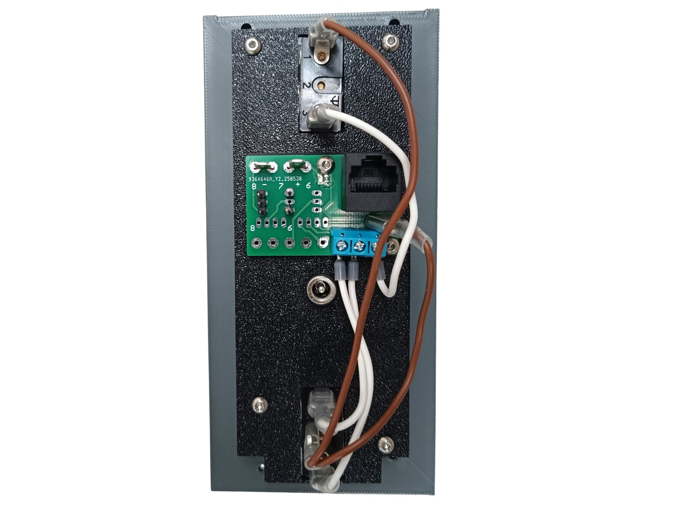
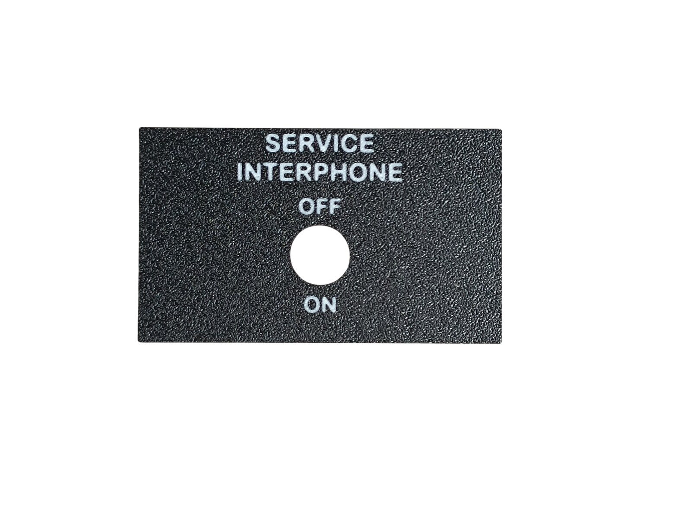
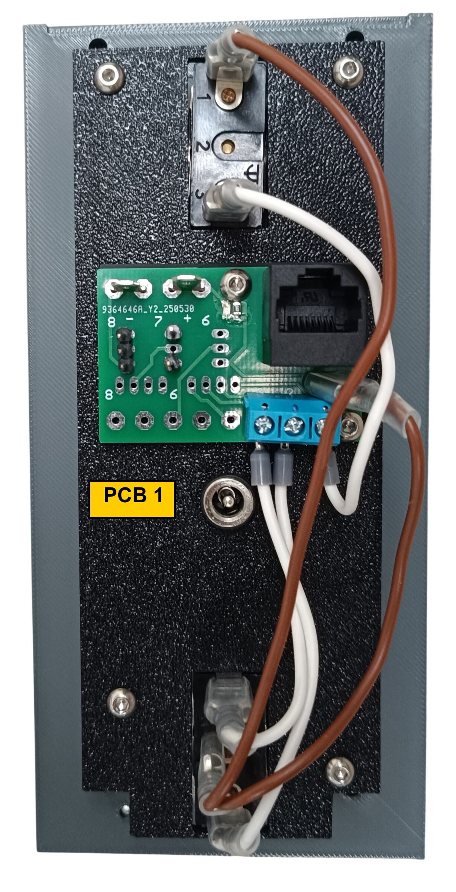

# 27. Interphone and Dome Panel

[📦 Download the printable model on MakerWorld](https://makerworld.com/en/models/3309341-boeing-737-overhead-interphone-and-dome-panel)

[← Back to model list](README.md)

---

## Photos

<table>
<tbody>
<tr>
<td align="center" width="50%"> Finished panel</td>
<td align="center" width="50%"> The top panel - the DOME WHITE plate, Dark Gray with the lettering in Jade White</td>
</tr>
</tbody>
<tbody>
<tr>
<td align="center" width="50%"> The bottom panel - the hole for the SERVICE INTERPHONE switch at the top, the recess for the top panel at the bottom</td>
<td align="center" width="50%"> The diffuser panel with the DOME WHITE switch fitted</td>
</tr>
</tbody>
<tbody>
<tr>
<td align="center" width="50%"> The backlight panel with the two LED strips, the DC jack and the standoffs</td>
<td align="center" width="50%"> Rear side - the PCB, the two switches and the DC jack</td>
</tr>
</tbody>
<tbody>
<tr>
<td align="center" width="50%"> The plate - Black with the lettering in Jade White</td>
<td align="center" width="50%"></td>
</tr>
</tbody>
</table>

---

## Filament

| | Colour | Filament |
|---|---|---|
|  | Dark Gray | C-Tech Premium Line PLA RAL7011 |
|  | Transparent | Filament PM PLA Transparent |
|  | White | Bambu PLA Basic Jade White (10100) |
|  | Black | Bambu PLA Basic Black (10101) |

---

## 3D Printed Parts

| Qty | Part | Notes |
|---:|---|---|
| 1× | Top panel | print on a **Textured** PEI plate |
| 1× | Bottom panel | print on a **Textured** PEI plate |
| 1× | Plate | print on a **Textured** PEI plate |
| 1× | Diffuser panel | print on a **Smooth** PEI plate |
| 1× | Backlight panel | |
| 1× | PCB frame | |
| 2× | Standoff 16 mm | |

---

## Switches and Buttons

| Qty | Type |
|---:|---|
| 1× | KN3(C)-101 or KN3(C)-102, ON/OFF |
| 1× | KN3(C)-103, ON/OFF/ON |

The two-position switch is SERVICE INTERPHONE, the three-position one is DOME WHITE - DIM, OFF and BRIGHT.

---

## Screws

| Qty | Screw | Joins |
|---:|---|---|
| 2× | Flat head M3×12 | bottom + standoff |
| 2× | Dome head M3×5 | PCB + backlight |
| 4× | Dome head M3×8 | backlight + standoff |
| 4× | Dome head M4×10 | bottom + main frame |

---

## PCB

| Qty | PCB | Connections used | Gerber files |
|---:|---|---|---|
| 1× | [RJ45 Direct](../pcb/rj45-direct.md) | pins 1–3 and 8 | [📥 PCB_RJ45_Direct.zip](https://raw.githubusercontent.com/om7ea/B737/main/PCB/PCB_RJ45_Direct.zip) |

Which switch each connection carries is in [Wiring](#wiring).

---

## Wiring

The panel takes **one** Ethernet patch cable to the [RJ45 Hub Shield](../pcb/rj45-hub-shield.md).

| PCB | Patch cable goes to | Connections used |
|---|---|---|
| **PCB 1** | socket **D1** on **Overhead_3** | pins 1–3 and 8 |

The socket labels **D0–D6**, **A1** and **A2** are silkscreened on the hub shield.

The rear of the panel. The board carries a three-way blue screw terminal at the pin 1 end and a three-pin header at the pin 8 end; the brown wire runs up to the SERVICE INTERPHONE switch, the two white ones down to DOME WHITE.

### PCB 1 - socket D1 on Overhead_3

| Pin | Switch |
|---:|---|
| 1 | SERVICE INTERPHONE |
| 2 | DOME WHITE - BRIGHT |
| 3 | DOME WHITE - DIM |
| 8 | Crew oxygen pressure gauge - servo signal |

Pin 8 does not belong to this panel. It drives the **Crew oxygen pressure gauge servo on the Engine and Oxygen Panel**: I chose to feed that servo from this board instead of from the Recorder and Stall Panel, because this one has seven of its eight pins free. The servo takes three of the pin headers at the pin 8 position - the signal, **GND** and **+5 V** - and its plug has to be rewired before it will work, see [Temperature and Climb Gauges](21-temperature-and-climb-gauges.md#wiring).

**Both switches share a single ground return.** Each switch takes one of its terminals to its own pin on the Direct PCB. The opposite terminals are commoned - daisy-chained from one switch to the next - and the chain ends at a **-** (ground) contact.

---

## Backlight

| Qty | Part | Reference |
|---:|---|---|
| 2× | LED strip | [Product I used](../../images/parts/AE_led_strip.png) |
| 1× | DC jack 5.5 × 2.5 mm | [Product I used](../../images/parts/AE_dc_jack.png) |

Powered from the **12 V** supply - see [Power supply](../system-overview.md#power-supply).
