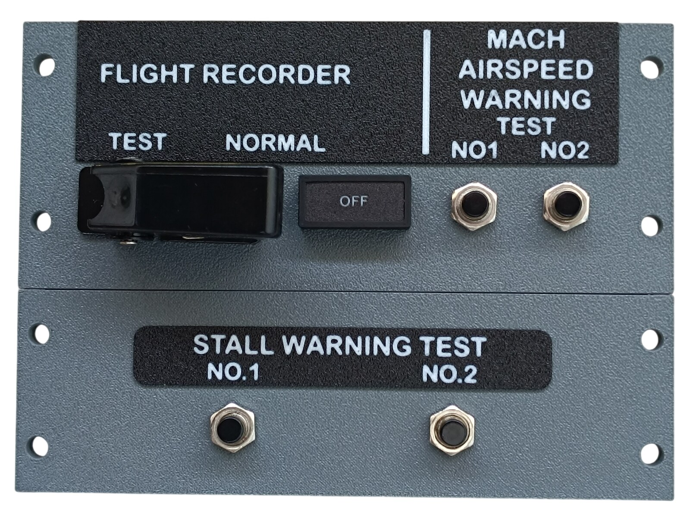
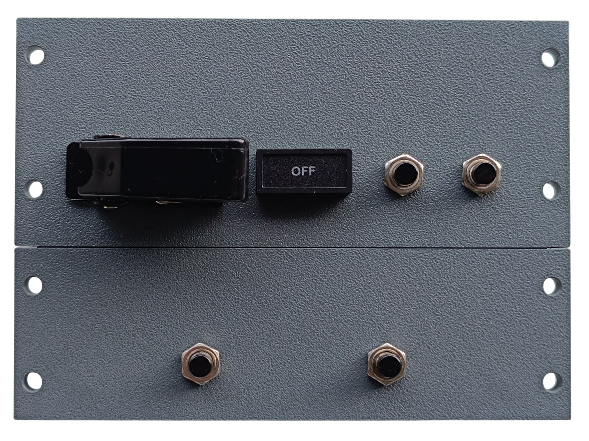
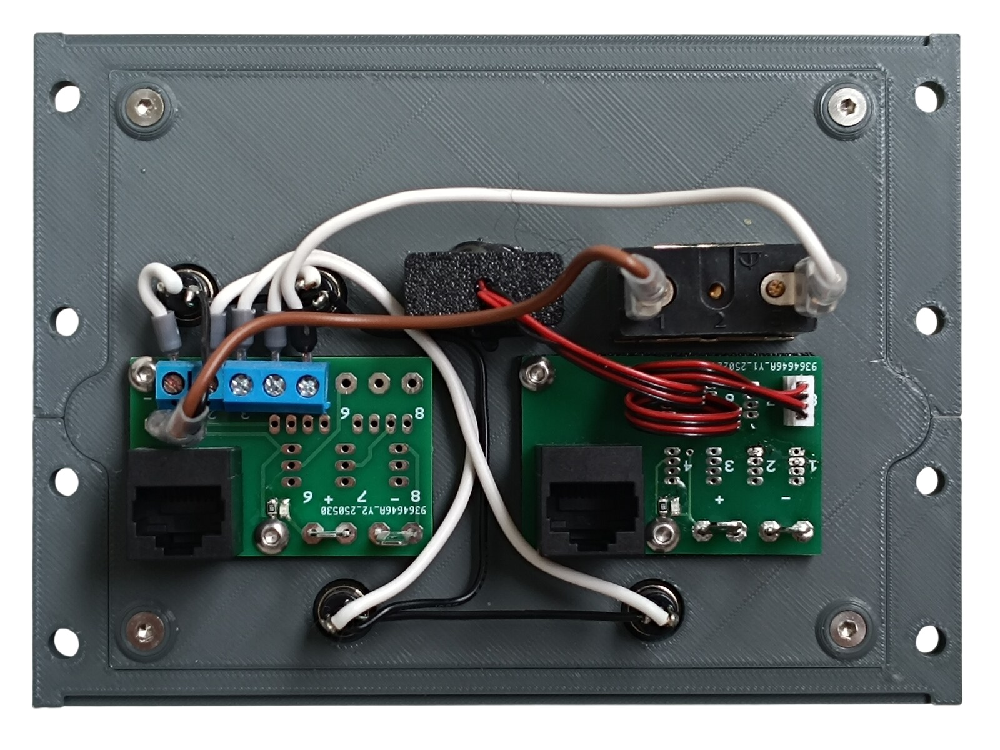
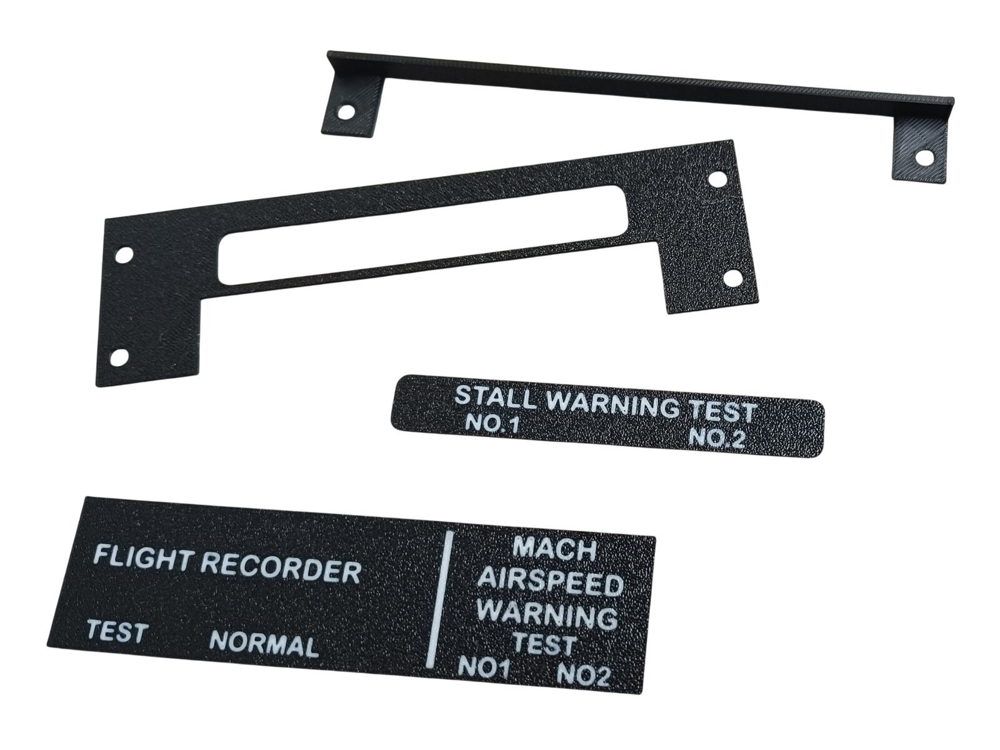
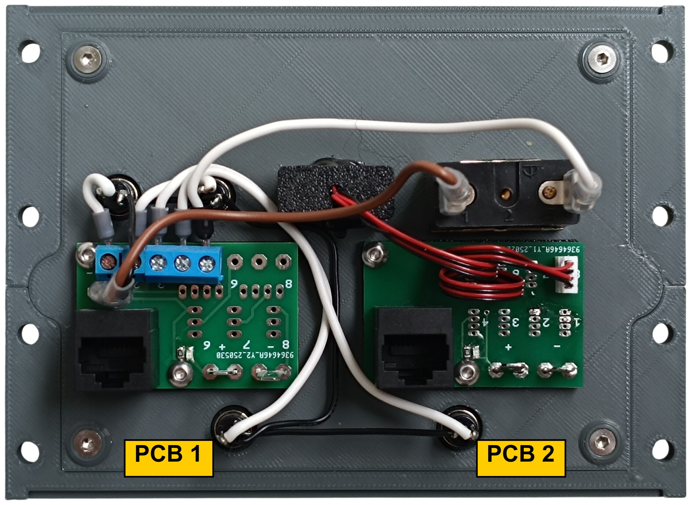
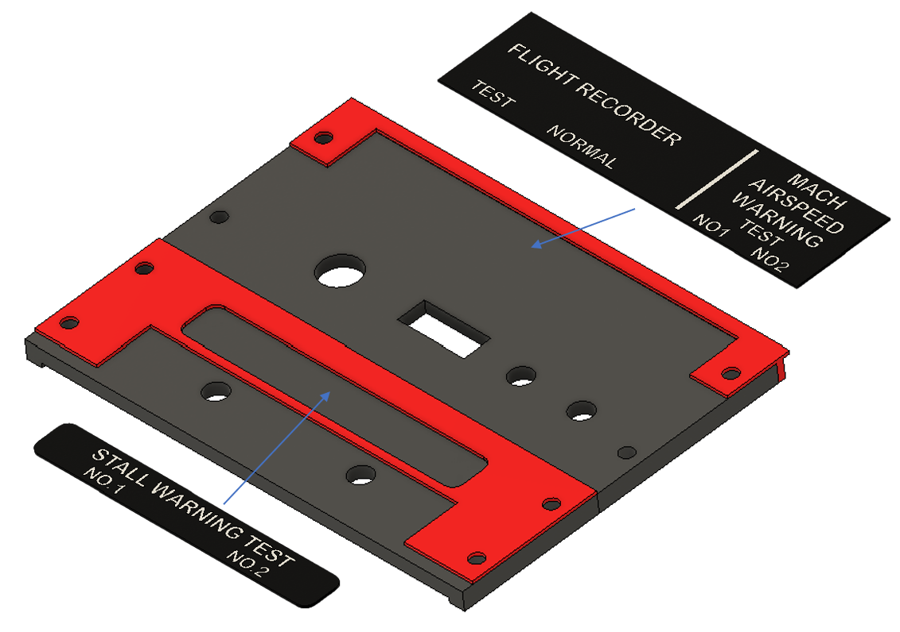
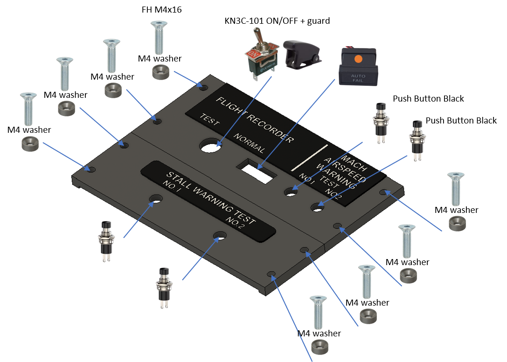
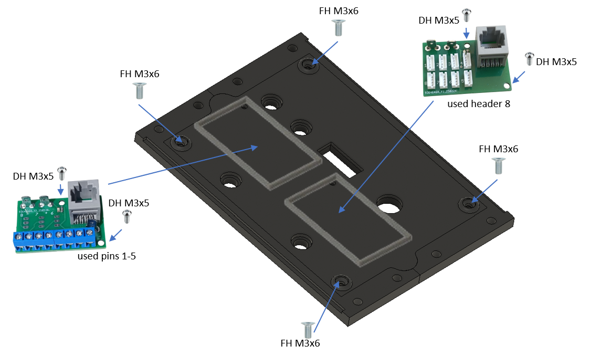

# 28. Recorder and Stall Panel

[📦 Download the printable model on MakerWorld](https://makerworld.com/en/models/3309626-boeing-737-overhead-recorder-and-stall-panel)

[← Back to model list](README.md)

---

## Photos

<table>
<tbody>
<tr>
<td align="center" width="50%"> Finished panel</td>
<td align="center" width="50%"> Both bottom panels with the switch, the buttons and the annunciator fitted, before the plates are glued on</td>
</tr>
</tbody>
<tbody>
<tr>
<td align="center" width="50%"> Rear side - the connection with the two PCBs</td>
<td align="center" width="50%"> The two plates and the two jigs that position them</td>
</tr>
</tbody>
</table>

---

## Filament

| | Colour | Filament |
|---|---|---|
|  | Dark Gray | C-Tech Premium Line PLA RAL7011 |
|  | White | Bambu PLA Basic Jade White (10100) |
|  | Black | Bambu PLA Basic Black (10101) |

---

## 3D Printed Parts

| Qty | Part | Notes |
|---:|---|---|
| 2× | Bottom panel | print on a **Textured** PEI plate |
| 2× | Plate | print on a **Textured** PEI plate |
| 1× | Connection | |
| 2× | PCB frame | |
| 8× | M4 washer | |
| 2× | Gluing jig | one for each plate, see [Glue](#glue) - not part of the finished panel |

---

## Switches and Buttons

| Qty | Type |
|---:|---|
| 1× | KN3(C)-101 or KN3(C)-102, ON/OFF |
| 4× | PBS-110 push button, black |
| 1× | Toggle switch safety aircraft guard, black |

The toggle switch is FLIGHT RECORDER and it is the one that carries the guard. The push buttons are MACH AIRSPEED WARNING TEST NO1 and NO2, and STALL WARNING TEST NO.1 and NO.2.

---

## Glue

The two plates are glued onto the bottom panels. The download includes a jig for each of them - they locate the plate against the edges of the panel so it ends up square and in the right place, and they are the parts drawn in red in [step 1](#1-bottom-panels---gluing-the-plates) of the assembly diagram.

> **Note**
> Do not use cyanoacrylate (superglue) here. As it cures it leaves a white film on the surface around the joint, not only where the glue was applied, and that shows on a black plate. A two-part epoxy is a good choice instead.

---

## Screws

| Qty | Screw | Joins |
|---:|---|---|
| 4× | Flat head M3×6 | bottoms + connection |
| 8× | Flat head M4×16 | bottom + main frame |
| 4× | Dome head M3×5 | PCB + connection |

---

## Annunciators

| Qty | Type |
|---:|---|
| 1× | Black background, yellow LED |

The annunciator is the OFF lamp of the flight recorder.

The annunciators are a separate model shared with the other panels - they are **not included** in this download.

| | |
|---|---|
| 📦 Printable model | [Boeing 737 Overhead - Annunciators](https://makerworld.com/en/models/3121595-boeing-737-overhead-annunciators) |
| 🔧 Build notes | [Annunciators](02-annunciators.md) |
| 🔌 PCB, BOM and wiring | [Annunciator PCB](../pcb/annunciator.md) |

---

## PCB

| Qty | PCB | Connections used | Gerber files |
|---:|---|---|---|
| 1× | [RJ45 Direct](../pcb/rj45-direct.md) | pins 1–5 | [📥 PCB_RJ45_Direct.zip](https://raw.githubusercontent.com/om7ea/B737/main/PCB/PCB_RJ45_Direct.zip) |
| 1× | [RJ45 LED Driver](../pcb/rj45-driver.md) | header 8 | [📥 PCB_RJ45_Driver.zip](https://raw.githubusercontent.com/om7ea/B737/main/PCB/PCB_RJ45_Driver.zip) |

Both boards sit on the connection, behind the joint between the two bottom panels. Mounting is shown in [step 3](#3-connection---pcbs) of the assembly diagram. Which switch and which annunciator each connection carries is in [Wiring](#wiring).

---

## Wiring

The panel takes **two** Ethernet patch cables to the [RJ45 Hub Shield](../pcb/rj45-hub-shield.md), and they go to **two different MEGA 2560 boards**.

| PCB | Patch cable goes to | Connections used |
|---|---|---|
| **PCB 1** | socket **D0** on **Overhead_3** | pins 1–5 |
| **PCB 2** | socket **D6** on **Overhead_5** | header 8 |

The socket labels **D0–D6**, **A1** and **A2** are silkscreened on the hub shield.

The rear of the panel. **PCB 1** is the board with the blue screw terminals - a two-way and a three-way block side by side make up the five pins it uses. **PCB 2** is the board with the small white connector and the red-and-black pair running off to the annunciator.

### PCB 1 - socket D0 on Overhead_3

| Pin | Switch |
|---:|---|
| 1 | MACH AIRSPEED WARNING TEST - NO2 |
| 2 | MACH AIRSPEED WARNING TEST - NO1 |
| 3 | STALL WARNING TEST - NO.2 |
| 4 | STALL WARNING TEST - NO.1 |
| 5 | FLIGHT RECORDER |

### PCB 2 - socket D6 on Overhead_5

| Header | Annunciator |
|---:|---|
| 8 | OFF |

Headers 1 to 7 are not populated.

**All the switches and buttons share a single ground return.** Each takes one of its terminals to its own pin on the Direct PCB. The opposite terminals are commoned - daisy-chained from one to the next - and the chain ends at a **-** (ground) contact.

---

## Assembly Diagram

Screw abbreviations used in the diagrams: **FH** = flat head, **DH** = dome head.

### 1. Bottom panels - gluing the plates

### 2. Bottom panels - switches, buttons and annunciator

### 3. Connection - PCBs

