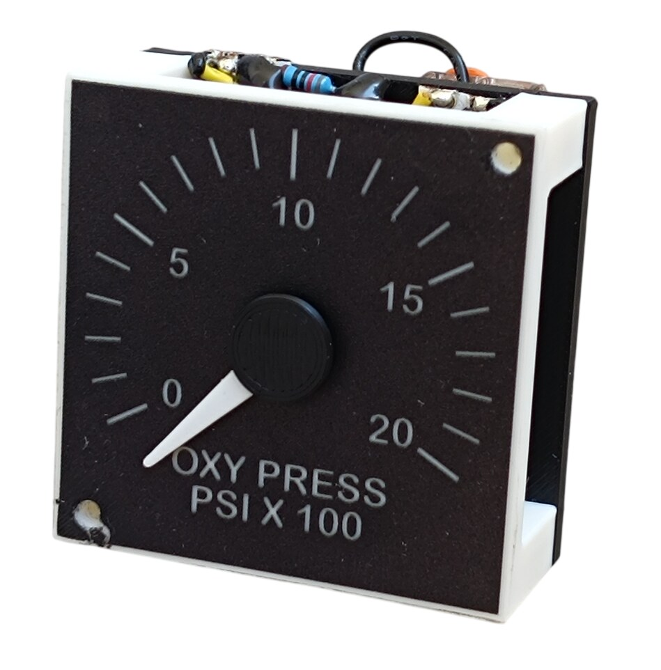
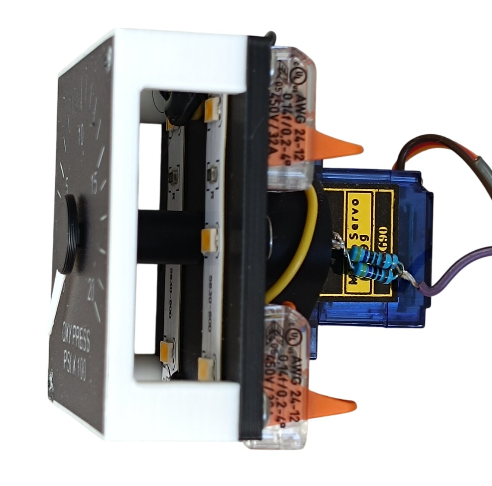
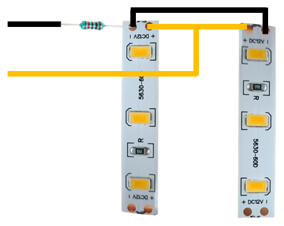
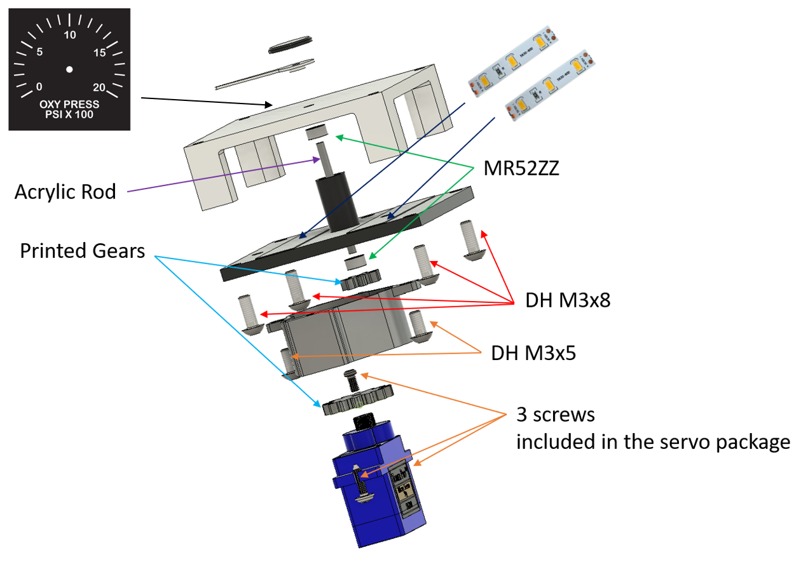

# 29. Oxygen Pressure Gauge

[📦 Download the printable model on MakerWorld](https://makerworld.com/en/models/3309881-boeing-737-overhead-oxygen-pressure-gauge)

[← Back to model list](README.md)

---

> **Note**
> This gauge is a model of its own - it is not part of any panel model. **One** is needed for the complete project, on the **Engine and Oxygen Panel**.
>
> It is built the same way as the [Temperature and Climb Gauges](21-temperature-and-climb-gauges.md). What makes it a different instrument is the UV-printed scale stuck to its face - OXY PRESS, PSI × 100 - the shape of its needle, and the size of the body itself: this one is a **49 × 49 mm** box, not 52 × 52 mm.

---

## Photos

<table>
<tbody>
<tr>
<td align="center" width="50%"> The finished gauge</td>
<td align="center" width="50%"> From the side - the two backlight LED strips inside the housing, the servo and the two splice connectors</td>
</tr>
</tbody>
</table>

---

## How It Works

The needle is driven by an **SG90 servo** through a pair of printed gears. The **14-tooth** gear sits on the servo, the **7-tooth** gear on the needle shaft, so the needle turns **twice as far as the servo** - the 180° of an SG90 become a full turn of the needle.

The needle shaft itself is a **2 mm acrylic rod** running in two **MR52ZZ** ball bearings, one in the top plate and one in the backlight plate. The rod is not only a shaft: a white LED underneath shines up through it, so the rod also carries light into the needle. The 7-tooth gear sits in that light path, which is why it is printed in **transparent** PLA.

The dial itself is lit separately, by two LED strips inside the housing - see [Backlight](#backlight).

---

## Filament

| | Colour | Filament |
|---|---|---|
|  | Black | Bambu PLA Basic Black (10101) |
|  | White | Bambu PLA Basic Jade White (10100) |
|  | Transparent | Filament PM PLA Transparent |

---

## 3D Printed Parts

| Qty | Part | Colour | Notes |
|---:|---|---|---|
| 1× | top | White | the front plate - the UV-printed scale goes on it and it diffuses the backlight |
| 1× | backlight | Black | print with **supports** |
| 1× | cover | Black | the servo bracket; print with **supports** |
| 1× | gear 14t | Black | on the servo |
| 1× | gear 7t | Transparent | on the needle shaft, in the light path of the needle LED |
| 1× | needle - blade | White | |
| 1× | needle - centre cap | Black | covers the hub of the blade |

---

## Electronic and Mechanical Components

| Qty | Part | Reference |
|---:|---|---|
| 1× | **Servo SG90** - 180°, plastic gears | [Product I used](../../images/parts/AE_servo_SG90.png) |
| 2× | **Ball bearing MR52ZZ** - 2 × 5 × 2.5 mm | [Product I used](../../images/parts/AE_bearing_MR52ZZ.png) |
| 1× | **Acrylic rod** - 2 mm, transparent; the needle shaft is cut from it | [Product I used](../../images/parts/AE_acrylic_rod.png) |
| 1× | **White 5 mm flat top LED** - the same one the annunciators use | [Product I used](../../images/parts/AE_led_white.png) |
| 1× | **150 Ω resistor** - in series with the white LED | |
| 2× | **LED strip** - the scale backlight | [Product I used](../../images/parts/AE_led_strip.png) |
| 1× | **820 Ω resistor** - in series with the two LED strips | |
| 2× | **Splice connector** - lever type, for the 12 V of the scale backlight | |

The three self-tapping screws that come with the servo are used as well: two hold the servo to the cover, the third fastens the 14-tooth gear to the servo shaft.

---

## Screws

| Qty | Screw | Joins |
|---:|---|---|
| 4× | Dome head M3×8 | backlight plate + top plate |
| 2× | Dome head M3×5 | cover + backlight plate |

---

## UV Print Files

| Qty | File |
|---:|---|
| 1× | A4 PDF - gauge scales |

One sheet carries the scales for all the gauges of the overhead. The PDF and the printing instructions are on the [UV Print Files](../uv-print.md) page.

---

## Backlight

### Scale

The scale is lit by two LED strips inside the housing, one on each side, shining through the white top plate from behind. They run on **12 V** taken from the backlighting of the Engine and Oxygen Panel, so the gauge dims together with that panel - see [Power supply](../system-overview.md#power-supply).

The two strips are not wired straight across that 12 V: an **820 Ω resistor** goes in series with the pair. The white top plate passes far more light than the printed face of a panel does, so on the bare supply the scale burns out much brighter than the lettering around it. The resistor holds it back to the brightness of the rest of the overhead.

The two strips sit in parallel and the resistor goes in the lead feeding them, close to the strips.

### Needle

The needle has a light of its own: a white 5 mm LED under the needle shaft, shining up through the transparent 7-tooth gear and the acrylic rod into the needle. It runs on **5 V** with a **150 Ω** resistor in series.

In the side photo there are two resistors on the servo, not one - I had no 150 Ω to hand and made the value up from two. One resistor of the right value does the same job.

> **Note**
> The needle lighting works, but the effect is weak. White PLA does not carry light well over the length of a needle, so the needle glows rather than lights up. It is worth building - but do not expect the needle to stand out the way the scale does.

---

## Wiring

The gauge has three connections.

| Connection | Supply | Comes from |
|---|---|---|
| Servo | 5 V | the control signal, **+5 V** and **GND**, all three from the pin headers at **pin 8** of the RJ45 Direct PCB on the [Interphone and Dome Panel](27-interphone-and-dome-panel.md#wiring) |
| Needle LED | 5 V | **+5 V** and **GND** from the **-** and **+** pins at position **7** of the same board |
| Scale backlight | 12 V | the backlighting of the Engine and Oxygen Panel, through an **820 Ω** resistor - see [Backlight](#backlight) |

> **⚠️ The servo plug has to be rewired**
> The SG90 does not leave the factory in the order the RJ45 Direct PCB expects, so the servo will **not** work if you plug it in as it comes. **Swap the red and the yellow wire:**
>
> | | Wire order in the plug |
> |---|---|
> | As delivered | brown - red - yellow |
> | **Needed** | **brown - yellow - red** |
>
> Lift the small tabs on the plastic housing, pull those two crimped contacts out and swap them over. Brown stays where it is. (On some SG90s the yellow wire is orange instead - it is the signal wire either way.)

The 12 V for the scale backlight is brought over from the panel's own backlighting with two **lever-type splice connectors**, one for +12 V and one for GND. Where they sit is up to you - both on the gauge works fine, and so does one on the gauge and one on the panel. There is nothing to screw them to, so **glue them down with super glue.**

---

## Assembly Diagram

Screw abbreviations used in the diagram: **DH** = dome head.

> **Note**
> Three of the joints may need a drop of super glue, depending on how tight they come out of your printer: the **7-tooth gear** on the acrylic rod, the **white needle** on the acrylic rod, and the **black centre cap** on the white needle.
