# 30. Engine and Oxygen Panel

[📦 Download the printable model on MakerWorld](https://makerworld.com/en/models/3311720-boeing-737-overhead-engine-and-oxygen-panel)

[← Back to model list](README.md)

---

## Photos

<table>
<tbody>
<tr>
<td align="center" width="50%">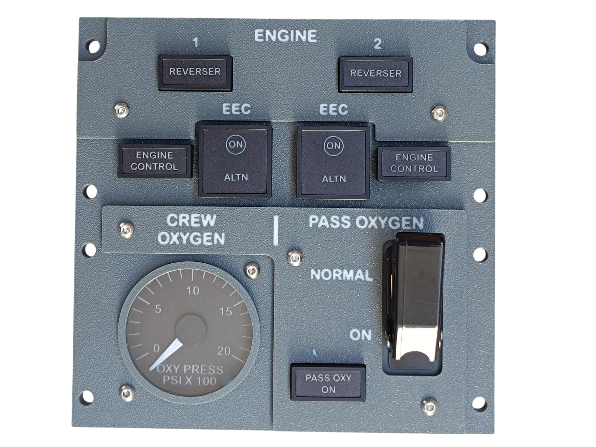 Finished panel</td>
<td align="center" width="50%">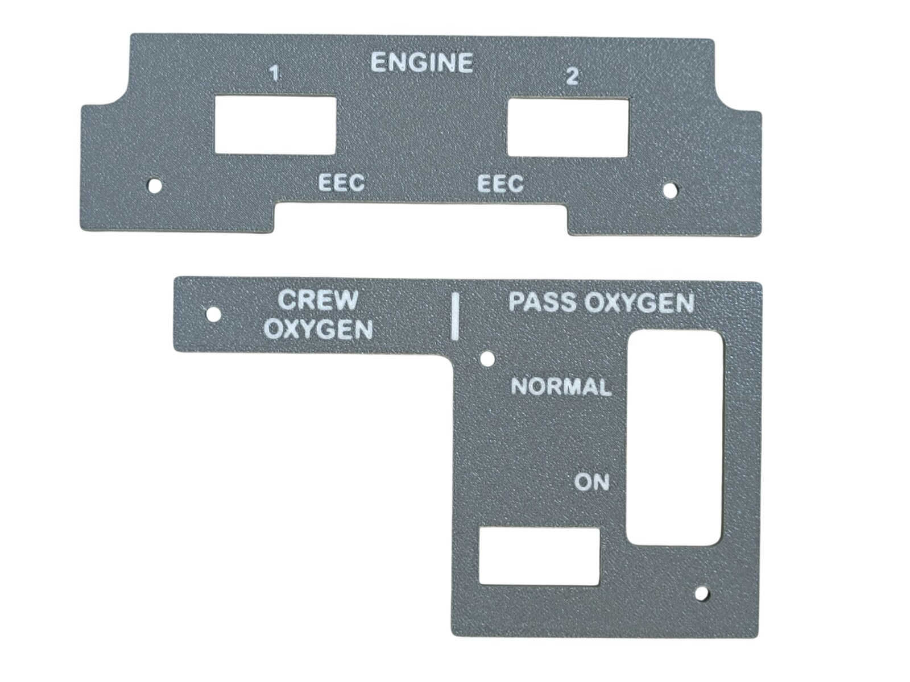 The two top panels - Dark Gray with the lettering in Jade White</td>
</tr>
</tbody>
<tbody>
<tr>
<td align="center" width="50%">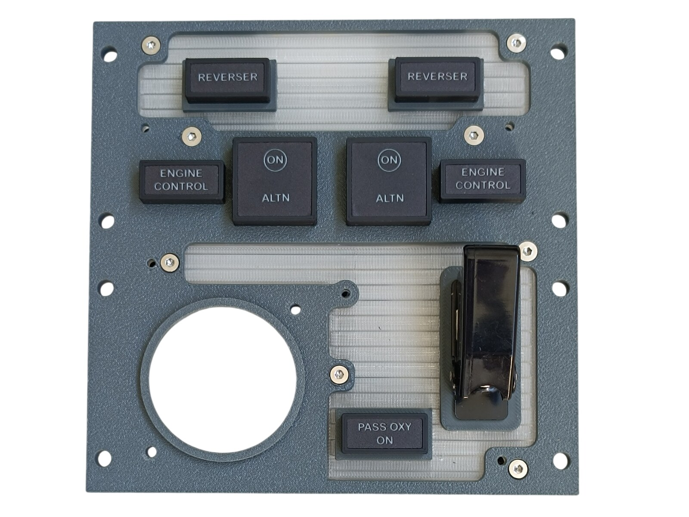 The bottom panel with both diffusers, the annunciators and the guarded PASS OXYGEN switch</td>
<td align="center" width="50%">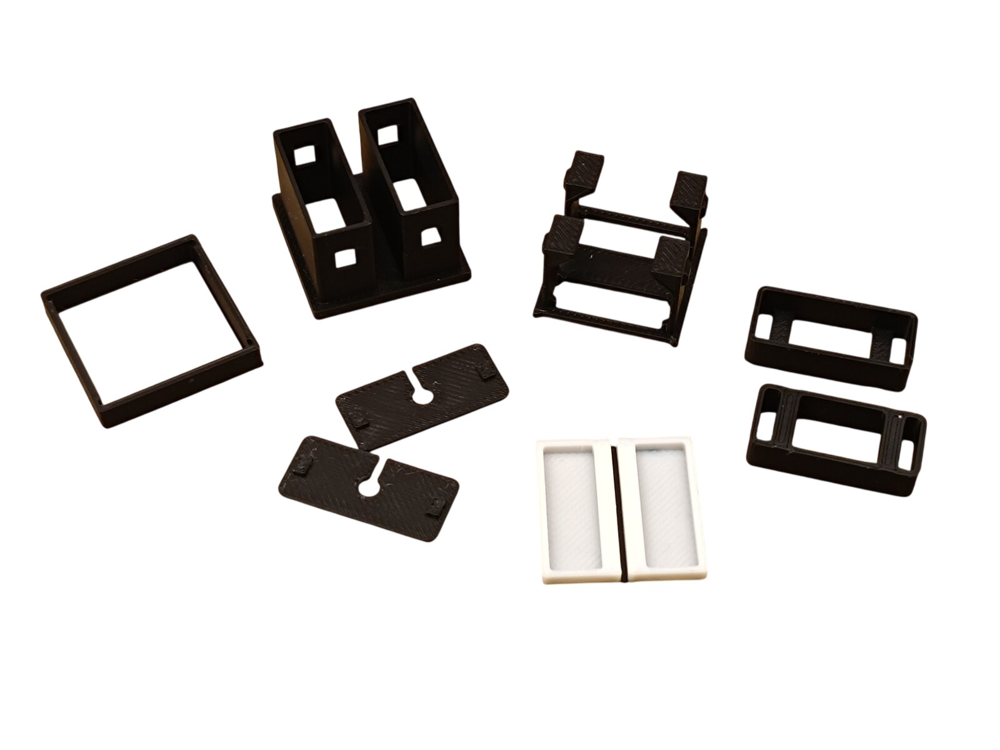 The printed parts of one large special annunciator - two pcb-holders and two covers, because it carries two PCBs</td>
</tr>
</tbody>
<tbody>
<tr>
<td align="center" width="50%">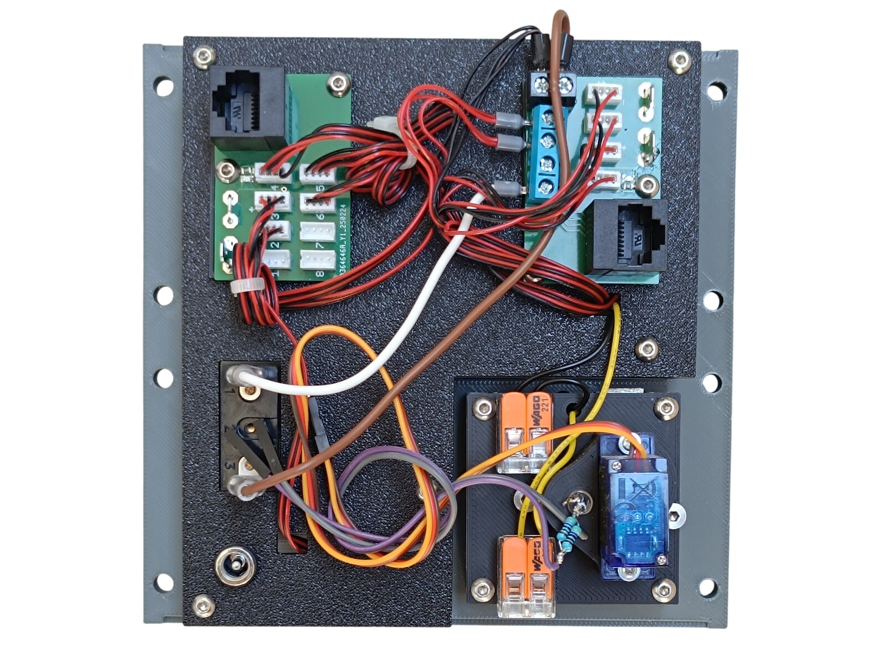 Rear side - the two PCBs, the switch, the DC jack and the gauge</td>
<td align="center" width="50%"></td>
</tr>
</tbody>
</table>

---

## Filament

| | Colour | Filament |
|---|---|---|
|  | Dark Gray | C-Tech Premium Line PLA RAL7011 |
|  | Transparent | Filament PM PLA Transparent |
|  | White | Bambu PLA Basic Jade White (10100) |
|  | Black | Bambu PLA Basic Black (10101) |

---

## 3D Printed Parts

| Qty | Part | Notes |
|---:|---|---|
| 1× | Top panel 1 | print on a **Textured** PEI plate |
| 1× | Top panel 2 | print on a **Textured** PEI plate |
| 1× | Bottom panel | print on a **Textured** PEI plate |
| 1× | Bezel | print on a **Textured** PEI plate |
| 1× | Diffuser panel 1 | print on a **Smooth** PEI plate |
| 1× | Diffuser panel 2 | print on a **Smooth** PEI plate |
| 1× | Backlight panel | |
| 2× | PCB frame | |
| 8× | M4 washer | |
| 5× | Standoff 16 mm | |

### Special annunciators

The two large EEC annunciators are part of this model. They use the same six parts as a standard [annunciator](02-annunciators.md) and go together the same way, but each one carries **two** PCBs, so it needs two pcb-holders and two covers.

| Qty | Part | Notes |
|---:|---|---|
| 2× | outer-part | |
| 2× | inner-part | |
| 2× | table | white |
| 2× | table-frame | |
| 4× | pcb-holder | |
| 4× | pcb-holder-cover | |

---

## Switches and Buttons

| Qty | Type |
|---:|---|
| 1× | KN3(C)-101 or KN3(C)-102, ON/OFF |
| 1× | Toggle switch safety guard, black |

The switch is PASS OXYGEN - NORMAL and ON - and it sits under the guard.

---

## Gauge

The CREW OXYGEN pressure instrument is a separate model - it is **not included** in this download. The bezel that rings it is part of this panel; the acrylic window between the two is not printed at all, it is cut - see [CNC Cut Files](#cnc-cut-files).

| | |
|---|---|
| 📦 Printable model | [Boeing 737 Overhead - Oxygen Pressure Gauge](https://makerworld.com/en/models/3309881-boeing-737-overhead-oxygen-pressure-gauge) |
| 🔧 Build notes | [Oxygen Pressure Gauge](29-oxygen-pressure-gauge.md) |

Its servo and its needle LED are fed from the [Interphone and Dome Panel](27-interphone-and-dome-panel.md#wiring), not from the boards on this panel; the 12 V for its scale comes from this panel's [Backlight](#backlight).

---

## Screws

| Qty | Screw | Joins |
|---:|---|---|
| 3× | Flat head M3×6 | bottom + diffuser |
| 5× | Flat head M3×12 | bottom + standoff |
| 8× | Flat head M4×16 | bottom + main frame |
| 4× | Dome head M3×5 | PCB + backlight |
| 10× | Dome head M3×8 | top + bottom, backlight + standoff |
| 2× | Dome head M3×12 | bottom + gauge |

---

## Annunciators

| Qty | Type |
|---:|---|
| 5× | Black background, yellow LED |
| 2× | Large special annunciator, white LED in the upper section and yellow LED in the lower section |

The five standard ones are REVERSER and ENGINE CONTROL, twice each, and PASS OXY ON. The two special ones are the EEC pushbuttons - **ON** in the upper section, **ALTN** in the lower.

The standard annunciators are a separate model shared with the other panels - they are **not included** in this download. The two special ones are, and they are wired differently - see [Wiring](#wiring).

| | |
|---|---|
| 📦 Printable model | [Boeing 737 Overhead - Annunciators](https://makerworld.com/en/models/3121595-boeing-737-overhead-annunciators) |
| 🔧 Build notes | [Annunciators](02-annunciators.md) |
| 🔌 PCB, BOM and wiring | [Annunciator PCB](../pcb/annunciator.md) |

---

## UV Print Files

| Qty | File |
|---:|---|
| 1× | A4 PDF - annunciator labels |

The two tall **ON / ALTN** labels of the special annunciators are on that sheet as well. The PDF and the printing instructions are on the [UV Print Files](../uv-print.md) page.

---

## CNC Cut Files

| Qty | File | Size |
|---:|---|---|
| 1× | cnc_gauge_43-8.dxf | Ø 43.8 mm |

This is the round window that goes in front of the CREW OXYGEN pressure gauge, behind the bezel. The drawing, the material and the cutting notes are on the [CNC Cut Files](../cnc-cut.md) page.

The window is glued to the bezel.

> **Note**
> Do not use cyanoacrylate (superglue) for that joint. As it cures it leaves a white film on the surface around the joint, not only where the glue was applied, and on a clear window it is impossible to miss. A two-part epoxy is a good choice instead.

---

## PCB

| Qty | PCB | Connections used | Gerber files |
|---:|---|---|---|
| 1× | [RJ45 LED Driver](../pcb/rj45-driver.md) | headers 1–8 | [📥 PCB_RJ45_Driver.zip](https://raw.githubusercontent.com/om7ea/B737/main/PCB/PCB_RJ45_Driver.zip) |
| 1× | [RJ45 Combined](../pcb/rj45-combined.md) | headers 1–4, pins 5, 7 and 8 | [📥 PCB_RJ45_Combined.zip](https://raw.githubusercontent.com/om7ea/B737/main/PCB/PCB_RJ45_Combined.zip) |

Both boards sit on the backlight panel, each in its own PCB frame. Mounting is shown in [step 3](#3-backlight-panel---pcbs-and-dc-jack) of the assembly diagram. Which annunciator and which switch each connection carries is in [Wiring](#wiring).

> **Note**
> Build the Combined board for this panel with a **two-way screw terminal in place of the `-` Faston**. Two things have to land on that contact at once: the wire from the PASS OXYGEN switch, and the ferrule holding the four ground wires of the special annunciators.

---

## Wiring

The panel takes **two** Ethernet patch cables to the [RJ45 Hub Shield](../pcb/rj45-hub-shield.md), and they go to **two different MEGA 2560 boards**.

| PCB | Patch cable goes to | Connections used |
|---|---|---|
| **PCB 1** | socket **D3** on **Overhead_2a** | headers 1–8 |
| **PCB 2** | socket **D3** on **Overhead_2b** | headers 1–4, pins 5, 7 and 8 |

The socket labels **D0–D6**, **A1** and **A2** are silkscreened on the hub shield.

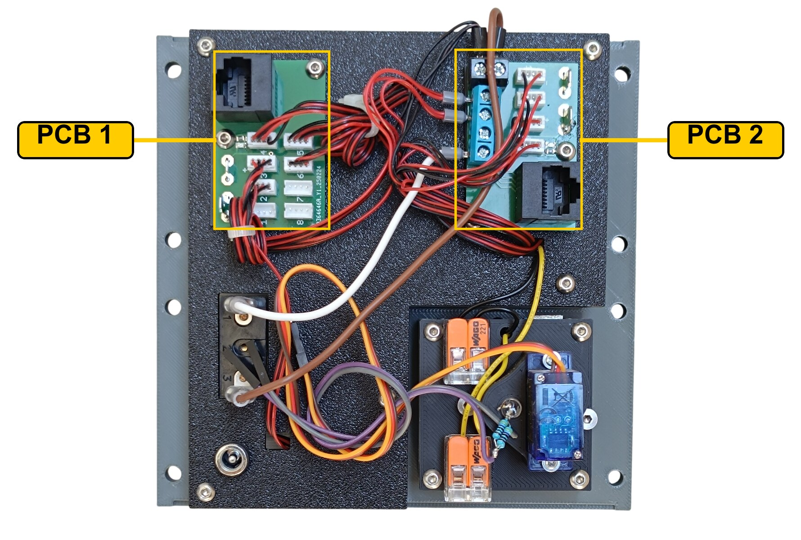

The rear of the panel. **PCB 1** is the board with the eight ZH headers and nothing else on it; **PCB 2** is the one with the blue screw terminal block down its side and the two-way terminal on its top edge. The gauge is at the bottom right, with its servo and the two pairs of lever-type splice connectors that feed its scale.

### PCB 1 - socket D3 on Overhead_2a

| Header | Annunciator |
|---:|---|
| 1 | RIGHT GEAR |
| 2 | PASS OXY ON |
| 3 | ENGINE CONTROL 2 |
| 4 | REVERSER 1 |
| 5 | REVERSER 2 |
| 6 | ENGINE CONTROL 1 |
| 7 | LEFT GEAR |
| 8 | NOSE GEAR |

Headers 1, 7 and 8 do not belong to this panel. They drive the three annunciators of the [Landing Gear Indicator Panel](16-landing-gear-indicator-panel.md), which has no board of its own - its ZH cables run across to this board.

### PCB 2 - socket D3 on Overhead_2b

| Header | Annunciator |
|---:|---|
| 1 | EEC 1 - ON |
| 2 | EEC 1 - ALTN |
| 3 | EEC 2 - ALTN |
| 4 | EEC 2 - ON |

| Pin | Switch |
|---:|---|
| 5 | PASS OXYGEN |
| 7 | EEC 2 |
| 8 | EEC 1 |

### The special annunciators

Each of the two special annunciators is built from **two** annunciator PCBs - the white LED lights the upper **ON** section, the yellow one the lower **ALTN** section. They go together exactly like a standard annunciator, but their cables have to be re-terminated: the ZH plug that goes to the header keeps only the two LED wires, and the button wires are taken out of it.

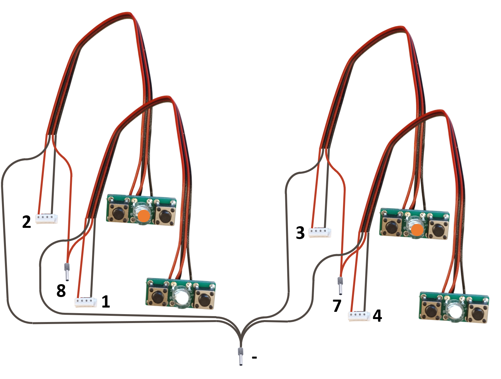

The numbers are the connections on PCB 2. **1** and **2** are the two LED headers of EEC 1 and **3** and **4** those of EEC 2; **8** and **7** are the pins that read the buttons, one ferrule per annunciator; **-** is the common ferrule that goes into the screw terminal.

**The switch and the two EEC buttons share a single ground return.** Each takes one of its terminals to its own pin on the Combined PCB. The opposite terminals are commoned and end at a **-** (ground) contact.

---

## Backlight

| Qty | Part | Reference |
|---:|---|---|
| 4× | LED strip | [Product I used](../../images/parts/AE_led_strip.png) |
| 1× | DC jack 5.5 × 2.5 mm | [Product I used](../../images/parts/AE_dc_jack.png) |

Powered from the **12 V** supply - see [Power supply](../system-overview.md#power-supply). The gauge takes the 12 V for its scale from here as well, through two lever-type splice connectors - see [Oxygen Pressure Gauge](29-oxygen-pressure-gauge.md#wiring).

---

## Assembly Diagram

Screw abbreviations used in the diagrams: **FH** = flat head, **DH** = dome head.

### 1. Bottom panel

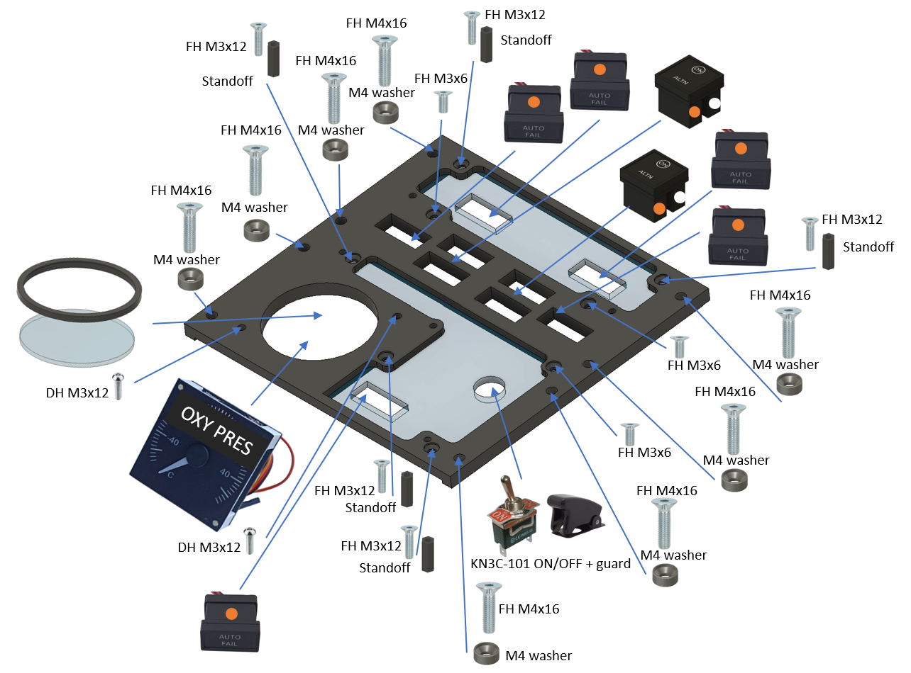

### 2. Backlight panel - LED strips

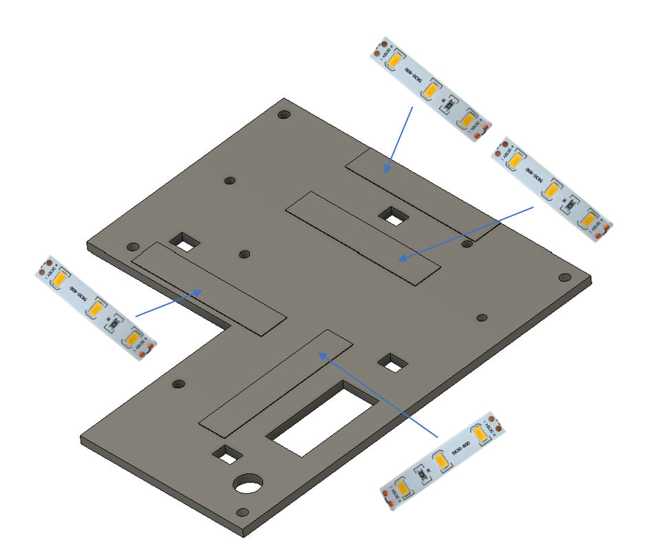

### 3. Backlight panel - PCBs and DC jack

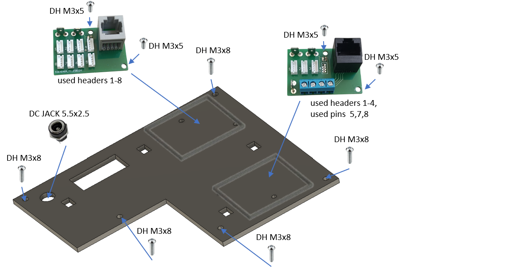

### 4. Top panels

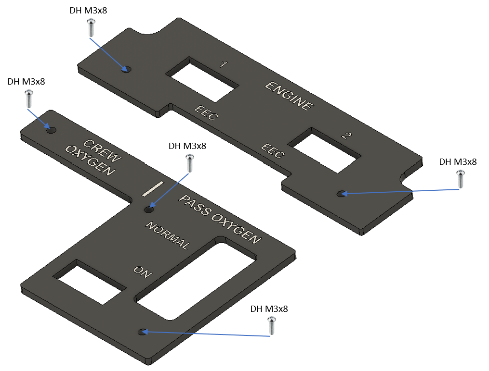
