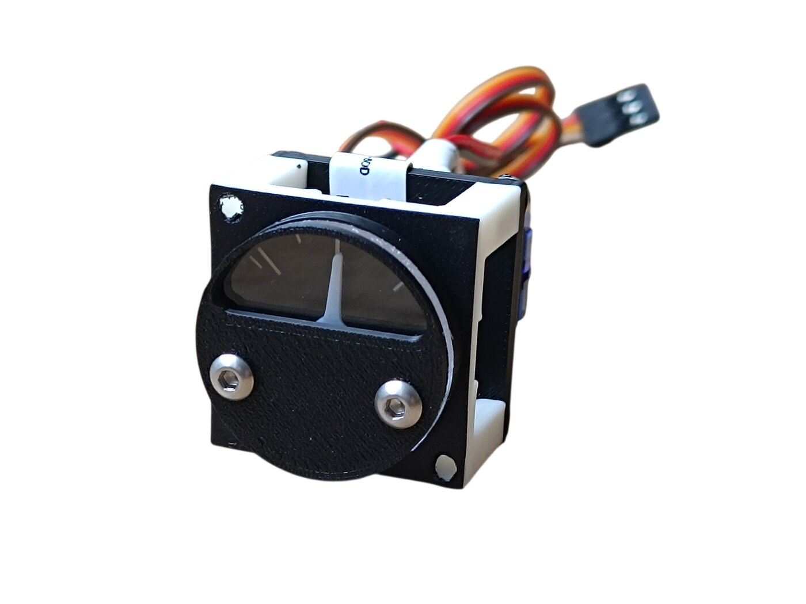
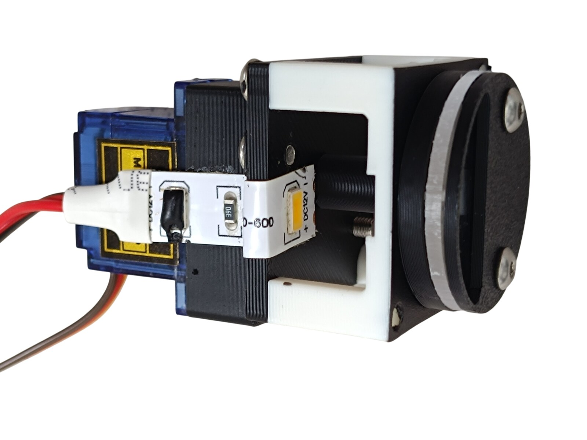
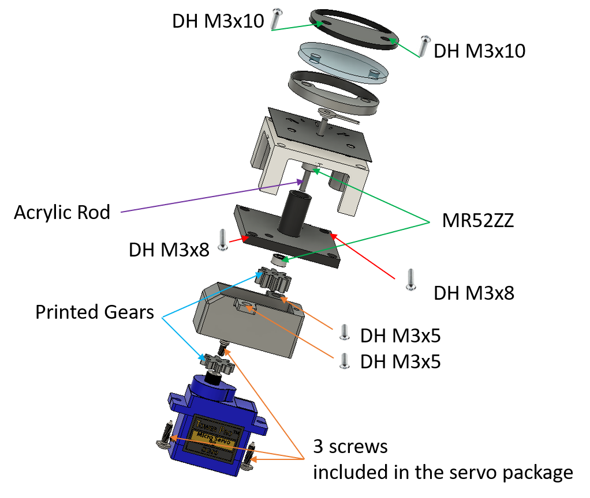

# 31. Outflow Valve Gauge

[📦 Download the printable model on MakerWorld](https://makerworld.com/en/models/3323749-boeing-737-overhead-outflow-valve-gauge)

[← Back to model list](README.md)

---

> **Note**
> This gauge is a model of its own - it is not part of any panel model. **One** is needed for the complete project, on the **[Cabin Pressure Control Panel](32-cabin-pressure-control-panel.md)**.
>
> It is built like the other gauges of the overhead, with two differences. Only the scale is lit - the needle carries no light of its own. And the acrylic window is screwed straight onto the gauge instead of being glued behind the bezel of a panel.

---

## Photos

<table>
<tbody>
<tr>
<td align="center" width="50%"> The finished gauge</td>
<td align="center" width="50%"> From above - the LED strip bent around the housing, the servo and the series resistor</td>
</tr>
</tbody>
</table>

---

## How It Works

The needle is driven by an **SG90 servo** through a pair of printed gears, the servo gear on the servo shaft and the rod gear on the needle shaft. The needle shaft itself is a **2 mm acrylic rod** running in two **MR52ZZ** ball bearings, one in the top panel and one in the backlight part.

---

## Filament

| | Colour | Filament |
|---|---|---|
|  | White | Bambu PLA Basic Jade White (10100) |
|  | Black | Bambu PLA Basic Black (10101) |

---

## 3D Printed Parts

| Qty | Part | Colour | Notes |
|---:|---|---|---|
| 1× | top panel | White | print on a **Smooth** PEI plate |
| 1× | backlight | Black | print on a **Smooth** PEI plate; the supports it needs are already set in the print file |
| 1× | gear cover | Black | print on a **Smooth** PEI plate |
| 1× | rod gear | Black | print on a **Smooth** PEI plate |
| 1× | servo gear | Black | print on a **Smooth** PEI plate |
| 1× | needle | White | print on a **Smooth** PEI plate |
| 1× | top cover | Black | print on a **Smooth** PEI plate |
| 1× | gauge cover | Black | print on a **Textured** PEI plate |

---

## Electronic and Mechanical Components

| Qty | Part | Reference |
|---:|---|---|
| 1× | **Servo SG90** - 180°, plastic gears | [Product I used](../../images/parts/AE_servo_SG90.png) |
| 2× | **Ball bearing MR52ZZ** - 2 × 5 × 2.5 mm | [Product I used](../../images/parts/AE_bearing_MR52ZZ.png) |
| 1× | **Acrylic rod** - 2 mm, transparent; the needle shaft is cut from it | [Product I used](../../images/parts/AE_acrylic_rod.png) |
| 1× | **LED strip** - the scale backlight | [Product I used](../../images/parts/AE_led_strip.png) |
| 1× | **820 Ω resistor** - in series with the LED strip | |
| 2× | **Splice connector** - lever type, for the 12 V of the scale backlight | |

The three self-tapping screws that come with the servo are used as well: two hold the servo to the gear cover, the third fastens the servo gear to the servo shaft.

---

## Screws

| Qty | Screw | Joins |
|---:|---|---|
| 2× | Dome head M3×10 | gauge cover + window + top cover, into the top panel |
| 2× | Dome head M3×8 | backlight + top panel |
| 2× | Dome head M3×5 | gear cover + backlight |

---

## CNC Cut Files

| Qty | File | Size |
|---:|---|---|
| 1× | cnc_gauge_29-8.dxf | Ø 29.8 mm, with two Ø 3.3 mm holes 20 mm apart |

This is the round window of the gauge. The drawing, the material and the cutting notes are on the [CNC Cut Files](../cnc-cut.md) page.

Unlike the other gauges of the overhead, this window is not glued behind the bezel of a panel. It is screwed straight onto the gauge, between the gauge cover and the top cover, by the two M3×10 screws - which is what the two holes in the drawing are for.

---

## UV Print Files

| Qty | File |
|---:|---|
| 1× | A4 PDF - gauge scales |

One sheet carries the scales for all the gauges of the overhead. The PDF and the printing instructions are on the [UV Print Files](../uv-print.md) page.

---

## Backlight

The scale is lit by a **single LED strip**, bent around the backlight part and the gear cover and glued down with super glue. The strip carries three LEDs but only one of them is used here - I covered the other two with black hot glue.

It runs on **12 V** taken from the backlighting of the Cabin Pressure Control Panel, so the gauge dims together with that panel - see [Power supply](../system-overview.md#power-supply). An **820 Ω resistor** goes in series with the strip. The white top panel passes far more light than the printed face of a panel does, so on the bare supply the scale burns out much brighter than the lettering around it. The resistor holds it back to the brightness of the rest of the overhead.

There is **no light in the needle**. On this gauge the scale is the only thing that is lit.

---

## Wiring

The gauge has two connections.

| Connection | Supply | Comes from |
|---|---|---|
| Servo | 5 V | the control signal, **+5 V** and **GND**, all three from the pin headers at **pin 6** of the RJ45 Direct PCB on the [Cabin Pressure Control Panel](32-cabin-pressure-control-panel.md#wiring) - socket **D4** on **Overhead_5** |
| Scale backlight | 12 V | the backlighting of the Cabin Pressure Control Panel, through an **820 Ω** resistor - see [Backlight](#backlight) |

> **⚠️ The servo plug has to be rewired**
> The SG90 does not leave the factory in the order the RJ45 Direct PCB expects, so the servo will **not** work if you plug it in as it comes. **Swap the red and the yellow wire:**
>
> | | Wire order in the plug |
> |---|---|
> | As delivered | brown - red - yellow |
> | **Needed** | **brown - yellow - red** |
>
> Lift the small tabs on the plastic housing, pull those two crimped contacts out and swap them over. Brown stays where it is. (On some SG90s the yellow wire is orange instead - it is the signal wire either way.)

The 12 V for the scale backlight is brought over from the panel's own backlighting with two **lever-type splice connectors**. There is nothing to screw them to, so they are glued down - on my build both sit on the backlight part of the panel.

---

## Assembly Diagram

Screw abbreviations used in the diagram: **DH** = dome head.

