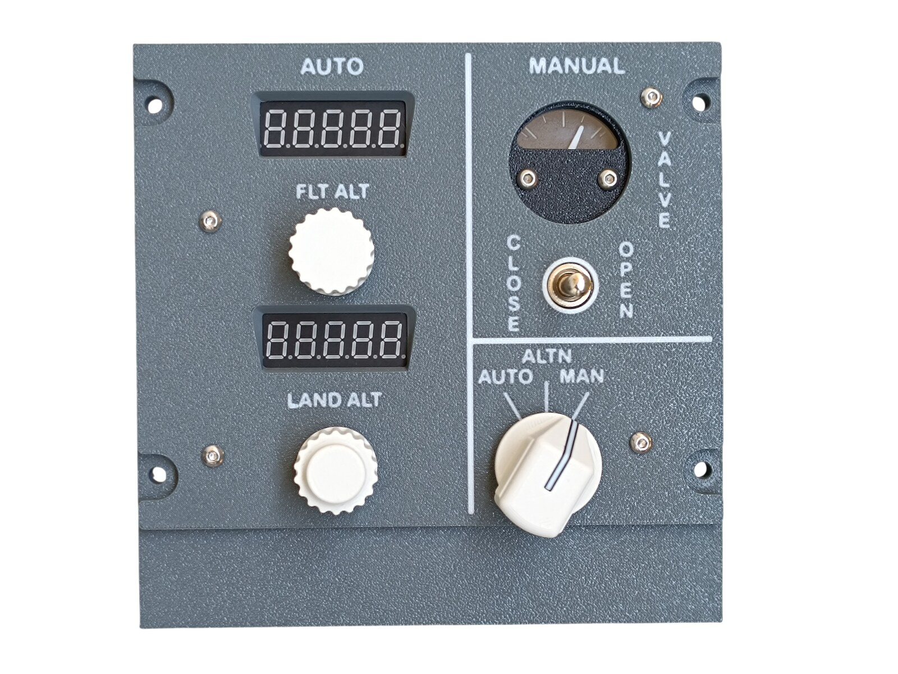
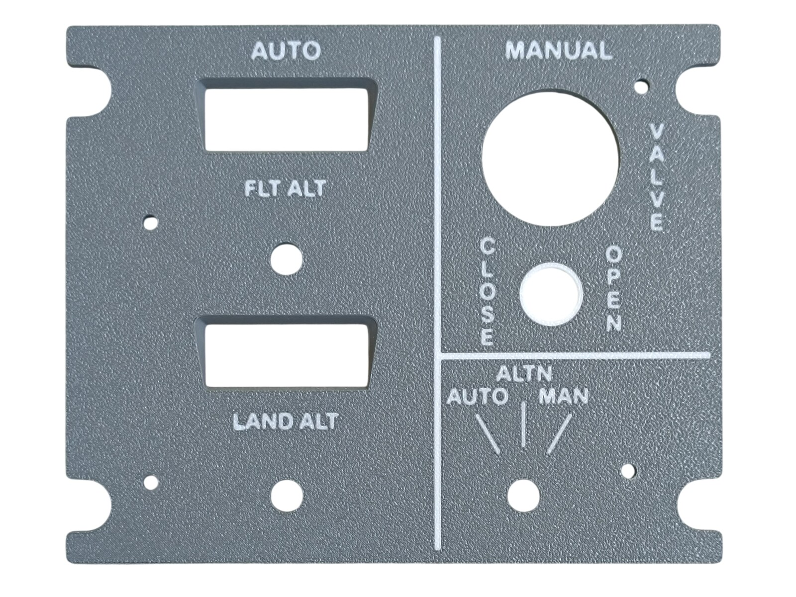
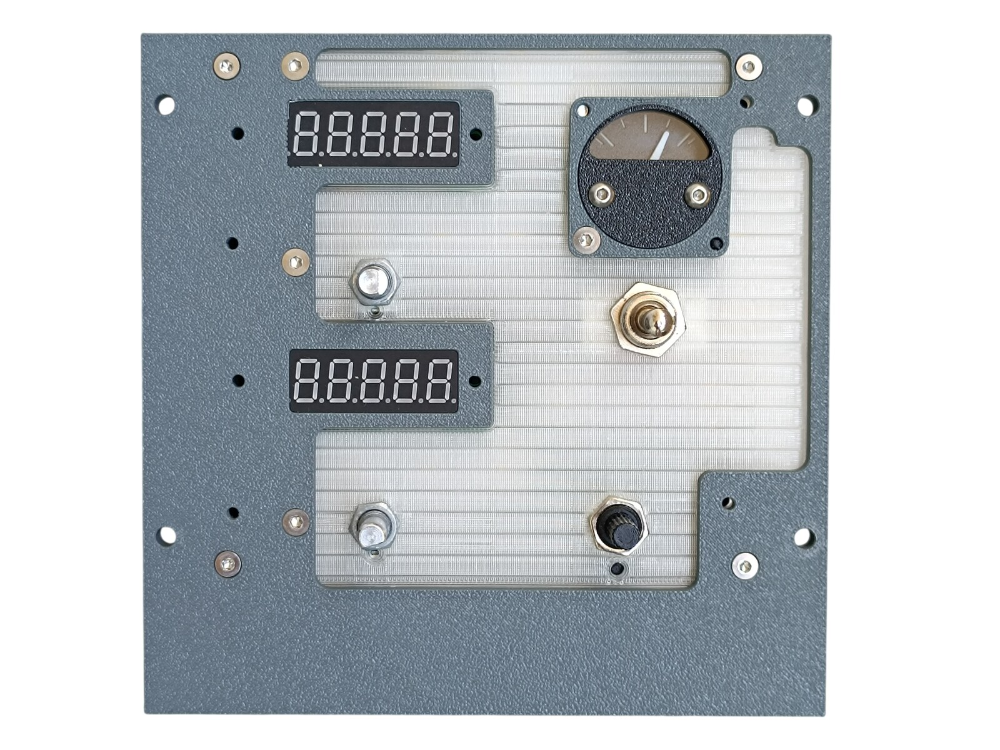
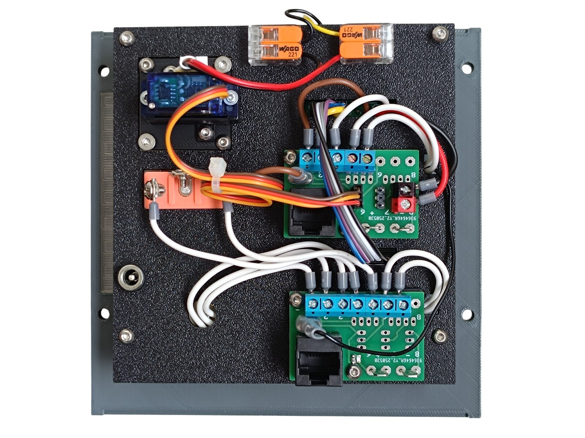
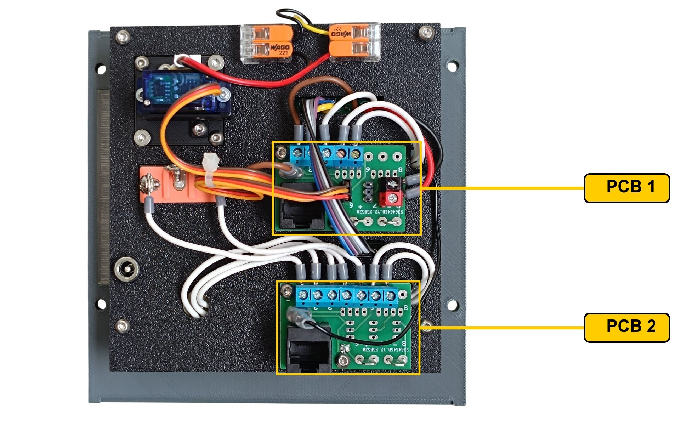
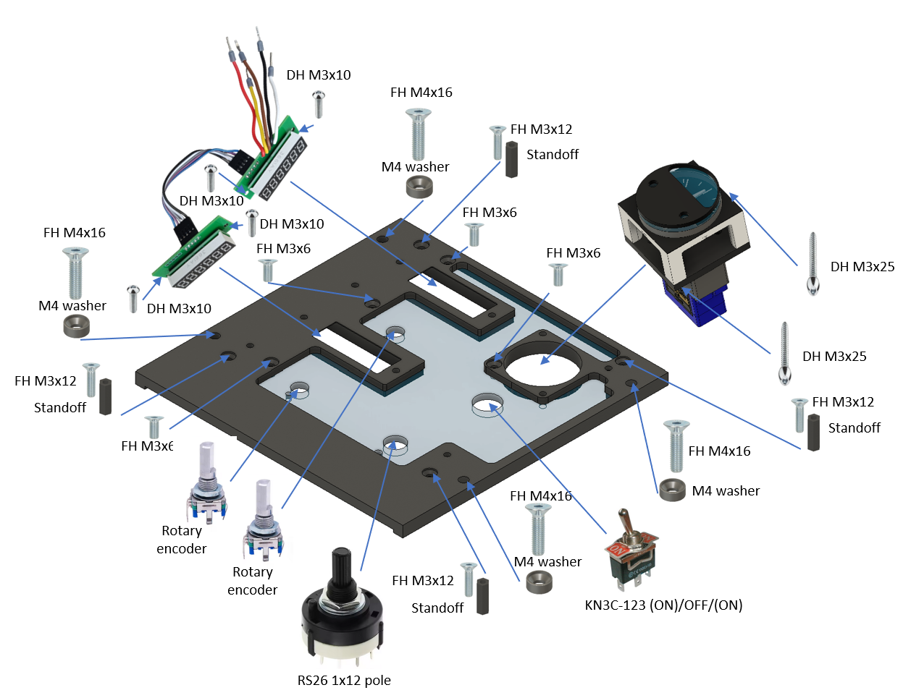
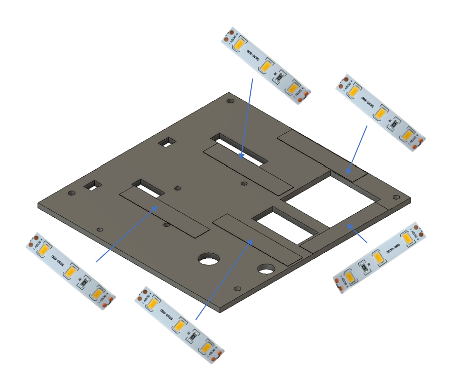
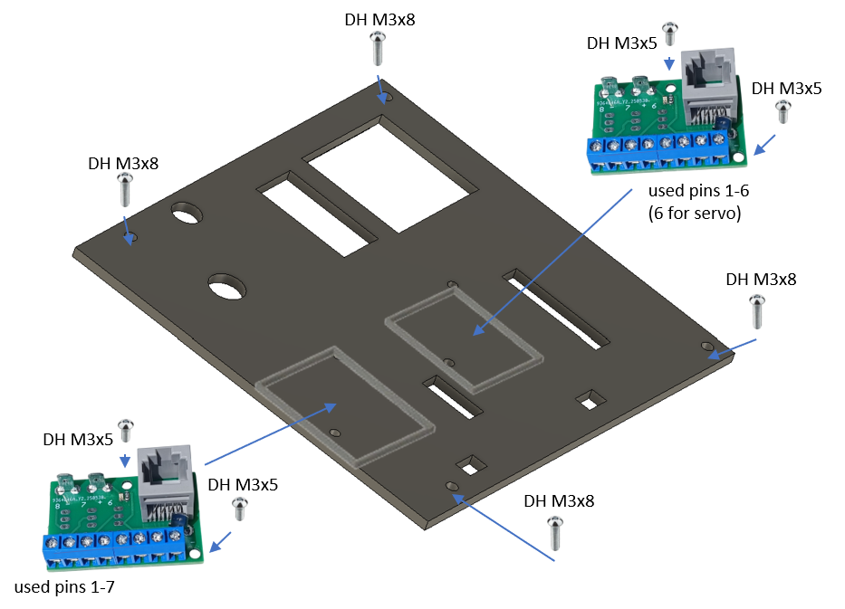
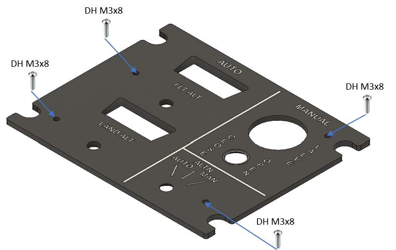

# 32. Cabin Pressure Control Panel

[📦 Download the printable model on MakerWorld](https://makerworld.com/en/models/3324181-boeing-737-overhead-cabin-pressure-control-panel)

[← Back to model list](README.md)

---

## Photos

<table>
<tbody>
<tr>
<td align="center" width="50%"> Finished panel</td>
<td align="center" width="50%"> The top panel - Dark Gray with the lettering in Jade White</td>
</tr>
</tbody>
<tbody>
<tr>
<td align="center" width="50%"> The two displays, the gauge, the VALVE switch and the mode selector, with the diffuser fitted, before the top panel goes on</td>
<td align="center" width="50%"> Rear side - the two PCBs, the gauge servo and the DC jack</td>
</tr>
</tbody>
</table>

---

## Filament

| | Colour | Filament |
|---|---|---|
|  | Dark Gray | C-Tech Premium Line PLA RAL7011 |
|  | Transparent | Filament PM PLA Transparent |
|  | White | Bambu PLA Basic Jade White (10100) |
|  | Black | Bambu PLA Basic Black (10101) |

---

## 3D Printed Parts

| Qty | Part | Notes |
|---:|---|---|
| 1× | Top panel | the Dark Gray plate with the Jade White lettering; print on a **Textured** PEI plate |
| 1× | Bottom panel | print on a **Textured** PEI plate |
| 1× | Diffuser panel | print on a **Smooth** PEI plate |
| 1× | Backlight panel | |
| 2× | PCB frame | |
| 4× | M4 washer | |
| 4× | Standoff 16 mm | |

---

## Switches and Buttons

| Qty | Type | Reference |
|---:|---|---|
| 1× | KN3(C)-123, (ON)/OFF/(ON) | |
| 1× | Rotary switch RS26, 12 positions | |
| 2× | **Rotary encoder EC11** - D shaft, 20 mm | [Product I used](../../images/parts/AE_encoder.png) |

The toggle switch is the outflow VALVE switch, momentary in both directions - CLOSE and OPEN. The rotary switch is the AUTO / ALTN / MAN mode selector; the RS26 has an adjustable end stop, so set it to **3** positions. The two encoders set FLT ALT and LAND ALT.

---

## Rotary Knobs

The knobs are a separate model shared with the other panels - they are **not included** in this download.

| Qty | Part |
|---:|---|
| 1× | Flt alt knob |
| 1× | Land alt knob |
| 1× | General knob, splined shaft |
| 1× | General knob indicator |

The Flt alt and Land alt knobs take no indicator.

| | |
|---|---|
| 📦 Printable model | [Boeing 737 Overhead - Rotary Knobs](https://makerworld.com/en/models/3066127-boeing-737-overhead-rotary-knobs) |
| 🔧 Build notes | [Rotary Knobs](03-rotary-knobs.md) |

---

## Gauge

The VALVE instrument is a separate model - it is **not included** in this download.

| | |
|---|---|
| 📦 Printable model | [Boeing 737 Overhead - Outflow Valve Gauge](https://makerworld.com/en/models/3323749-boeing-737-overhead-outflow-valve-gauge) |
| 🔧 Build notes | [Outflow Valve Gauge](31-outflow-valve-gauge.md) |

Its connections are in [Wiring](#wiring).

---

## Screws

| Qty | Screw | Joins |
|---:|---|---|
| 4× | Flat head M3×6 | bottom + diffuser |
| 4× | Flat head M3×12 | bottom + standoff |
| 4× | Flat head M4×16 | bottom + main frame |
| 4× | Dome head M3×5 | PCB + backlight |
| 8× | Dome head M3×8 | top + bottom, backlight + standoff |
| 4× | Dome head M3×10 | display PCB + bottom |
| 2× | Dome head M3×25 | gauge + bottom |

The four M4×16 screws each take one of the printed M4 washers. The M3×10 screws are two per display module.

---

## PCB

| Qty | PCB | Connections used | Gerber files |
|---:|---|---|---|
| 2× | [RJ45 Direct](../pcb/rj45-direct.md) | pins 1-6 on one, 1-7 on the other | [📥 PCB_RJ45_Direct.zip](https://raw.githubusercontent.com/om7ea/B737/main/PCB/PCB_RJ45_Direct.zip) |
| 2× | [Cabin Pressure Display](../pcb/cabin-pressure-display.md) | the FLT ALT and LAND ALT displays | [📥 board 1](https://raw.githubusercontent.com/om7ea/B737/main/PCB/PCB_Cabin_Pressure_Display_LED.zip) [📥 board 2](https://raw.githubusercontent.com/om7ea/B737/main/PCB/PCB_Cabin_Pressure_Display_MAX.zip) |

Each Cabin Pressure Display is a module of two boards soldered together, so two modules mean two of each board. The modules are mounted in [step 1](#1-bottom-panel---displays-gauge-switches-and-encoders) of the assembly diagram, the two RJ45 Direct boards in [step 3](#3-backlight-panel---pcbs). Which connection carries what is in [Wiring](#wiring).

---

## Wiring

Both RJ45 Direct PCBs hang off the same MEGA 2560, `Overhead_5`. Each one is connected by one Ethernet patch cable to a socket on the [RJ45 Hub Shield](../pcb/rj45-hub-shield.md).

| PCB | Patch cable goes to | Connections used |
|---|---|---|
| **PCB 1** | socket **D4** on **Overhead_5** | pins 1-6 |
| **PCB 2** | socket **D0** on **Overhead_5** | pins 1-7 |

The socket labels **D0-D6**, **A1** and **A2** are silkscreened on the hub shield.

The rear of the panel. **PCB 1** is the upper board, the one with five blue screw terminals. **PCB 2** is the lower board, with a row of seven screw terminals holding the white wires of the mode selector, the VALVE switch and the LAND ALT encoder. The two orange lever connectors at the top of the panel are the 12 V tap for the gauge backlight.

### PCB 1 - socket D4 on Overhead_5

| Pin | Connection |
|---:|---|
| 1 | FLT ALT and LAND ALT displays - LOAD |
| 2 | FLT ALT and LAND ALT displays - CLK |
| 3 | FLT ALT and LAND ALT displays - DIN |
| 4-5 | FLT ALT encoder |
| 6 | Outflow Valve Gauge - servo signal |

Pins 7 and 8 are not used.

The gauge servo takes its signal, **+5 V** and **GND** from the three-pin header on this board. The servo plug has to be rewired before it will work - see [Outflow Valve Gauge](31-outflow-valve-gauge.md#wiring).

The five wires of the FLT ALT display module are soldered straight into its input pads and reach this board; the output of that module feeds the LAND ALT module through a Dupont cable. Which pad is which is on the [Cabin Pressure Display](../pcb/cabin-pressure-display.md) page. Position **8** carries no signal - its screw terminal is the **5 V** and **GND** supply for the two display modules.

### PCB 2 - socket D0 on Overhead_5

| Pin | Connection |
|---:|---|
| 1 | Mode selector - MAN |
| 2 | Mode selector - ALTN |
| 3 | Mode selector - AUTO |
| 4 | VALVE switch - CLOSE |
| 5 | VALVE switch - OPEN |
| 6-7 | LAND ALT encoder |

Pin 8 is not used.

The gauge's scale backlight runs on 12 V from this panel's own backlighting, through the two lever-type splice connectors at the top of the panel.

**The switches share a single ground return.** Each switch takes one of its terminals to its own pin on the Direct PCB. The opposite terminals are commoned - daisy-chained from one switch to the next - and the chain ends at a **-** (ground) contact.

---

## Backlight

| Qty | Part | Reference |
|---:|---|---|
| 5× | LED strip | [Product I used](../../images/parts/AE_led_strip.png) |
| 1× | DC jack 5.5 × 2.5 mm | [Product I used](../../images/parts/AE_dc_jack.png) |

Powered from the **12 V** supply - see [Power supply](../system-overview.md#power-supply).

---

## Assembly Diagram

Screw abbreviations used in the diagrams: **FH** = flat head, **DH** = dome head.

### 1. Bottom panel - displays, gauge, switches and encoders

### 2. Backlight panel - LED strips

### 3. Backlight panel - PCBs

### 4. Top panel

