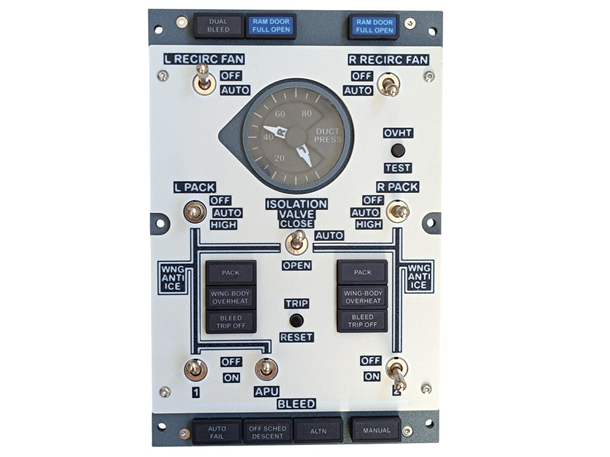
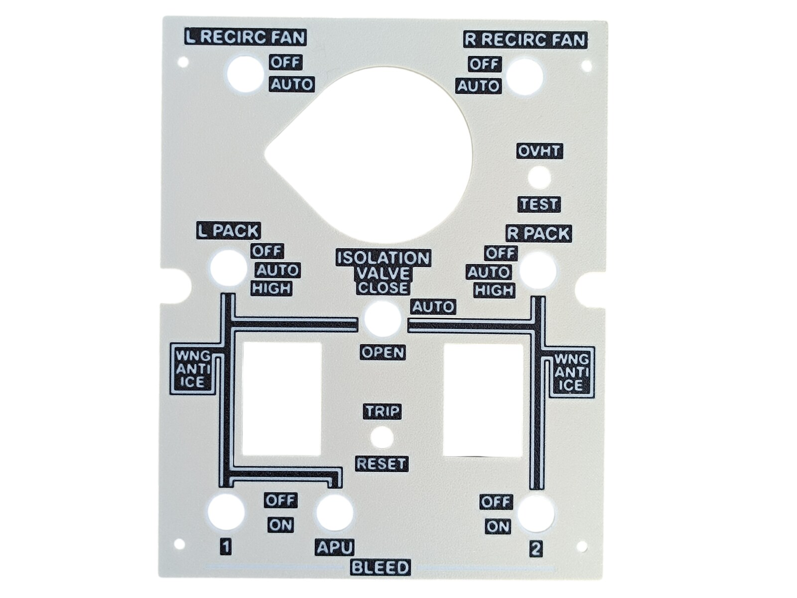
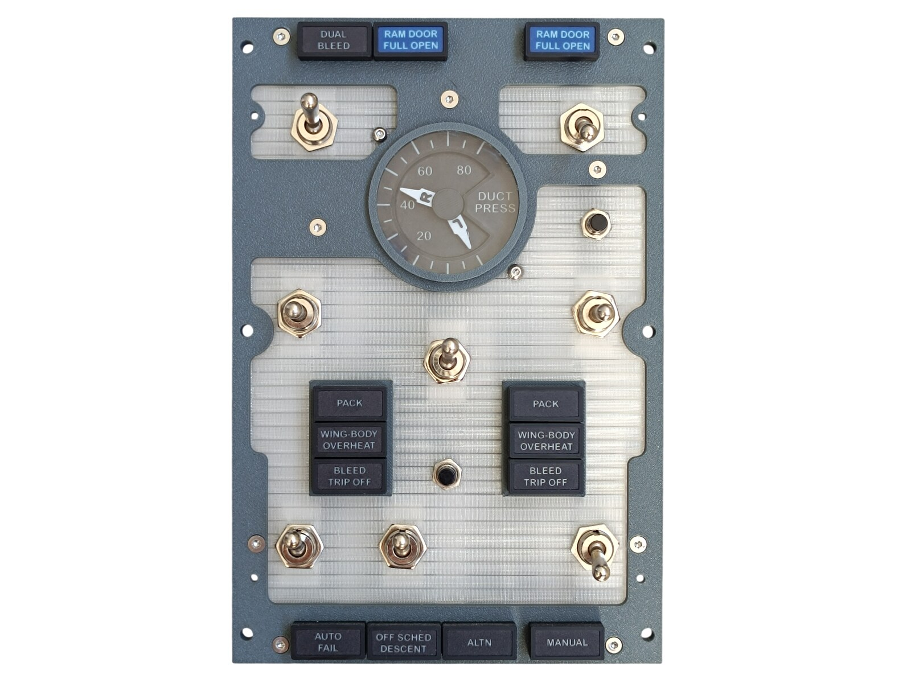
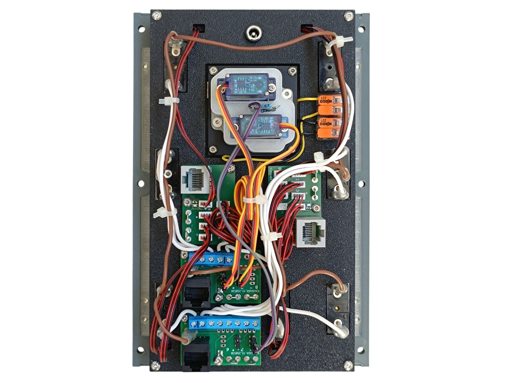
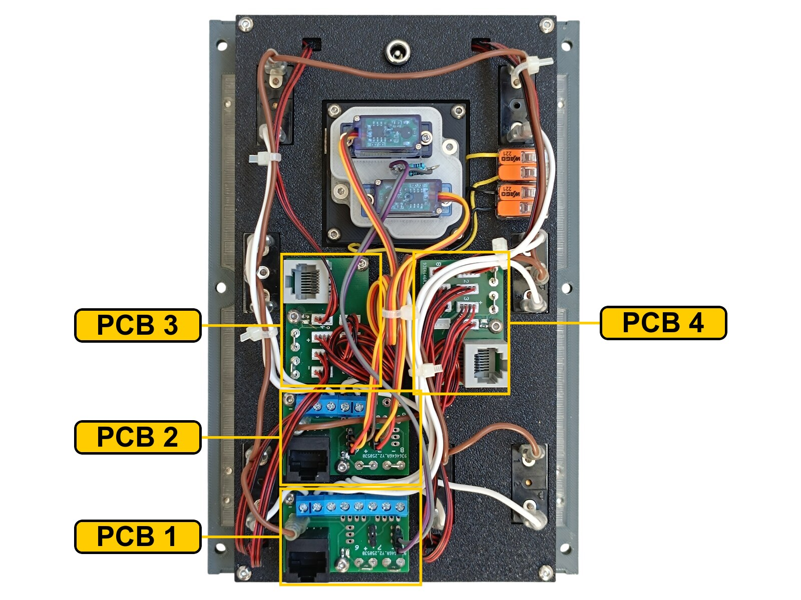
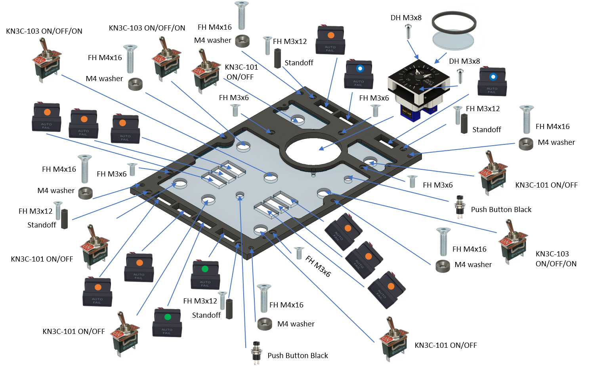
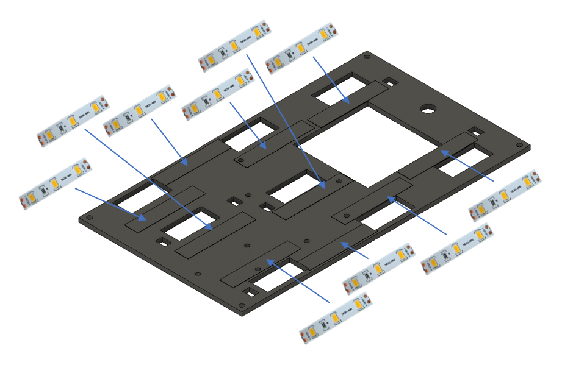
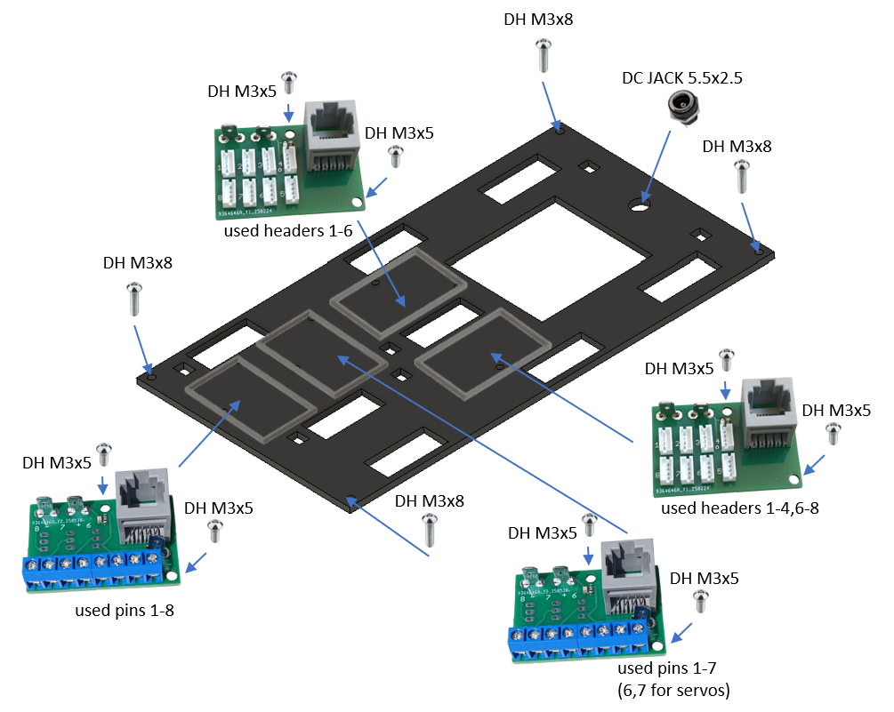
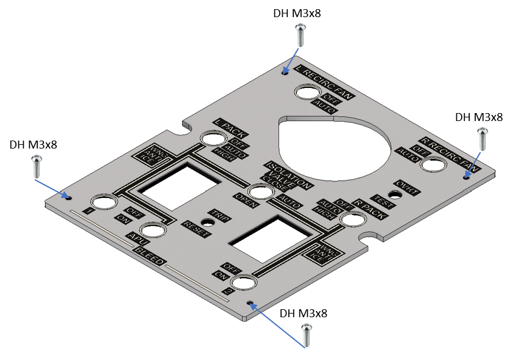

# 34. Bleed Air Control Panel

[📦 Download the printable model on MakerWorld](https://makerworld.com/en/models/3332584-boeing-737-overhead-bleed-air-control-panel)

[← Back to model list](README.md)

---

## Photos

<table>
<tbody>
<tr>
<td align="center" width="50%"> Finished panel</td>
<td align="center" width="50%"> The top panel - Bone White with the lettering in Black</td>
</tr>
</tbody>
<tbody>
<tr>
<td align="center" width="50%"> The gauge, the switches, the two buttons and the annunciators, with the diffuser fitted, before the top panel goes on</td>
<td align="center" width="50%"> Rear side - the four PCBs, the two gauge servos and the DC jack</td>
</tr>
</tbody>
</table>

---

## Filament

| | Colour | Filament |
|---|---|---|
|  | Dark Gray | C-Tech Premium Line PLA RAL7011 |
|  | Bone White | Bambu PLA Matte Bone White (11103) |
|  | Transparent | Filament PM PLA Transparent |
|  | White | Bambu PLA Basic Jade White (10100) |
|  | Black | Bambu PLA Basic Black (10101) |

---

## 3D Printed Parts

| Qty | Part | Notes |
|---:|---|---|
| 1× | Top panel | print on a **Textured** PEI plate |
| 1× | Bottom panel | print on a **Textured** PEI plate |
| 1× | Diffuser panel | print on a **Smooth** PEI plate |
| 1× | Backlight panel | |
| 1× | Bezel | the ring around the gauge window |
| 4× | PCB frame | |
| 6× | M4 washer | |
| 4× | Standoff 16 mm | |

---

## Switches and Buttons

| Qty | Type |
|---:|---|
| 5× | KN3(C)-101, ON/OFF |
| 3× | KN3(C)-103, ON/OFF/ON |
| 2× | PBS-110 push button, black |

The five two-position switches are L RECIRC FAN, R RECIRC FAN and the three BLEED switches - 1, APU and 2. The three-position ones are L PACK and R PACK, both OFF / AUTO / HIGH, and the ISOLATION VALVE switch, CLOSE / AUTO / OPEN. The two buttons are OVHT TEST and TRIP RESET.

---

## Gauge

The DUCT PRESS instrument is a separate model - it is **not included** in this download. The bezel that rings it is part of this panel; the acrylic window between the two is not printed at all, it is cut - see [CNC Cut Files](#cnc-cut-files).

| | |
|---|---|
| 📦 Printable model | [Boeing 737 Overhead - Duct Pressure Gauge](https://makerworld.com/en/models/3330434-boeing-737-overhead-duct-pressure-gauge) |
| 🔧 Build notes | [Duct Pressure Gauge](33-duct-pressure-gauge.md) |

It is a two-needle instrument with a servo per needle, so it takes two connections instead of one. They are in [Wiring](#wiring).

---

## Screws

| Qty | Screw | Joins |
|---:|---|---|
| 5× | Flat head M3×6 | bottom + diffuser |
| 4× | Flat head M3×12 | bottom + standoff |
| 6× | Flat head M4×16 | bottom + main frame |
| 8× | Dome head M3×5 | PCB + backlight |
| 10× | Dome head M3×8 | top + bottom, backlight + standoff, diffuser + gauge |

The six M4×16 screws each take one of the printed M4 washers. Of the ten M3×8, four hold the top panel, four the backlight panel and two the gauge.

---

## Annunciators

| Qty | Type |
|---:|---|
| 9× | Black background, yellow LED |
| 2× | Black background, green LED |
| 2× | Blue background, white LED |

The two blue ones are RAM DOOR FULL OPEN, left and right. The two green ones are ALTN and MANUAL in the bottom row. The nine yellow ones are DUAL BLEED, AUTO FAIL, OFF SCHED DESCENT, and PACK, WING-BODY OVERHEAT and BLEED TRIP OFF twice each.

The annunciators are a separate model shared with the other panels - they are **not included** in this download.

| | |
|---|---|
| 📦 Printable model | [Boeing 737 Overhead - Annunciators](https://makerworld.com/en/models/3121595-boeing-737-overhead-annunciators) |
| 🔧 Build notes | [Annunciators](02-annunciators.md) |
| 🔌 PCB, BOM and wiring | [Annunciator PCB](../pcb/annunciator.md) |

---

## CNC Cut Files

| Qty | File | Size |
|---:|---|---|
| 1× | cnc_gauge_48-8.dxf | Ø 48.8 mm |

This is the round window that goes in front of the DUCT PRESS gauge, behind the bezel. The drawing, the material and the cutting notes are on the [CNC Cut Files](../cnc-cut.md) page.

The window is glued to the bezel.

> **Note**
> Do not use cyanoacrylate (superglue) for that joint. As it cures it leaves a white film on the surface around the joint, not only where the glue was applied, and on a clear window it is impossible to miss. A two-part epoxy is a good choice instead.

---

## PCB

| Qty | PCB | Connections used | Gerber files |
|---:|---|---|---|
| 2× | [RJ45 Direct](../pcb/rj45-direct.md) | pins 1-8 on one, 1-7 on the other | [📥 PCB_RJ45_Direct.zip](https://raw.githubusercontent.com/om7ea/B737/main/PCB/PCB_RJ45_Direct.zip) |
| 2× | [RJ45 LED Driver](../pcb/rj45-driver.md) | headers 1-6 on one, 1-4 and 6-8 on the other | [📥 PCB_RJ45_Driver.zip](https://raw.githubusercontent.com/om7ea/B737/main/PCB/PCB_RJ45_Driver.zip) |

Mounting is shown in [step 3](#3-backlight-panel---pcbs-and-dc-jack) of the assembly diagram. Which switch and which annunciator each connection carries is in [Wiring](#wiring).

---

## Wiring

All four PCBs hang off the same MEGA 2560, `Overhead_5`. Each one is connected by one Ethernet patch cable to a socket on the [RJ45 Hub Shield](../pcb/rj45-hub-shield.md).

| PCB | Patch cable goes to | Connections used |
|---|---|---|
| **PCB 1** | socket **D3** on **Overhead_5** | pins 1-8 |
| **PCB 2** | socket **D2** on **Overhead_5** | pins 1-7 |
| **PCB 3** | socket **D5** on **Overhead_5** | headers 1-6 |
| **PCB 4** | socket **D1** on **Overhead_5** | headers 1-4 and 6-8 |

The socket labels **D0-D6**, **A1** and **A2** are silkscreened on the hub shield.

The rear of the panel. **PCB 1** is the lowest board, the one with a row of eight blue screw terminals. **PCB 2** sits just above it, with a shorter block of screw terminals and the two three-wire servo cables on its pin headers. **PCB 3** and **PCB 4** are the upper pair, with the small white connectors and the red-and-black cables running off to the annunciators; **PCB 4** is the right-hand one, the only board with its topmost connector populated.

### PCB 1 - socket D3 on Overhead_5

| Pin | Switch |
|---:|---|
| 1 | BLEED 2 |
| 2 | L RECIRC FAN |
| 3 | L PACK - HIGH |
| 4 | L PACK - OFF |
| 5 | ISOLATION VALVE - OPEN |
| 6 | ISOLATION VALVE - CLOSE |
| 7 | BLEED 1 |
| 8 | APU BLEED |

### PCB 2 - socket D2 on Overhead_5

| Pin | Connection |
|---:|---|
| 1 | R PACK - OFF |
| 2 | R PACK - HIGH |
| 3 | R RECIRC FAN |
| 4 | OVHT TEST button |
| 5 | TRIP RESET button |
| 6 | Duct Pressure Gauge - R needle servo signal |
| 7 | Duct Pressure Gauge - L needle servo signal |

Pin 8 is not used.

Neither servo connection goes through a screw terminal. Each one takes its signal, **+5 V** and **GND** from the pin headers at its own position on this board. Both servo plugs have to be rewired before they will work - see [Duct Pressure Gauge](33-duct-pressure-gauge.md#wiring). The gauge also draws the 5 V for its needle LEDs from this board, and the 12 V for its scale backlight from this panel's own backlighting, through the two orange lever-type splice connectors at the top of the panel.

### PCB 3 - socket D5 on Overhead_5

| Header | Annunciator |
|---:|---|
| 1 | ALTN |
| 2 | MANUAL |
| 3 | WING-BODY OVERHEAT (right) |
| 4 | RAM DOOR FULL OPEN (right) |
| 5 | PACK (right) |
| 6 | BLEED TRIP OFF (right) |

Headers 7 and 8 are not populated.

### PCB 4 - socket D1 on Overhead_5

| Header | Annunciator |
|---:|---|
| 1 | RAM DOOR FULL OPEN (left) |
| 2 | WING-BODY OVERHEAT (left) |
| 3 | OFF SCHED DESCENT |
| 4 | AUTO FAIL |
| 6 | PACK (left) |
| 7 | BLEED TRIP OFF (left) |
| 8 | DUAL BLEED |

Header 5 is not populated.

PACK, WING-BODY OVERHEAT, BLEED TRIP OFF and RAM DOOR FULL OPEN are each printed twice on the panel, once on the left half and once on the right; the qualifier in the tables says which of the pair a connection carries.

**All the switches and buttons share a single ground return.** Each switch takes one of its terminals to its own pin on the Direct PCB. The opposite terminals are commoned - daisy-chained from one switch to the next - and the chain ends at a **-** (ground) contact.

---

## Backlight

| Qty | Part | Reference |
|---:|---|---|
| 10× | LED strip | [Product I used](../../images/parts/AE_led_strip.png) |
| 1× | DC jack 5.5 × 2.5 mm | [Product I used](../../images/parts/AE_dc_jack.png) |

Powered from the **12 V** supply - see [Power supply](../system-overview.md#power-supply).

---

## Assembly Diagram

Screw abbreviations used in the diagrams: **FH** = flat head, **DH** = dome head.

### 1. Bottom panel - diffuser, gauge, annunciators, switches and buttons

### 2. Backlight panel - LED strips

### 3. Backlight panel - PCBs and DC jack

### 4. Top panel

