# 36. Cabin Altitude Panel

[← Back to model list](README.md)

---

## Photos

<table>
<tbody>
<tr>
<td align="center" width="50%">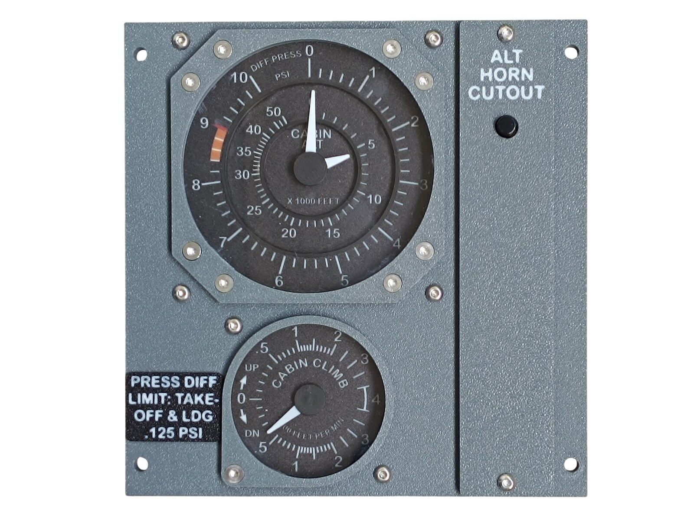 Finished panel</td>
<td align="center" width="50%">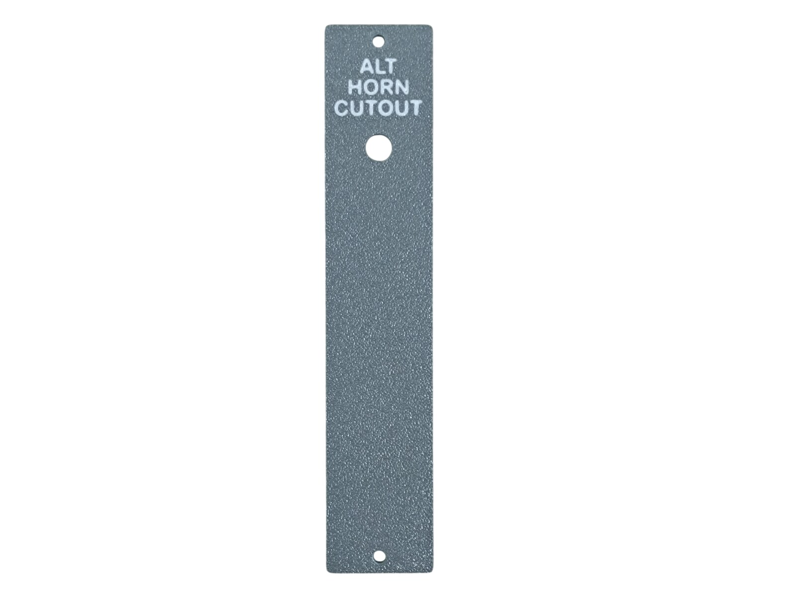 The top panel - Dark Gray with the lettering in Jade White</td>
</tr>
</tbody>
<tbody>
<tr>
<td align="center" width="50%">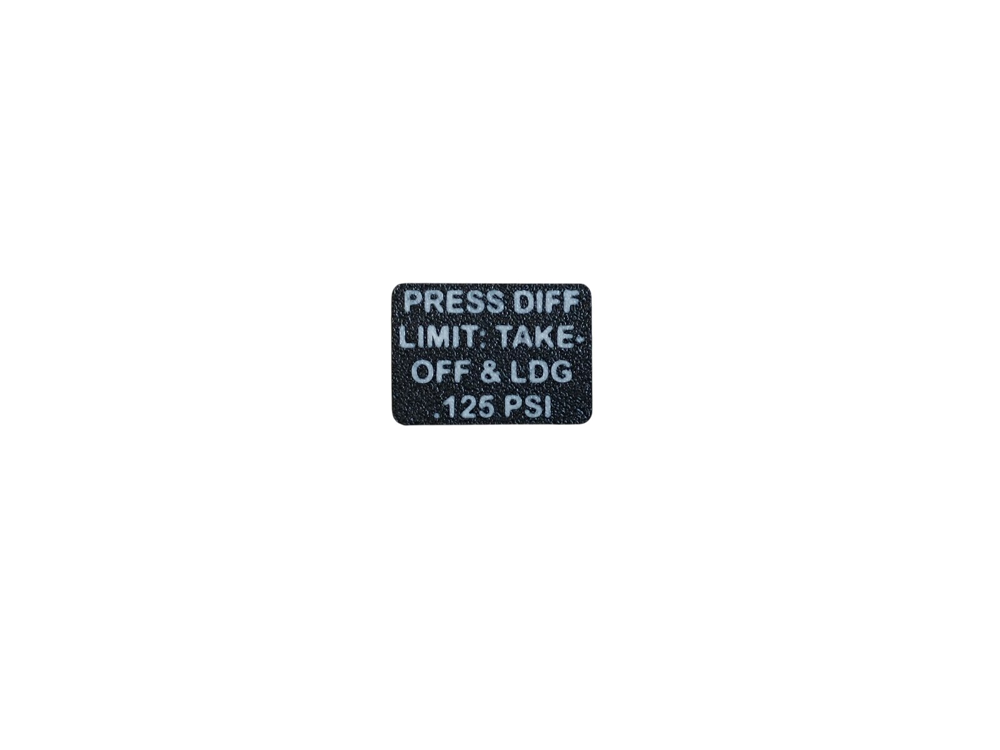 The info plate - Black with the lettering in Jade White</td>
<td align="center" width="50%">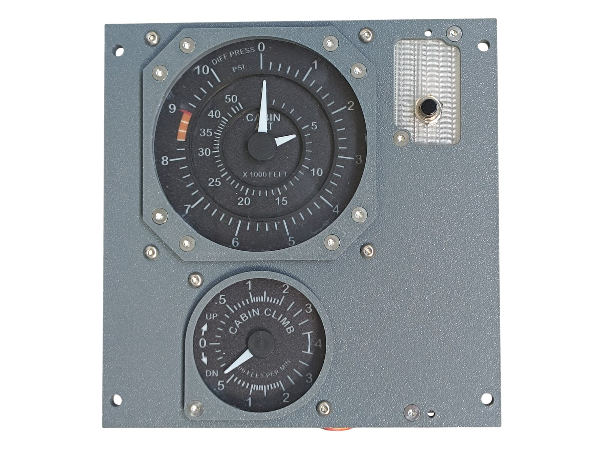 Both gauges, the bezels, the diffuser and the button fitted, before the top panel goes on</td>
</tr>
</tbody>
<tbody>
<tr>
<td align="center" width="50%">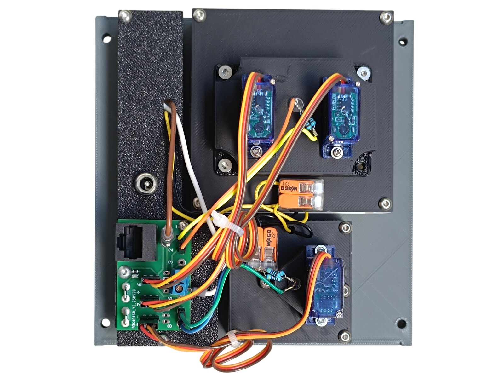 Rear side - the PCB, the three gauge servos and the DC jack</td>
<td align="center" width="50%"></td>
</tr>
</tbody>
</table>

---

## Filament

| | Colour | Filament |
|---|---|---|
|  | Dark Gray | C-Tech Premium Line PLA RAL7011 |
|  | Transparent | Filament PM PLA Transparent |
|  | White | Bambu PLA Basic Jade White (10100) |
|  | Black | Bambu PLA Basic Black (10101) |

---

## 3D Printed Parts

| Qty | Part | Notes |
|---:|---|---|
| 1× | Top panel | the narrow ALT HORN CUTOUT strip; print on a **Textured** PEI plate |
| 1× | Bottom panel | print on a **Textured** PEI plate |
| 1× | Info plate | the PRESS DIFF LIMIT plate; print on a **Textured** PEI plate |
| 1× | Diffuser panel | print on a **Smooth** PEI plate |
| 1× | Backlight panel | |
| 1× | Big bezel | the ring around the Cabin Alt / Diff Press gauge |
| 1× | Small bezel | the ring around the Cabin Climb gauge |
| 1× | PCB frame | |
| 4× | M4 washer | |
| 2× | Standoff 16 mm | |

---

## Switches and Buttons

| Qty | Type |
|---:|---|
| 1× | PBS-110 push button, black |

The single button is ALT HORN CUTOUT. It is the only thing on this panel that the pilot can operate - everything else is an instrument.

---

## Gauges

Both instruments are separate models - they are **not included** in this download. The two bezels that ring them are part of this panel; the acrylic windows between bezel and gauge are not printed at all, they are cut - see [CNC Cut Files](#cnc-cut-files).

The big one is the **CABIN ALT / DIFF PRESS** instrument, the largest gauge of the overhead. It is a two-needle instrument with a servo per needle, so it takes two connections instead of one.

| | |
|---|---|
| 📦 Printable model | [Boeing 737 Overhead - Cabin Alt / Diff Press Gauge](https://makerworld.com/en/models/3334561-boeing-737-overhead-cabin-alt-diff-press-gauge) |
| 🔧 Build notes | [Cabin Alt / Diff Press Gauge](35-cabin-alt-diff-press-gauge.md) |

The small one is the **CABIN CLIMB** gauge, one of the four gauges built from the shared Temperature and Climb Gauges model. What makes it the CABIN CLIMB instrument is its UV-printed scale and the `hand-climb` needle.

| | |
|---|---|
| 📦 Printable model | [Boeing 737 Overhead - Temperature and Climb Gauges](https://makerworld.com/en/models/3251829-boeing-737-overhead-temperature-and-climb-gauges) |
| 🔧 Build notes | [Temperature and Climb Gauges](21-temperature-and-climb-gauges.md) |

Both gauges are in [Wiring](#wiring).

---

## Glue

The info plate is glued onto the bottom panel.

> **Note**
> Do not use cyanoacrylate (superglue) here. As it cures it leaves a white film on the surface around the joint, not only where the glue was applied, and that shows on a black plate. A two-part epoxy is a good choice instead.

---

## Screws

| Qty | Screw | Joins |
|---:|---|---|
| 10× | Flat head M3×6 | bottom + bezels, bottom + diffuser |
| 2× | Flat head M3×12 | bottom + standoff |
| 4× | Flat head M4×16 | bottom + main frame |
| 2× | Dome head M3×5 | PCB + backlight |
| 6× | Dome head M3×12 | bottom + gauge |
| 4× | Dome head M3×8 | top + bottom, backlight + standoff |

The four M4×16 screws each take one of the printed M4 washers. Of the ten M3×6, eight hold the big bezel, one the small bezel and one the diffuser. Of the six M3×12, four hold the Cabin Alt / Diff Press gauge and two the Cabin Climb gauge. Of the four M3×8, two hold the top panel and two the backlight panel.

---

## CNC Cut Files

| Qty | File | Size |
|---:|---|---|
| 1× | cnc_gauge_78-9.dxf | Ø 78.9 mm |
| 1× | cnc_gauge_48-8.dxf | Ø 48.8 mm |

The large window goes in front of the CABIN ALT / DIFF PRESS gauge, the small one in front of the CABIN CLIMB gauge, each behind its own bezel. The drawings, the material and the cutting notes are on the [CNC Cut Files](../cnc-cut.md) page.

Both windows are glued to their bezels.

> **Note**
> Do not use cyanoacrylate (superglue) for those joints. As it cures it leaves a white film on the surface around the joint, not only where the glue was applied, and on a clear window it is impossible to miss. A two-part epoxy is a good choice instead.

---

## PCB

| Qty | PCB | Connections used | Gerber files |
|---:|---|---|---|
| 1× | [RJ45 Direct](../pcb/rj45-direct.md) | pins 5-8 | [📥 PCB_RJ45_Direct.zip](https://raw.githubusercontent.com/om7ea/B737/main/PCB/PCB_RJ45_Direct.zip) |

The board on this panel is **modified** - four of its unused positions were turned into a 5 V supply for the needle lighting of the two gauges. How that is done is in [Wiring](#wiring).

Mounting is shown in [step 3](#3-backlight-panel---pcb-and-dc-jack) of the assembly diagram. Which connection carries what is in [Wiring](#wiring).

---

## Wiring

The panel has a single PCB. It is connected by one Ethernet patch cable to a socket on the [RJ45 Hub Shield](../pcb/rj45-hub-shield.md).

| PCB | Patch cable goes to | Connections used |
|---|---|---|
| **PCB 1** | socket **D3** on **Overhead_4** | pins 5-8 |

The socket labels **D0-D6**, **A1** and **A2** are silkscreened on the hub shield.

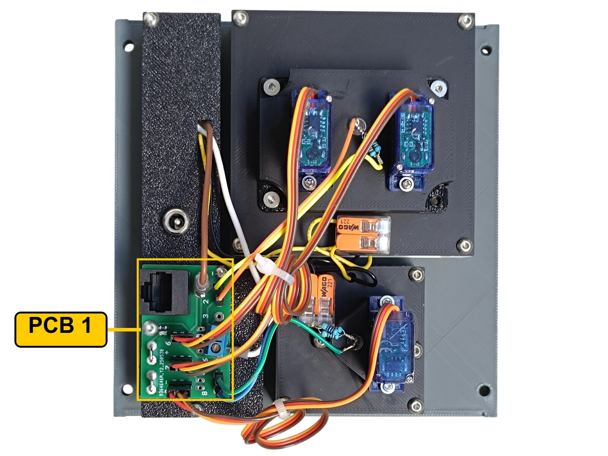

The rear of the panel. **PCB 1** is the only board, at the bottom left next to the DC jack. The two servos on the upper backlight part drive the CABIN ALT and DIFF PRESS needles, the single one below drives the CABIN CLIMB needle. The two orange lever connectors in the middle are the 12 V tap for the two scale backlights.

### PCB 1 - socket D3 on Overhead_4

| Pin | Connection |
|---:|---|
| 5 | ALT HORN CUTOUT button |
| 6 | Cabin Alt / Diff Press Gauge - DIFF PRESS needle servo signal |
| 7 | Cabin Alt / Diff Press Gauge - CABIN ALT needle servo signal |
| 8 | Cabin Climb Gauge - servo signal |

Each of the three servos takes its signal, **+5 V** and **GND** from the three-pin header at its own position on this board. All three servo plugs have to be rewired before they will work - see [Cabin Alt / Diff Press Gauge](35-cabin-alt-diff-press-gauge.md#wiring) and [Temperature and Climb Gauges](21-temperature-and-climb-gauges.md#wiring).

### The modified board

The three servos are driven from the three-pin headers and the button from a screw terminal, which leaves most of the screw terminals on the board doing nothing. I turned four of them into a **5 V supply for the needle LEDs** of the two gauges, so that neither needle light has to be fed from somewhere else on the overhead.

**1.** With a knife, cut the track that feeds the screw terminal at positions **1**, **2**, **7** and **8**. Only the screw terminals come loose - the three-pin headers at 7 and 8 keep their signal and still drive the two servos in the table above.

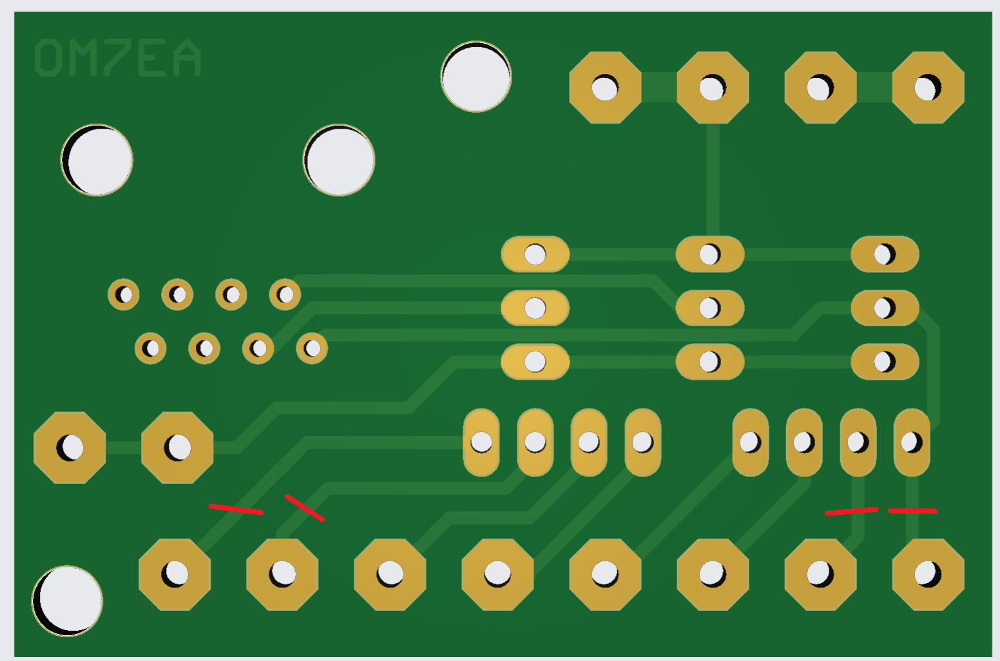

**2.** Fit a **three-pin header with the middle pin pulled out**, so that only the two outer pins are left, into positions **1** and **2**. Fit a second one the same way into positions **7** and **8**.

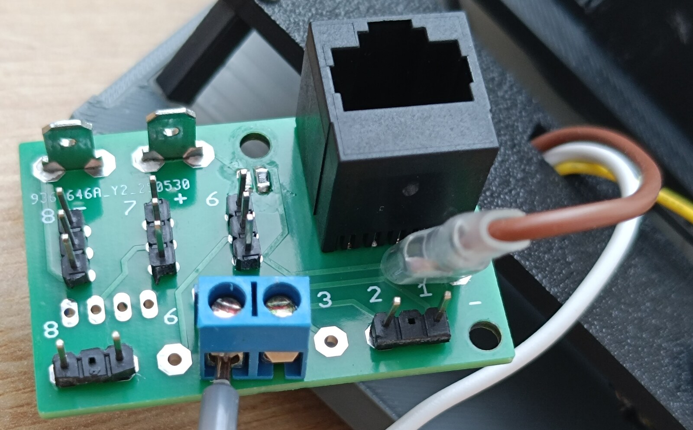

**3.** Solder four short links on the underside of the board: **+5 V** to positions **1** and **7**, **GND** to positions **2** and **8**.

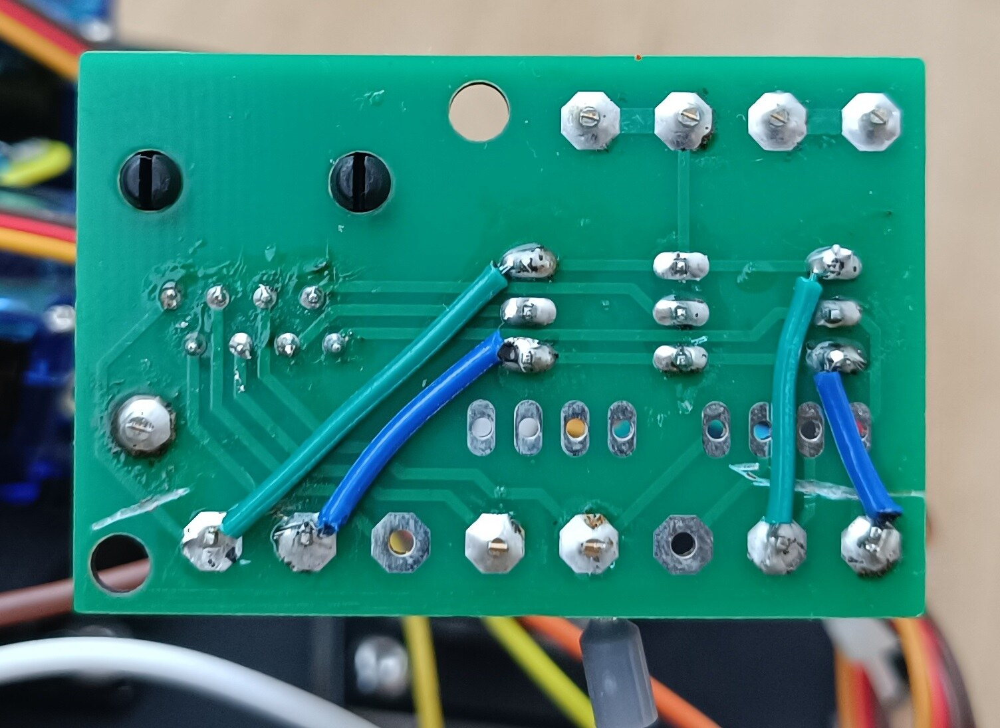

Each of the two headers now gives one **+5 V / GND** pair - one for the needle LED of each gauge. No signal is taken from them, and the screw terminals at those four positions carry nothing.

The scale backlight of both gauges runs on **12 V** from this panel's own backlighting, through the two orange lever-type splice connectors on the rear.

The ALT HORN CUTOUT button takes one of its terminals to pin **5** on the Direct PCB and the other to a **-** (ground) contact.

---

## Backlight

| Qty | Part | Reference |
|---:|---|---|
| 1× | LED strip | [Product I used](../../images/parts/AE_led_strip.png) |
| 1× | DC jack 5.5 × 2.5 mm | [Product I used](../../images/parts/AE_dc_jack.png) |

Powered from the **12 V** supply - see [Power supply](../system-overview.md#power-supply).

The single strip sits behind the diffuser and lights the ALT HORN CUTOUT lettering. It is the only thing on this panel lit from the panel's own strip; the rest of the front is taken up by the two gauges, which carry their own backlight and draw their 12 V from here.

---

## Assembly Diagram

Screw abbreviations used in the diagrams: **FH** = flat head, **DH** = dome head.

### 1. Bottom panel - gauges, bezels, diffuser, info plate and button

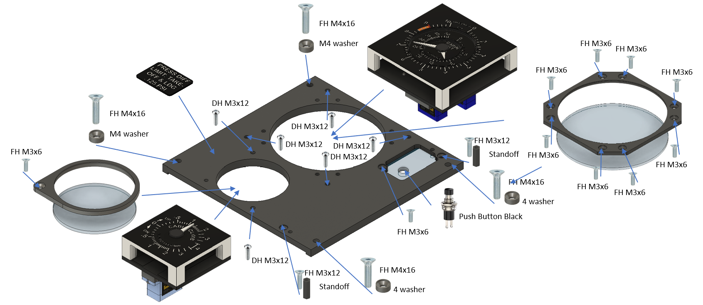

### 2. Backlight panel - LED strip

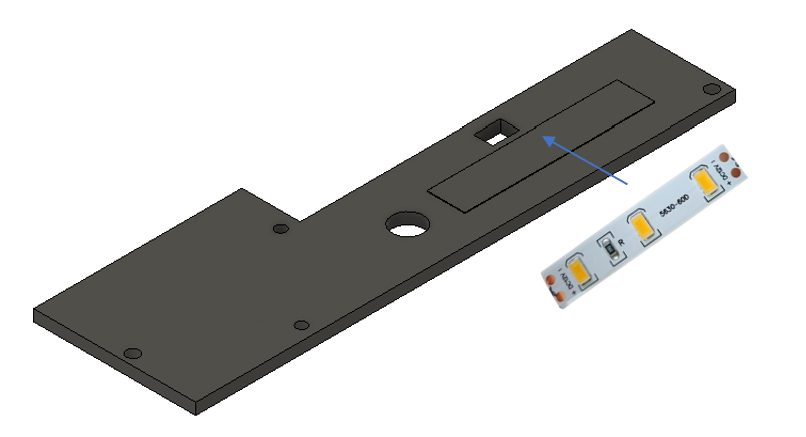

### 3. Backlight panel - PCB and DC jack

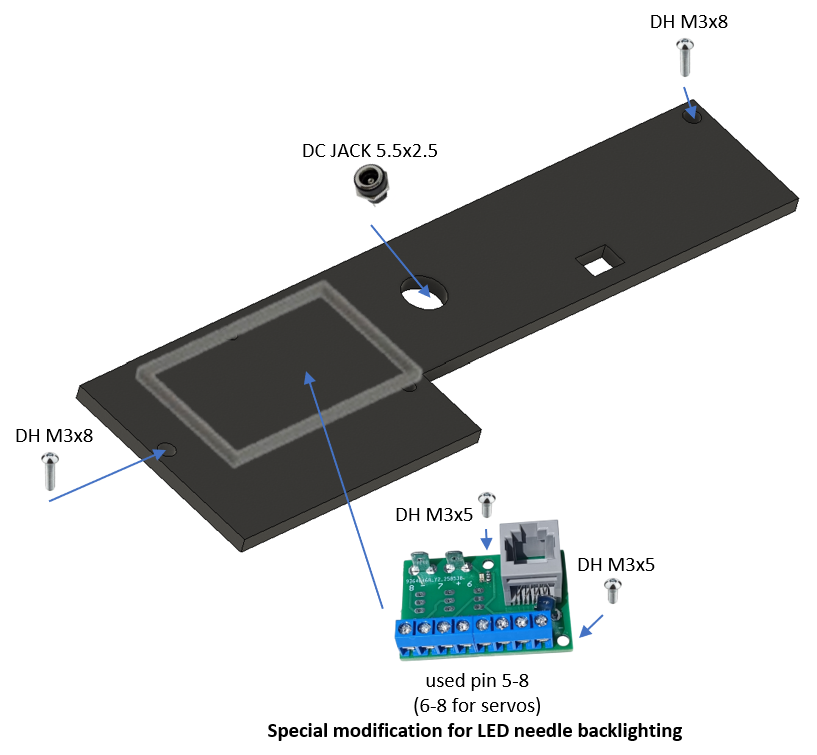

### 4. Top panel

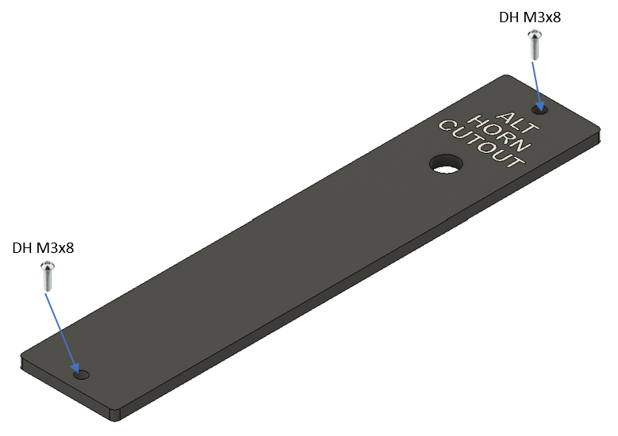
