# 38. Right Light Panel

[📦 Download the printable model on MakerWorld](https://makerworld.com/en/models/3350735-boeing-737-overhead-right-light-panel)

[← Back to model list](README.md)

---

## Photos

<table>
<tbody>
<tr>
<td align="center" width="50%">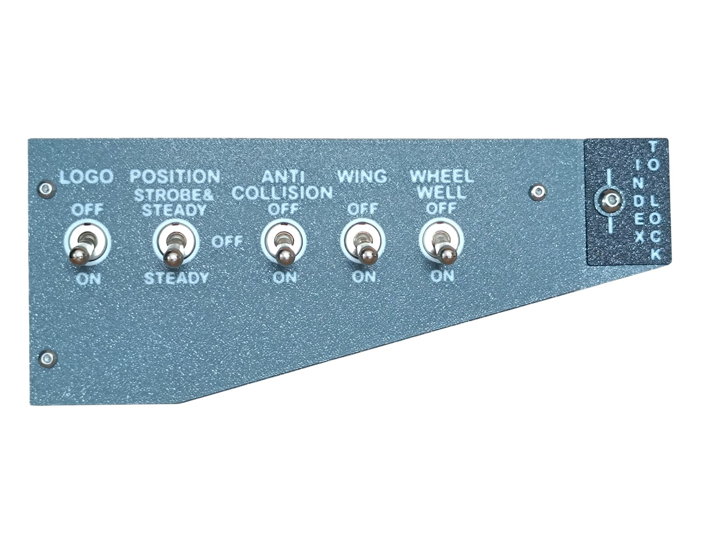 Finished panel</td>
<td align="center" width="50%">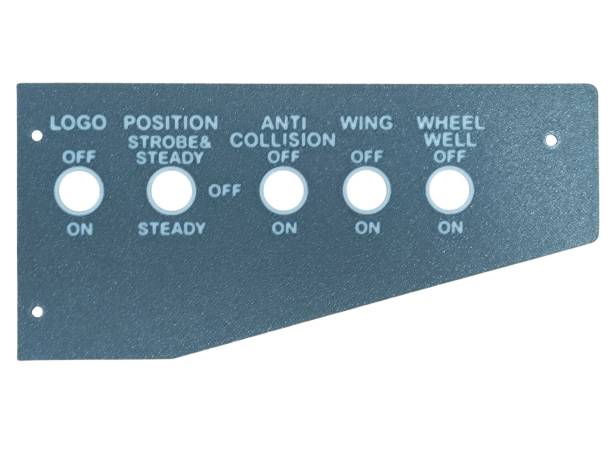 The top panel - Dark Gray with the lettering in Jade White</td>
</tr>
</tbody>
<tbody>
<tr>
<td align="center" width="50%">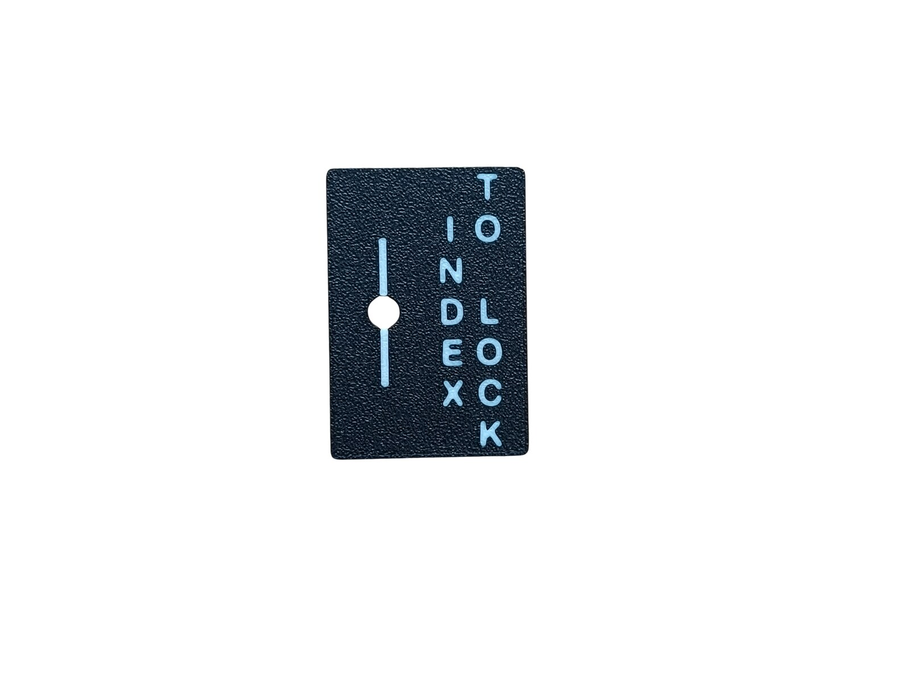 The index plate - Black with the lettering in Jade White</td>
<td align="center" width="50%">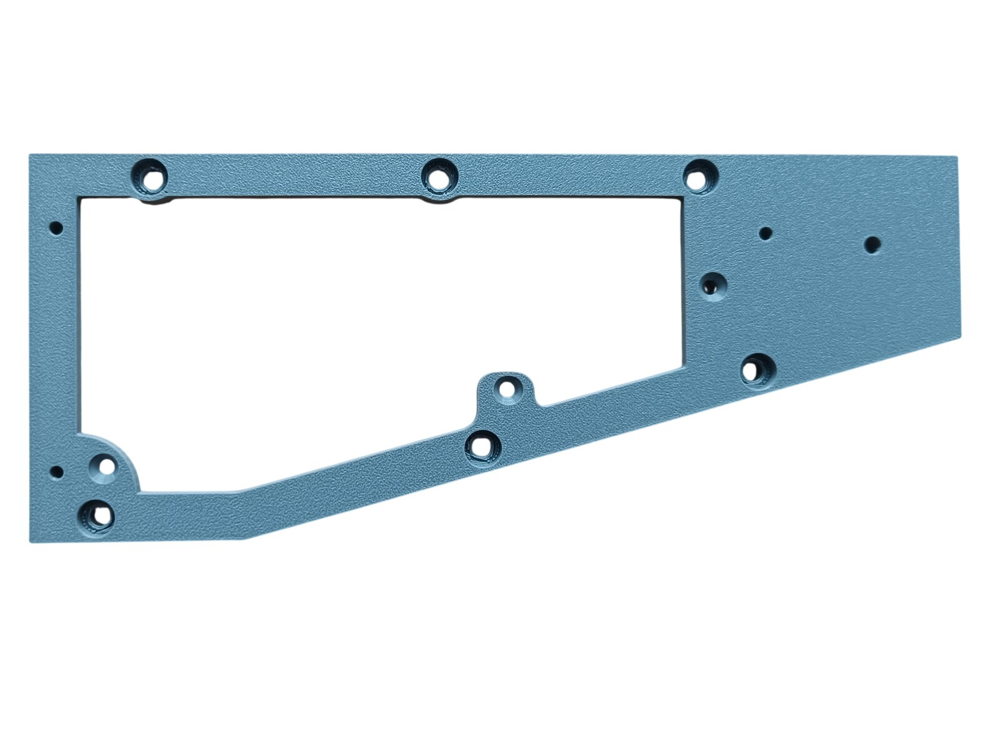 The bottom panel - the opening is where the diffuser shows through</td>
</tr>
</tbody>
<tbody>
<tr>
<td align="center" width="50%">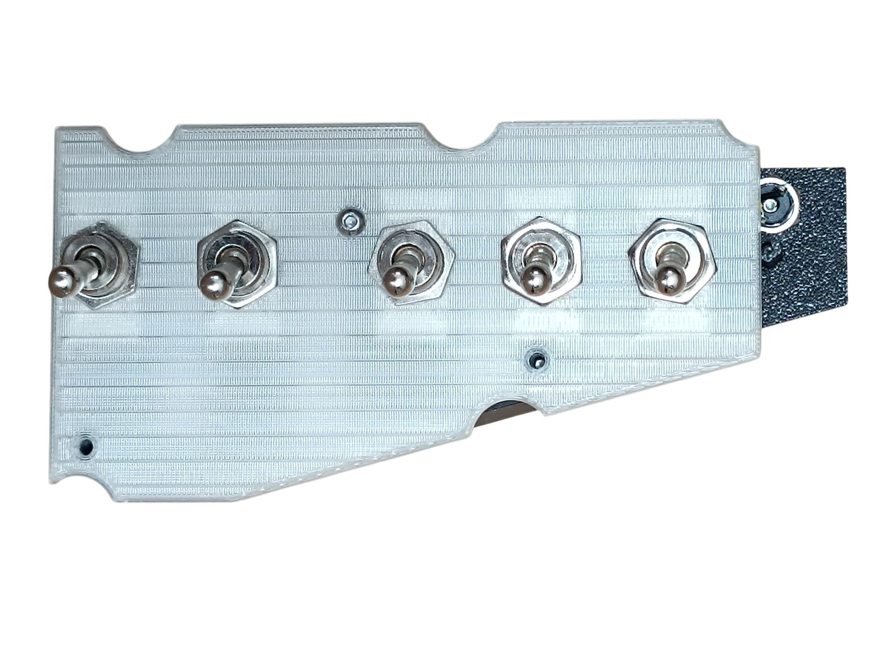 The diffuser panel with all five switches fitted</td>
<td align="center" width="50%">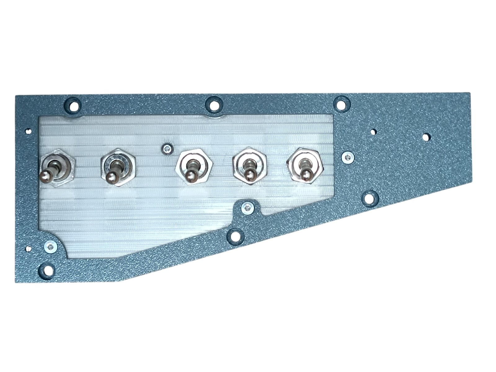 The diffuser and the switches in the bottom panel, before the top panel goes on</td>
</tr>
</tbody>
<tbody>
<tr>
<td align="center" width="50%">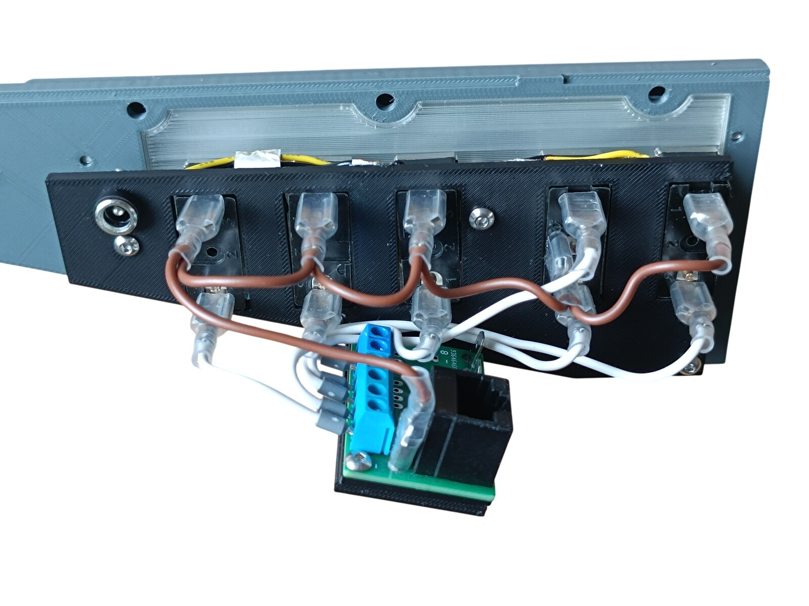 Rear side - the backlight panel, the DC jack and the PCB</td>
<td align="center" width="50%"></td>
</tr>
</tbody>
</table>

---

## Filament

| | Colour | Filament |
|---|---|---|
|  | Dark Gray | C-Tech Premium Line PLA RAL7011 |
|  | Transparent | Filament PM PLA Transparent |
|  | White | Bambu PLA Basic Jade White (10100) |
|  | Black | Bambu PLA Basic Black (10101) |

---

## 3D Printed Parts

| Qty | Part | Notes |
|---:|---|---|
| 1× | Top panel | print on a **Textured** PEI plate |
| 1× | Bottom panel | print on a **Textured** PEI plate |
| 1× | Index plate | the INDEX TO LOCK plate at the right end; print on a **Textured** PEI plate |
| 1× | Diffuser panel | print on a **Smooth** PEI plate |
| 1× | Backlight panel | |
| 1× | PCB frame | |
| 4× | Standoff 16 mm | |
| 1× | Flat washer | goes under the screw that holds the index plate |

---

## Switches and Buttons

| Qty | Type |
|---:|---|
| 4× | KN3(C)-101, ON/OFF |
| 1× | KN3(C)-103, ON/OFF/ON |

The four two-position switches are LOGO, ANTI COLLISION, WING and WHEEL WELL. The three-position one is POSITION - STROBE & STEADY / OFF / STEADY.

---

## Screws

| Qty | Screw | Joins |
|---:|---|---|
| 3× | Flat head M3×12 | bottom + standoff |
| 2× | Dome head M3×5 | PCB + backlight |
| 8× | Dome head M3×8 | top + bottom, diffuser + standoff, backlight + standoff |
| 7× | Dome head M4×8 | bottom + main frame, index plate + bottom |

Three of the four standoffs are screwed to the bottom panel with the M3×12 screws; the fourth is screwed through the diffuser with M3×8.

---

## PCB

| Qty | PCB | Connections used | Gerber files |
|---:|---|---|---|
| 1× | [RJ45 Direct](../pcb/rj45-direct.md) | pins 1-6 | [📥 PCB_RJ45_Direct.zip](https://raw.githubusercontent.com/om7ea/B737/main/PCB/PCB_RJ45_Direct.zip) |

Mounting is shown in [step 3](#3-backlight-panel---pcb-and-dc-jack) of the assembly diagram. Which switch each connection carries is in [Wiring](#wiring).

---

## Wiring

The panel has a single PCB. It is connected by one Ethernet patch cable to a socket on the [RJ45 Hub Shield](../pcb/rj45-hub-shield.md).

| PCB | Patch cable goes to | Connections used |
|---|---|---|
| **PCB 1** | socket **D5** on **Overhead_3** | pins 1-6 |

The socket labels **D0-D6**, **A1** and **A2** are silkscreened on the hub shield.

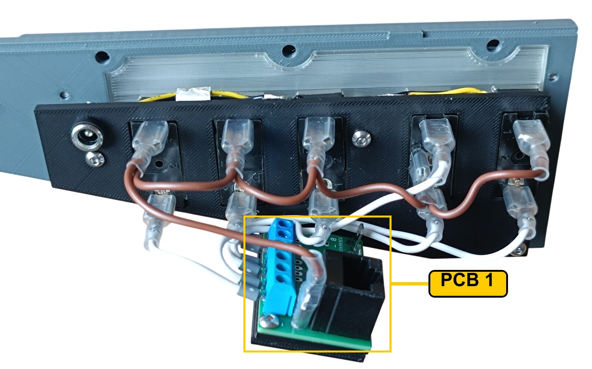

The rear of the panel. **PCB 1** is the only board, on its frame below the backlight panel; the DC jack sits at the far left of the same panel. The white wires run from the board up to the switches; the brown wire daisy-chains the opposite terminals of all five switches together.

### PCB 1 - socket D5 on Overhead_3

| Pin | Switch |
|---:|---|
| 1 | WHEEL WELL |
| 2 | WING |
| 3 | ANTI COLLISION |
| 4 | POSITION - STEADY |
| 5 | POSITION - STROBE & STEADY |
| 6 | LOGO |

Pins 7 and 8 are not used.

**All the switches share a single ground return.** Each switch takes one of its terminals to its own pin on the Direct PCB. The opposite terminals are commoned - daisy-chained from one switch to the next - and the chain ends at a **-** (ground) contact.

---

## Backlight

| Qty | Part | Reference |
|---:|---|---|
| 4× | LED strip | [Product I used](../../images/parts/AE_led_strip.png) |
| 1× | DC jack 5.5 × 2.5 mm | [Product I used](../../images/parts/AE_dc_jack.png) |

Powered from the **12 V** supply - see [Power supply](../system-overview.md#power-supply).

---

## Assembly Diagram

Screw abbreviations used in the diagrams: **FH** = flat head, **DH** = dome head.

### 1. Bottom panel - diffuser, index plate, switches and standoffs

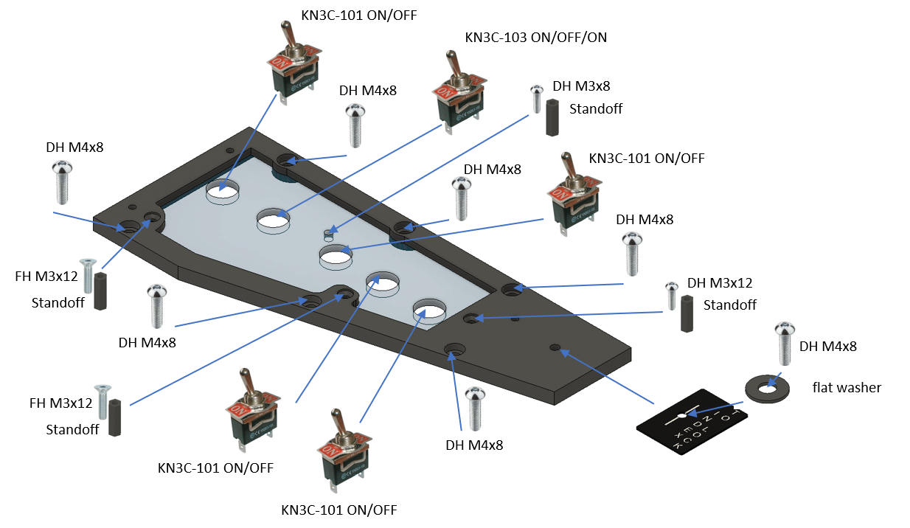

### 2. Backlight panel - LED strips

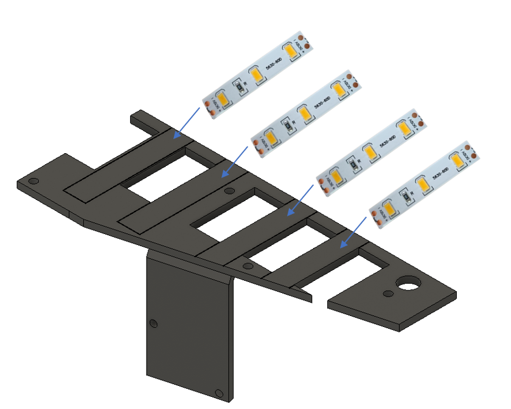

### 3. Backlight panel - PCB and DC jack

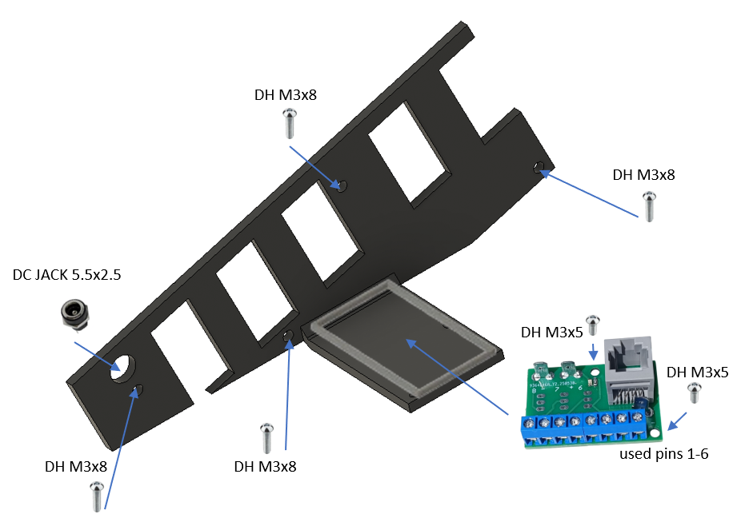

### 4. Top panel

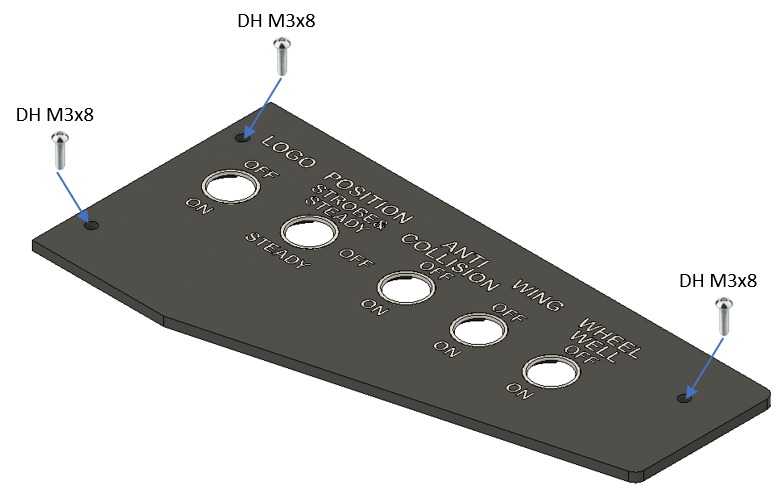
