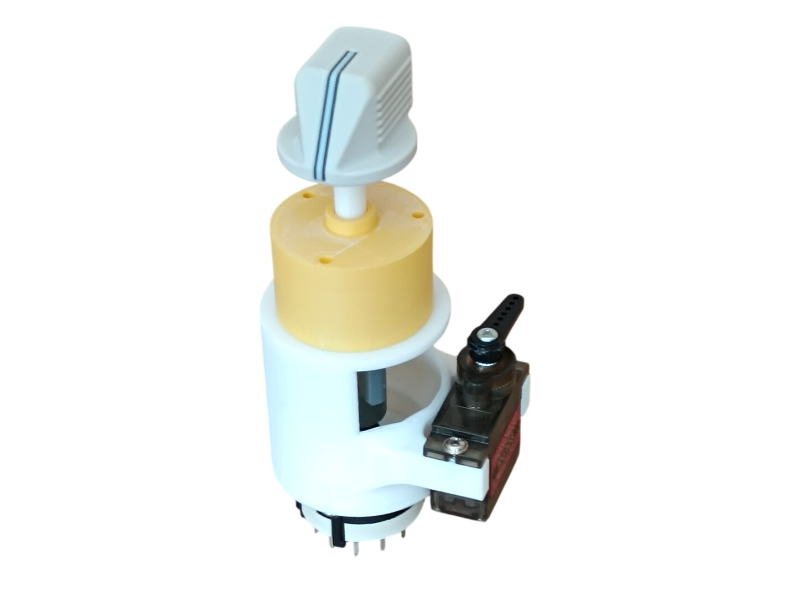
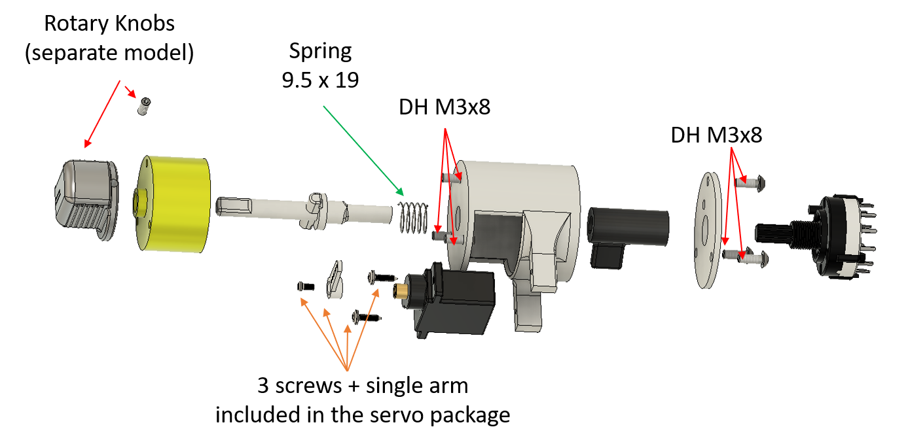

# 39. Engine Start Switch

[📦 Download the printable model on MakerWorld](https://makerworld.com/en/models/3375879-boeing-737-overhead-engine-start-switch)

[← Back to model list](README.md)

---

> **Note**
> **Two** are needed for the complete project, both on the **[Engine Start Panel](40-engine-start-panel.md)** - one for each engine.

---

## Photos

<table>
<tbody>
<tr>
<td align="center" width="50%"> The finished switch, with its knob fitted</td>
</tr>
</tbody>
</table>

---

## How It Works

The knob turns a **rotary switch RS26** through two printed rods, set to the four positions **GRD / OFF / CONT / FLT**. A spring keeps the knob pulled out, and out of **OFF** it can only be turned after it has been **pushed in** - without pushing, it does not turn.

An **MG90S servo** beside the switch turns the knob back from **GRD** to **OFF** once the simulator releases the starter, the way the real aircraft does it.

---

## 3D Printed Parts

| Per switch | Total for 2 | Part |
|---:|---:|---|
| 1× | 2× | top case |
| 1× | 2× | top rod |
| 1× | 2× | bottom case |
| 1× | 2× | bottom case cover |
| 1× | 2× | bottom rod |

The colour of the filament and the type of the build plate are up to you - the whole switch is hidden behind the panel.

---

## Switches and Buttons

| Per switch | Total for 2 | Type |
|---:|---:|---|
| 1× | 2× | Rotary switch RS26, 12 positions |

The RS26 has an adjustable end stop - set it to **4** positions.

---

## Electronic and Mechanical Components

| Per switch | Total for 2 | Part | Reference |
|---:|---:|---|---|
| 1× | 2× | **Servo MG90S** - 180°, metal gears | [Product I used](../../images/parts/AE_servo_MG90S.png) |
| 1× | 2× | **Spring** - 9.5 × 19 mm | |

The MG90S has metal gears, so it copes with a heavier load than the SG90 used in the gauges.

The three screws and the single arm that come with the servo are used as well.

> **Note**
> On some servos the single arm that comes in the package is too long and does not fit into the case. In that case take the double arm, which has one side slightly shorter, and cut the other side off. You can also take the four-way arm and cut off the three sides you do not need.

> **⚠️ Fit the servo arm only after MobiFlight has set the servo**\
> Do not fit the arm when you install the servo for the first time - leave the servo without it. If you use my [MobiFlight configuration](../mobiflight.md), the servo moves to the right position once it is connected to power and to the MEGA and MobiFlight is started. Only then fit the arm, exactly as in the photo on this page.

---

## Screws

| Per switch | Total for 2 | Screw | Joins |
|---:|---:|---|---|
| 6× | 12× | Dome head M3×8 | bottom case + top case, bottom case + bottom case cover |

---

## Assembly Diagram

Screw abbreviations used in the diagram: **DH** = dome head.

