# 40. Engine Start Panel

[📦 Download the printable model on MakerWorld](https://makerworld.com/en/models/3376922-boeing-737-overhead-engine-start-panel)

[← Back to model list](README.md)

---

## Photos

<table>
<tbody>
<tr>
<td align="center" width="50%">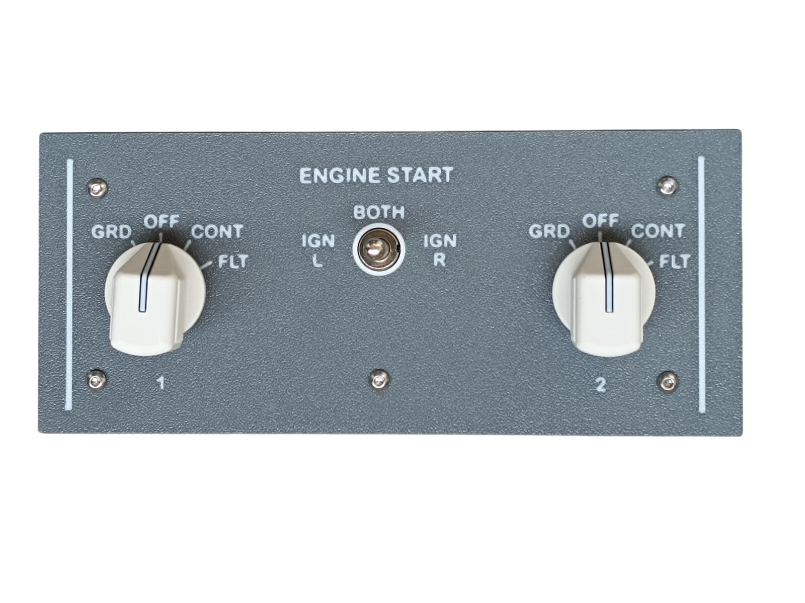 Finished panel</td>
<td align="center" width="50%">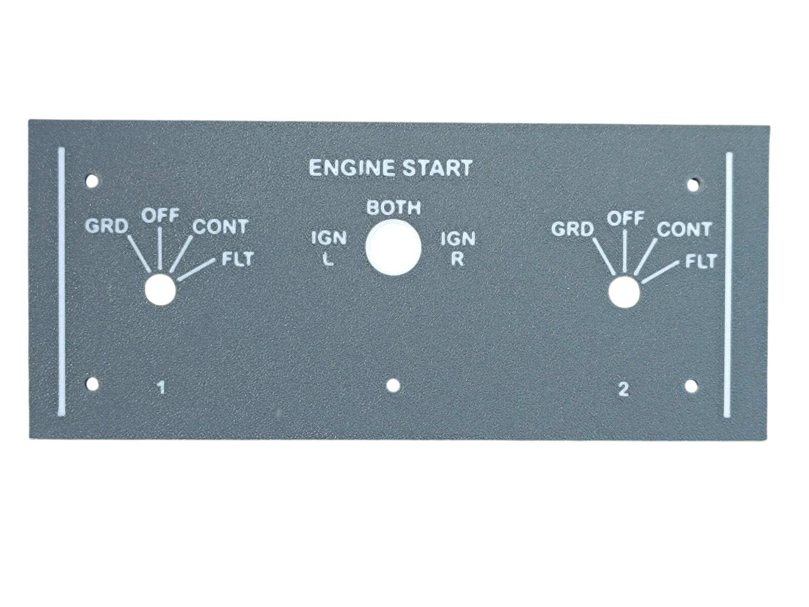 The top panel - Dark Gray with the lettering in Jade White</td>
</tr>
</tbody>
<tbody>
<tr>
<td align="center" width="50%">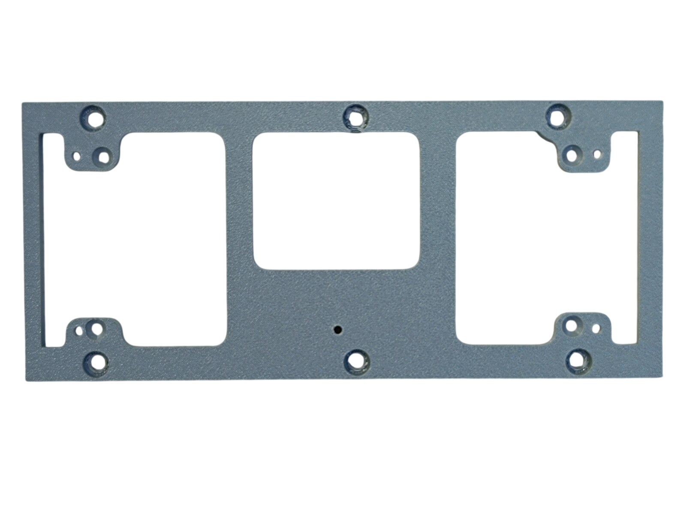 The bottom panel - the three openings are where the diffuser shows through</td>
<td align="center" width="50%">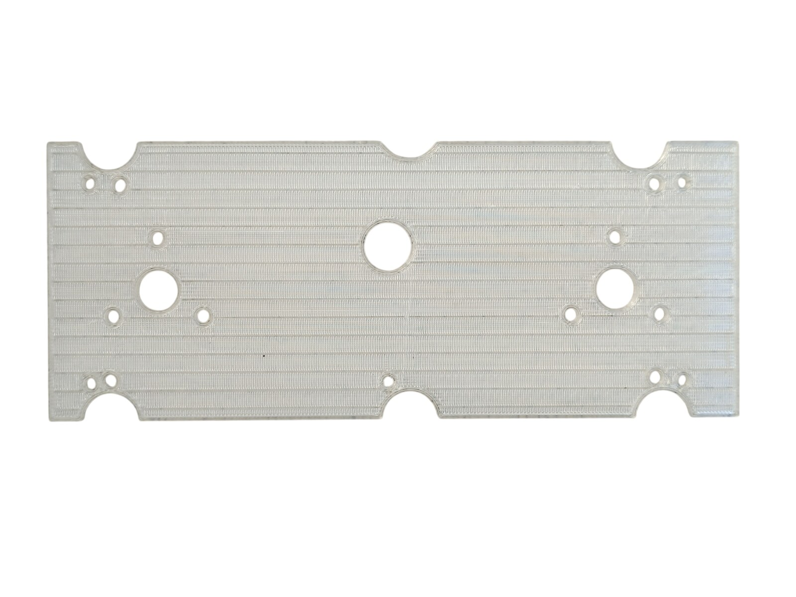 The diffuser panel</td>
</tr>
</tbody>
<tbody>
<tr>
<td align="center" width="50%">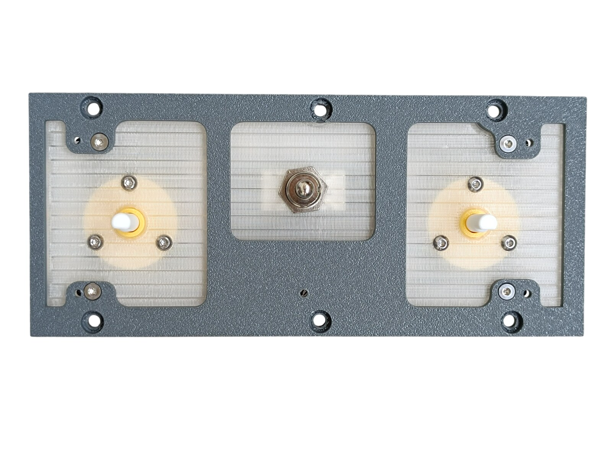 The diffuser, the toggle switch and the two Engine Start Switches in the bottom panel, before the top panel goes on</td>
<td align="center" width="50%">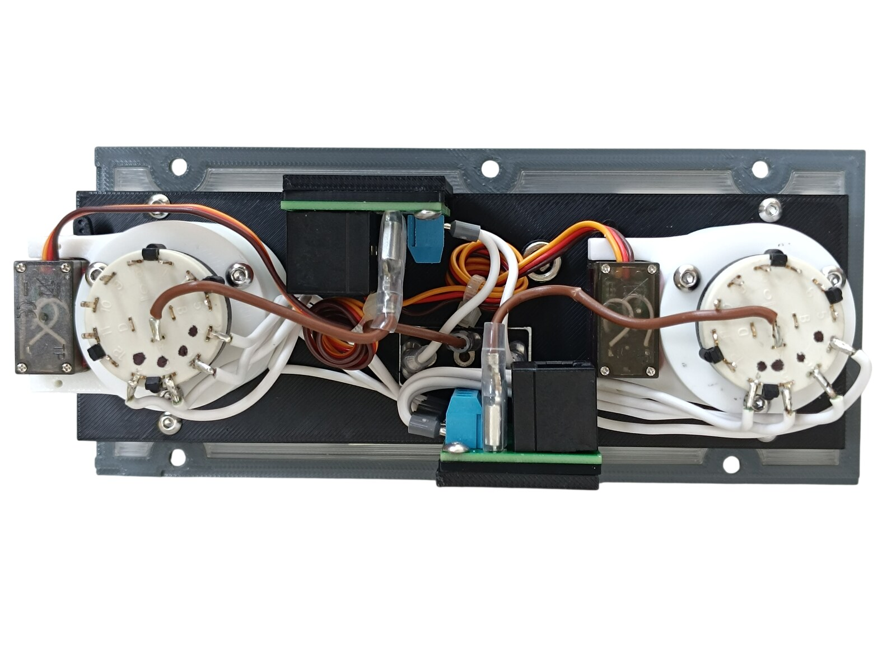 Rear side - the backlight panel, the two PCBs, the DC jack and the two Engine Start Switches with their servos</td>
</tr>
</tbody>
<tbody>
<tr>
<td align="center" width="50%">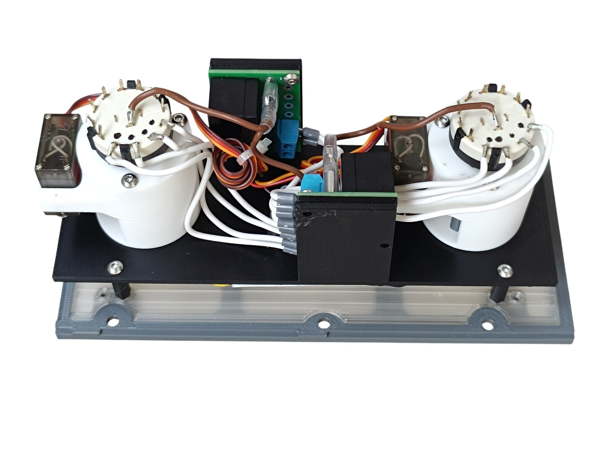 Rear side, seen at an angle</td>
<td align="center" width="50%">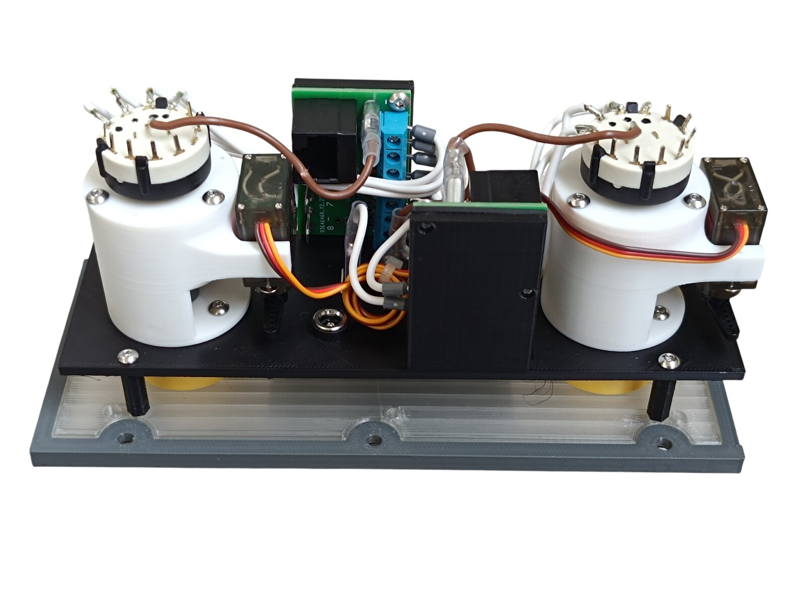 Rear side, seen at an angle from the other edge</td>
</tr>
</tbody>
</table>

---

## Filament

| | Colour | Filament |
|---|---|---|
|  | Dark Gray | C-Tech Premium Line PLA RAL7011 |
|  | Transparent | Filament PM PLA Transparent |
|  | White | Bambu PLA Basic Jade White (10100) |
|  | Black | Bambu PLA Basic Black (10101) |

---

## 3D Printed Parts

| Qty | Part | Notes |
|---:|---|---|
| 1× | Top panel | print on a **Textured** PEI plate |
| 1× | Bottom panel | print on a **Textured** PEI plate |
| 1× | Diffuser panel | print on a **Smooth** PEI plate |
| 1× | Backlight panel | |
| 2× | PCB frame | |
| 4× | Standoff 16 mm | |

---

## Switches and Buttons

| Qty | Type |
|---:|---|
| 1× | KN3(C)-103, ON/OFF/ON |

The toggle switch is the ignition selector - IGN L / BOTH / IGN R.

---

## Engine Start Switches

The two ENGINE START rotary switches are a separate model - they are **not included** in this download. Each one is a rotary switch with a servo that turns the knob back from GRD to OFF.

| | |
|---|---|
| 📦 Printable model | [Boeing 737 Overhead - Engine Start Switch](https://makerworld.com/en/models/3375879-boeing-737-overhead-engine-start-switch) |
| 🔧 Build notes | [Engine Start Switch](39-engine-start-switch.md) |

Both switches are in [Wiring](#wiring).

---

## Rotary Knobs

The knobs for the two Engine Start Switches are a separate model shared with the other panels - they are **not included** in this download.

| Qty | Part |
|---:|---|
| 2× | General knob, D shaft |
| 2× | General knob indicator |

| | |
|---|---|
| 📦 Printable model | [Boeing 737 Overhead - Rotary Knobs](https://makerworld.com/en/models/3066127-boeing-737-overhead-rotary-knobs) |
| 🔧 Build notes | [Rotary Knobs](03-rotary-knobs.md) |

---

## Screws

| Qty | Screw | Joins |
|---:|---|---|
| 4× | Flat head M3×12 | bottom + standoff |
| 4× | Dome head M3×5 | PCB + backlight |
| 15× | Dome head M3×8 | top + bottom, bottom + Engine Start Switch, backlight + standoff |
| 6× | Dome head M4×8 | bottom + main frame |

---

## PCB

| Qty | PCB | Connections used | Gerber files |
|---:|---|---|---|
| 2× | [RJ45 Direct](../pcb/rj45-direct.md) | pins 1-8 on one board, pins 5-8 on the other | [📥 PCB_RJ45_Direct.zip](https://raw.githubusercontent.com/om7ea/B737/main/PCB/PCB_RJ45_Direct.zip) |

Mounting is shown in [step 3](#3-backlight-panel---pcbs-and-dc-jack) of the assembly diagram. Which switch each connection carries is in [Wiring](#wiring).

---

## Wiring

The panel has two PCBs. Each one is connected by its own Ethernet patch cable to a socket on the [RJ45 Hub Shield](../pcb/rj45-hub-shield.md).

| PCB | Patch cable goes to | Connections used |
|---|---|---|
| **PCB 1** | socket **D4** on **Overhead_3** | pins 1-8 |
| **PCB 2** | socket **D6** on **Overhead_3** | pins 5-8 |

The socket labels **D0-D6**, **A1** and **A2** are silkscreened on the hub shield.

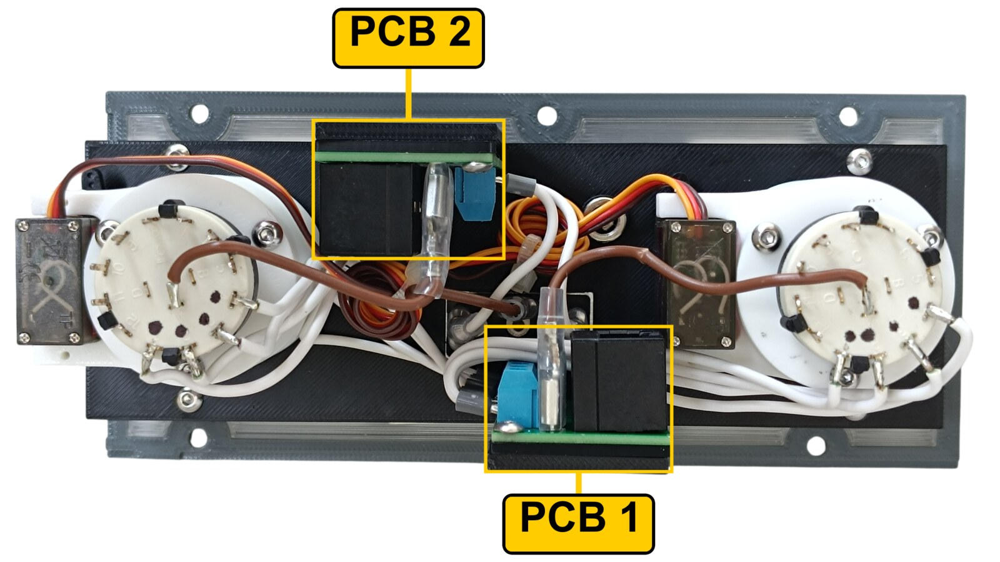

The rear of the panel. **PCB 1** sits on its frame at the bottom edge of the backlight panel, **PCB 2** on its frame at the top edge. The servo cables of both Engine Start Switches run to PCB 2.

### PCB 1 - socket D4 on Overhead_3

| Pin | Switch |
|---:|---|
| 1 | ENGINE START 2 - FLT |
| 2 | ENGINE START 2 - CONT |
| 3 | ENGINE START 2 - OFF |
| 4 | ENGINE START 2 - GRD |
| 5 | ENGINE START 1 - FLT |
| 6 | ENGINE START 1 - CONT |
| 7 | ENGINE START 1 - OFF |
| 8 | ENGINE START 1 - GRD |

### PCB 2 - socket D6 on Overhead_3

| Pin | Connection |
|---:|---|
| 5 | IGN R |
| 6 | IGN L |
| 7 | ENGINE START 1 - servo |
| 8 | ENGINE START 2 - servo |

Pins 1-4 are not used. The two servos plug onto the three-pin headers at positions 7 and 8, which carry the control signal, **+5 V** and **GND**.

> **⚠️ Both servo plugs have to be rewired**\
> The MG90S does not leave the factory in the order the RJ45 Direct PCB expects, so a servo will **not** work if you plug it in as it comes. **Swap the red and the orange wire:**
>
> | | Wire order in the plug |
> |---|---|
> | As delivered | brown - red - orange |
> | **Needed** | **brown - orange - red** |
>
> Lift the small tabs on the plastic housing, pull those two crimped contacts out and swap them over. Brown stays where it is.

**All the switches share a single ground return.** Each switch takes one of its terminals to its own pin on the Direct PCB. The opposite terminals are commoned - daisy-chained from one switch to the next - and the chain ends at a **-** (ground) contact.

---

## Backlight

| Qty | Part | Reference |
|---:|---|---|
| 5× | LED strip | [Product I used](../../images/parts/AE_led_strip.png) |
| 1× | DC jack 5.5 × 2.5 mm | [Product I used](../../images/parts/AE_dc_jack.png) |

Powered from the **12 V** supply - see [Power supply](../system-overview.md#power-supply).

---

## Assembly Diagram

Screw abbreviations used in the diagrams: **FH** = flat head, **DH** = dome head.

### 1. Bottom panel - switches and standoffs

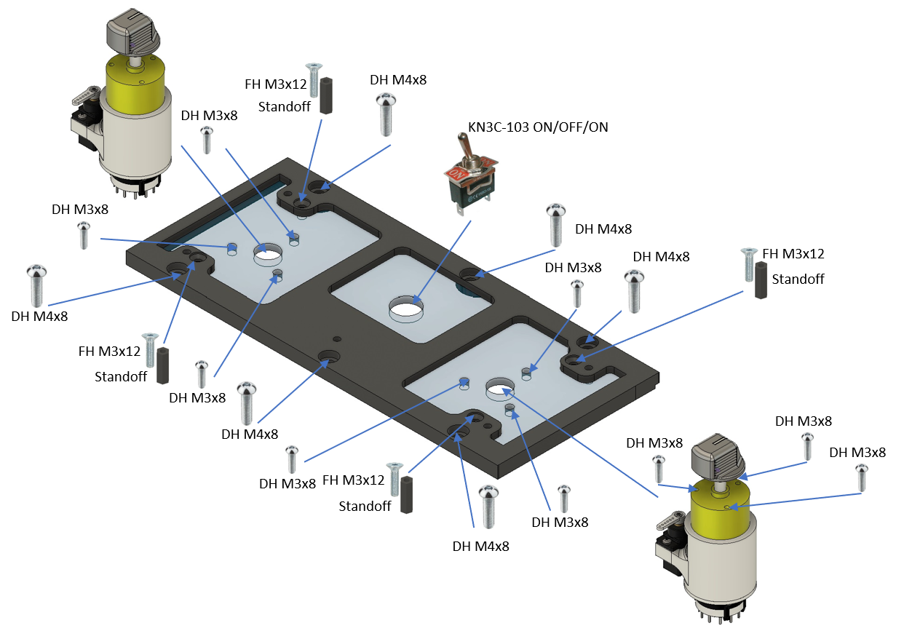

### 2. Backlight panel - LED strips

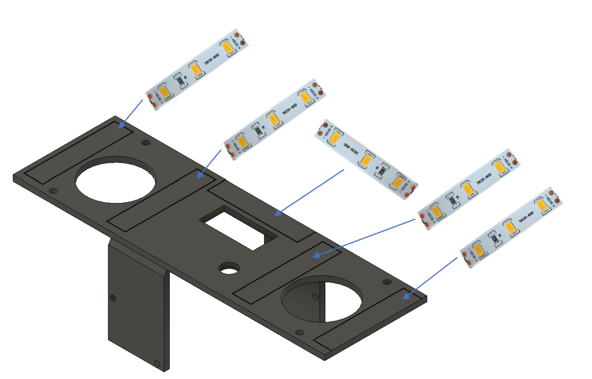

### 3. Backlight panel - PCBs and DC jack

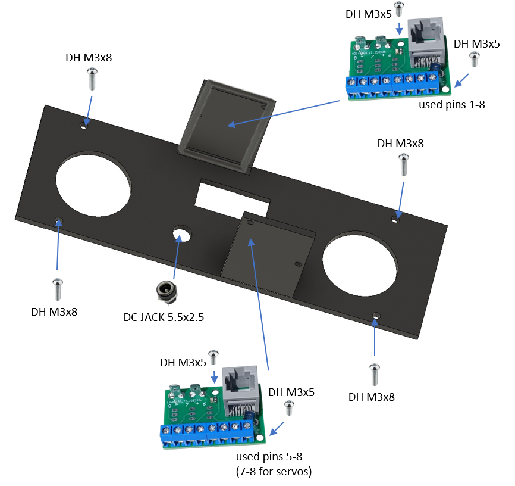

### 4. Top panel

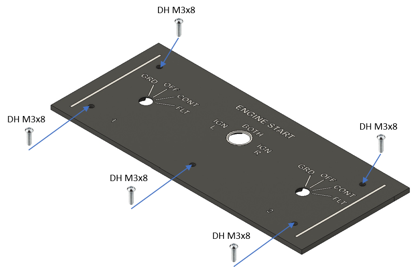
