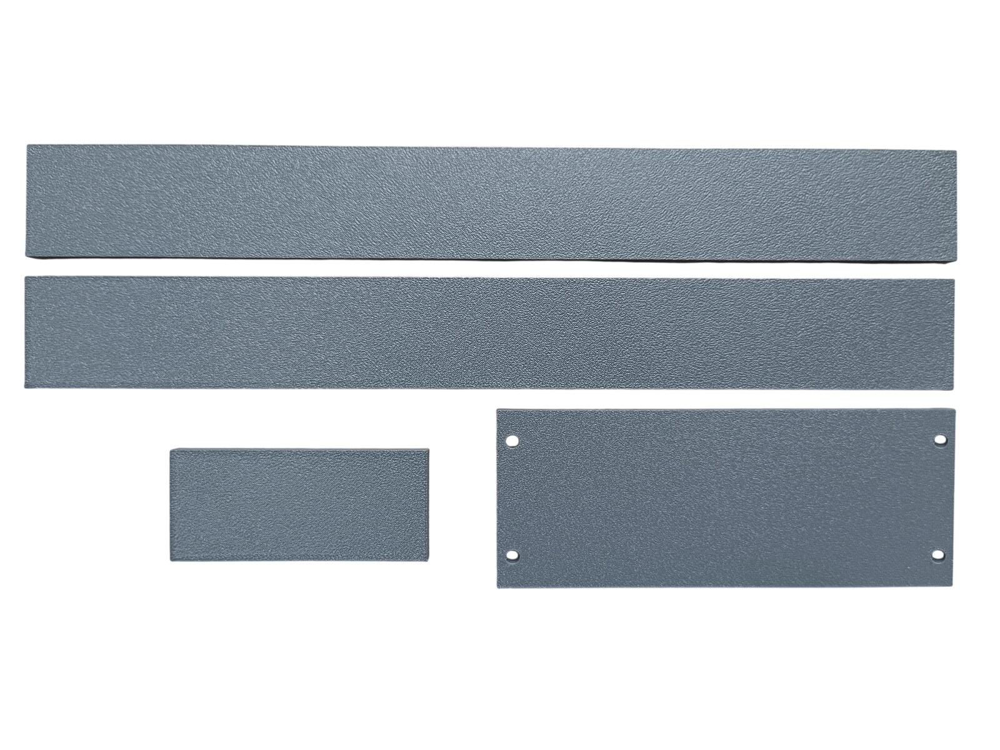
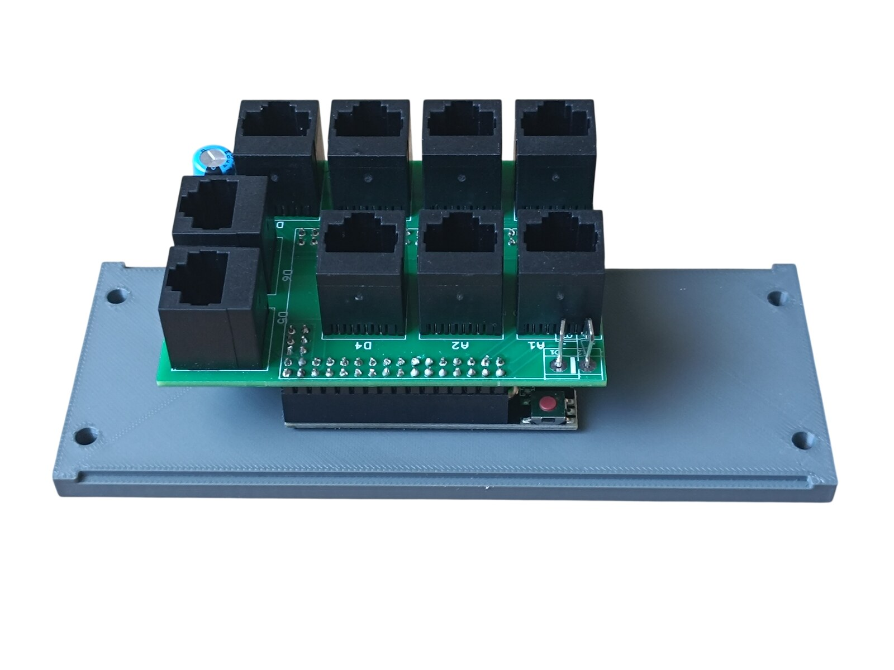
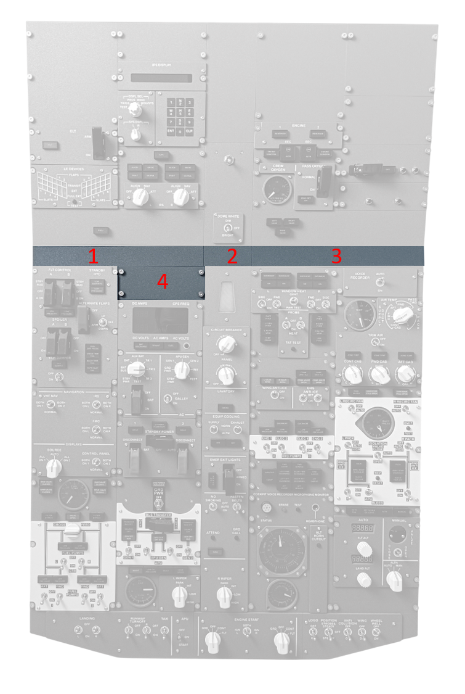
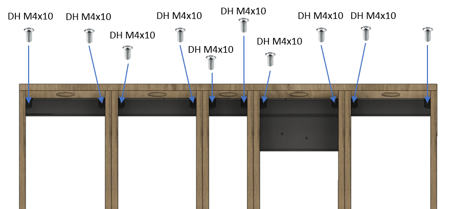
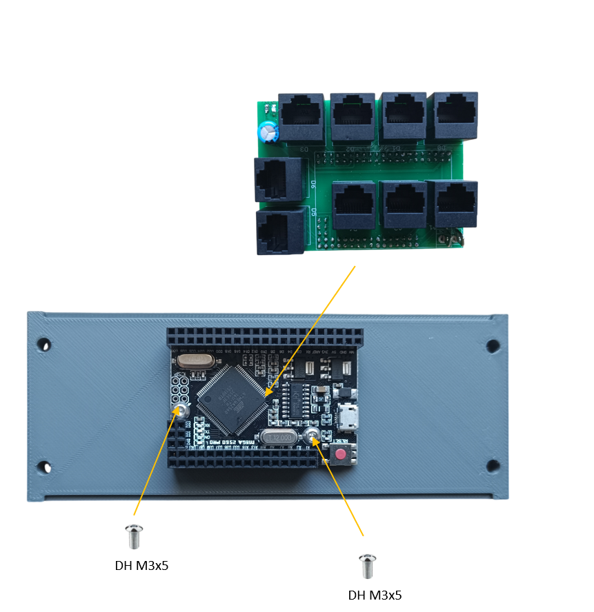
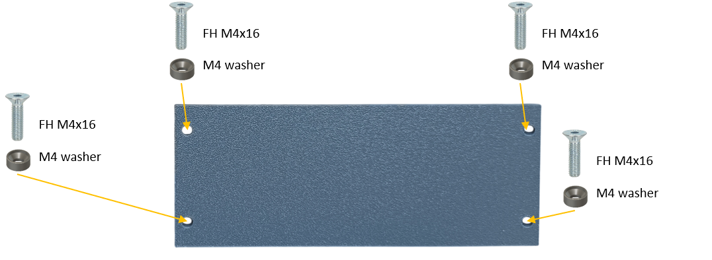

# 41. FWD Blank Panels

[📦 Download the printable model on MakerWorld](https://makerworld.com/en/models/3381374-boeing-737-overhead-fwd-blank-panels)

[← Back to model list](README.md)

---

## Photos

<table>
<tbody>
<tr>
<td align="center" width="50%"> The four blank panels</td>
<td align="center" width="50%"> Blank panel 4 from behind, with the MEGA 2560 and its RJ45 Hub Shield</td>
</tr>
</tbody>
</table>

---

## Panel Positions

---

## Filament

| | Colour | Filament |
|---|---|---|
|  | Dark Gray | C-Tech Premium Line PLA RAL7011 |

---

## 3D Printed Parts

| Qty | Part | Notes |
|---:|---|---|
| 1× | Blank FWD panel 1 | print on a **Textured** PEI plate |
| 1× | Blank FWD panel 2 | print on a **Textured** PEI plate |
| 1× | Blank FWD panel 3 | print on a **Textured** PEI plate |
| 1× | Blank FWD panel 4 | print on a **Textured** PEI plate |
| 4× | M4 washer | one under each M4×16 screw of panel 4 |

---

## Electronic Components

| Qty | Part | Reference |
|---:|---|---|
| 1× | **MEGA 2560 PRO MINI** | [The boards](../system-overview.md#the-boards) |

Panel 4 carries the board marked **mega 2b** in [The boards](../system-overview.md#the-boards) - `Overhead_2b` in MobiFlight - with its RJ45 Hub Shield plugged on top.

---

## Screws

| Qty | Screw | Joins |
|---:|---|---|
| 4× | Flat head M4×16 | panel 4 + main frame |
| 2× | Dome head M3×5 | MEGA 2560 + panel 4 |
| 10× | Dome head M4×10 | panels 1-3 + main frame |

---

## PCB

| Qty | PCB | Connections used | Gerber files |
|---:|---|---|---|
| 1× | [RJ45 Hub Shield](../pcb/rj45-hub-shield.md) | plugs onto the MEGA 2560 | [📥 PCB_RJ45_Hub_Shield.zip](https://raw.githubusercontent.com/om7ea/B737/main/PCB/PCB_RJ45_Hub_Shield.zip) |

The shield is fitted in [step 2](#2-mega-2560-and-rj45-hub-shield-on-panel-4) of the assembly diagram.

---

## Assembly Diagram

Screw abbreviations used in the diagrams: **FH** = flat head, **DH** = dome head.

### 1. Panels 1-3 onto the main frame

### 2. MEGA 2560 and RJ45 Hub Shield on panel 4

### 3. Panel 4 onto the main frame

