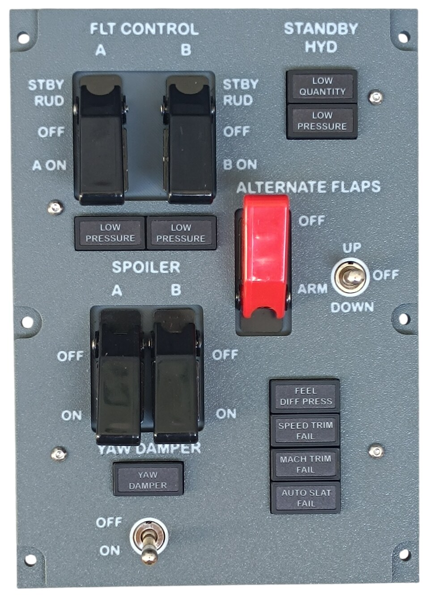
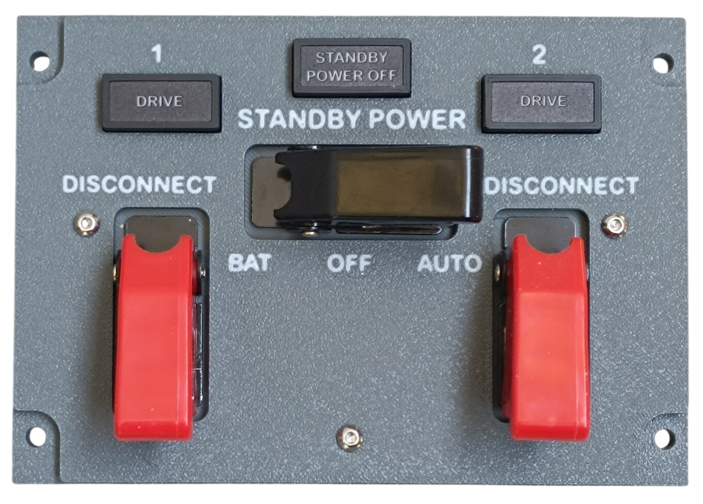
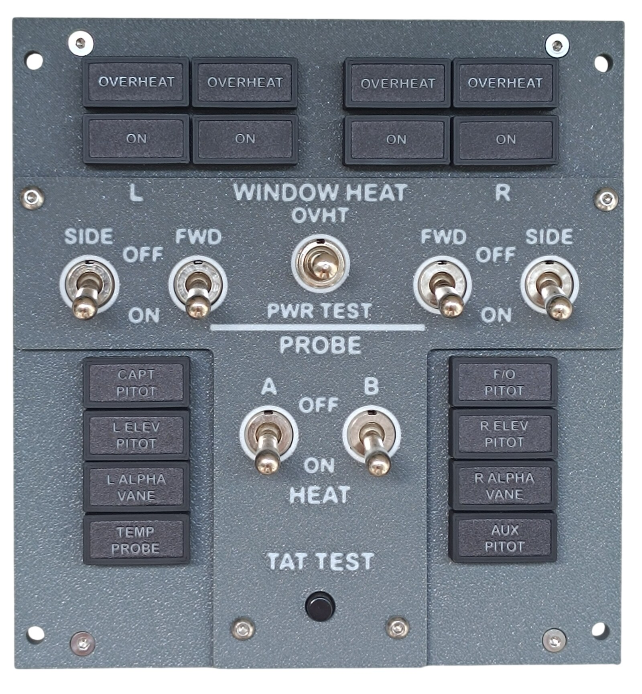
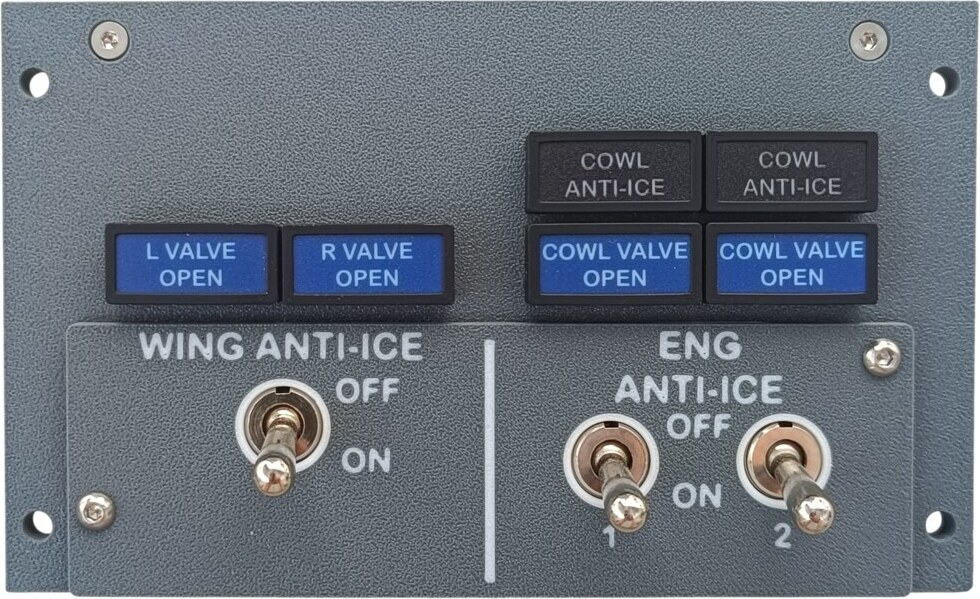
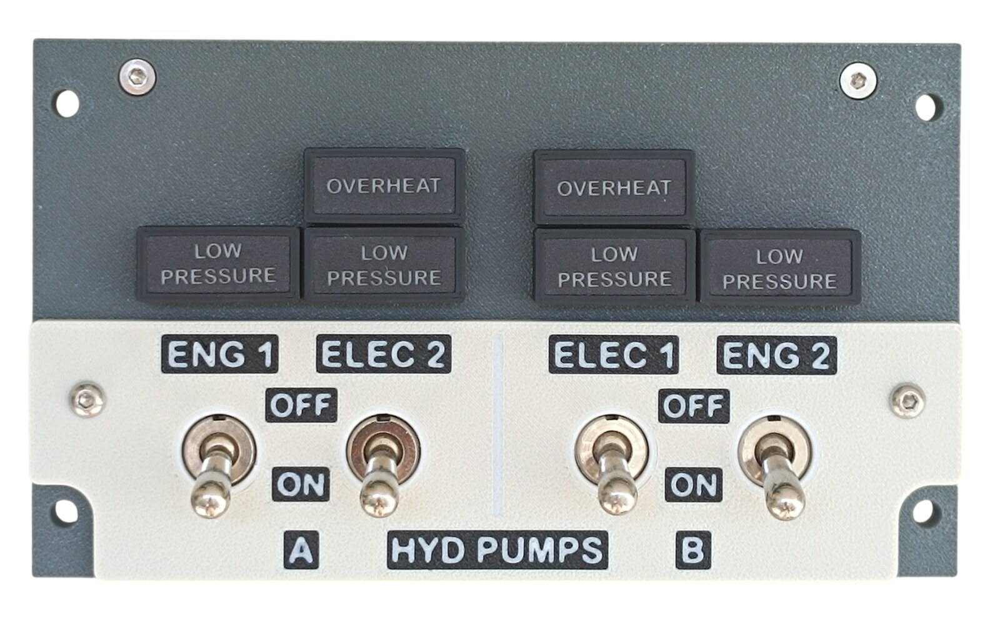
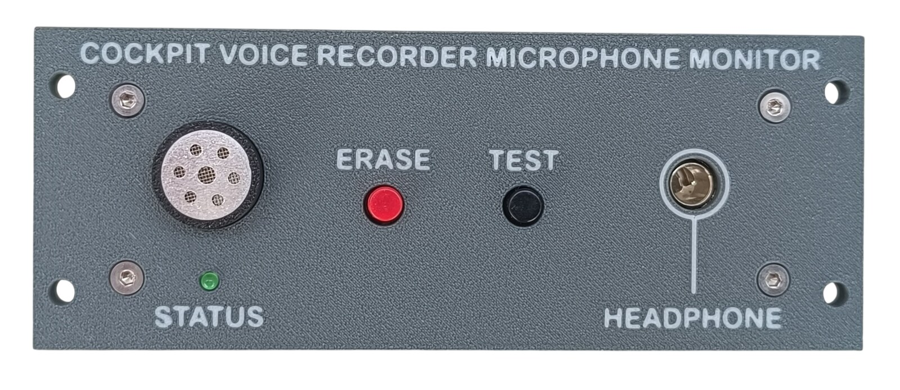

# Models

Build notes for the individual models. The printable parts themselves are published on MakerWorld — the pages linked below contain the print settings and assembly instructions for each model.

[← Back to main page](../../README.md)

The numbering follows the order in which the models were released on MakerWorld.

---

## Frame and Shared Components

These are not panels. The frame carries the whole overhead, and the components below are reused across many panels.

| | # | Model | MakerWorld | Build notes |
|---|---:|---|---|---|
| | 1 | Main Frame | [Model](https://makerworld.com/en/models/3179915-boeing-737-overhead-frame) | 🚧 |
| | 2 | Annunciators | [Model](https://makerworld.com/en/models/3121595-boeing-737-overhead-annunciators) | [Notes](02-annunciators.md) |
| | 3 | Rotary Knobs | [Model](https://makerworld.com/en/models/3066127-boeing-737-overhead-rotary-knobs) | 🚧 |

---

## Panels

| | # | Panel | MakerWorld | Build notes |
|---|---:|---|---|---|
| | 4 | Navigation Panel | [Model](https://makerworld.com/en/models/2985636-boeing-737-overhead-navigation-panel) | 🚧 |
|  | 5 | Flight Control Panel | [Model](https://makerworld.com/en/models/3153234-boeing-737-overhead-flight-control-panel) | [Notes](05-flight-control-panel.md) |
|  | 6 | Door Warning Panel | [Model](https://makerworld.com/en/models/3163604-boeing-737-overhead-door-warning-panel) | [Notes](06-door-warning-panel.md) |
|  | 7 | Generator Drive and Standby Power Panel | [Model](https://makerworld.com/en/models/3163662-boeing-737-overhead-generator-drive-panel) | [Notes](07-generator-drive-panel.md) |
|  | 8 | Window and Probe Heat Panel | [Model](https://makerworld.com/en/models/3196345-boeing-737-overhead-window-and-probe-heat-panel) | [Notes](08-window-and-probe-heat-panel.md) |
|  | 9 | Anti-ice Panel | [Model](https://makerworld.com/en/models/3197814-boeing-737-overhead-anti-ice-panel) | [Notes](09-anti-ice-panel.md) |
|  | 10 | Hydraulic Control Panel | [Model](https://makerworld.com/en/models/3212634-boeing-737-overhead-hydraulic-control-panel) | [Notes](10-hydraulic-control-panel.md) |
|  | 11 | Voice Recorder Monitor | 🚧 | [Notes](11-voice-recorder-monitor.md) |

More panels are currently in preparation.
