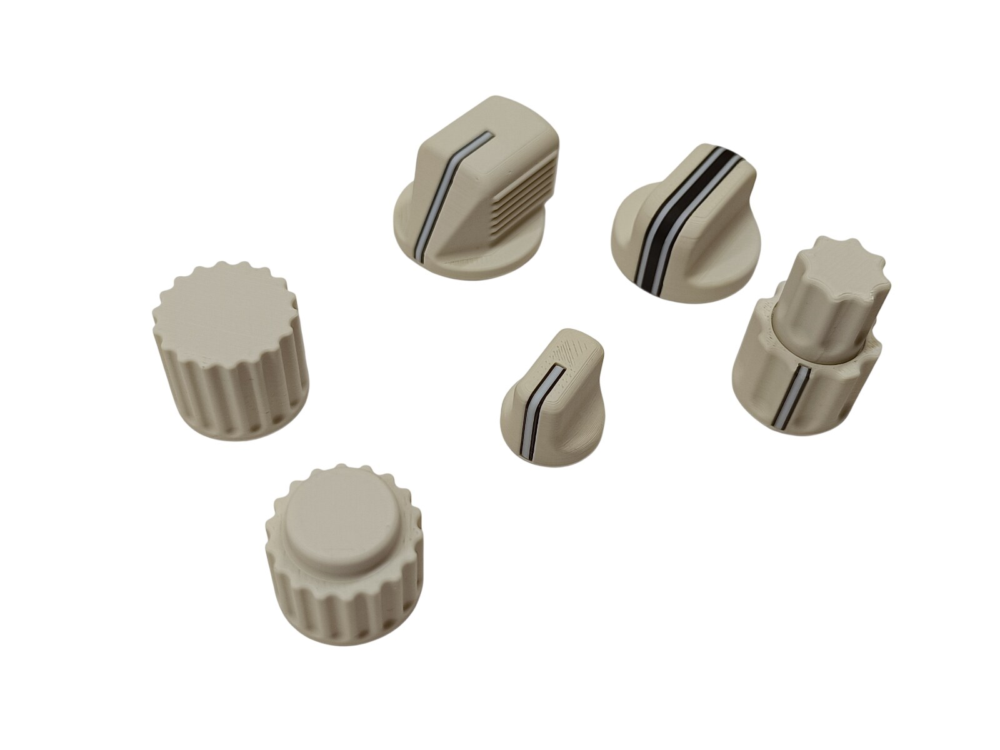
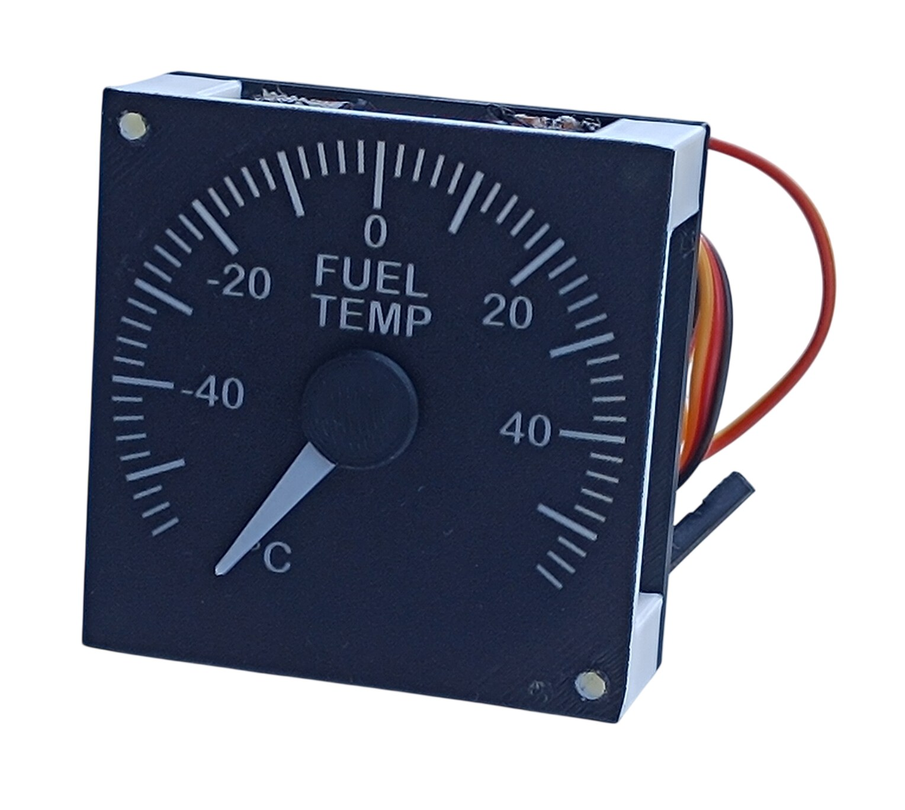
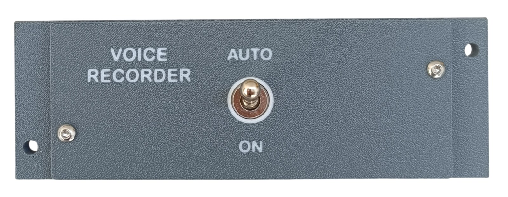
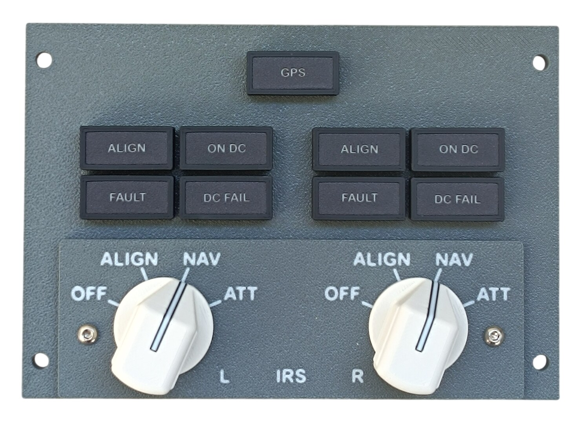
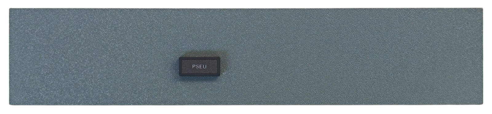
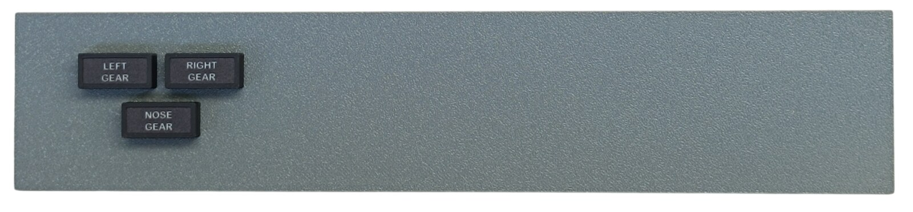
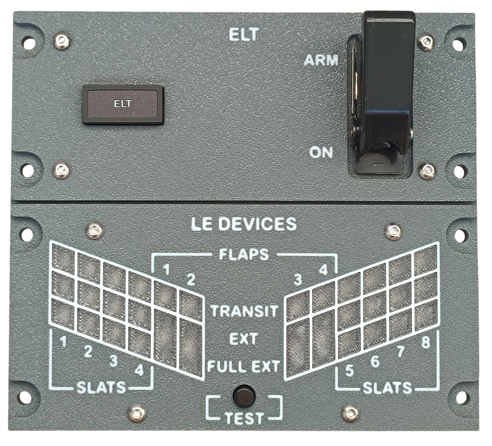
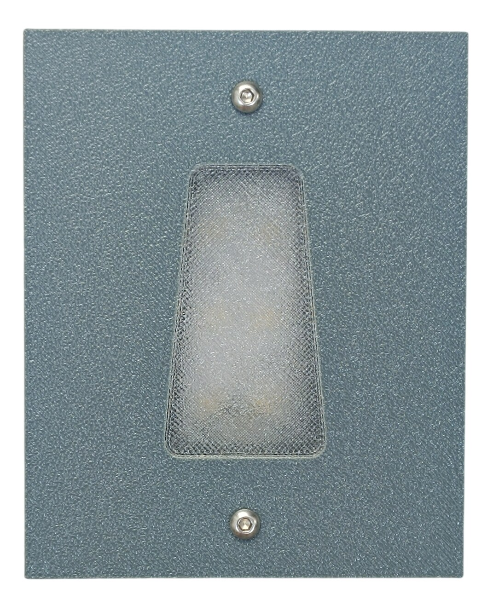
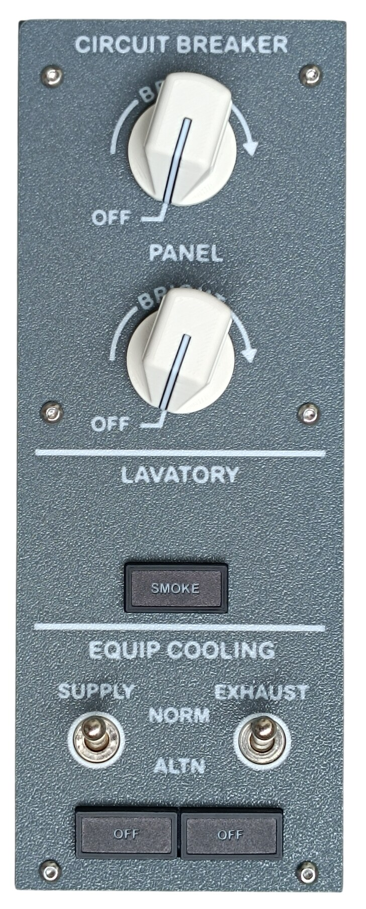
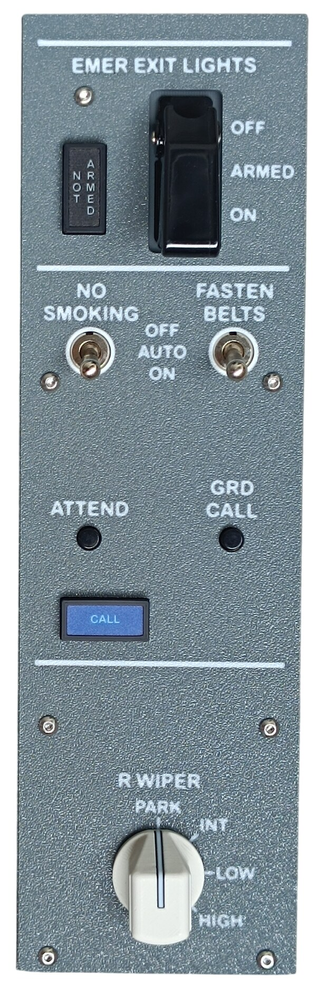

# Models

Build notes for the individual models. The printable parts themselves are published on MakerWorld — the pages linked below contain the print settings and assembly instructions for each model.

[← Back to main page](../../README.md)

The models are listed in the order in which they were released on MakerWorld.

---

## Frame and Shared Models

These are not panels. The frame carries the whole overhead; the rest are components and instruments that go into the panels — some of them into several.

<table>
<thead>
<tr>
<th></th>
<th>Model</th>
<th>MakerWorld</th>
<th>Build notes</th>
</tr>
</thead>
<tbody>
<tr>
<td></td>
<td>Main Frame</td>
<td><a href="https://makerworld.com/en/models/3179915-boeing-737-overhead-frame">Model</a></td>
<td>🚧</td>
</tr>
</tbody>
<tbody>
<tr>
<td></td>
<td>Annunciators</td>
<td><a href="https://makerworld.com/en/models/3121595-boeing-737-overhead-annunciators">Model</a></td>
<td><a href="02-annunciators.md">Notes</a></td>
</tr>
</tbody>
<tbody>
<tr>
<td></td>
<td>Rotary Knobs</td>
<td><a href="https://makerworld.com/en/models/3066127-boeing-737-overhead-rotary-knobs">Model</a></td>
<td><a href="03-rotary-knobs.md">Notes</a></td>
</tr>
</tbody>
<tbody>
<tr>
<td></td>
<td>Temperature and Climb Gauges</td>
<td><a href="https://makerworld.com/en/models/3251829-boeing-737-overhead-temperature-and-climb-gauges">Model</a></td>
<td><a href="21-temperature-and-climb-gauges.md">Notes</a></td>
</tr>
</tbody>
<tbody>
<tr>
<td></td>
<td>Oxygen Pressure Gauge</td>
<td>🚧</td>
<td>🚧</td>
</tr>
</tbody>
<tbody>
<tr>
<td></td>
<td>Outflow Valve Gauge</td>
<td>🚧</td>
<td>🚧</td>
</tr>
</tbody>
<tbody>
<tr>
<td></td>
<td>Cabin Alt / Diff Press Gauge</td>
<td>🚧</td>
<td>🚧</td>
</tr>
</tbody>
<tbody>
<tr>
<td></td>
<td>Duct Pressure Gauge</td>
<td>🚧</td>
<td>🚧</td>
</tr>
</tbody>
</table>

---

## Panels

<table>
<thead>
<tr>
<th></th>
<th>Panel</th>
<th>MakerWorld</th>
<th>Build notes</th>
</tr>
</thead>
<tbody>
<tr>
<td></td>
<td>Navigation Panel</td>
<td><a href="https://makerworld.com/en/models/2985636-boeing-737-overhead-navigation-panel">Model</a></td>
<td><a href="04-navigation-panel.md">Notes</a></td>
</tr>
</tbody>
<tbody>
<tr>
<td></td>
<td>Flight Control Panel</td>
<td><a href="https://makerworld.com/en/models/3153234-boeing-737-overhead-flight-control-panel">Model</a></td>
<td><a href="05-flight-control-panel.md">Notes</a></td>
</tr>
</tbody>
<tbody>
<tr>
<td></td>
<td>Door Warning Panel</td>
<td><a href="https://makerworld.com/en/models/3163604-boeing-737-overhead-door-warning-panel">Model</a></td>
<td><a href="06-door-warning-panel.md">Notes</a></td>
</tr>
</tbody>
<tbody>
<tr>
<td></td>
<td>Generator Drive and Standby Power Panel</td>
<td><a href="https://makerworld.com/en/models/3163662-boeing-737-overhead-generator-drive-panel">Model</a></td>
<td><a href="07-generator-drive-panel.md">Notes</a></td>
</tr>
</tbody>
<tbody>
<tr>
<td></td>
<td>Window and Probe Heat Panel</td>
<td><a href="https://makerworld.com/en/models/3196345-boeing-737-overhead-window-and-probe-heat-panel">Model</a></td>
<td><a href="08-window-and-probe-heat-panel.md">Notes</a></td>
</tr>
</tbody>
<tbody>
<tr>
<td></td>
<td>Anti-ice Panel</td>
<td><a href="https://makerworld.com/en/models/3197814-boeing-737-overhead-anti-ice-panel">Model</a></td>
<td><a href="09-anti-ice-panel.md">Notes</a></td>
</tr>
</tbody>
<tbody>
<tr>
<td></td>
<td>Hydraulic Control Panel</td>
<td><a href="https://makerworld.com/en/models/3212634-boeing-737-overhead-hydraulic-control-panel">Model</a></td>
<td><a href="10-hydraulic-control-panel.md">Notes</a></td>
</tr>
</tbody>
<tbody>
<tr>
<td></td>
<td>Voice Recorder Monitor</td>
<td><a href="https://makerworld.com/en/models/3212900-boeing-737-overhead-voice-recorder-monitor">Model</a></td>
<td><a href="11-voice-recorder-monitor.md">Notes</a></td>
</tr>
</tbody>
<tbody>
<tr>
<td></td>
<td>Voice Recorder Switch</td>
<td><a href="https://makerworld.com/en/models/3214222-boeing-737-overhead-voice-recorder-switch">Model</a></td>
<td><a href="12-voice-recorder-switch.md">Notes</a></td>
</tr>
</tbody>
<tbody>
<tr>
<td></td>
<td>IRS Mode Select Unit</td>
<td><a href="https://makerworld.com/en/models/3214377-boeing-737-overhead-irs-mode-select-unit">Model</a></td>
<td><a href="13-irs-mode-select-unit.md">Notes</a></td>
</tr>
</tbody>
<tbody>
<tr>
<td></td>
<td>IRS Display Unit</td>
<td><a href="https://makerworld.com/en/models/3222680-boeing-737-overhead-irs-display-unit">Model</a></td>
<td><a href="14-irs-display-unit.md">Notes</a></td>
</tr>
</tbody>
<tbody>
<tr>
<td></td>
<td>PSEU Panel</td>
<td><a href="https://makerworld.com/en/models/3223471-boeing-737-overhead-pseu-panel">Model</a></td>
<td><a href="15-pseu-panel.md">Notes</a></td>
</tr>
</tbody>
<tbody>
<tr>
<td></td>
<td>Landing Gear Indicator Panel</td>
<td><a href="https://makerworld.com/en/models/3223506-boeing-737-overhead-landing-gear-indicator-panel">Model</a></td>
<td><a href="16-landing-gear-indicator-panel.md">Notes</a></td>
</tr>
</tbody>
<tbody>
<tr>
<td></td>
<td>LE Devices and ELT Panel</td>
<td><a href="https://makerworld.com/en/models/3233836-boeing-737-overhead-le-devices-and-elt-panel">Model</a></td>
<td><a href="17-le-devices-and-elt-panel.md">Notes</a></td>
</tr>
</tbody>
<tbody>
<tr>
<td></td>
<td>Flood Light</td>
<td><a href="https://makerworld.com/en/models/3237863-boeing-737-overhead-flood-light">Model</a></td>
<td><a href="18-flood-light.md">Notes</a></td>
</tr>
</tbody>
<tbody>
<tr>
<td></td>
<td>Center Upper Panel</td>
<td><a href="https://makerworld.com/en/models/3238245-boeing-737-overhead-center-upper-panel">Model</a></td>
<td><a href="19-center-upper-panel.md">Notes</a></td>
</tr>
</tbody>
<tbody>
<tr>
<td></td>
<td>Center Lower Panel</td>
<td><a href="https://makerworld.com/en/models/3238455-boeing-737-overhead-center-lower-panel">Model</a></td>
<td><a href="20-center-lower-panel.md">Notes</a></td>
</tr>
</tbody>
</table>

More panels are currently in preparation.
