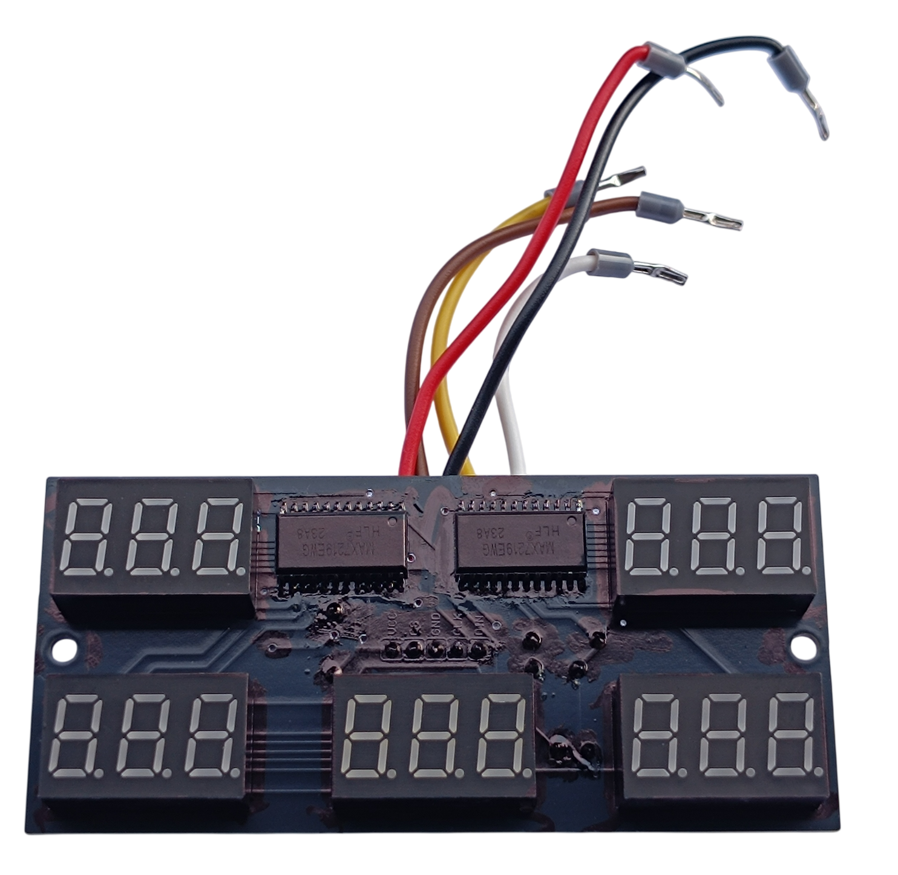
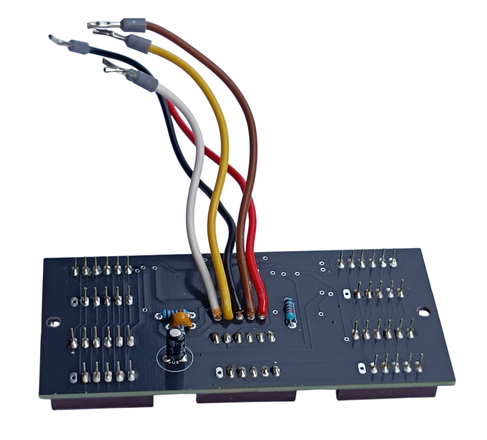
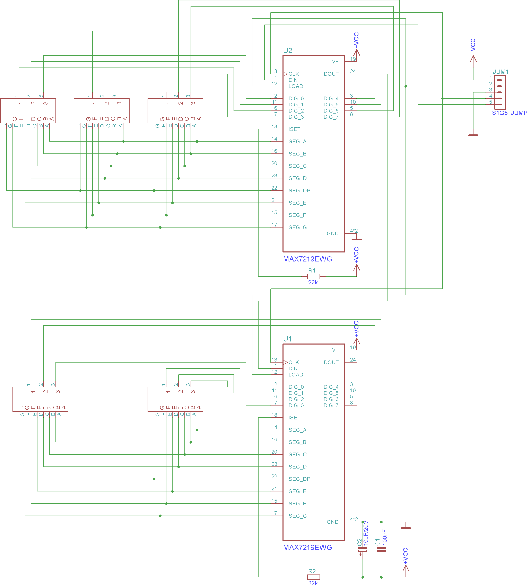

# 8. AC and DC Meter

<table>
<tbody>
<tr>
<td align="center"> Front view</td>
<td align="center"> Rear view</td>
</tr>
</tbody>
</table>

[📥 Download Gerber files - PCB_AC_DC_Meter.zip](https://raw.githubusercontent.com/om7ea/B737/main/PCB/PCB_AC_DC_Meter.zip)

[← Back to PCB overview](README.md)

---

## Purpose

Designed for the **AC and DC Meter Panel**. It carries the five three-digit displays of that panel and reaches the MEGA 2560 PRO MINI over five wires. The digits are driven by two **MAX7219** display drivers, chained one behind the other so that the whole board works off a single serial link.

## Quantity

Only **1** PCB is required for the complete project.

---

## Bill of Materials (BOM) - per PCB

| Qty | Part | Reference |
|---:|---|---|
| 2× | **MAX7219EWG** - SOP24, surface mount | [Product I used](../../images/parts/AE_MAX7219.png) |
| 5× | **7-segment display** - 3 digits, common cathode, 0.36 inch, green | [Product I used](../../images/parts/AE_7seg_display.png) |
| 2× | **22 kΩ resistor** - one per MAX7219 | |
| 1× | **100 nF ceramic capacitor** | |
| 1× | **10 µF / 25 V electrolytic capacitor** | |

---

## Connections

Five wires are soldered straight into the pads in the middle of the board - there is no connector. I used a different colour for each of them, so that they can be told apart on the photos above.

| Pad | Wire colour on my board |
|---|---|
| VCC | red |
| LOAD (CS) | brown |
| GND | black |
| CLK | yellow |
| DIN | white |

---

## Assembly Notes

- The five displays and the two MAX7219 go on the **front** of the board. The two resistors, both capacitors and the five wires are on the **back**.
- The two MAX7219 are the only surface mounted parts. Solder them first, while the board still lies flat.

> **Note**
> Paint over the side walls of every display with a black marker, and paint over all the silver parts as well - the pads, the solder joints and the leads of the integrated circuits. Nothing then catches the light behind the window of the panel, and there is no sign of a circuit board inside.

---

## Schematic

