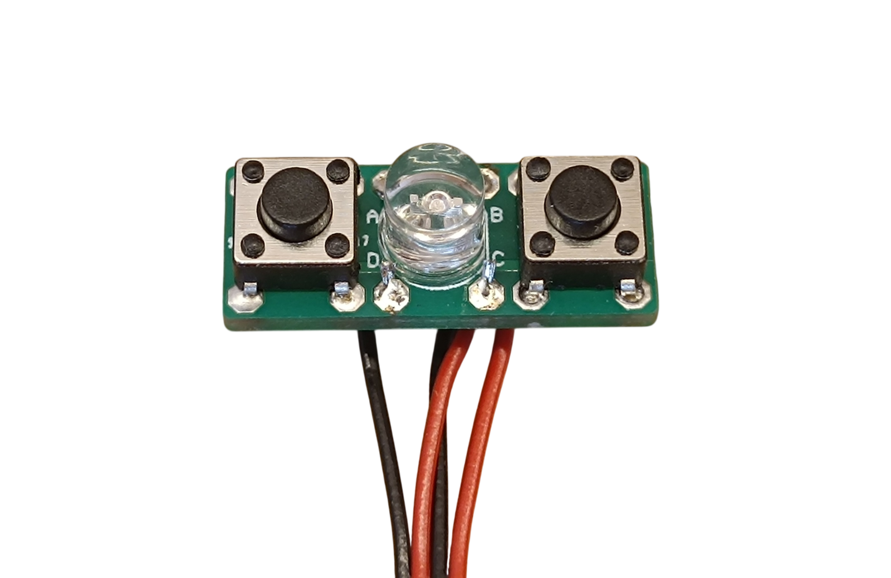
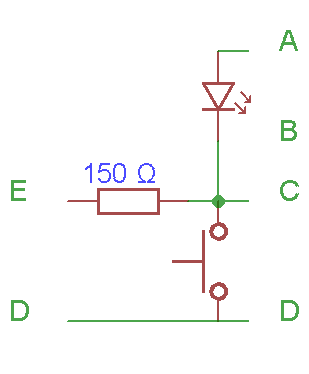
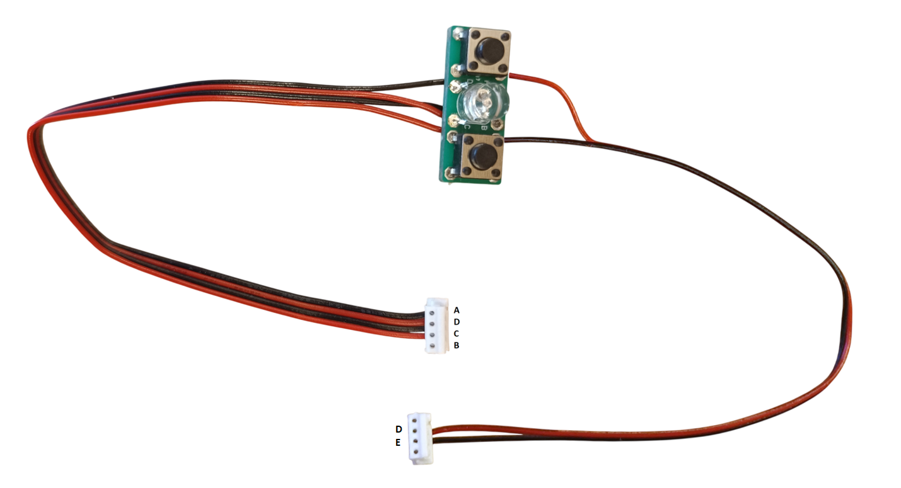

# 1. Annunciator PCB

[📥 Download Gerber files - PCB_Annunciator.zip](https://raw.githubusercontent.com/om7ea/B737/main/PCB/PCB_Annunciator.zip)

[← Back to PCB overview](README.md)

---

## Quantity

A total of **125** PCBs are required for the complete project. I recommend ordering a few extra in case some are damaged during assembly.

## Annunciator Types

The project includes several types of annunciators:

| Qty | Background | LED |
|---:|---|---|
| 93× | black | yellow |
| 9× | black | green |
| 2× | black | white |
| 8× | blue | white |
| 9× | blue | white, two brightness levels (DIM/BRIGHT) |
| 2× | black | large special annunciators in the Engine Panel - two PCBs each, white LED in the upper section and yellow LED in the lower section |

> **Note**
> The dual brightness annunciators are optional. They are only required if you want to reproduce the two brightness levels. For a simpler build, omit them and use the standard version instead.

---

## Bill of Materials (BOM) - for all 125 PCBs

| Qty | Part | Reference |
|---:|---|---|
| 125× | **PCB** | download the Gerber files above |
| 250× | **Switch** - 6×6×4.5 tact switch, 4-pin vertical micro button | [Product I used](../../images/parts/AE_button.png) |
| 95× | **Yellow 5 mm flat top LED** | [Product I used](../../images/parts/AE_led_yellow.png) |
| 9× | **Green 5 mm flat top LED** | [Product I used](../../images/parts/AE_led_green.png) |
| 21× | **White 5 mm flat top LED** | [Product I used](../../images/parts/AE_led_white.png) |
| 134× | **Cable with connector** - ZH 1.5 28AWG 15 cm, 4 pins (125 for annunciators + 9 for the dual brightness function); buy the set - connectors + cables | [Product I used](../../images/parts/AE_ZH.png) |
| 9× | **150 Ω resistor** for the dual brightness function - I used 0805 SMD | |

---

## PCB Assembly & Wiring

### Standard Annunciators

### Annunciators with Dual Brightness Function

For the cable with the connector used for the dual brightness function, the two unused wires can be cut off.

---

## ⚠️ Important - Switch Type

I have encountered two different types of switches, both with a 4.5 mm height. The difference is the length of the actuator pin: one type has a **1.0 mm** pin, the other a **1.5 mm** pin.

The shorter **1.0 mm version caused significant problems** during assembly. I had to modify and trim four plastic supports to make it work, so I do not recommend using this version.

The **1.5 mm version worked perfectly** without any modifications.

Unfortunately, you cannot know in advance which version you will receive when ordering - it seems to depend on the manufacturer/supplier. If you receive the 1.0 mm version, I recommend ordering the switches again from a different supplier. They are relatively inexpensive, and this will save you a lot of trouble during assembly.
