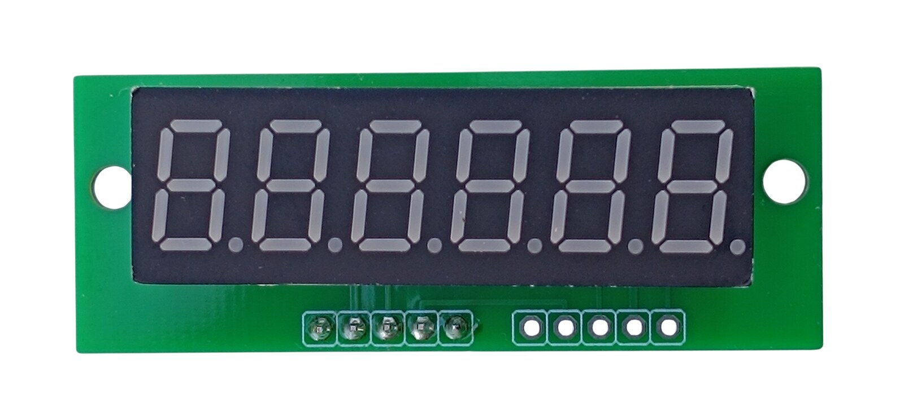
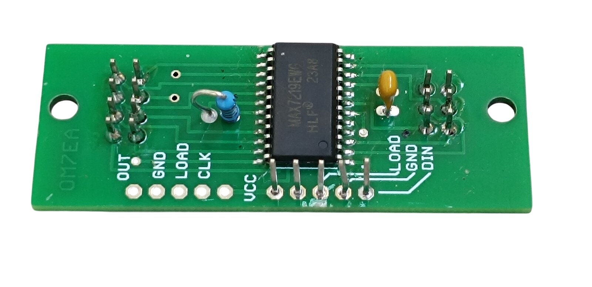
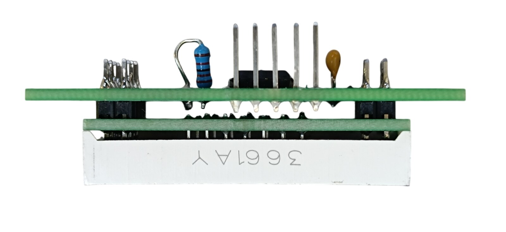
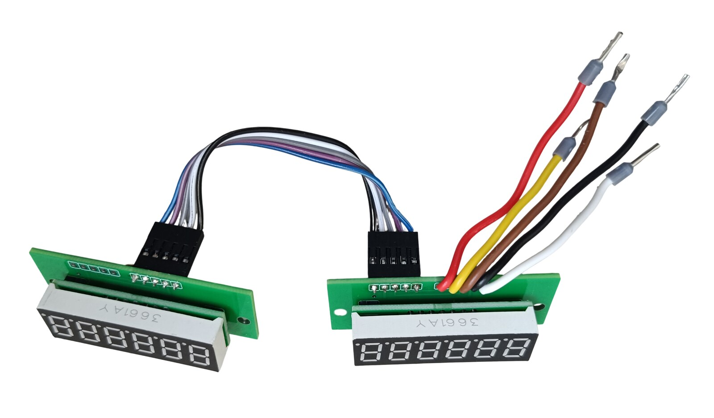
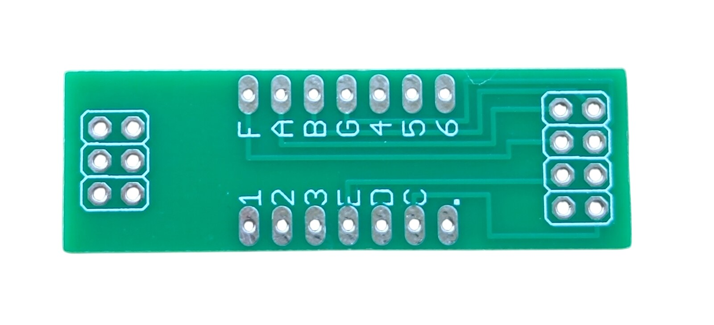
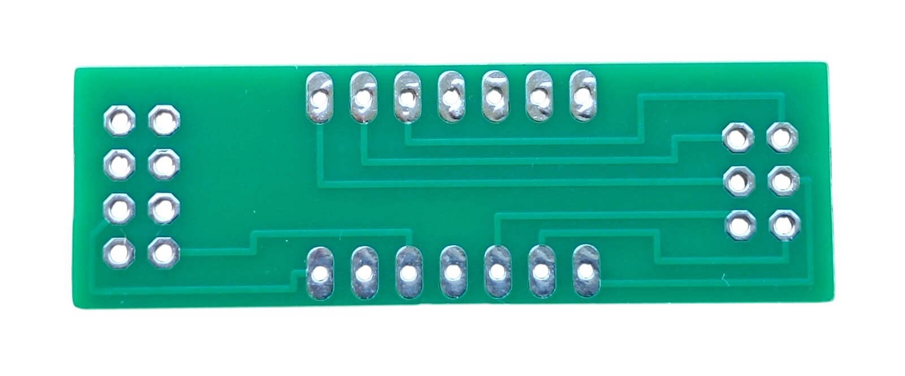
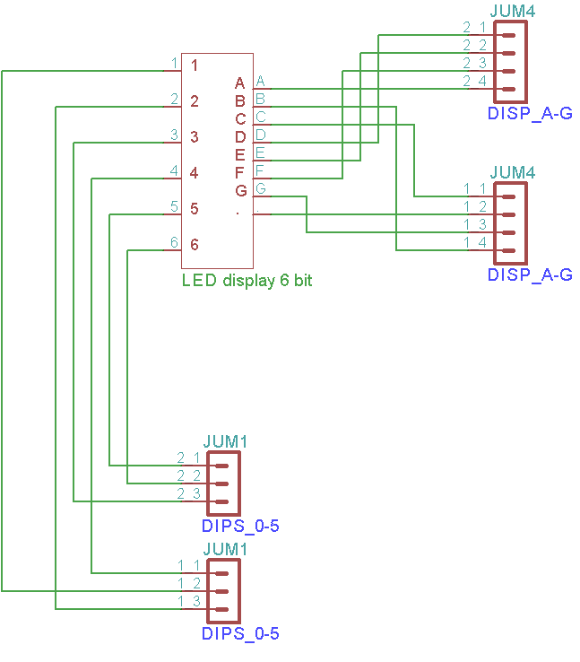
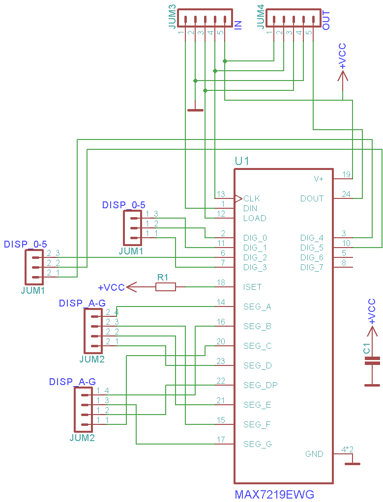

# 9. Cabin Pressure Display

<table>
<tbody>
<tr>
<td align="center"> Assembled module - top</td>
<td align="center"> Assembled module - bottom</td>
</tr>
</tbody>
<tbody>
<tr>
<td align="center"> The two boards from the side</td>
<td align="center"> Both modules joined</td>
</tr>
</tbody>
</table>

[📥 Download Gerber files - board 1, PCB_Cabin_Pressure_Display_LED.zip](https://raw.githubusercontent.com/om7ea/B737/main/PCB/PCB_Cabin_Pressure_Display_LED.zip)

[📥 Download Gerber files - board 2, PCB_Cabin_Pressure_Display_MAX.zip](https://raw.githubusercontent.com/om7ea/B737/main/PCB/PCB_Cabin_Pressure_Display_MAX.zip)

[← Back to PCB overview](README.md)

---

## Purpose

Designed for the **Cabin Pressure Control Panel**. One module drives one six-digit display of that panel, and the panel carries two of them - FLT ALT and LAND ALT. The digits are driven by a **MAX7219**, the same driver as on the [AC and DC Meter](ac-dc-meter.md) board.

This is **two boards soldered into a single module**. Board 1 carries the display, board 2 carries the MAX7219, and the two double row pin headers that join them are soldered into both boards - the module cannot be taken apart again. Each board has its own outline and its own Gerber file, so both have to be ordered.

## Quantity

**2** modules are required for the complete project, which means **2× board 1 and 2× board 2**.

---

## Board 1 - Display

<table>
<tbody>
<tr>
<td align="center"> Display side</td>
<td align="center"> Reverse side</td>
</tr>
</tbody>
</table>

The board carries nothing but the display and the two headers that reach board 2.

| Qty | Part | Reference |
|---:|---|---|
| 1× | **6-digit 7-segment display** - 0.36 inch, common cathode, yellow (3661AY) | [Product I used](../../images/parts/AE_6digit_display.png) |
| 1× | **Double row pin header 2×3** | |
| 1× | **Double row pin header 2×4** | |

> **Note**
> Solder both headers in first and the display only after that. The display sits over their solder joints, and once it is in place they cannot be reached.

---

## Board 2 - MAX7219 driver

| Qty | Part | Reference |
|---:|---|---|
| 1× | **MAX7219EWG** - SOP24, surface mount | [Product I used](../../images/parts/AE_MAX7219.png) |
| 1× | **22 kΩ resistor** | |
| 1× | **100 nF ceramic capacitor** | |
| 1× | **5-pin single row pin header** | |

The MAX7219 is the only surface mounted part. Solder it first, while the board still lies flat.

---

## Connections

Board 2 has two five-pad connectors, an input and an output, and the silkscreen names every pad:

| Connector | Pads, in the order they are printed on the board |
|---|---|
| Input | VCC, CLK, LOAD, GND, DIN |
| Output | OUT, GND, LOAD, CLK, VCC |

**Only one of the two is populated on each module**, so the two modules are not built the same way.

The FLT ALT module is the one the signal arrives at. Its five wires are soldered straight into the input pads - there is no connector - and they run to the RJ45 Direct PCB on the Cabin Pressure Control Panel. Its five-pin header goes on the **output**.

| Input pad | Wire colour on my board |
|---|---|
| VCC | red |
| CLK | yellow |
| LOAD | brown |
| GND | black |
| DIN | white |

The LAND ALT module is fed from the first one, so its five-pin header goes on the **input** and its output stays empty. The two are joined by a 5-pin Dupont female to female cable, 10 cm long, signal for signal:

| Output pad - FLT ALT | Input pad - LAND ALT |
|---|---|
| OUT | DIN |
| GND | GND |
| LOAD | LOAD |
| CLK | CLK |
| VCC | VCC |

| Qty | Part | Reference |
|---:|---|---|
| 1× | **5-pin Dupont cable** - 2.54 mm, female to female, 10 cm | [Product I used](../../images/parts/AE_dupont_5p.png) |

> **Note**
> The wire colours of the Dupont cable mean nothing here - they do not follow the colours used anywhere else in this project. Go by the pad names printed on the boards, or by the photo of the two joined modules above.

---

## Schematic

 Board 1 - Display

 Board 2 - MAX7219 driver
