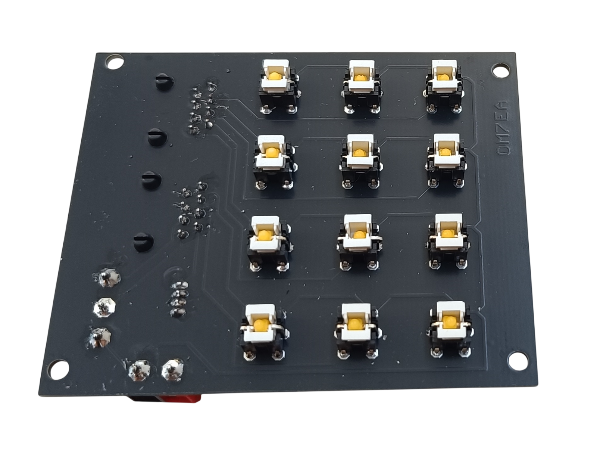
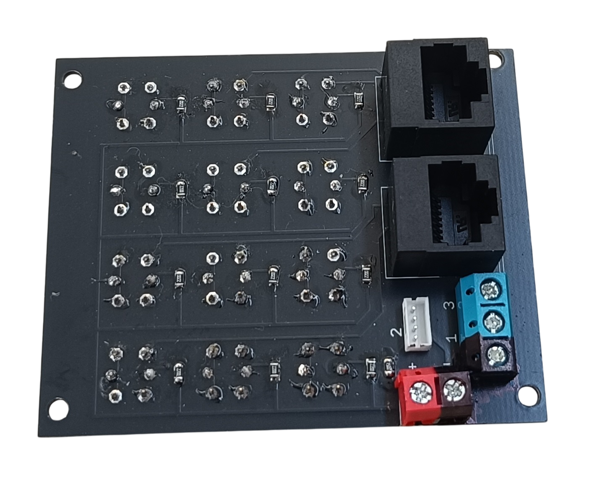
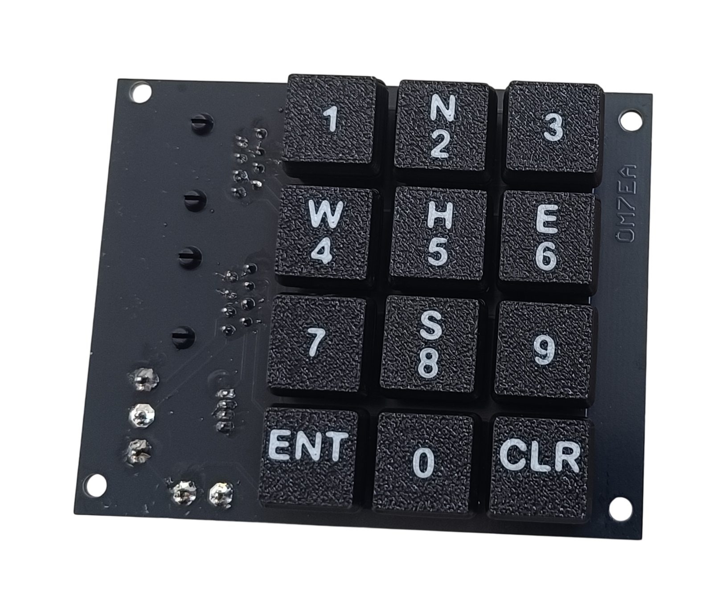
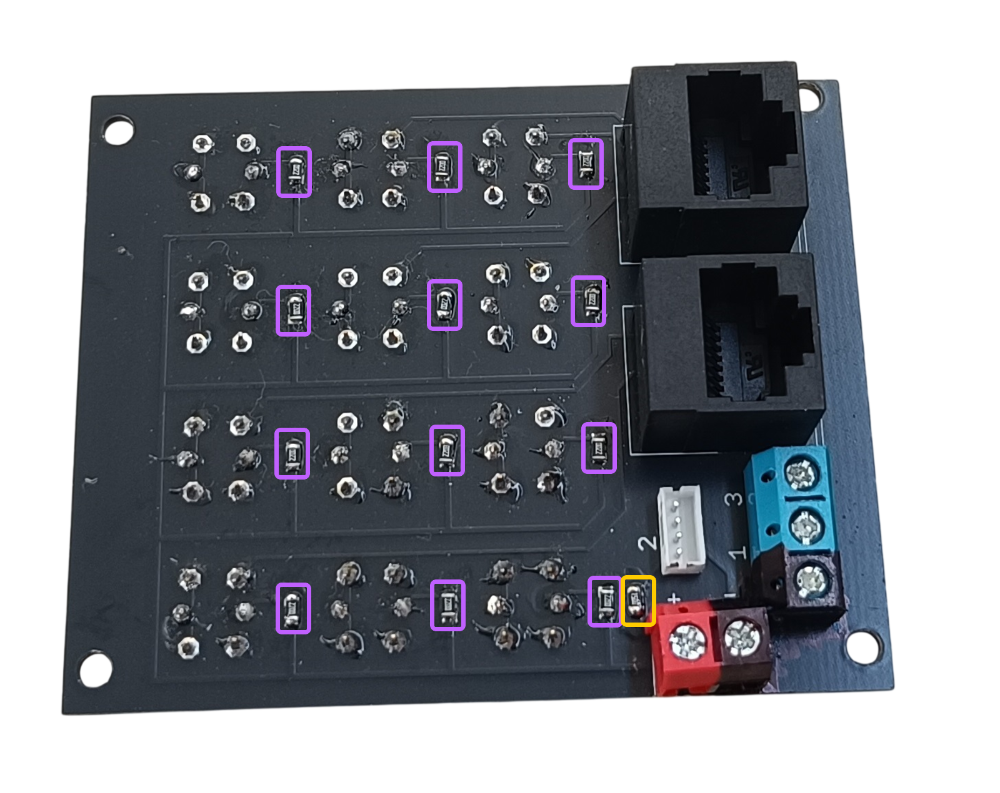

# 6. IRS Keyboard

[📥 Download Gerber files - PCB_IRS_Keyboard.zip](https://raw.githubusercontent.com/om7ea/B737/main/PCB/PCB_IRS_Keyboard.zip)

[← Back to PCB overview](README.md)

---

## Purpose

Designed for the keypad of the **[IRS Display Unit](../models/14-irs-display-unit.md)**. It carries the twelve illuminated push buttons of the keyboard, each with its own LED, and reaches the MEGA 2560 PRO MINI through two RJ45 cables.

The board also drives the **GPS annunciator of the [IRS Mode Select Unit](../models/13-irs-mode-select-unit.md)**, which connects to the ZH header — that is what the 150 Ω resistor is for.

## Quantity

Only **1** PCB is required for the complete project.

---

## Bill of Materials (BOM) — per PCB

| Qty | Part | Reference |
|---:|---|---|
| 12× | **6×6×7 mm tactile switch with lamp holder** — the LED is fitted separately | [Product I used](../../images/parts/AE_button_led.png) |
| 12× | **1.5 mm LED — warm white** | [Product I used](../../images/parts/AE_led_warm_white.png) |
| 2× | **RJ45 connector** — 5224 8P8C in-line, vertical 180°, full plastic | [Product I used](../../images/parts/AE_RJ45.png) |
| 1× | **Header ZH 1.5 4P** — buy the set (connectors + cables) | [Product I used](../../images/parts/AE_ZH.png) |
| 1× | **KF301 PCB screw terminal — 3P** | [Product I used](../../images/parts/AE_KF301.png) |
| 1× | **KF301 PCB screw terminal — 2P** | [Product I used](../../images/parts/AE_KF301.png) |
| 12× | **220 Ω resistor (0805)** — one per button LED | |
| 1× | **150 Ω resistor (0805)** — for the GPS annunciator of the IRS Mode Select Unit | |

> **Note**
> Order the button in the **Lamp Holder** colour variant. The other variants come with the LED already fitted, and it is not the one used here.

> **Note**
> The buttons are sold in packs of 10 and the 1.5 mm LEDs in packs of 50, so the smallest order that covers this board is 20 buttons and 50 LEDs.

---

## Assembly Notes

- The push buttons and their LEDs go on the **front** side of the board. The RJ45 sockets, the ZH header, the two screw terminals and all the SMD resistors go on the **back**.
- The LED is soldered into the board, not into the switch. Push its leads through the holes in the switch body first, then solder them on the back of the board.
- **Check the polarity of every LED before you solder it.** Hold its leads against their pads with the board powered and turn the LED round if it does not light. Solder it only once it lights.

### Resistor Placement

- **Purple** — the twelve **220 Ω** resistors, one per button LED.
- **Yellow** — the single **150 Ω** resistor for the GPS annunciator of the IRS Mode Select Unit.
