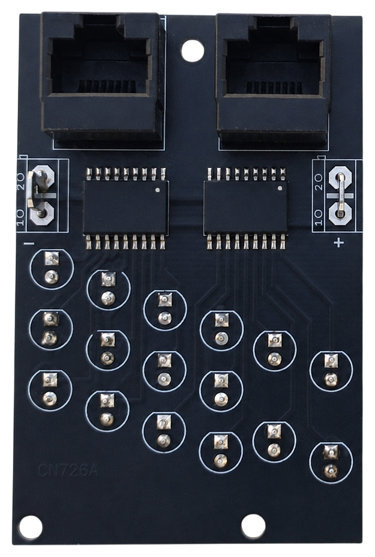
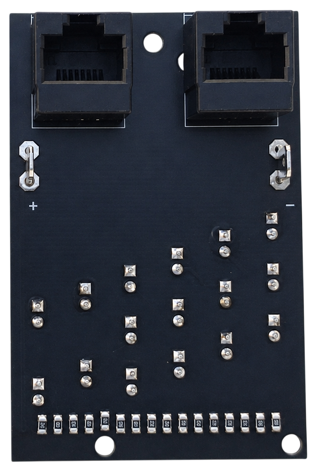

# 7. LE Devices

[← Back to PCB overview](README.md)

---

## Purpose

Designed for the **LE Devices and ELT Panel**. It carries the indicator LEDs of the leading edge devices grid — 16 LEDs per board — and reaches the MEGA 2560 PRO MINI through two RJ45 cables. The LEDs are driven by the same **ULN2803** used on the annunciator driver boards.

## Quantity

**2** PCBs are required for the complete project — one for each half of the panel. They are the same board: the design is symmetrical, so a single layout serves both the left and the right side.

---

## Bill of Materials (BOM) — for both PCBs

| Qty | Part | Reference |
|---:|---|---|
| 4× | **ULN2803** | [Product I used](../../images/parts/AE_ULN2803.png) |
| 4× | **RJ45 connector** — 5224 8P8C in-line, vertical 180°, full plastic | [Product I used](../../images/parts/AE_RJ45.png) |
| 4× | **4.8 mm PCB male Faston terminal** | [Product I used](../../images/parts/AE_plug_male.png) |
| 12× | **Yellow 5 mm flat top LED** | [Product I used](../../images/parts/AE_led_yellow.png) |
| 20× | **Green 5 mm flat top LED** | [Product I used](../../images/parts/AE_led_green.png) |
| 12× | **330 Ω resistor (0805)** — one per yellow LED | |
| 20× | **2.2 kΩ resistor (0805)** — one per green LED | |

Each board takes 2× ULN2803, 2× RJ45, 2× Faston terminals and 16 LEDs with their 16 resistors. How the yellow and the green LEDs divide between the two boards follows the panel.

> **Note**
> The resistor values are the ones that suited the LEDs I used. Pick yours so that the yellow and the green LEDs come out at roughly the same brightness — the right value depends on the LEDs you buy.

---

## Assembly Notes

- **Look at the photos carefully before you populate the board.** One design serves both halves of the panel, so the second board comes out mirrored — this is the easiest place in the whole project to get it wrong.
- The two RJ45 connectors, the two ULN2803 and the two Faston terminals go on the **front** of the board. The 16 SMD resistors go on the **back**, in a single row along the bottom edge — one per LED.
- The `+` and `−` marks beside the Faston terminals are printed on both faces of the board, and they swap sides when you turn the board over. Go by the mark on the face you are looking at, not by the position.
- Every LED position is marked for polarity on both faces as well.
