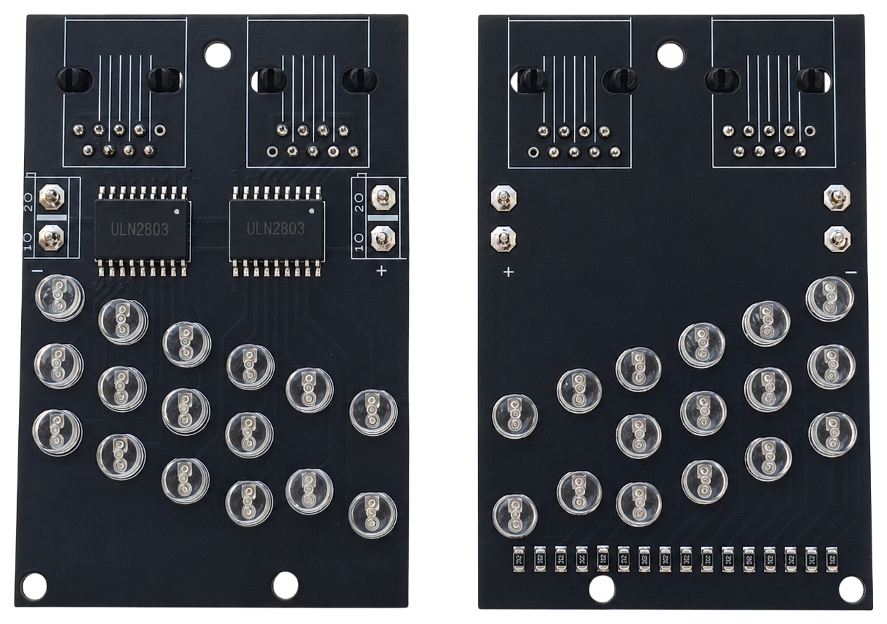
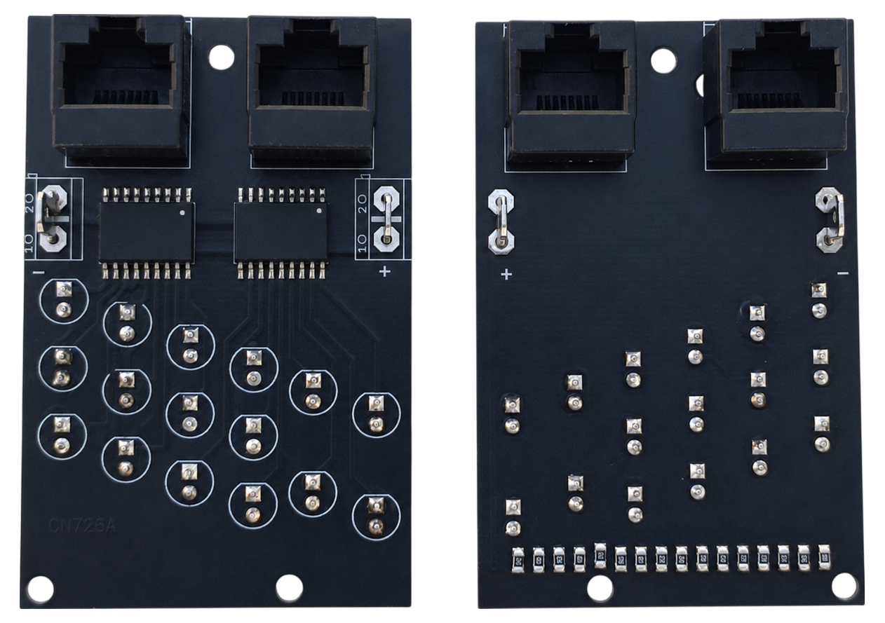
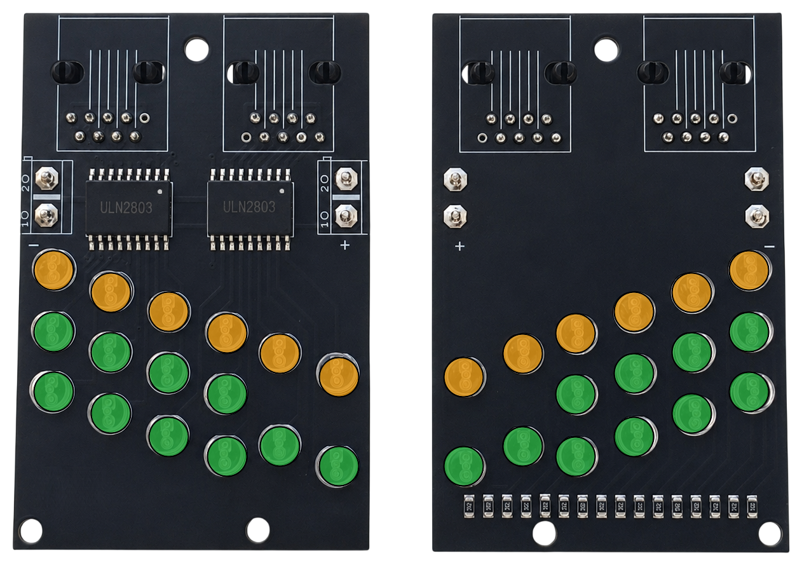

# 7. LE Devices

<table>
<tbody>
<tr>
<td align="center"> Front view</td>
<td align="center"> Rear view</td>
</tr>
</tbody>
</table>

[📥 Download Gerber files - PCB_LE_Devices.zip](https://raw.githubusercontent.com/om7ea/B737/main/PCB/PCB_LE_Devices.zip)

[← Back to PCB overview](README.md)

---

## Purpose

Designed for the **LE Devices and ELT Panel**. It carries the indicator LEDs of the leading edge devices display — 16 LEDs per board — and reaches the MEGA 2560 PRO MINI through two RJ45 cables. The LEDs are driven by the same **ULN2803** used on the annunciator driver boards.

## Quantity

**2** PCBs are required for the complete project — one for each half of the panel. They are the same board: the design is symmetrical, so a single layout serves both the left and the right side.

---

## Bill of Materials (BOM) — for both PCBs

| Qty | Part | Reference |
|---:|---|---|
| 4× | **ULN2803** | [Product I used](../../images/parts/AE_ULN2803.png) |
| 4× | **RJ45 connector** — 5224 8P8C in-line, vertical 180°, full plastic | [Product I used](../../images/parts/AE_RJ45.png) |
| 4× | **4.8 mm PCB male Faston terminal** | [Product I used](../../images/parts/AE_plug_male.png) |
| 12× | **Yellow 5 mm flat top LED** | [Product I used](../../images/parts/AE_led_yellow.png) |
| 20× | **Green 5 mm flat top LED** | [Product I used](../../images/parts/AE_led_green.png) |
| 12× | **330 Ω resistor (0805)** — one per yellow LED | |
| 20× | **2.2 kΩ resistor (0805)** — one per green LED | |

Each board takes 2× ULN2803, 2× RJ45, 2× Faston terminals and 16 LEDs with their 16 resistors.

> **Note**
> The resistor values are the ones that suited the LEDs I used. Pick yours so that the yellow and the green LEDs come out at roughly the same brightness — the right value depends on the LEDs you buy.

---

## Assembly Notes

- **Look at the photos carefully before you populate the board.** One design serves both halves of the panel, and the mirroring is easy to get wrong.
- The two ULN2803 and the 16 SMD resistors are surface mounted. They sit on opposite faces of the board — the drivers on one side, the resistors in a single row along the bottom edge on the other — and they are the same on both boards.
- The **LEDs**, the **Faston terminals** and the **RJ45 connectors** are the parts that make the difference. On the second board they are pushed in from the opposite side of the board, which mirrors the whole layout for the other half of the panel.
- The `+` and `−` marks beside the Faston terminals are printed on both faces of the board and swap sides when you turn it over. Go by the mark on the face you are working from, not by the position. The polarity of every LED position is marked on both faces as well.

### LED Colours

The two boards seen from the front, in the position they take in the panel — the left board is the left half of the display, the right board the right half.

- **Yellow** — the **TRANSIT** lamps: the top LED of every group, 6 per board, **12** in total.
- **Green** — the **EXT** and **FULL EXT** lamps: everything below, 10 per board, **20** in total.

The groups of three are the eight **SLATS** (TRANSIT, EXT, FULL EXT), the groups of two the four **LE FLAPS** (TRANSIT, EXT). The slats sit on the outer sides of the display, the flaps in the middle.
