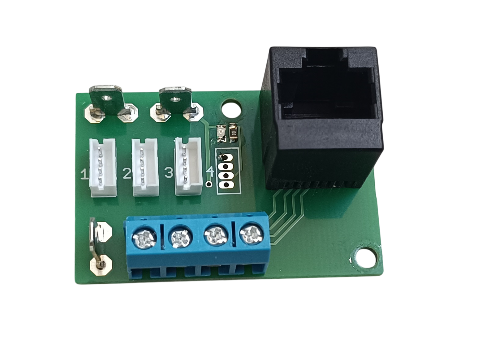
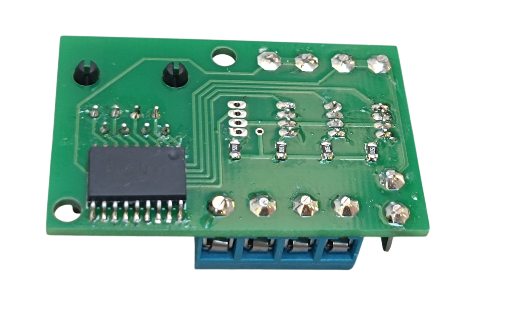

# 4. RJ45 Combined

**4 pins with LED driver + 4 pins direct**

[📥 Download Gerber files - PCB_RJ45_Combined.zip](https://raw.githubusercontent.com/om7ea/B737/main/PCB/PCB_RJ45_Combined.zip)

[← Back to PCB overview](README.md)

---

## Purpose

Designed to connect up to **4 annunciators and 4 direct connections**. This PCB combines the functionality of the [RJ45 Direct](rj45-direct.md) and [RJ45 LED Driver](rj45-driver.md) boards.

## Quantity

A total of **6** PCBs are required for the complete project. I recommend ordering a few extra in case some are damaged during assembly.

---

## Bill of Materials (BOM) — per PCB

| Qty | Part | Reference |
|---:|---|---|
| 1× | **RJ45 connector** — 5224 8P8C in-line, vertical 180°, full plastic | [Product I used](../../images/parts/AE_RJ45.png) |
| 3× | **4.8 mm PCB male Faston terminal** | [Product I used](../../images/parts/AE_plug_male.png) |
| 1–4× | **Header ZH 1.5 4P** — buy the set (connectors + cables) | [Product I used](../../images/parts/AE_ZH.png) |
| 1–4× | **SMD 0805 resistors** — values are the same as in the [RJ45 LED Driver table](rj45-driver.md#resistor-values) | |
| 1× | **ULN2803** | [Product I used](../../images/parts/AE_ULN2803.png) |
| as required | **KF301 PCB screw terminals** — 2P/3P/4P | [Product I used](../../images/parts/AE_KF301.png) |
| 1× | **330 Ω resistor (0805)** — optional | |
| 1× | **Green LED (0805)** — optional | |
