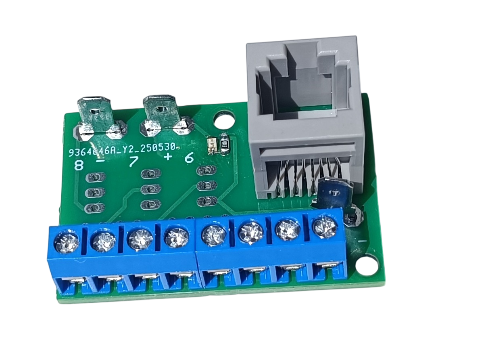
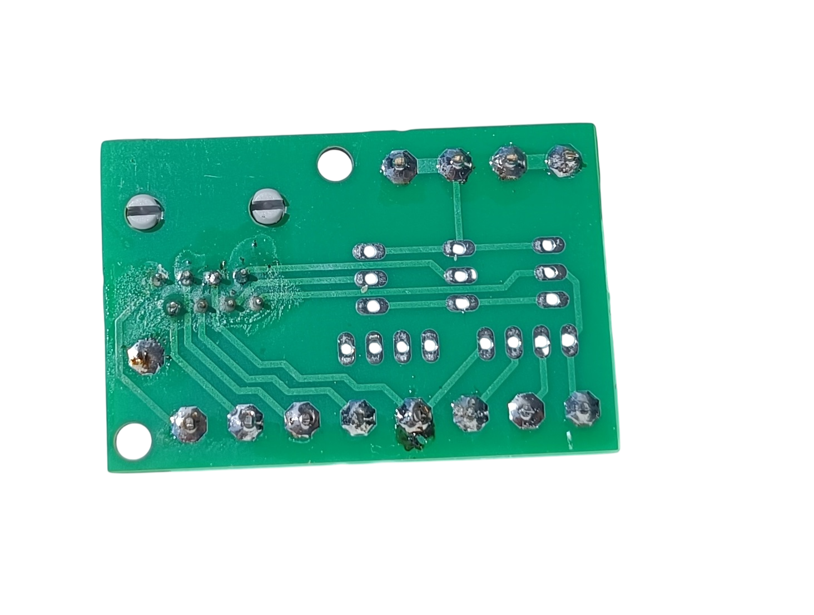

# 2. RJ45 Direct Connection

[📥 Download Gerber files - PCB_RJ45_Direct.zip](https://raw.githubusercontent.com/om7ea/B737/main/PCB/PCB_RJ45_Direct.zip)

[← Back to PCB overview](README.md)

---

## Purpose

Designed for direct connection through an RJ45 connector. Used for push buttons, toggle switches, rotary switches, servos, displays, and similar components that do not need an LED driver.

## Quantity

A total of **27** PCBs are required for the complete project. I recommend ordering a few extra in case some are damaged during assembly.

---

## Bill of Materials (BOM) - per PCB

| Qty | Part | Reference |
|---:|---|---|
| 1× | **RJ45 connector** - 5224 8P8C in-line, vertical 180°, full plastic | [Product I used](../../images/parts/AE_RJ45.png) |
| 3× | **4.8 mm PCB male Faston terminal** | [Product I used](../../images/parts/AE_plug_male.png) |
| as required | **KF301 PCB screw terminals** - 2P/3P/4P | [Product I used](../../images/parts/AE_KF301.png) |
| as required | **2.54 mm male pin header** | |
| 1× | **330 Ω resistor (0805)** - optional | |
| 1× | **Green LED (0805)** - optional | |
