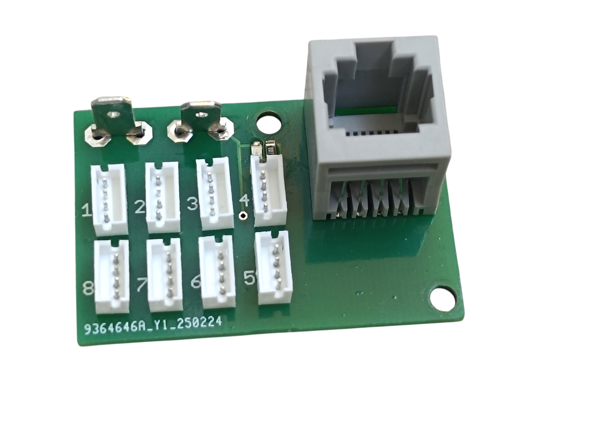
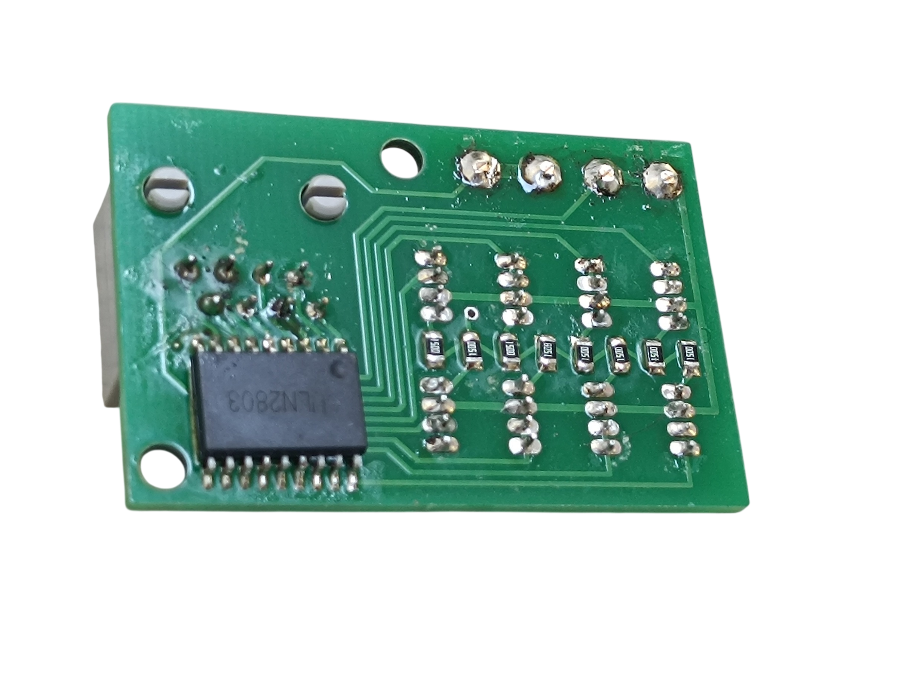

# 3. RJ45 LED Driver

[📥 Download Gerber files - PCB_RJ45_Driver.zip](https://raw.githubusercontent.com/om7ea/B737/main/PCB/PCB_RJ45_Driver.zip)

[← Back to PCB overview](README.md)

---

## Purpose

Designed to connect up to **8 annunciators** with push buttons. The integrated driver powers the LEDs, reducing the current load on the board when connecting a large number of LEDs.

## Quantity

A total of **20** PCBs are required for the complete project. I recommend ordering a few extra in case some are damaged during assembly.

---

## Bill of Materials (BOM) — per PCB

| Qty | Part | Reference |
|---:|---|---|
| 1× | **RJ45 connector** — 5224 8P8C in-line, vertical 180°, full plastic | [Product I used](../../images/parts/AE_RJ45.png) |
| 2× | **4.8 mm PCB male Faston terminal** | [Product I used](../../images/parts/AE_plug_male.png) |
| 1–8× | **Header ZH 1.5 4P** — buy the set (connectors + cables) | [Product I used](../../images/parts/AE_ZH.png) |
| 1–8× | **SMD 0805 resistors** — see the table below for values | |
| 1× | **ULN2803** | [Product I used](../../images/parts/AE_ULN2803.png) |
| 1× | **330 Ω resistor (0805)** — optional | |
| 1× | **Green LED (0805)** — optional | |

### Resistor Values

| LED | Value |
|---|---|
| yellow LED | 150 Ω |
| green LED | 330 Ω |
| white LED — no dual brightness annunciator | 250 Ω |
| white LED — dual brightness annunciator | 100 Ω |
