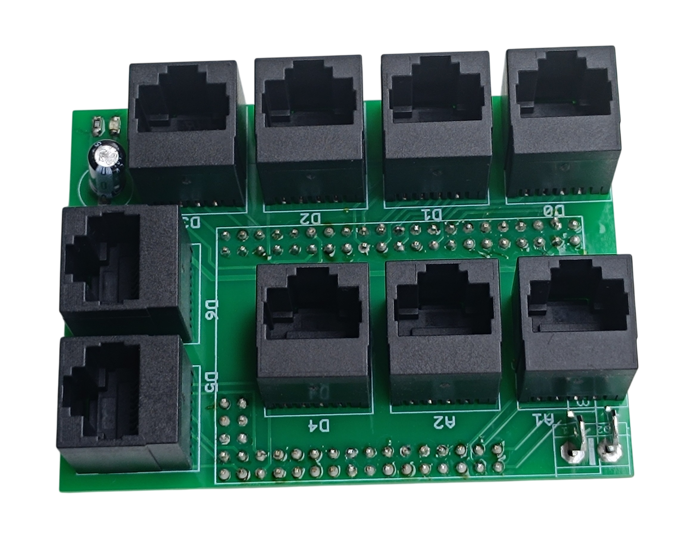
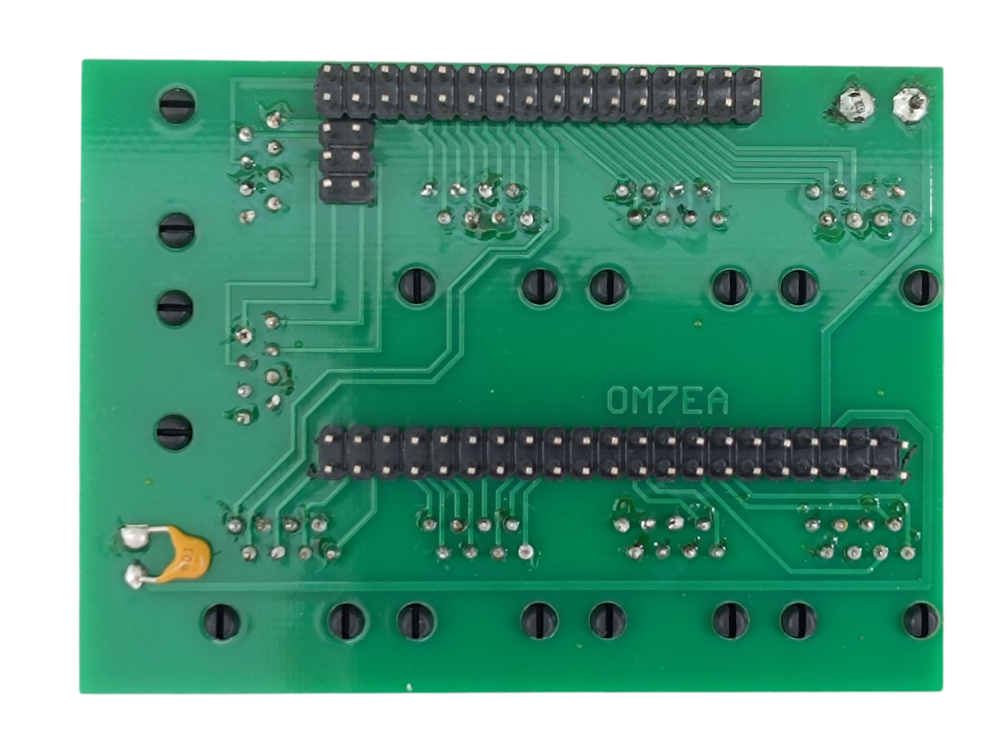
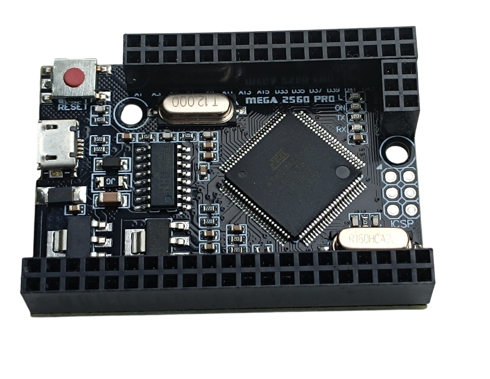
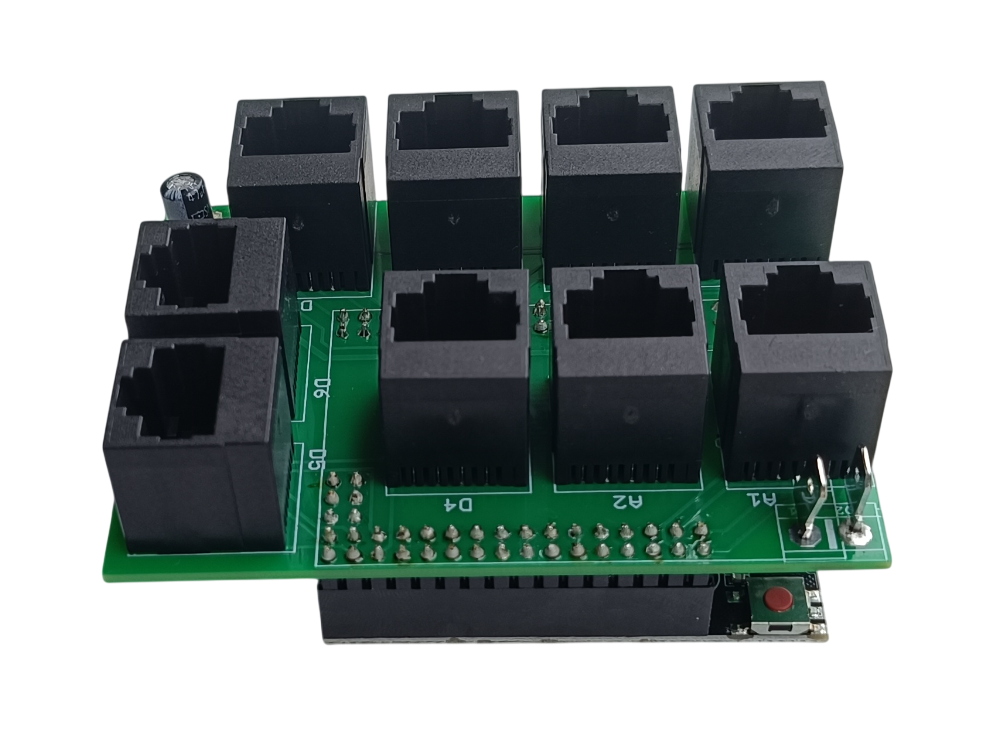

# 5. RJ45 Hub Shield

[📥 Download Gerber files - PCB_RJ45_Hub_Shield.zip](https://raw.githubusercontent.com/om7ea/B737/main/PCB/PCB_RJ45_Hub_Shield.zip)

[← Back to PCB overview](README.md)

---

## Purpose

A shield for the **MEGA 2560 PRO MINI**. It plugs straight onto the board and gives it **nine RJ45 sockets**.

The sockets are silkscreened **D0–D6** for the digital groups and **A1, A2** for the analog ones. The power terminal feeds **5 V** into the shield, which supplies both the RJ45 sockets and the MEGA 2560 PRO MINI itself.

Board size: **81.5 × 58.5 mm**.

## Quantity

A total of **7** PCBs are required for the complete project — one for each of the seven [MEGA 2560 PRO MINI boards](../system-overview.md#the-boards).

---

## Bill of Materials (BOM) — for all 7 PCBs

| Qty | Part | Reference |
|---:|---|---|
| 7× | **PCB** | download the Gerber files above |
| 63× | **RJ45 connector** — 5224 8P8C in-line, vertical 180°, full plastic | [Product I used](../../images/parts/AE_RJ45.png) |
| 7× | **Electrolytic capacitor 47 µF / 16 V** — radial, 3.5 mm lead pitch | |
| 7× | **Ceramic capacitor 100 nF** | |
| 14× | **4.8 mm PCB male Faston terminal** — one leg clipped off, this is what I used | [Product I used](../../images/parts/AE_plug_male.png) |
| 7× | **2×21 pin header** — 2.54 mm double row, usually supplied with the MEGA 2560 PRO MINI | |
| 7× | **2×16 pin header** — 2.54 mm double row, usually supplied with the MEGA 2560 PRO MINI | |
| 7× | **2×3 pin header** — 2.54 mm double row, usually supplied with the MEGA 2560 PRO MINI | |
| 7× | **2×21 female socket** — 2.54 mm double row, soldered into the MEGA 2560 PRO MINI | [Product I used](../../images/parts/AE_socket_2x21.png) |
| 7× | **2×16 female socket** — 2.54 mm double row, soldered into the MEGA 2560 PRO MINI | [Product I used](../../images/parts/AE_socket_2x16.png) |
| 7× | **2×3 female socket** — 2.54 mm double row, soldered into the MEGA 2560 PRO MINI | [Product I used](../../images/parts/AE_socket_2x3.png) |
| 7× | **330 Ω resistor (0805)** — optional | |
| 7× | **Green LED (0805)** — optional | |

> **Note**
> The 5 V input footprint is 5.08 mm, so a [KF301-2P screw terminal](../../images/parts/AE_KF301.png) fits it just as well as the two Faston tabs. Use whichever you prefer.

> **Note**
> The shop lists these headers and sockets by the number of positions in one row, so a 2×21 part is sold as *21Pin*.

> **Note**
> The MEGA 2560 PRO MINI itself is not part of this BOM — see [The boards](../system-overview.md#the-boards) in the system overview.

---

## Assembly Notes

<table>
<tbody>
<tr>
<td></td>
<td></td>
</tr>
</tbody>
<tbody>
<tr>
<td>The MEGA 2560 PRO MINI with the female sockets soldered in</td>
<td>The shield plugged onto the board</td>
</tr>
</tbody>
</table>

- The RJ45 sockets, the 47 µF electrolytic capacitor and the optional power LED go on the **top** side. The pin headers and the 100 nF capacitor go on the **bottom** side.
- I soldered the **pin headers into the shield** and the **female sockets into the MEGA 2560 PRO MINI**, so the shield sits on top of the board. The other way round works just as well.
- The 100 nF capacitor has no footprint of its own — solder it directly across the two power terminal pads on the underside, in parallel with the 47 µF.
